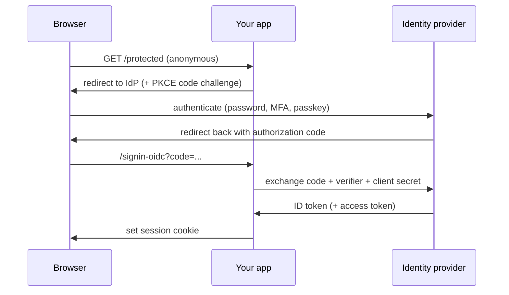

## Most auth confusion is three concepts wearing one trench coat

Developers say "auth" and mean three separable things: **authentication** (establishing who the caller is), **authorization** (deciding what they may do), and **session management** (how identity persists across requests). ASP.NET Core separates them cleanly - `UseAuthentication` populates `HttpContext.User`; `UseAuthorization` evaluates policies against it (in exactly that order in the middleware pipeline) - and most real-world misconfigurations come from blurring which of the three a given mechanism handles. This post builds the mental model: cookies for browser apps, JWTs for APIs, OIDC for delegating the hard parts, and the specific settings that separate secure from decorative.

## The core abstraction: schemes produce ClaimsPrincipals

Every authentication mechanism in ASP.NET Core is a **scheme**: a named handler that knows how to (a) authenticate a request (turn a cookie/header into a `ClaimsPrincipal`), (b) challenge (what to do with anonymous users - redirect to login vs return 401), and (c) forbid (403 behavior). Multiple schemes coexist - a browser app and its API can live in one process with cookies and JWT bearer side by side, selected per endpoint. Everything downstream - `[Authorize]`, policies, your code reading `User.FindFirstValue(...)` - consumes the resulting claims and doesn't care which scheme produced them. That indirection is the design; internalize it and the configuration stops looking like incantations.

## Cookie authentication: the right default for server-rendered apps

For MVC/Razor Pages/Blazor Server apps, the cookie handler *is* your session mechanism:

```csharp
builder.Services.AddAuthentication(CookieAuthenticationDefaults.AuthenticationScheme)
    .AddCookie(o =>
    {
        o.Cookie.Name = "__Host-app";              // __Host- prefix: Secure + no Domain + Path=/
        o.Cookie.HttpOnly = true;                  // default; JS cannot read it
        o.Cookie.SameSite = SameSiteMode.Lax;      // CSRF mitigation baseline
        o.Cookie.SecurePolicy = CookieSecurePolicy.Always;
        o.ExpireTimeSpan = TimeSpan.FromHours(8);
        o.SlidingExpiration = true;
        o.LoginPath = "/account/login";
    });
```

What's actually in the cookie: an **encrypted, integrity-protected serialization of the ClaimsPrincipal** (via Data Protection - not a session ID, unless you plug in a session store). Consequences worth knowing:

- **Data Protection keys must be shared and persisted** across your instances (`PersistKeysToAzureBlobStorage`/Redis/etc.). The classic outage: keys default to local disk, a deploy or second instance can't decrypt existing cookies, and every user is logged out - or worse, bounced between instances that alternately accept and reject them.
- **Revocation is not instant.** The cookie is self-contained for its lifetime; "disable user" doesn't take effect until expiry. The hook is `OnValidatePrincipal` - check a security stamp against the store (Identity does this, by default every 30 minutes) and `RejectPrincipal()` to force re-auth. Decide your revocation latency deliberately.
- **SameSite=Lax kills most CSRF**, but state-changing GETs (don't have those - REST post) and legitimate cross-site POST flows still need antiforgery tokens - which the framework wires into forms automatically; keep it on.

## JWT bearer: the right default for APIs

APIs serve non-browser clients and cross-origin SPAs; a self-contained bearer token fits. The critical reframe: **a JWT is not encrypted, it's signed.** Anyone can base64-decode the payload; the signature only proves *who issued it* and *that it wasn't modified*. Never put secrets in claims; validation is everything:

```csharp
builder.Services.AddAuthentication(JwtBearerDefaults.AuthenticationScheme)
    .AddJwtBearer(o =>
    {
        o.Authority = "https://login.example.com";   // token issuer; keys fetched from its metadata
        o.Audience  = "orders-api";
        o.TokenValidationParameters = new()
        {
            ValidateIssuer = true,
            ValidateAudience = true,        // see below - do not turn this off
            ValidateLifetime = true,
            ClockSkew = TimeSpan.FromMinutes(1),   // default is 5 - tighten it knowingly
        };
    });
```

Map each validation to the attack it stops, because each one gets disabled by someone "just getting it working":

- **Signature (via Authority metadata)** → stops forged tokens. Setting `Authority` makes the handler fetch the issuer's public **signing keys** from its OIDC discovery document and handle key rotation automatically - which is why asymmetric signing (RS256/ES256) is the norm: the issuer holds the private key; APIs only ever hold public keys. **HS256 with a shared secret** means every API that validates tokens can also *mint* them - one leaked appsettings file compromises the issuer. Avoid for anything multi-service.
- **Issuer** → stops tokens from a different (even legitimate) identity provider being replayed at you.
- **Audience** → stops the *confused deputy*: a valid token issued for `analytics-api` being replayed against `orders-api`. `ValidateAudience = false` is the single most common real-world JWT misconfiguration - it appears in tutorials because it makes errors go away, and it quietly means *any* token from your issuer works on *every* API.
- **Lifetime + skew** → bounds the replay window for a stolen token.

Structural decisions that follow from "signed, not revocable":

- **Access tokens short (5-15 minutes)**; longevity comes from **refresh tokens**, which live *only* on the auth server, are stored server-side, and *are* revocable - and should be **rotated on every use** with reuse detection (a replayed old refresh token signals theft; revoke the whole family). This split is the revocation story: stolen access tokens expire quickly; stolen refresh tokens die on first reuse.
- **Claims are a snapshot at issuance.** Roles changed mid-token-lifetime don't apply until refresh - authorize against claims accepting that latency, or check the store for the sensitive operations.
- **SPA token storage**: localStorage is readable by any XSS payload; the defensible pattern for browser apps is the **BFF (Backend-for-Frontend)** - the SPA talks to its own backend using a cookie, and the backend holds tokens and calls APIs. If you remember one architecture opinion from this post: browsers get cookies, machines get bearers.

## OIDC: stop building the login page

OpenID Connect is the protocol for **delegating authentication** to an identity provider (Entra ID, Auth0, Keycloak, Duende IdentityServer) - your app receives identity rather than verifying passwords. The flow worth knowing cold is **authorization code + PKCE** (the correct choice for web apps *and* SPAs; implicit flow is deprecated): app redirects to the IdP with a one-time code challenge → user authenticates there (passwords, MFA, passkeys - all the IdP's problem now) → IdP redirects back with a short-lived **authorization code** → app's *backend* exchanges code (+ verifier + client secret) for tokens. The browser never sees tokens in URLs; the code is useless without the verifier.



In ASP.NET Core, the standard composition is **OIDC for the login handshake, cookie for the session**:

```csharp
builder.Services.AddAuthentication(o =>
    {
        o.DefaultScheme = CookieAuthenticationDefaults.AuthenticationScheme;
        o.DefaultChallengeScheme = OpenIdConnectDefaults.AuthenticationScheme;
    })
    .AddCookie()
    .AddOpenIdConnect(o =>
    {
        o.Authority = "https://login.example.com";
        o.ClientId = "web-app";
        o.ClientSecret = builder.Configuration["Oidc:ClientSecret"];  // keep secrets out of source
        o.ResponseType = "code";               // code flow (PKCE is on by default)
        o.Scope.Add("orders-api");             // request access token for your API
        o.SaveTokens = true;                    // keep tokens for calling APIs on user's behalf
        o.GetClaimsFromUserInfoEndpoint = true;
    });
```

Challenge redirects to the IdP; the OIDC handler validates the returned **ID token** (same signature/issuer/audience machinery as above - the handler does it, but now you know what it's doing); the cookie carries the session thereafter. Access tokens saved via `SaveTokens` flow to your typed HttpClients for downstream API calls.

## The misconfiguration hall of fame

A checklist assembled from real incidents: `ValidateAudience = false` (confused deputy, discussed); `RequireHttpsMetadata = false` left on outside local dev (key fetch over HTTP = token forgery via MITM); Data Protection keys not persisted (mass logouts, or antiforgery failures across instances); accepting `alg` from the token rather than pinning expected algorithms (the classic none/RS-to-HS confusion attacks - modern handlers defend, old custom validation code often doesn't); tokens or cookies over HTTP because `SecurePolicy` was relaxed "for testing"; and logging raw tokens (bearer tokens are credentials - redact `Authorization` headers in any request logging).

And the meta-rule that prevents most of it: **don't hand-roll token issuance or password storage.** Between OIDC providers, ASP.NET Core Identity, and Duende, the remaining reasons to write your own are approximately zero, and the failure modes are careers.

## Takeaways

- Schemes produce ClaimsPrincipals; cookies, bearers, and OIDC are just different producers feeding the same authorization pipeline.
- Cookies: encrypted principal, shared Data Protection keys, deliberate revocation via principal validation.
- JWTs: signed not secret - every validation flag maps to an attack; audience validation stays on; short access + rotating refresh is the revocation design.
- OIDC with code+PKCE delegates the genuinely hard parts; compose it with a cookie session and let the IdP own passwords and MFA.
