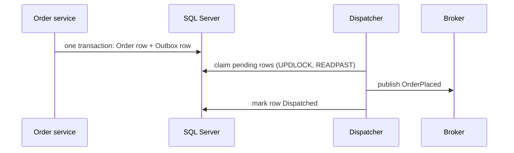

## The dual-write problem: two systems, no shared transaction

Your order service must do two things when an order is placed: save the order to SQL Server, and publish an `OrderPlaced` event (to Service Bus, RabbitMQ, or even just an email dispatcher). Write both and you have four orderings, two of which are disasters:

- Save then publish - crash between them → **order exists, event never sent**; downstream never ships it.
- Publish then save - crash between them → **event announces an order that doesn't exist**.

Wrapping both in a database transaction doesn't help - the broker isn't in your transaction, and distributed transactions across DB + broker are a road you don't want (and most brokers don't offer). This is the **dual-write problem**, and the outbox pattern is its standard, boring, correct solution: *make the event part of the database transaction by writing it to a table, then deliver it separately.* It gets referenced everywhere; here's the complete implementation.

## The design in one sentence

Business change and its events commit **atomically in one local transaction** (business tables + an `Outbox` table); a background dispatcher then reads pending outbox rows and publishes them, marking each done - giving **at-least-once** delivery, which consumers absorb via idempotency.



## The table

```sql
CREATE TABLE dbo.Outbox (
    OutboxId        BIGINT IDENTITY NOT NULL PRIMARY KEY,   -- clustered: append-only insert pattern
    OccurredAtUtc   DATETIME2(3)    NOT NULL DEFAULT SYSUTCDATETIME(),
    EventType       VARCHAR(200)    NOT NULL,                -- 'orders.order-placed.v1'
    AggregateId     VARCHAR(64)     NOT NULL,                -- for partitioned/ordered publish
    Payload         NVARCHAR(MAX)   NOT NULL,                -- JSON (consider an ISJSON check constraint)
    Status          TINYINT         NOT NULL DEFAULT 0,      -- 0 Pending, 1 Dispatched, 2 Failed/parked
    AttemptCount    TINYINT         NOT NULL DEFAULT 0,
    NextAttemptUtc  DATETIME2(3)    NOT NULL DEFAULT SYSUTCDATETIME(),
    DispatchedAtUtc DATETIME2(3)    NULL,
    LastError       NVARCHAR(1000)  NULL
);

CREATE INDEX IX_Outbox_Pending
    ON dbo.Outbox (NextAttemptUtc)
    INCLUDE (EventType, AggregateId, Payload, AttemptCount)
    WHERE Status = 0;      -- filtered index: the dispatcher's entire world
```

Design notes, each earning its keep:

- **BIGINT identity clustered key**: inserts append at the end - no page splits, and the ever-ascending pattern suits a high-insert table.
- **The filtered index is the star** ([covering indexes](/posts/what-is-clustered-vs-non-clustered-index/)): the dispatcher polls only `Status = 0`, which is a tiny sliver of an ever-growing table. The filtered index stays small forever and makes the poll O(pending), not O(history).
- **NextAttemptUtc** bakes retry backoff into the schema - failed rows get a future timestamp and naturally drop out of the poll until due.
- **EventType carries a version** (`.v1`) - payload schemas evolve; consumers need to know which they're reading (contract discipline applies to events too).

## Writing to the outbox: same transaction, no exceptions to the rule

With EF Core, the outbox row rides along in the aggregate's `SaveChanges`:

```csharp
public async Task PlaceOrderAsync(PlaceOrder cmd, CancellationToken ct)
{
    var order = Order.Create(cmd);
    _db.Orders.Add(order);

    _db.Outbox.Add(OutboxMessage.From(
        eventType: "orders.order-placed.v1",
        aggregateId: order.Id.ToString(),
        payload: JsonSerializer.Serialize(new OrderPlacedV1(order.Id, order.CustomerId, order.Total))));

    await _db.SaveChangesAsync(ct);   // ONE transaction: order + event, or neither
}
```

A tidy upgrade once this pattern spreads: raise domain events on your entities and convert them to outbox rows in a `SaveChangesAsync` override or interceptor - one enforcement point instead of per-handler discipline. One caution: `ExecuteUpdateAsync`-style bulk changes bypass SaveChanges interceptors, so bulk mutations that must emit events need explicit outbox writes.

The rule that must never bend: **the outbox insert is in the same transaction as the business change.** An outbox written in a second transaction recreates the dual-write problem with extra steps.

## The dispatcher: claiming work safely with competing consumers

The dispatcher is a `BackgroundService` (the usual skeleton: scope-per-cycle, catch-inside-the-loop, PeriodicTimer, honored stopping token). The interesting part is **claiming rows** so that multiple app instances don't double-dispatch the same message constantly. The tool is the classic queue-claim idiom:

```sql
-- Claim a batch: atomically flip Pending rows to in-flight and return them
UPDATE TOP (@BatchSize) o
SET Status = 3,                        -- 3 = Claimed (in-flight)
    AttemptCount = AttemptCount + 1
OUTPUT inserted.OutboxId, inserted.EventType, inserted.AggregateId,
       inserted.Payload, inserted.AttemptCount
FROM dbo.Outbox o WITH (READPAST, UPDLOCK, ROWLOCK)
WHERE o.Status = 0 AND o.NextAttemptUtc <= SYSUTCDATETIME();
```

Why each piece is there: `UPDLOCK` makes claim-check-and-set atomic; **`READPAST`** makes competing dispatchers skip each other's locked rows instead of queueing behind them - N instances drain the outbox in parallel without coordination; `OUTPUT` returns the claimed batch in the same statement; and the status flip means a row is never claimable twice. After publishing each message:

```sql
UPDATE dbo.Outbox SET Status = 1, DispatchedAtUtc = SYSUTCDATETIME()
WHERE OutboxId = @id;

-- on failure: schedule retry with exponential backoff + jitter
UPDATE dbo.Outbox
SET Status = CASE WHEN AttemptCount >= 8 THEN 2 ELSE 0 END,   -- park after max attempts
    NextAttemptUtc = DATEADD(SECOND, POWER(2, AttemptCount) + @jitter, SYSUTCDATETIME()),
    LastError = @error
WHERE OutboxId = @id;
```

Crash-safety analysis - the whole point, so walk it: crash **before** claim → rows still Pending, next cycle gets them. Crash **after** claim, before publish → rows stuck at Status 3; a small reaper query resets Claimed rows older than a visibility timeout back to Pending (`WHERE Status = 3 AND ClaimedAtUtc < DATEADD(MINUTE, -5, ...)` - add a ClaimedAtUtc column for this). Crash **after publish, before marking dispatched** → the row returns to Pending and **publishes again**. That last case is irreducible - it's why the pattern is *at-least-once*, and why the consumer side matters.

**Parked messages (Status 2) are your dead-letter queue** - alert on their count (a degraded health check reading `SELECT COUNT(*) FROM Outbox WHERE Status = 2` is honest observability), and build the small admin action to requeue them after fixing the cause.

## The consumer side: the inbox

At-least-once delivery means every consumer must be idempotent. The standard idempotency-key machinery is exactly this - keyed by message ID:

```csharp
// Inside the consumer's transaction:
// INSERT INTO ProcessedMessages (MessageId) - unique constraint is the arbiter
// duplicate key -> already processed -> ack and skip
// then do the work IN THE SAME TRANSACTION as recording the ID
```

The load-bearing detail mirrors the outbox itself: *recording that you processed* and *the effects of processing* commit atomically, or a crash between them re-creates the dual-write problem on the consuming side. Outbox on the producer, inbox on the consumer - one pattern, two ends.

**Ordering**: rows claimed by parallel dispatchers can publish out of order. If per-aggregate ordering matters (it usually does; global ordering usually doesn't), either publish to a broker with per-key ordering using `AggregateId` as the key, or have the dispatcher group its batch by AggregateId and publish each group sequentially. Design consumers to tolerate reordering where you can - it's the cheapest option of the three.

## Housekeeping: the table grows forever unless you decide otherwise

Dispatched rows are audit gold for a while and dead weight after. Options in ascending sophistication: a nightly delete of `Status = 1 AND DispatchedAtUtc < @cutoff` **in batches** (1-5k rows per transaction, avoiding lock escalation); or, at serious volume, partition the outbox by month and `SWITCH` old partitions out - the classic sliding-window pattern, turning purge into a metadata operation.

**When to reach for a library instead**: this hand-rolled version is genuinely fine for one service and one database - it's ~200 lines you fully understand. Reach for **MassTransit** (transactional outbox built in), **NServiceBus**, or CAP when you need many services, saga orchestration, multi-transport support, or you'd rather adopt their battle-tested reaper/ordering/inbox machinery than maintain your own. The concepts transfer one-to-one; you'll configure those libraries better for having built the small version once.

## Takeaways

- Dual writes cannot be made atomic across DB and broker - so put the event *in* the database transaction and deliver it asynchronously.
- The claim query (UPDLOCK + READPAST + OUTPUT) plus a filtered pending index is the entire concurrency story - competing dispatchers scale without coordination.
- At-least-once is a promise about the producer; idempotent consumers with an inbox table complete the contract.
- Park poison messages, alert on them, batch the cleanup - an outbox without housekeeping is a future incident with excellent audit logs.
