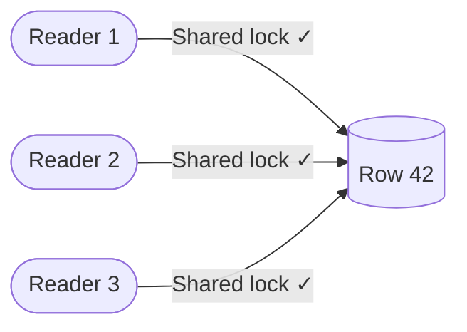
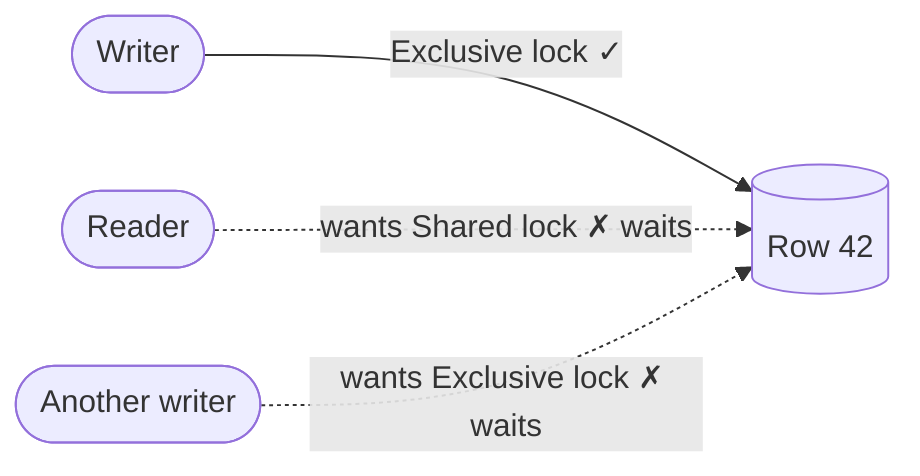
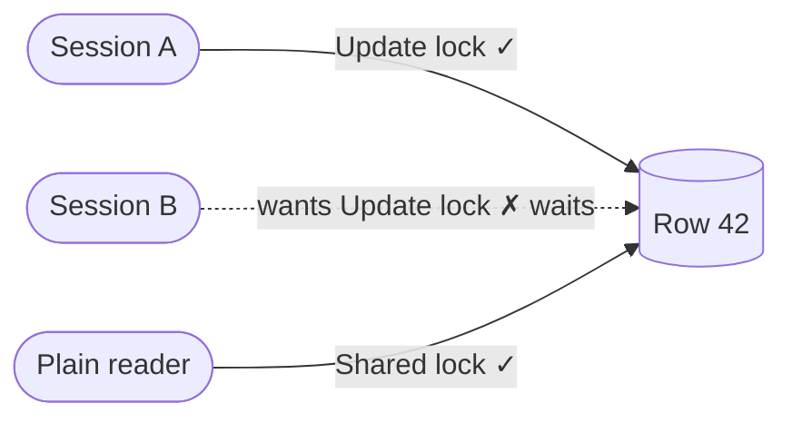
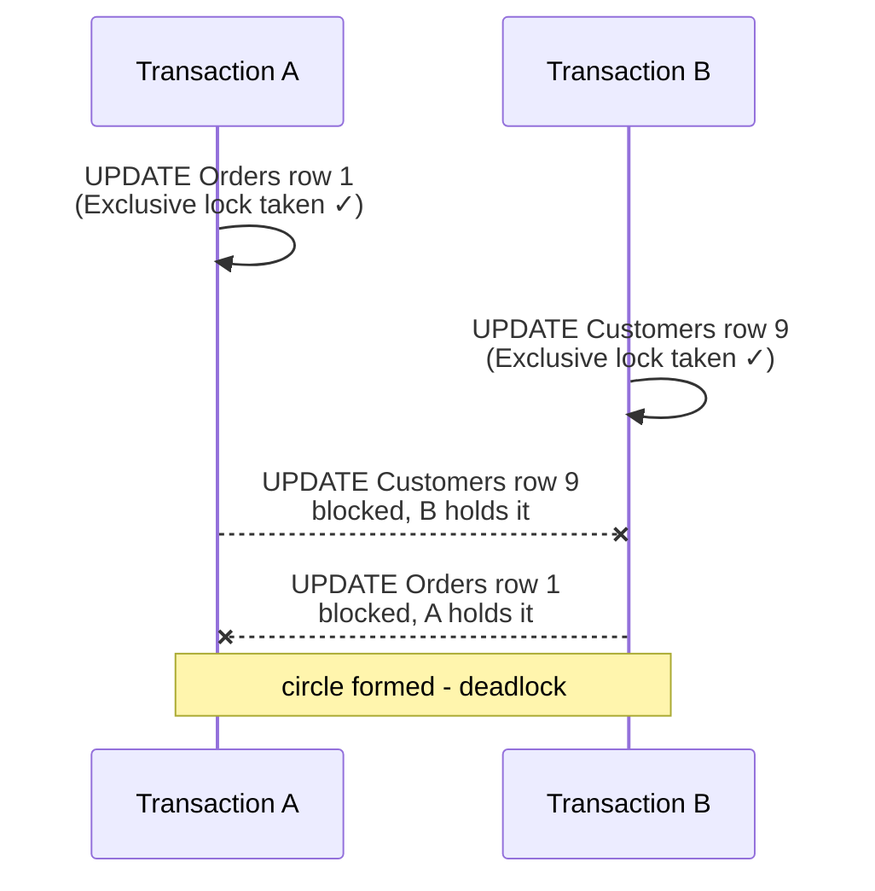
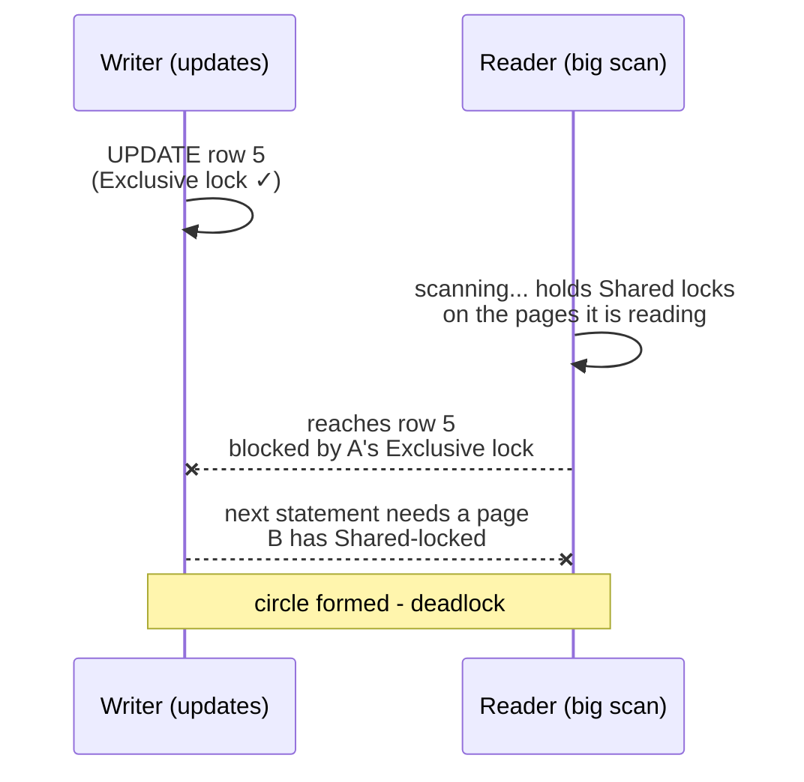
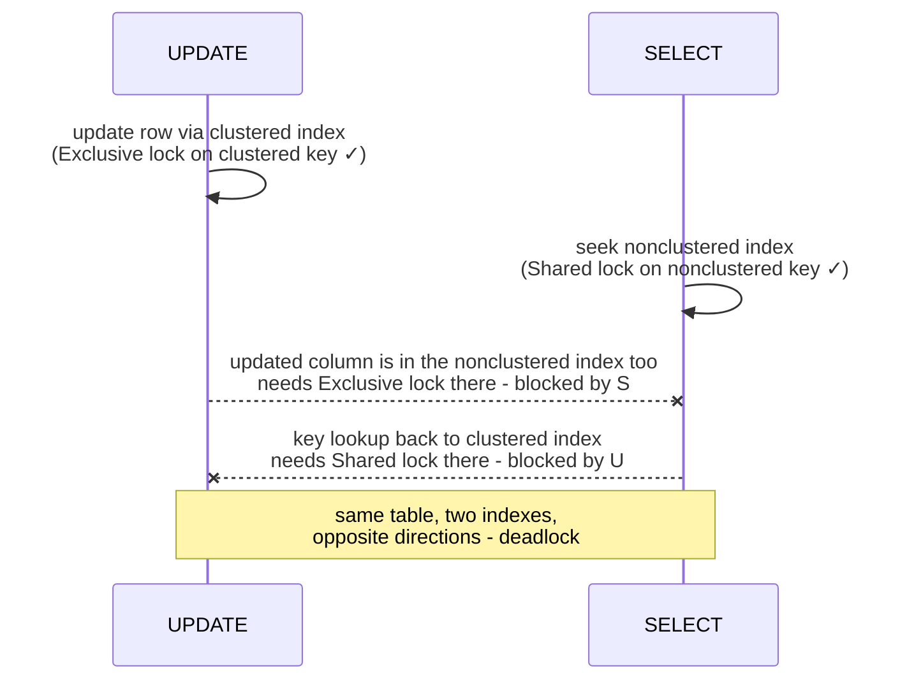
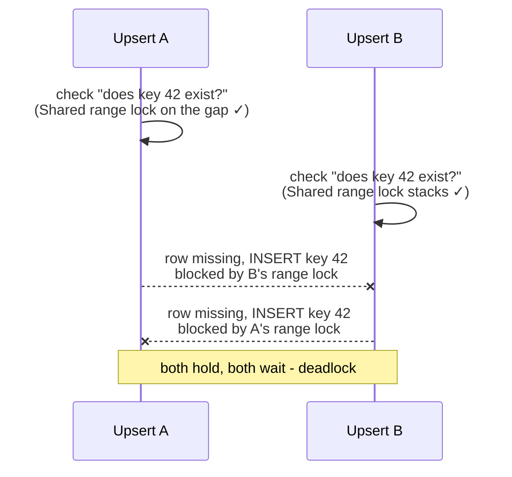

## Error 1205 is not random bad luck

"Transaction (Process ID 87) was deadlocked on lock resources with another process and has been chosen as the deadlock victim. Rerun the transaction."

Most teams treat this error as weather - unpredictable, retry and move on. It is not. A deadlock is a specific, reconstructible event: two sessions each holding a lock the other one needs, stuck in a circle of waiting that can never resolve on its own. SQL Server notices the circle (a background monitor checks roughly every 5 seconds), picks a victim - by default the session that is cheapest to roll back - and kills it so the other can finish.

Every deadlock has an exact cause, the cause is recorded automatically, and almost all of them fit a handful of patterns you can design away. This post walks through all of it from the ground up. Abbreviations are spelled out on first use, and there is a [glossary](/glossary/) if you land here mid-way.

## First, meet the locks

You only need three lock types to understand deadlocks.

**Shared locks (S)** are for reading. Many sessions can read the same row at the same time, so shared locks stack happily:



**Exclusive locks (X)** are for writing. Only one session can change a row at a time, and while it does, nobody else can read (under default settings) or write that row:



**Update locks (U)** mean "I am reading this row, but I intend to write it". Readers with plain shared locks are still allowed in, but only one session can hold the update lock. This one-at-a-time rule matters later, because it is the fix for an entire deadlock pattern:



The whole compatibility story in one table ("can a second session take this lock while the first one holds that lock?"):

| Second session wants → / First holds ↓ | Shared (S) | Update (U) | Exclusive (X) |
| :-- | :--: | :--: | :--: |
| **Shared (S)** | yes | yes | no |
| **Update (U)** | yes | no | no |
| **Exclusive (X)** | no | no | no |

Blocking is normal: one session waits, the other finishes, the waiter proceeds. A **deadlock** is different - the waiting forms a circle, and a circle never finishes on its own:


That circle is the thing SQL Server detects, records, and breaks. Everything below is about reading that record and removing the circle.

## Step 1: get the deadlock graph (it is already being captured)

You do not need to enable anything. Since SQL Server 2012, a built-in trace session called **system_health** - part of Extended Events, SQL Server's lightweight tracing framework - records every deadlock:

```sql
SELECT CAST(event_data AS XML) AS DeadlockGraph
FROM (
    SELECT CAST(target_data AS XML) AS td
    FROM sys.dm_xe_session_targets st
    JOIN sys.dm_xe_sessions s ON s.address = st.event_session_address
    WHERE s.name = 'system_health' AND st.target_name = 'ring_buffer'
) AS src
CROSS APPLY td.nodes('//RingBufferTarget/event[@name="xml_deadlock_report"]') AS q(ev)
CROSS APPLY (SELECT ev.query('.') AS event_data) AS d;
```

The ring buffer is a circular memory buffer, so old events get overwritten on a busy system - check the `system_health` event *files* too, or set up a dedicated Extended Events session that writes `xml_deadlock_report` events to files if deadlocks happen often enough to study over time.

If you save the XML with an `.xdl` extension and open it in SQL Server Management Studio, it renders as the visual deadlock graph - the ovals-and-arrows picture.

## Step 2: read the graph like a story

Every deadlock graph has the same anatomy, and reading it is a fixed procedure. Two lists matter:

- **process-list**: the sessions involved. For each one you get the `inputbuf` (the SQL statement it was running - your first clue), its isolation level, and what it was waiting for.
- **resource-list**: the locked objects. Each resource names its **owner** (who holds the lock, and in what mode) and its **waiter** (who is blocked wanting it, and in what mode).

The deadlock *is* the circle you can trace through those lists: Session A owns resource 1 and waits on resource 2; Session B owns resource 2 and waits on resource 1.

Three questions to answer, in order:

**1. What objects are locked?** Resources appear as `keylock`, `pagelock`, or `objectlock` entries with a `hobt_id` (Heap Or B-Tree ID - the internal identifier of one physical index or table structure). Join it to the system tables to get real names:

```sql
SELECT o.name AS table_name, i.name AS index_name
FROM sys.partitions p
JOIN sys.objects o ON o.object_id = p.object_id
JOIN sys.indexes i ON i.object_id = p.object_id AND i.index_id = p.index_id
WHERE p.hobt_id = 72057594043105280;   -- value from the graph
```

**2. What lock modes?** Exclusive waiting on Shared, Update on Update, range locks - the combination of modes identifies the pattern (next section).

**3. What statements?** Here is the single most confusing thing about deadlock graphs: the `inputbuf` shows the statement running *now*, but the lock being *held* was often taken by an **earlier statement in the same transaction**. The held lock tells you what the transaction did before; the wait tells you what it is doing now. Reconstruct the transaction's full sequence from your code, not just from the graph.

## Step 3: match it to a pattern

Four patterns cover the overwhelming majority of real deadlocks.

### Pattern 1: opposite-order access

Transaction A updates `Orders` then `Customers`. Transaction B updates `Customers` then `Orders`. Each grabs its first exclusive lock fine, then waits forever for the other's:



**The graph shows**: two exclusive-lock owners, each waiting for the other's key lock, on *different tables*.

**Fix**: pick one access order and use it in every code path - alphabetical, dependency order, anything, as long as it is a documented convention. This is the deadlock everyone knows about; in practice it is less common than the next three.

### Pattern 2: reader meets writer on the same rows

Session A updates a row and holds an exclusive lock on it. Session B is a reporting query scanning the same table; it takes shared locks as it reads and is now stuck behind A's exclusive lock. Meanwhile A's *next* statement needs rows that B's scan currently has shared-locked. Circle:



**Fix**: this is exactly the reader-versus-writer contention that **Read Committed Snapshot Isolation** eliminates. With that database setting on, readers see a recent committed copy of each row (a "snapshot") instead of taking shared locks, so they stop participating in these circles entirely. Alternatively, give the reader a proper index so its scan becomes a seek - a seek touches a handful of rows instead of holding locks across the whole table.

### Pattern 3: the key lookup deadlock (the sneaky one)

This one needs no transactions at all - a plain UPDATE and a plain SELECT can deadlock each other through two indexes of the *same table*.

Background in one sentence: a table's **clustered index** is the table itself sorted by primary key, a **nonclustered index** is a separate copy of some columns, and when a SELECT uses the nonclustered index but needs a column that is not in it, it does a **key lookup** back into the clustered index ([more here](/posts/what-is-clustered-vs-non-clustered-index/)).

Now watch the two sessions cross paths in opposite directions:



**The graph shows**: two key locks on **the same table but different indexes** (one clustered, one nonclustered), with a SELECT as one of the participants. That signature is unmistakable once you know it.

**Fix**: make the nonclustered index **covering** for that SELECT - include the extra columns it needs, so there is no lookup, no second lock, no circle. Read Committed Snapshot Isolation also dissolves it, because the reader stops taking locks. This pattern alone justifies re-reading your deadlock graphs after "harmless" index changes.

### Pattern 4: the upsert collision

Two sessions run the same insert-if-not-exists logic for a row that does not exist yet. The standard safe way to write an upsert uses the serializable isolation level (or the `HOLDLOCK` hint, same thing), which takes **range locks** - locks on the *gap* where the row would be - to stop other sessions from sneaking the row in. But range locks in shared mode stack, exactly like ordinary shared locks:



**The graph shows**: two `RangeS-S` owners (shared range locks) waiting on each other.

**Fix**: remember the update lock from the compatibility table - only one session can hold it. Ask for it during the existence check: `WITH (UPDLOCK, SERIALIZABLE)`. Update locks are incompatible with each other, so the second upsert waits politely *before* the circle can form, and the two upserts run one after the other instead of deadlocking.

```sql
BEGIN TRAN;
IF EXISTS (SELECT 1 FROM Accounts WITH (UPDLOCK, SERIALIZABLE) WHERE AccountId = @id)
    UPDATE Accounts SET Balance = Balance + @amt WHERE AccountId = @id;
ELSE
    INSERT Accounts (AccountId, Balance) VALUES (@id, @amt);
COMMIT;
```

### Honorable mention: the unindexed foreign key

Deleting a parent row makes SQL Server check the child table for references. Without an index on the foreign key column, that check **scans the whole child table**, locking far more than one key and colliding with any concurrent child-table work. If your graph shows a parent-table delete holding wide locks on a child table: index the foreign key column. (It also makes the delete dramatically faster; foreign key columns should be indexed by default.)

## Step 4: reduce, then tolerate

Design measures, roughly in order of leverage:

1. **Read Committed Snapshot Isolation** - removes readers from deadlock circles wholesale. Cost: row versions are kept in `tempdb`, so watch its usage.
2. **Index for seeks and coverage** - smaller lock footprints and no key lookups; patterns 2 and 3 mostly evaporate.
3. **Short transactions** - fewer locks, held briefly; never hold a transaction open across application-side work like a web service call.
4. **Consistent access ordering** and **update-lock-first upserts** - the fixes for the write-versus-write patterns.
5. **Touch fewer rows per statement** - batch big updates (1,000 to 5,000 rows per transaction). This also avoids lock escalation, where the server trades thousands of row locks for one table lock and turns polite row conflicts into table-sized deadlocks.

Then tolerance: some residual deadlock rate on a busy transactional system is normal, and error 1205 is **explicitly retriable** - the victim was rolled back cleanly, so rerunning it is safe. Wire 1205 into your transient-error retry policy (Entity Framework Core's `EnableRetryOnFailure` already includes it) with a small backoff. Retry is the correct *last* layer - after the design fixes, not instead of them. A deadlock rate that climbs with load is a design problem wearing a retry-shaped bandage.

## A worked read-through

A real graph, abbreviated:

- Process 1: running `UPDATE Orders SET Status=... WHERE OrderId=@p`. Owns a key lock on `PK_Orders` (Exclusive), waits on a key lock on `IX_Orders_Status` (Exclusive).
- Process 2: running `SELECT OrderId, CustomerId FROM Orders WHERE Status='Open'`. Owns a key lock on `IX_Orders_Status` (Shared), waits on `PK_Orders` (Shared).

Diagnosis in one breath: same table, two indexes, a SELECT holding the nonclustered index and wanting the clustered one - **pattern 3, the key lookup deadlock**. Fix:

```sql
CREATE INDEX IX_Orders_Status ON Orders(Status) INCLUDE (CustomerId);
```

The SELECT is now covered - no lookup, so the deadlock ceases to exist. Verify by checking system_health again a week later.

## Takeaways

- Deadlocks are recorded automatically in system_health - every 1205 error has a readable autopsy waiting for you.
- Three lock types tell the whole story: Shared stacks, Exclusive excludes, Update serializes intent.
- Read the graph as owner-and-waiter circles, and remember: held locks usually came from *earlier statements* in the same transaction.
- Four patterns explain nearly everything - opposite order, reader-versus-writer, key lookup, and upsert collisions - each with a specific, known fix.
- Read Committed Snapshot Isolation and covering indexes prevent whole categories; retrying on error 1205 handles the civilized remainder.
