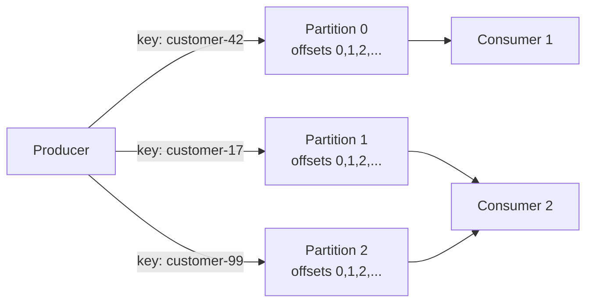

## Start from something you already know

If you have worked with SQL Server, you already understand the core idea of Kafka, because you have been sitting next to it for years: the transaction log. Every write to a database is first appended to a sequential log; the tables are just a convenient view derived from that log. Change Data Capture ([CDC](/glossary/#cdc)) works by reading that log directly - I covered how in [Change Data Capture in SQL Server](/posts/change-data-capture-in-sql-server/).

Kafka takes that internal implementation detail and turns it into the product. A Kafka **topic** is a durable, append-only log that many independent readers can consume at their own pace. That single design decision explains almost everything else about Kafka - what it is great at, what it is awkward at, and why people coming from RabbitMQ or Azure Service Bus keep tripping over it.

This post builds Kafka up from that log, piece by piece: partitions, offsets, consumer groups, rebalancing, and replication. No .NET code yet - the follow-up, [Kafka Delivery Semantics in .NET](/posts/kafka-delivery-semantics-dotnet/), gets concrete with `Confluent.Kafka`. Here the goal is the mental model, because most production Kafka incidents I have seen were mental-model failures, not code failures.

## A log is not a queue

The distinction sounds academic until it bites you. In a classic queue (RabbitMQ, Service Bus, SQS):

- A message is **removed** (or at least locked) when a consumer takes it.
- Two consumers on one queue **compete** - each message goes to exactly one of them.
- Once processed and acknowledged, the message is gone. There is no "read it again."

In a log:

- Messages are **appended** and stay there for a retention period (time- or size-based), regardless of who has read them.
- Consumers do not take messages; they **read at a position** (an offset) that they control.
- Ten independent applications can read the same topic fully, each at their own pace, without configuring anything on the broker for fan-out.

The practical consequence is the killer feature: **replay**. A bug in your consumer corrupted a week of downstream data? Reset the consumer's offset to a week ago and reprocess. In a queue, those messages are gone; your recovery story is a database restore and an apology. In ad-tech pipelines where a pricing bug can misattribute a few hundred million events, replay is not a nice-to-have - it is the reason the architecture survives its own bugs.

The cost is that the broker no longer tracks per-message state for you. There is no per-message acknowledgement, no built-in dead-lettering, no visibility timeout. Everything a queue does for you per message, you now do yourself per offset. That trade is worth it for high-volume streams and worth avoiding for low-volume work queues - more on that choice in [Choosing a Cloud Messaging Backbone](/posts/choosing-a-cloud-messaging-backbone/).

## Partitions: the unit of everything

A topic is not one log; it is N logs, called **partitions**. This is the single most consequential setting in Kafka, because a partition is the unit of:

- **Ordering** - messages are strictly ordered *within* a partition, and not at all *across* partitions.
- **Parallelism** - one partition can be consumed by at most one consumer in a group, so partition count is your maximum consumer parallelism.
- **Storage scaling** - partitions of one topic spread across brokers, so a topic can be bigger than any one machine.

Which partition a message lands in is decided by the **producer**, not the broker. If the message has a key, the default partitioner hashes it (murmur2) and takes it modulo the partition count. Same key, same partition, therefore same ordering. If the message has no key, messages are sprayed across partitions in batches, and any two messages may arrive at consumers in any relative order.

Three things follow that people learn the hard way:

1. **Choose the key for ordering, not for convenience.** If all events for `OrderId=42` must be seen in order (created, paid, shipped), key by `OrderId`. If you key by, say, event type, then `OrderCreated` and `OrderPaid` for the same order can land in different partitions and be processed out of order. Consumers see "paid" for an order they have not seen created. Every "Kafka reordered my messages" bug I have debugged was actually a keying bug.

2. **Changing the partition count breaks key-to-partition mapping.** Hashing is modulo N; change N and `customer-42` starts landing in a different partition, while its historical messages stay in the old one. Per-key ordering is broken across the boundary. Plan partition counts with headroom up front (going from 6 to 12 later is an event, not a config change) - I go deeper on this in [Partitioning - The Decision That Follows You Everywhere](/posts/partitioning-strategies-that-follow-you-everywhere/).

3. **Hot keys create hot partitions.** Hashing balances keys, not traffic. In ad-tech, one large advertiser can be 20% of all events; their key maps to one partition, and that partition's consumer becomes the pipeline's bottleneck while its siblings idle. No amount of adding consumers fixes it, because one partition still goes to one consumer.

## Offsets: the consumer's bookmark

Every message in a partition has an **offset** - a monotonically increasing 64-bit position. A consumer's entire state is "I have processed partition 3 up to offset 1,048,576." That is it. Consumers periodically **commit** their offsets back to Kafka (into an internal topic named `__consumer_offsets`), so that after a crash or restart the group knows where to resume.

This is worth staring at, because it defines your delivery guarantees:

- Commit the offset **after** processing → after a crash you re-read some messages → **at-least-once** (duplicates possible).
- Commit the offset **before** processing → after a crash you skip some messages → **at-most-once** (loss possible).

There is no per-message state, so there is no "this one message failed, redeliver just it." If message 500 is a poison message, you either skip it (and record it somewhere - a dead-letter topic you build yourself) or you stop the partition. Consumer **lag** - the gap between the log's end offset and your committed offset - is the one metric that summarizes consumer health, and it is the first graph to check in any Kafka incident.

## Consumer groups and rebalancing

A **consumer group** is a set of consumers sharing a `group.id`, and Kafka divides the topic's partitions among them: 12 partitions, 3 consumers → 4 partitions each. Two different groups (say, `billing` and `analytics`) each get the *full* stream independently - that is the fan-out story, and it requires zero broker configuration.

The dividing-up is called **rebalancing**, and it is where consumer groups hurt. A rebalance triggers whenever membership changes: a consumer joins, leaves, crashes, or - the sneaky one - is *presumed* dead because it went too long without polling (`max.poll.interval.ms`, default 5 minutes). A consumer that processes a slow batch for 6 minutes gets kicked out, its partitions are reassigned, it finishes its batch anyway and tries to commit, fails, and meanwhile another consumer reprocessed the same messages. If processing time can spike, either lower `max.poll.records` or make the work asynchronous to the poll loop.

Classic (eager) rebalancing is stop-the-world: every consumer in the group stops, gives up all partitions, and gets a new assignment. On a group with 50 consumers, one flapping pod can make the whole group spend more time rebalancing than consuming. Modern clients support **cooperative (incremental) rebalancing**, which only moves the partitions that actually need to move - turn it on; the default exists for compatibility, not because it is good.

Two sizing rules that fall out of this:

- More consumers than partitions → the extras sit idle. 12 partitions with 15 consumers means 3 do nothing.
- Consumer count should divide partition count evenly, or some consumers carry more partitions than others - fine for balanced load, painful with hot partitions.

## Replication: where the data actually lives

Each partition has one **leader** replica and N-1 **followers** on other brokers; all reads and writes go through the leader, and followers replicate its log. The set of replicas that are caught up is the **In-Sync Replicas** ([ISR](/glossary/#isr)). Three settings decide whether "Kafka accepted my write" means anything:

- `acks=0` - producer does not wait at all. Fire and forget; loss on any hiccup.
- `acks=1` - leader wrote it locally. If the leader dies before followers copy it, the write is gone *after* you were told it succeeded.
- `acks=all` - every replica in the current ISR wrote it.

Here is the subtlety that catches people: `acks=all` means "all *in-sync* replicas," and the ISR shrinks under stress. If two of three replicas fall behind and drop out of the ISR, the ISR is just the leader, and `acks=all` degenerates into `acks=1`. The guard rail is `min.insync.replicas=2` (on a replication factor of 3): with fewer than 2 in-sync replicas, the broker rejects `acks=all` writes outright. That is the correct behavior - **refusing writes loudly beats accepting them into a single fragile copy** - but it means your producer must handle `NotEnoughReplicas` errors, and your on-call must know that this error is the cluster protecting your data, not just breaking.

The last lever is `unclean.leader.election.enable`. If a partition's only in-sync replica dies, may an out-of-sync replica become leader? Yes → the partition stays available but every message the stale replica missed is silently gone. No (the default since 0.11) → the partition is unavailable until the real leader returns. For anything with money in it, keep it off and take the downtime.

The durable configuration for data you care about, all together: replication factor 3, `min.insync.replicas=2`, `acks=all`, unclean election off. Anything less is a decision to trade durability for latency or availability - sometimes fine for clickstream telemetry, never fine silently.

## What Kafka is not

A senior engineer's Kafka opinion is mostly knowing when not to use it:

- **Not a work queue.** No per-message ack, retry, or dead-lettering; competing-consumer granularity is the partition, not the message. For "process each job once, retry failures individually," Service Bus or SQS is less code and fewer 2 a.m. pages.
- **Not a database.** Retention makes it feel queryable ("just read the topic"), but there is no index; finding one message means scanning a partition. Log compaction gives you latest-value-per-key semantics, which powers changelog topics, but that is a cache-warming trick, not a query engine.
- **Not a request/response transport.** You can build RPC over Kafka with correlation IDs and reply topics. Every team that does regrets it by the second incident.

Where it is unmatched: high-volume event streams with multiple independent consumers, replay as a first-class recovery tool, and per-key ordered feeds - which is exactly the shape of CDC pipelines, clickstreams, and the event backbones between microservices.

## Where to go next

- [Streaming SQL Server Changes into Kafka with Debezium](/posts/streaming-sql-server-cdc-into-kafka-debezium/) - the CDC post and this one, joined in production.
- [Kafka Delivery Semantics in .NET](/posts/kafka-delivery-semantics-dotnet/) - producers, consumers, and exactly-once claims, with `Confluent.Kafka` code.
- [Partitioning - The Decision That Follows You Everywhere](/posts/partitioning-strategies-that-follow-you-everywhere/) - the same partitioning problem across Kafka, SQL Server, and cloud NoSQL.
