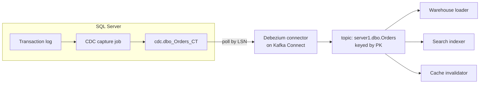

## From change tables to change streams

[Change Data Capture in SQL Server](/posts/change-data-capture-in-sql-server/) covered how CDC turns the transaction log into queryable change tables. That is half a pipeline. The change tables sit inside the database; every downstream consumer still has to poll them, track its own Log Sequence Number ([LSN](/glossary/#lsn)) watermark, and handle cleanup racing against its own lag. Do that once and it is a utility; do it in five consumers and you have five slightly different bugs.

**Debezium** is the standard way to do it exactly once, centrally: a Kafka Connect connector that polls the CDC tables, converts every row change into a structured event, and publishes it to Kafka - one topic per table, keyed by primary key. Downstream consumers stop being database pollers and become ordinary Kafka consumers, with replay for free (see [Kafka for Engineers Who Know Databases](/posts/kafka-for-engineers-who-know-databases/) for why that matters).



Worth being precise about, because it surprises people: unlike its MySQL and Postgres connectors, Debezium's SQL Server connector does **not** read the transaction log itself. It reads the CDC change tables that SQL Server's capture job populates. That means everything from the CDC post still applies - the Agent jobs, the retention window, the capture instance mechanics - and Debezium adds a second consumer-side pipeline on top. Two lags to monitor, not one.

## What a change event looks like

Debezium wraps every change in a consistent envelope. For an update to `Orders`:

```json
{
  "before": { "OrderId": 42, "Status": "Pending",  "Total": 120.00 },
  "after":  { "OrderId": 42, "Status": "Paid",     "Total": 120.00 },
  "source": {
    "connector": "sqlserver",
    "db": "SalesDb", "schema": "dbo", "table": "Orders",
    "commit_lsn": "0000003a:00000f48:0003",
    "ts_ms": 1752470400000
  },
  "op": "u",
  "ts_ms": 1752470400123
}
```

The parts that earn their keep:

- **`op`** - `c` (insert), `u` (update), `d` (delete), `r` (read, i.e. from the initial snapshot). Consumers branch on this, so deletes are first-class instead of the thing polling forgot.
- **`before` and `after`** - the full row images. `before` on updates requires the CDC capture instance to include it (it does by default); it is what lets a consumer compute *what changed* without keeping its own copy.
- **`source.commit_lsn`** - ties the event back to the exact database transaction. Two events with the same commit LSN were committed atomically; a warehouse loader that wants transactional consistency groups by it.
- **Two timestamps** - `source.ts_ms` is when the database committed; the top-level `ts_ms` is when Debezium processed it. The difference between them *is* your end-to-end lag, per event. Graph it.

The **message key** is the table's primary key. Since Kafka guarantees order per key within a partition, all changes to `OrderId=42` arrive in commit order at whichever consumer handles that key. That is the property the whole downstream design leans on - and it is also why you never repartition a CDC topic casually.

## The snapshot: day zero is the hard part

A change stream answers "what changed since X." A brand-new consumer needs "everything, then what changed." Debezium handles this with an initial **snapshot**: on first start it reads the whole table (emitting `op: "r"` events), records the LSN it started at, then switches to streaming changes from that LSN. Consumers cannot tell bootstrap data from live data, which is exactly the point.

The senior-engineer concerns are operational:

- **Snapshot duration vs CDC retention.** The snapshot of a 500 GB table can take hours. The changes accumulating meanwhile live in the CDC tables, which the cleanup job prunes (default retention: 3 days). If snapshot time ever approaches retention time, the stream will have a hole. Check `sys.sp_cdc_help_jobs` and size retention against your biggest table's snapshot, not your average one.
- **Locks.** By default the connector takes a brief schema-stability lock when the snapshot starts. On a busy Online Transaction Processing ([OLTP](/glossary/#oltp)) database, coordinate the first deploy like a migration, not a config push.
- **Re-snapshots are a tool, not a failure.** Blowing away a consumer's derived state and re-snapshotting (Debezium supports ad-hoc incremental snapshots via signals) is often faster and safer than surgically repairing it. Design downstream tables so "truncate and replay" is always an option.

## Deletes, tombstones, and compacted topics

A delete produces two messages: a change event with `op: "d"` and `before` populated, then a **tombstone** - a message with the same key and a `null` value. The tombstone is not for your consumers; it is for Kafka **log compaction**. A compacted topic retains the latest value per key, so a tombstone is how a key gets fully removed from a compacted CDC topic.

This matters twice over. First, your consumers must not crash on null-value messages (a classic first-week Debezium bug). Second, compaction is what makes CDC topics usable as *bootstrap sources*: a compacted `Orders` topic converges toward one message per existing order, so a new consumer can read it end to end and hold a complete current-state copy, then keep it fresh from the same stream. That pattern - every service hydrating its own read model from compacted CDC topics - is the honest version of "microservices without shared databases."

## Schema evolution: the part that pages you

Tables change. The failure mode is specific to SQL Server CDC and worth internalizing: a capture instance snapshots the table's schema *at creation time*. `ALTER TABLE Orders ADD CouponCode ...` does not break anything - it just silently never appears in the change stream, because the capture instance predates it.

The playbook (same as in the CDC post, now with a Kafka twist):

1. Add the column to the table.
2. Create a **second capture instance** for the table (SQL Server allows exactly two) with the new schema.
3. Let Debezium switch over, then drop the old instance.

On the Kafka side, protect consumers with a **schema registry** and a compatibility mode. `BACKWARD` compatibility (new schema can read old data - in practice: you may add optional fields and delete fields, and consumers upgrade before producers) is the sane default for CDC topics. With the registry enforcing it, "someone widened a column and every consumer NullReferenced at 3 a.m." becomes a rejected registration at deploy time instead. Contract-first discipline applies to events exactly as it does to APIs.

## Debezium vs the outbox pattern

I wrote up [the outbox pattern](/posts/outbox-pattern-end-to-end/) as the fix for dual writes. Debezium and outbox are not rivals; they answer different questions:

- **CDC/Debezium streams facts about rows**: "the `Orders` row changed." The event schema *is* the table schema. Perfect for data integration - warehouses, search indexes, caches - where the consumer genuinely wants the row. Brittle as a public contract between services, because now `ALTER TABLE` is an API change for other teams.
- **Outbox streams intents**: "OrderPlaced happened," with a deliberately designed payload decoupled from storage. Right for service-to-service integration events.

The best production setup I know combines them: services write domain events to an outbox table, and *Debezium tails the outbox table* (it ships an outbox event router for exactly this), which deletes the hand-rolled dispatcher from the outbox pattern while keeping its clean contracts. Row streams for data plumbing, outbox streams for domain events, one Debezium install for both.

## The operational checklist

What I actually monitor on a SQL Server → Debezium → Kafka pipeline, in priority order:

1. **End-to-end lag** - `ts_ms` minus `source.ts_ms` at the consumer. This is the number the business feels.
2. **CDC capture job health** - if the Agent job stops, the log cannot truncate and the *database* is now at risk, not just the pipeline. This one pages.
3. **Connector state** - Kafka Connect tasks fail sticky; a connector in `FAILED` state stays failed until poked. Alert on state, not just lag (lag on a dead connector grows only on the DB side).
4. **CDC retention headroom** - time until cleanup would eat changes the connector has not read. Shrinks when the connector falls behind; if it hits zero you re-snapshot.
5. **Schema drift** - a diff between `sys.columns` and each capture instance's captured column list catches "someone added a column" before consumers notice fields missing.

None of these are exotic, which is the point: the pipeline is boring when monitored and mystifying when not. The changes flow from the transaction log through the change tables into topics, per-key ordered, replayable, consumed by systems that never touch your database. That is CDC finished properly.
