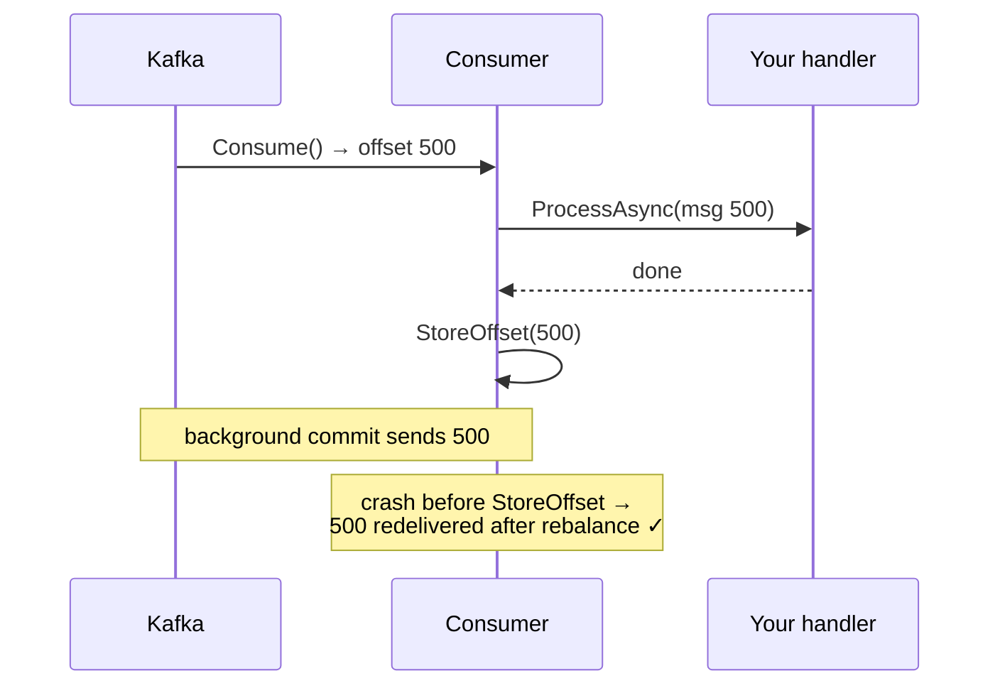

## The question that decides your design

Every messaging design starts with one question: when this process crashes at the worst possible moment - and it will - do I want to see that message **again** (at-least-once), or risk **never** seeing it (at-most-once)? "Exactly-once" is the option everyone wants, and the term is sold hard enough that teams believe they have it when they do not. This post pins down what `Confluent.Kafka` actually gives a .NET service on each side of the topic, and where the real exactly-once machinery lives (spoiler: in your database, and you already built it if you read [the outbox post](/posts/outbox-pattern-end-to-end/)).

The mental model from [Kafka for Engineers Who Know Databases](/posts/kafka-for-engineers-who-know-databases/) is assumed: topics, partitions, offsets, consumer groups.

## The producer side: getting messages in without losing or duplicating them

Here is a producer configured for durability, with the settings that matter spelled out:

```csharp
var config = new ProducerConfig
{
    BootstrapServers = "broker1:9092,broker2:9092",
    Acks = Acks.All,                  // wait for all in-sync replicas
    EnableIdempotence = true,         // broker de-dupes producer retries
    MessageSendMaxRetries = int.MaxValue,
    MessageTimeoutMs = 120_000,       // total time budget incl. retries
    LingerMs = 5,                     // small batching window; huge throughput win
    CompressionType = CompressionType.Zstd
};

using var producer = new ProducerBuilder<string, string>(config).Build();

var result = await producer.ProduceAsync("orders-events",
    new Message<string, string> { Key = order.Id.ToString(), Value = payload });
// result.Status == PersistStatus.Persisted, result.Offset == where it landed
```

Two failure modes this configuration is closing off:

**Loss.** `Acks.All` plus the broker-side `min.insync.replicas=2` means "persisted" means *replicated*. With the default `Acks.Leader`-style setting, a leader can acknowledge your write and die before any follower copies it - you were told success, the data is gone.

**Duplication from retries.** A retry after a timeout is ambiguous: maybe the broker never got the message, maybe it got it and the ack was lost. Without idempotence, retrying that ambiguity writes the message twice. `EnableIdempotence = true` gives the producer a broker-assigned ID and per-partition sequence numbers, so the broker recognizes and drops the duplicate. This is cheap and has been safe to enable for years; there is no good reason to run without it.

Know the boundary of the guarantee, though: idempotence covers **this producer instance's retries to a partition**. It does not de-dupe across producer restarts, and it does not de-dupe *your application* calling `ProduceAsync` twice because your own upstream retried. Application-level duplicates are your problem, and the outbox dispatcher pattern (claim, publish, mark - with the possibility of a crash between publish and mark) is precisely why consumers must tolerate duplicates anyway.

One more .NET-specific trap: `ProduceAsync` per message, awaited one at a time, serializes on round-trips and caps you at a few hundred messages per second. For throughput, use the `Produce` overload with a delivery handler, or fire batches of `ProduceAsync` tasks and await them together - the client batches under the hood (`LingerMs`), and throughput jumps two orders of magnitude.

## The consumer side: where the defaults betray you

The default consumer behavior is the most common source of silent message loss in .NET Kafka services. Watch the sequence:

- `EnableAutoCommit = true` (default): the client commits offsets on a background timer every 5 seconds.
- `EnableAutoOffsetStore = true` (default): every message is marked as done **the moment `Consume` returns it to you** - before your code has processed it.

Crash after `Consume` but before your handler finishes, and the background commit may already have said "done." The message is never redelivered. Your "at-least-once" pipeline is at-most-once, and the loss is invisible until reconciliation finds it weeks later.

The correct at-least-once pattern separates *storing* an offset (in client memory) from *committing* it (to the broker), and stores only after processing:

```csharp
var config = new ConsumerConfig
{
    BootstrapServers = "...",
    GroupId = "billing",
    EnableAutoCommit = true,          // background commit is fine...
    EnableAutoOffsetStore = false,    // ...but WE decide what is commit-eligible
    AutoOffsetReset = AutoOffsetReset.Earliest,
    PartitionAssignmentStrategy = PartitionAssignmentStrategy.CooperativeSticky
};

using var consumer = new ConsumerBuilder<string, string>(config).Build();
consumer.Subscribe("orders-events");

while (!ct.IsCancellationRequested)
{
    var cr = consumer.Consume(ct);
    if (cr?.Message is null) continue;         // tombstones: null value, real key

    await ProcessAsync(cr.Message, ct);        // do the work FIRST
    consumer.StoreOffset(cr);                  // now it may be committed
}
```



Now a crash mid-processing means redelivery - duplicates, not loss. That is the deal you signed: **at-least-once is a promise to receive duplicates**, and the consumer must be idempotent. Rebalances make this concrete rather than theoretical: when a consumer joins the group mid-batch, partitions move, and the new owner resumes from the last *committed* offset - everything after it gets processed again on the new pod even though the old pod may have finished it.

Idempotency has exactly three honest implementations, in order of preference:

1. **Natural idempotency** - the operation is a state assertion: `UPDATE Orders SET Status='Shipped' WHERE OrderId=@id`. Applying it twice is harmless. Design events as state facts rather than deltas ("balance is now 70", not "subtract 30") and most of the problem dissolves.
2. **A processed-messages table** - insert the message ID and do the work in one database transaction; a duplicate hits the primary key violation and is skipped. This is the idempotent-consumer half of the outbox post, and it is bulletproof because the dedup check and the side effect commit atomically.
3. **Upstream dedup caches** - Redis SET NX with a Time To Live ([TTL](/glossary/#ttl)) and similar. Fine as an optimization in front of option 2, unsound alone: the cache and the side effect do not commit together.

## Exactly-once: what Kafka transactions actually buy

Kafka does have transactions, and the marketing phrase "exactly-once semantics" ([EOS](/glossary/#eos)) refers to them. It is critical to understand the shape of the guarantee. A transactional producer can atomically:

- write messages to several topic-partitions, **and**
- commit its input consumer's offsets,

so that in a **consume → transform → produce** pipeline (read from topic A, compute, write to topic B), either the output messages appear *and* the input is marked consumed, or neither. Downstream consumers set `IsolationLevel = ReadCommitted` and never see messages from aborted transactions.

```csharp
var pConfig = new ProducerConfig
{
    BootstrapServers = "...",
    TransactionalId = "enricher-1",   // stable per logical producer instance
    // EnableIdempotence, Acks.All implied by transactional mode
};
using var producer = new ProducerBuilder<string, string>(pConfig).Build();
producer.InitTransactions(TimeSpan.FromSeconds(30));

while (true)
{
    var batch = ConsumeBatch(consumer);
    producer.BeginTransaction();
    foreach (var cr in batch)
        producer.Produce("orders-enriched", Transform(cr.Message));
    producer.SendOffsetsToTransaction(
        Offsets(batch), consumer.ConsumerGroupMetadata, TimeSpan.FromSeconds(30));
    producer.CommitTransaction();     // outputs + input offsets, atomically
}
```

That is a real and useful guarantee **when both ends of the operation are Kafka**. It is the foundation of Kafka Streams. Now the boundary: the moment your "transform" writes to SQL Server, calls a payment API, or sends an email, that side effect is **outside the transaction**. Kafka cannot roll back your database, and aborting the Kafka transaction does not un-charge the card. For the workloads most backend services actually run - consume from Kafka, write to a database - transactions add broker round-trips and operational surface without closing the gap that matters.

So the staff-engineer summary:

- **Kafka-to-Kafka pipeline?** Transactions give you exactly-once. Use them (or use Kafka Streams / a framework that wires them for you).
- **Kafka-to-database?** The database is the transaction coordinator you already have. At-least-once delivery + idempotent consumer (the processed-messages table committing with the side effect) *is* exactly-once **processing**, which is the thing the business actually asked for. Exactly-once *delivery* to an arbitrary external system does not exist, in Kafka or anywhere else - it is the Two Generals problem wearing a vendor T-shirt.
- **Database-to-Kafka?** That is the dual-write problem, and the answer is the [outbox pattern](/posts/outbox-pattern-end-to-end/) or [CDC via Debezium](/posts/streaming-sql-server-cdc-into-kafka-debezium/), not producer heroics.

## The checklist

For a .NET service on Kafka, the configuration that survives incident review:

- Producer: `Acks.All`, `EnableIdempotence = true`, generous `MessageTimeoutMs`, handle the terminal delivery error (park the payload, page someone - it means the cluster refused the write).
- Broker/topic: replication factor 3, `min.insync.replicas=2`.
- Consumer: `EnableAutoOffsetStore = false`, `StoreOffset` only after processing, `CooperativeSticky` assignment, and a plan for poison messages (try N times, then produce to a dead-letter topic you own and store the offset - never let one bad message park a partition forever).
- Consumer handlers idempotent, verified by a test that literally delivers every message twice. If that test is not in the suite, the property does not exist.

None of this is exotic, and that is the point worth internalizing: delivery semantics are not a Kafka feature you enable, they are an end-to-end property you construct - and the last mile is always yours.
