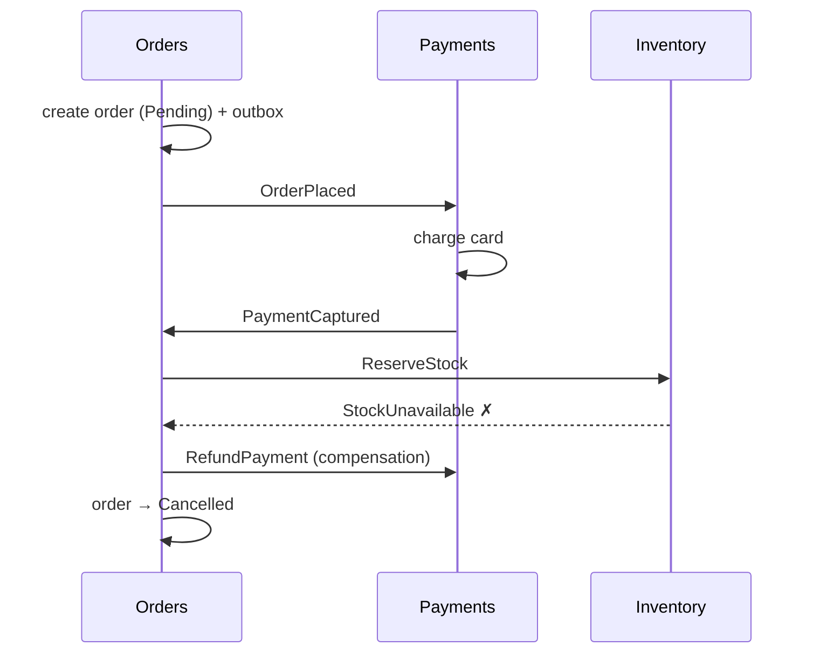

## The failure mode has a name

Most teams that regret microservices did not fail at Kubernetes, service meshes, or observability. They failed earlier and quieter: they drew the boundaries wrong, and every downstream pain - lockstep deploys, cascading outages, four-service call chains to render one page - flows from that. The result has a name, **distributed monolith**: a system with the operational cost of microservices and the coupling of a monolith. You get neither independent deployability nor the simplicity of one process; you pay for both.

You can diagnose it with three questions:

1. Can you deploy this service alone, without coordinating versions with another team? If releases travel in convoys, the boundary is fiction.
2. Can this service do its core job while its neighbors are down? If every request fans out synchronously into other services, availability multiplies away: five services at 99.9% in a chain is 0.999⁵ ≈ **99.5%** - you architected your way from four hours of annual downtime to forty-three.
3. Does more than one service write the same data? If two services write the `Orders` table, you do not have two services; you have one database with two deployment pipelines and twice the ways to corrupt it.

This post is about drawing boundaries so those three answers come out right - and about recognizing when the right number of services is, for now, one.

## Boundaries follow data ownership

The design rule that does the most work: **a service boundary is a data-ownership boundary.** Each service owns some set of business state - it is the only thing that writes that state, the only thing that reads it directly, and the published contract (API + events) is the *only* way anyone else sees it.

Everything else people use to slice services - "one service per entity," "one per team-sized chunk of code," "one per noun in the requirements doc" - produces boundaries that cut through transactions. The tell is workflows that need atomic writes across services. If placing an order must atomically touch the Order service, Inventory service, and Pricing service, those three are one consistency boundary wearing three costumes, and physics will collect the difference (in sagas, in dual writes, in support tickets).

So the working method, in order:

- **Find the invariants.** "Stock cannot go negative." "An order total equals the sum of its lines." An invariant that must hold *transactionally* must live inside one service. Invariants that can be eventually consistent ("the dashboard shows today's revenue") can cross boundaries.
- **Group by rate and reason of change.** Pricing rules change weekly by the revenue team; fulfillment logic changes quarterly by the warehouse team. Different owners, different cadence, different service. In practice, this is Domain-Driven Design's bounded context, with less vocabulary.
- **Check the conversation.** If two candidate services would call each other on most requests, merge them. Chattiness is coupling that acquired a network hop.

The shared-database shortcut deserves its own funeral, because it is always the first compromise offered: "we'll split the code but keep one database for now." The database *is* the coupling. Team A adds an index for their query pattern and Team B's writes slow down; Team B alters a column and Team A's nightly job breaks; nobody can tell which service actually depends on which table. Change Data Capture pipelines make honest decoupling cheaper than it used to be - each service can hydrate its own read model from [CDC topics](/posts/streaming-sql-server-cdc-into-kafka-debezium/) instead of reaching into a neighbor's tables.

## Communication: the coupling dial

Given good boundaries, the second decision is how services talk, and the choice is a dial from tight to loose:

**Synchronous request/response** (HTTP, gRPC) - tightest. The caller's latency includes the callee's, the caller's availability includes the callee's (that 0.999⁵ math), and both must be up at the same moment. Right for genuine questions the caller cannot proceed without: "is this token valid," "what is this SKU's price *right now*."

**Asynchronous commands** (a queue: Service Bus, SQS) - looser. "Do this, eventually": one intended recipient, retries and dead-lettering handled by the broker, sender does not need the receiver up. Right for triggering work: "generate the invoice PDF."

**Events** (a log: Kafka, Event Hubs) - loosest. "This happened": the publisher does not know or care who listens. New consumers attach without touching the producer - the shipping team subscribes to `OrderPlaced` and the ordering team finds out at the demo. Right for propagating facts between contexts.

The senior-engineer discipline is defaulting to the loose end and *justifying* every move toward the tight end. A synchronous call is a statement: "I cannot be correct without this answer, fresh, right now." Most calls in most systems do not meet that bar - they fetch data that changes rarely (cache it), or data the service could own a copy of (replicate it via events), or they trigger work the user is not waiting for (queue it). Chains of synchronous calls are how one slow dependency becomes a site-wide outage; the mitigation patterns get their own post in [Timeouts, Retries, and Circuit Breakers](/posts/timeouts-retries-circuit-breakers-dotnet/).

The exactly-one warning on the loose end: publishing an event and committing your database write are two systems and one crash away from divergence. That is the dual-write problem, and the fix - the [outbox pattern](/posts/outbox-pattern-end-to-end/) - is non-negotiable plumbing for event-driven services.

## Workflows across boundaries: sagas, honestly

Cross-service workflows without distributed transactions means **sagas**: a sequence of local transactions, each publishing what happened, with **compensating actions** instead of rollback. Place an order:

Two shapes exist. **Choreography**: no coordinator; each service reacts to the previous event. Fine for two or three steps, and then it rots - the workflow exists nowhere, so nobody can answer "where is order 42 stuck?" without grepping four services' logs. **Orchestration**: one service (here, Orders) owns the state machine and issues commands. It is less fashionable and almost always what you want once a workflow has failure paths, because the workflow's state is a row you can query, retry, and time-out.

The part that separates a saga on a whiteboard from one in production:

- **Compensation is a business decision, not an undo.** You cannot un-send an email or un-capture a payment; you send a correction or a refund. Every step needs its compensation designed with the domain experts, not improvised in the handler.
- **Every step is at-least-once**, so every step is idempotent - the [delivery semantics post](/posts/kafka-delivery-semantics-dotnet/) covers the three honest implementations.
- **Intermediate states are visible.** For seconds or minutes, an order is paid but unreserved. The UI, support tooling, and reporting must model these states (`Pending`, `AwaitingStock`) instead of pretending the workflow is instantaneous. Eventual consistency is a user-experience feature you design, not a caveat you footnote.
- **Timeouts are part of the state machine.** Inventory never answers - is the saga stuck forever? Orchestrators need "if no reply in X, compensate" transitions, which is exactly why the state-machine-in-a-table beats implicit choreography.

## The modular monolith is a valid answer

Here is the opinion that gets more right with every system I see: **most teams should start with a modular monolith and extract services only when a specific pressure demands it.** One deployable, but internally structured with the same discipline - modules with owned tables (schema-per-module works well in SQL Server), communicating through interfaces and an in-process event bus, no reaching across module lines into another's data.

The pressures that genuinely justify extraction are concrete, not aesthetic: one module needs to scale independently (the ad-event ingester handling 100x the traffic of the admin UI); one module needs a different runtime or risk profile; two teams are truly stepping on each other's release cadence; a compliance boundary needs a process boundary. When a pressure appears, a *well-bounded* module extracts in weeks - the interfaces already exist, the in-process events become Kafka topics with the same schemas, the tables move with the module.

The reason this ordering wins is that boundaries are the hard part, and a monolith is the cheapest place to get them wrong. Inside one process, a misdrawn boundary costs a refactor - move the code, fix the references, ship. Across services, the same mistake costs a data migration, API versioning across teams, a saga where a transaction used to be, and a quarter of roadmap. Microservices do not create good boundaries; they *freeze* whatever boundaries you have. Freeze them after they have proven right, not before.

So: draw boundaries around data ownership and invariants, keep every write path behind its owner, default to events over calls, orchestrate the workflows that matter, and let the network into your architecture only where it pays rent. The teams that do this end up with few services, boring incidents, and roadmaps about the product - which is the whole point.
