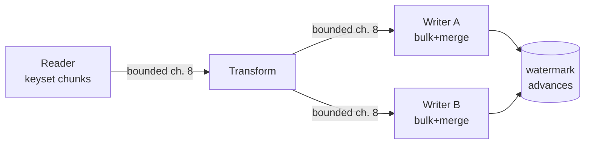

## The gap between "works" and "survives"

Every data-heavy shop has this job: every night, move and transform a hundred-million-ish rows - ad events into aggregates, transactions into a warehouse feed, CDC output into a reporting store. The first version is easy and everyone writes it: `SELECT` the day's rows, loop, transform, `INSERT`. It works on ten thousand rows in staging. Then production hands it 100 million and it dies in one of five extremely predictable ways:

1. It reads everything into memory and gets killed by the container's memory limit.
2. It does one row per round-trip and its ETA is measured in days.
3. It runs in one giant transaction that bloats the log and blocks the OLTP workload.
4. It crashes at row 60 million and the only recovery is "run it all again" - which double-processes the first 60 million.
5. It gets faster hardware instead of a design, and dies again next quarter.

Each failure has a specific, boring fix, and together the fixes form a shape every serious batch pipeline shares: **chunked, keyset-driven, idempotent, bulk-written, backpressured.** This post builds that shape in .NET and SQL Server, because that is where I have run it, but the shape is portable.

## Chunking: keyset, never OFFSET

Rule one: the unit of work is a **chunk** (5,000-50,000 rows), and each chunk is its own read, its own transform, its own write, its own transaction. Memory stays flat, transactions stay short, progress is resumable.

Rule two: chunks are carved by **keyset (seek) pagination**, not `OFFSET/FETCH`:

```sql
-- WRONG: OFFSET re-reads and discards all skipped rows.
-- Chunk 2,000 at 50k/chunk scans ~100M rows to return 50k. O(n²) total.
SELECT ... ORDER BY EventId OFFSET 100000000 ROWS FETCH NEXT 50000 ROWS ONLY;

-- RIGHT: seek to the last key seen; every chunk is one index seek + range scan.
SELECT TOP (50000) EventId, EventDate, CampaignId, Amount
FROM   dbo.AdEvents
WHERE  EventId > @lastSeenId          -- the "keyset"
ORDER  BY EventId;
```

With `OFFSET`, chunk N costs O(N × chunk size) because the engine materializes and throws away everything before the offset; total cost across the run is quadratic, which is why OFFSET-based jobs start fast and asymptote toward frozen. Keyset chunks cost the same at row 99 million as at row 1 - each is a seek on the clustering key ([why that seek is cheap](/posts/what-is-clustered-vs-non-clustered-index/)). It also composes with filtered work queues: `WHERE EventId > @last AND Status = 0` rides a filtered index exactly like the [outbox dispatcher's](/posts/outbox-pattern-end-to-end/) claim query.

The keyset column must be unique and monotonic for the scan (an identity or `(EventDate, EventId)` composite). If the natural key is composite, seek with a row-value comparison: `WHERE (EventDate, EventId) > (@d, @id)` expressed in SQL Server as `WHERE EventDate > @d OR (EventDate = @d AND EventId > @id)` - and check the plan actually seeks ([execution plans post](/posts/reading-sql-execution-plans/)).

## Watermarks: crash-proof by construction

A resumable job persists **how far it got** - the watermark - transactionally with the work itself:

```sql
CREATE TABLE dbo.PipelineWatermark (
    PipelineName  varchar(100) NOT NULL PRIMARY KEY,
    LastKeyDone   bigint       NOT NULL,
    UpdatedAtUtc  datetime2(3) NOT NULL DEFAULT SYSUTCDATETIME()
);
```

The loop per chunk: read from `LastKeyDone`, transform, then **write results + advance watermark in one transaction**. Crash anywhere and restart resumes from the last committed chunk - at worst re-processing one chunk, never skipping one. That "at worst re-process" clause means chunk writes must be idempotent, which the merge pattern below gives you for free.

This is the same at-least-once + idempotency contract as [Kafka consumers](/posts/kafka-delivery-semantics-dotnet/) - a batch pipeline is just a stream with a very slow clock, and CDC-driven incremental loads make the analogy literal: the watermark becomes an [LSN](/glossary/#lsn), the source becomes [change tables](/posts/change-data-capture-in-sql-server/), and "the night's rows" becomes "changes since the last run" - usually a 100x reduction in rows touched, which is the single biggest optimization available to most nightly jobs.

One prerequisite people miss: **late arrivals**. If rows can be inserted with yesterday's business date after yesterday's run finished, a date-based watermark silently misses them forever. Watermark on a monotonic *system* column (identity, `rowversion`, LSN), never on a business date; the business date is data, not progress.

## Writing fast: SqlBulkCopy into staging, then MERGE

Row-by-row `INSERT` costs a round-trip and a log record each; 100M of them is the days-long ETA. The fix is two-stage:

**Stage 1 - bulk load the chunk into a staging table.** `SqlBulkCopy` streams rows over Tabular Data Stream ([TDS](/glossary/#tds)) bulk protocol - orders of magnitude faster than inserts:

```csharp
using var bulk = new SqlBulkCopy(conn, SqlBulkCopyOptions.TableLock, tx)
{
    DestinationTableName = "stg.CampaignDailyAgg",
    BatchSize = 50_000,
    EnableStreaming = true            // stream from IDataReader, no buffering
};
await bulk.WriteToServerAsync(chunkReader, ct);
```

**Stage 2 - one set-based statement from staging into the target.** This is where idempotency is manufactured - re-running a chunk upserts the same values instead of duplicating:

```sql
MERGE dbo.CampaignDailyAgg WITH (HOLDLOCK) AS t
USING stg.CampaignDailyAgg AS s
  ON  t.CampaignId = s.CampaignId AND t.EventDate = s.EventDate
WHEN MATCHED THEN UPDATE
     SET t.Impressions = s.Impressions, t.Spend = s.Spend
WHEN NOT MATCHED THEN
     INSERT (CampaignId, EventDate, Impressions, Spend)
     VALUES (s.CampaignId, s.EventDate, s.Impressions, s.Spend);
```

(`MERGE` has a deserved bad reputation without `HOLDLOCK` and a simple key-equality `ON` clause; used this way it is fine. Separate `UPDATE`-then-`INSERT ... WHERE NOT EXISTS` statements in the same transaction are an equally correct, more debuggable alternative.)

Notice what the aggregate design did there: the target keys on `(CampaignId, EventDate)` and stores **state, not increments**. `SET Spend = s.Spend` re-applied twice is harmless; `SET Spend = t.Spend + s.Spend` re-applied twice is a finance ticket. Idempotency is mostly schema design wearing a process hat.

For initial loads into *empty* tables, go further: simple recovery or bulk-logged model, `TABLOCK`, load sorted by the clustering key, and build nonclustered indexes *after* the load - minimal logging plus no per-row index maintenance routinely takes hours down to minutes.

## Backpressure: bounded channels between stages

Read, transform, write - three stages with different speeds. Run them serially and total time is the *sum* of the three. Pipeline them naively (`Task.Run` per chunk, unbounded queue between stages) and the fast reader piles 90 million transformed rows into memory ahead of the slow writer: failure mode #1 again, now with extra steps.

The primitive that makes pipelining safe is a **bounded** queue, and .NET ships it as `System.Threading.Channels`:

```csharp
var chunks = Channel.CreateBounded<Chunk>(new BoundedChannelOptions(capacity: 8)
{
    SingleWriter = true,
    FullMode = BoundedChannelFullMode.Wait    // reader BLOCKS when writer lags
});

// Producer: reads chunks; awaits (pauses) when 8 chunks are queued
async Task ReadAsync() {
    await foreach (var chunk in ReadChunksAsync(ct))
        await chunks.Writer.WriteAsync(chunk, ct);   // backpressure point
    chunks.Writer.Complete();
}

// Consumers: N parallel writers draining the channel
async Task WriteAsync() {
    await foreach (var chunk in chunks.Reader.ReadAllAsync(ct))
        await BulkUpsertAsync(chunk, ct);
}

await Task.WhenAll(ReadAsync(), WriteAsync(), WriteAsync());
```

The bounded capacity is the whole point: when writers lag, `WriteAsync` on the channel *awaits*, which pauses the reader, which slows the whole pipeline to the speed of its slowest stage **with only 8 chunks ever in flight**. Memory is flat and configurable. Throughput approaches the max of the slowest stage rather than the sum of all three - and now you can attack the slowest stage specifically (usually the write, hence the bulk machinery above). Two writer tasks against *different* target partitions parallelize cleanly; two against the same key ranges just deadlock politely - [partition the work](/posts/partitioning-strategies-that-follow-you-everywhere/) by the same key the target is organized by.



## Run it like production, not like a script

The remaining 20% that distinguishes a pipeline from a script:

- **Metrics that predict, not describe**: rows/second and chunk latency trended per run. A job that "still finishes by 6 a.m." while rows/sec degrades 3% weekly is an incident with a scheduled date. The watermark table doubles as a progress API: `(max source key - LastKeyDone) / rows_per_sec` = honest ETA for the 4 a.m. "will it finish?" question.
- **A kill switch and a throttle**: batch jobs share the database with the OLTP workload; the job should watch for blocking it causes (or just the time of day) and slow itself down. `WAITFOR DELAY` between chunks is unglamorous and has saved more mornings than any clever feature.
- **Poison chunk handling**: one malformed row should quarantine the *row* (dead-letter table, alert), not wedge the run at 60% forever. Same philosophy as poison messages in queues.
- **The batch-to-streaming question.** When the business starts asking for the nightly numbers hourly, then every 15 minutes, do not keep shrinking the batch window - the setup overhead dominates and the failure modes multiply. That pressure is the signal to move the pipeline onto the stream you probably already have: [CDC into Kafka](/posts/streaming-sql-server-cdc-into-kafka-debezium/), consumers maintaining the aggregates continuously. The chunked-idempotent-watermarked discipline transfers directly; only the clock changes.

None of this is glamorous. That is rather the point: at 100 million rows, cleverness is a liability and arithmetic is destiny. Count the round-trips, bound the memory, make every step re-runnable, and the job becomes what it should have been all along - boring.
