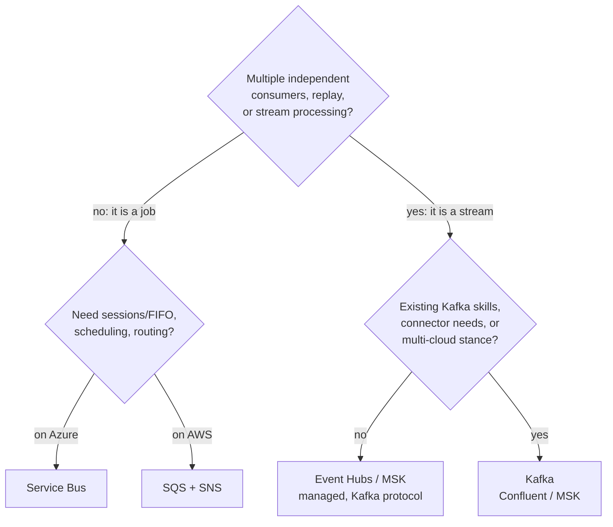

## Ask the shape question first

Teams agonize over Service Bus vs Kafka vs SQS as if it were one comparison. It is not - it is two decisions stacked, and the first one does 80% of the work: **is your workload a queue or a log?**

- A **queue** workload: discrete jobs, each processed once by whichever worker grabs it, with per-message retry, dead-lettering, and completion. "Generate this invoice." "Send this email." The message's life ends when the work is done.
- A **log** workload: a stream of facts, in order, that *multiple* independent consumers read at their own pace, possibly again ("replay"). Clickstreams, [CDC feeds](/posts/streaming-sql-server-cdc-into-kafka-debezium/), integration events feeding billing *and* analytics *and* search. The message's life is the retention window, regardless of who has read it.

The reason to get this right first is that the two shapes are not interchangeable, and forcing one into the other is the origin story of most messaging misery ([the log-vs-queue mechanics in detail](/posts/kafka-for-engineers-who-know-databases/)). Kafka as a job queue means hand-building per-message retry, dead-lettering, and competing consumers - the broker fights you at every step because a partition, not a message, is its unit of consumption. Service Bus as an event replay log means it cannot: completed messages are *gone*; there is no rewinding for the new analytics consumer or the bug-recovery reprocess.

Only after the shape question does the second decision - which vendor's implementation of that shape - matter. So: queues first, logs second, then the decision path.

## The queues: Service Bus and SQS/SNS

**Azure Service Bus** is the feature-rich queue. Beyond the basics (per-message lock, abandon/complete, delivery counting, automatic dead-letter queue ([DLQ](/glossary/#dlq)) after max deliveries), the features that decide real designs:

- **Topics + subscriptions with filters**: broker-side fan-out and routing - one `orders` topic, subscriptions per consumer with SQL-ish filter rules. This is SNS+SQS in one resource.
- **Sessions**: per-key FIFO. Messages sharing a `SessionId` are delivered in order to one consumer at a time - the queue-world equivalent of Kafka's per-key partition ordering, and the feature people do not know they need until events for the same order process out of order.
- **Scheduled delivery and deferral**: "deliver this at 9 a.m." and "not yet" as broker features, which otherwise become a cron job and a table you maintain forever.
- **Duplicate detection**: broker-side dedup by `MessageId` over a time window - a real assist for the [at-least-once duplicates problem](/posts/kafka-delivery-semantics-dotnet/), though not a substitute for consumer idempotency (the window is finite).

**AWS SQS** is the opposite philosophy: almost no features, executed at effectively unlimited scale with near-zero operations. One consumer group per queue, fan-out by putting **SNS** (or EventBridge) in front and subscribing multiple queues. The traps are specific and worth knowing cold:

- The **visibility timeout** is a lease, not a lock. Take a message, exceed the timeout while still working, and SQS redelivers it to another worker - now two workers process it concurrently. Size the timeout above worst-case (not average) processing time, extend it via heartbeat for long jobs, and be idempotent regardless.
- **Standard queues are at-least-once and unordered** - occasionally duplicated and out of order *by design*. If you did not read that sentence before going to production, production will read it to you.
- **FIFO queues** fix ordering and add dedup, but throughput is capped per `MessageGroupId` - the group is the ordering unit, exactly like a Kafka partition key, and a single hot group serializes to a few hundred messages/second no matter what you provision. [The hot-key problem](/posts/partitioning-strategies-that-follow-you-everywhere/) again, wearing AWS branding.

Choosing between them is mostly not a features contest: **you are usually already on one cloud, and the local queue is the right answer.** Cross-cloud "best of breed" messaging buys you egress bills, two identity systems, and no meaningful capability the other side's queue lacks for queue-shaped work.

## The logs: Event Hubs and Kafka

**Kafka** is the reference log: partitions, offsets, consumer groups, compaction, long retention, a massive connector ecosystem (Debezium included), and per-key ordering that the whole [streaming architecture](/posts/kafka-for-engineers-who-know-databases/) leans on. The honest cost is operational: even "managed" Kafka (AWS MSK, Confluent Cloud) leaves you owning partition strategy, consumer lag, rebalance behavior, and capacity planning. Kafka is a platform you adopt, not a resource you provision.

**Azure Event Hubs** is "the log as a cloud resource": Kafka's shape (partitions, offsets, consumer groups) with Azure's operational model. Two facts matter most in practice:

- It speaks the **Kafka wire protocol** - `Confluent.Kafka` clients and most of the ecosystem point at it with a connection-string change. This makes Event Hubs the low-drama on-ramp: adopt the log model on a managed resource; if you outgrow it, the protocol boundary makes leaving survivable.
- **Checkpointing is yours.** There is no broker-side offset store; consumers (via the SDK's processor + a blob container) record their own positions. It works well, but "where am I in the stream" is now explicitly your consumer's state - budget for understanding it.

Plus one genuinely great feature: **Capture** - the hub archives every event to Blob Storage/Data Lake automatically, giving you the cold-storage replay tier and warehouse feed without a consumer to run.

The trap shared by *every* log, worth engraving: retention is finite and consumer-independent. A consumer down longer than retention has silently lost data - no DLQ will tell you. Alerting on consumer lag versus retention headroom is not optional; it is the log-world equivalent of monitoring the CDC cleanup job.

## The decision path

Compressed into prose: **jobs go on your cloud's queue** (Service Bus if you need sessions, scheduling, or rich routing; SQS when you want minimum operational surface). **Streams go on a log**, and the default should be the managed one (Event Hubs or MSK) unless you have Kafka expertise in-house, need its connector/stream-processing ecosystem specifically, or have a hard multi-cloud requirement - Kafka's protocol being the lingua franca is a real portability argument, but pay it only when portability is a real requirement.

Three closing rules that outlast any vendor comparison:

1. **It is normal - and correct - to run both a queue and a log.** Domain events on the log; work dispatch on the queue; a consumer of the log often enqueues jobs as its output. One-backbone-to-rule-them-all is aesthetics, and the workloads will punish it.
2. **The broker never completes your semantics.** Whichever box you pick: producers get atomicity from the [outbox pattern](/posts/outbox-pattern-end-to-end/), consumers are idempotent, poison messages have a destination, and lag/DLQ depth are alerted on. Those four travel with you across every migration; the connection string is the least durable part of the design.
3. **Decide with the 10x load and 10-person-team test.** Fancy features you will not use are free-looking liabilities; operational burden you cannot staff is a paging schedule. The best messaging choice is the one whose failure modes your actual team can debug at 3 a.m. - which is a compliment to boring technology, and intended as one.
