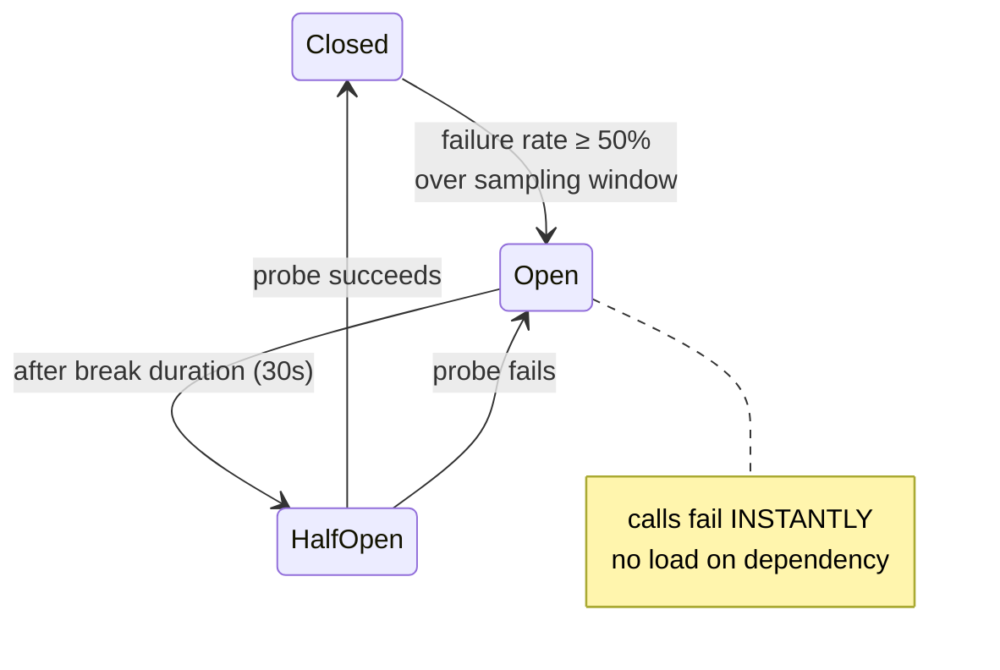

## Resilience patterns can be the outage

The dirty secret of resilience engineering: half the major outages I have studied were not caused by the failing dependency - they were caused by everyone's *resilience code reacting to it*. A dependency slows down; every caller's requests pile up waiting on generous timeouts; every caller retries; traffic triples against a service that was merely slow, which now actually falls over; its fallback dependency receives the full redirected load and follows it down. The dependency sneezed and the resilience patterns delivered the pneumonia.

So this post treats timeouts, retries, and circuit breakers as one *system* with interactions, not a checklist of NuGet features. The ordering matters: **timeouts first** (they bound the damage), **retries second** (they must live inside the budget timeouts create), **circuit breakers third** (they stop the first two from becoming a battering ram). Code is Polly v8 (`Microsoft.Extensions.Resilience`) because that is the current .NET standard - the reasoning is portable.

## Timeouts: every remote call, no exceptions, budgeted

The starting sin in most codebases is the default. `HttpClient.Timeout` defaults to **100 seconds**. A service doing 50 requests/second whose dependency goes dark accumulates up to 5,000 in-flight requests before the first timeout fires - each holding a connection, buffers, and (in a queue consumer) a message lease. Thread-pool starvation and health-check failures arrive well before second 100. A missing timeout is an unbounded liability on someone else's behavior.

Two rules:

**Set timeouts from the caller's need, not the callee's history.** "P99 is 800ms so I set 2 seconds" is backwards - if the user gives up at 3 seconds, a 30-second timeout only ensures you do work nobody is waiting for. Start from the top: the edge has a total budget (say 2s), and each hop gets a slice of what remains.

**Propagate the budget.** A caller with 400ms left calling a service that internally allows 5s just moved the waste downstream. Pass the deadline along (gRPC does this natively; for HTTP, flow a deadline header and honor it) and cancel work whose requester has already given up - in .NET that means `CancellationToken` threaded through every async call, *including* the database and Kafka produce calls, not just the HTTP ones.

```csharp
// Per-attempt timeout lives INSIDE the retry; total timeout outside it.
services.AddHttpClient<PricingClient>()
    .AddResilienceHandler("pricing", b =>
    {
        b.AddTimeout(TimeSpan.FromSeconds(2));            // total budget
        b.AddRetry(new HttpRetryStrategyOptions { /* below */ });
        b.AddTimeout(TimeSpan.FromMilliseconds(500));     // per attempt
    });
```

That layering - attempt timeout inside retry inside total timeout - is the difference between "3 tries × 500ms, done by 1.6s" and "one hung call eats the whole budget and the retries never happen."

## Retries: the pattern most likely to hurt you

A retry is a bet that the failure is transient and rare. When the failure is *systemic* - the dependency is down, not unlucky - retries convert your traffic into a weapon. The arithmetic is brutal because it compounds per layer: the edge retries 3x, the service it calls retries its own dependency 3x, that dependency retries the database 3x → one user click becomes **27 database attempts**. This is retry amplification, and it is why a 10-minute database blip so often shows up as a 2-hour full-stack outage: nothing can come back up under 27x load. The fixes, all of which are policy decisions, not code tricks:

- **Retry only where the failure is likely transient and the operation is safe**: network timeouts, HTTP 503/429, SQL error 1205 ([deadlock victim](/posts/sql-server-deadlocks-deep-dive/) - literally documented as "rerun the transaction"). Never on 400s, auth failures, or business rejections - retrying a validation error 3 times is three chances for the same "no."
- **Retry at ONE layer** (usually the outermost that can judge success), not every layer. Inner layers report failure fast; one layer owns persistence.
- **Exponential backoff with jitter, always.** Backoff without jitter synchronizes clients: everything that failed at T retries in lockstep at T+1, T+2, T+4 - coordinated waves hammering a recovering service exactly when it is weakest ("thundering herd"). Jitter decorrelates the waves into a smear the service can absorb.
- **Honor `Retry-After`.** A 429 with a header is the server *telling you* its recovery schedule; backing off on your own schedule instead is rude and ineffective.

```csharp
b.AddRetry(new HttpRetryStrategyOptions
{
    MaxRetryAttempts = 3,
    BackoffType = DelayBackoffType.Exponential,
    UseJitter = true,                       // decorrelated, non-negotiable
    Delay = TimeSpan.FromMilliseconds(200),
    ShouldHandle = args => ValueTask.FromResult(
        args.Outcome.Result?.StatusCode is HttpStatusCode.ServiceUnavailable
            or HttpStatusCode.TooManyRequests
            or HttpStatusCode.RequestTimeout
        || args.Outcome.Exception is HttpRequestException or TimeoutRejectedException)
});
```

And the precondition that outranks all tuning: **you may only retry what is safe to repeat.** A timeout is ambiguous - the payment POST may have succeeded before the response was lost. Retrying it blind is how customers get charged twice. The fix is an **idempotency key**: the caller generates a unique key per logical operation, sends it on every attempt, and the server stores it with the result (same transaction as the side effect - the processed-messages table from [the delivery-semantics post](/posts/kafka-delivery-semantics-dotnet/) in HTTP clothing). Replays return the stored result instead of re-executing. Stripe's API is the canonical public example. Without this, "retry POSTs" is not a resilience policy, it is a refund-processing policy.

## Circuit breakers: stop asking a question that hurts

Retries handle *rare* failure; the circuit breaker handles the moment failure stops being rare. It is a state machine wrapped around a dependency:



**Closed**: normal, counting failures. **Open**: every call fails immediately without touching the dependency - your service stops queueing doomed work (protecting *you*) and stops adding load (protecting *them*, and everyone else sharing them). **Half-open**: after a cooldown, a probe request tests recovery; success closes the circuit, failure re-opens it. The half-open state is the anti-thundering-herd device on the recovery side: one probe, not your full traffic, greets the recovering service.

```csharp
b.AddCircuitBreaker(new HttpCircuitBreakerStrategyOptions
{
    FailureRatio = 0.5,                          // open at 50% failures...
    MinimumThroughput = 20,                      // ...but only with real volume
    SamplingDuration = TimeSpan.FromSeconds(30),
    BreakDuration = TimeSpan.FromSeconds(30)
});
```

Details that decide whether the breaker helps or hurts:

- **`MinimumThroughput` prevents flappy circuits**: 2 failures out of 3 calls at 4 a.m. is 66% failure and zero information. Do not let low-traffic noise open circuits.
- **Scope the breaker to the failure domain.** One breaker across all downstream services means the pricing API's bad day blocks calls to the healthy inventory API. One breaker per host (or per endpoint for mixed workloads) is the right granularity - Polly's per-`HttpClient` handler gives you per-service scoping by default.
- **An open circuit is an answer, and the caller must have a plan for it.** Degrade (serve the cached price with a staleness marker), default (assume in-stock and reconcile at checkout), or refuse visibly (fail fast with a clear error). "Throw and let the user see a spinner for the full break duration" is choosing the worst plan by not choosing. What degradation is acceptable is a *product* decision - get it decided before the incident, not during.

## The patterns compose into a posture

Assembled, the pipeline for one dependency reads outside-in: total timeout → retry (with jitter, on retryable errors, idempotency keys on the wire) → circuit breaker → per-attempt timeout. Polly v8 executes them in exactly that nesting. Two final pieces complete the posture:

**Bulkheads**: cap concurrent calls per dependency (`b.AddConcurrencyLimiter(100)`), so a slow dependency can exhaust *its* compartment of connections and threads but not the process. The name is the ship metaphor and it is accurate - flooding stays in one compartment. This is the pattern that directly kills the "5,000 in-flight requests" failure from the timeouts section.

**Load shedding at your own front door**: when your queue depth or latency says you are drowning, reject early (429 + `Retry-After`) rather than time out late. Every request you will eventually fail is cheaper to fail *now*, before it consumes a thread for 2 seconds. Rejecting work you cannot do is not rudeness; accepting work you cannot do is.

And underneath all of it, the boring foundation the patterns assume: async calls fan out and time out only if you *await* correctly ([async/await pitfalls](/posts/async-await-pitfalls-in-csharp/)), and messaging paths get their resilience from at-least-once + idempotency + dead-letter queues ([DLQ](/glossary/#dlq)) rather than synchronous heroics - often the strongest resilience move of all is making the call [asynchronous and therefore retryable offline](/posts/microservice-boundaries-data-ownership/).

The test of the posture is not whether each policy exists - it is whether you can answer, for every dependency: *what happens here when this is down, and what does the user see?* If the answer involves the words "hopefully" or "should just," the next incident will grade the homework for you.
