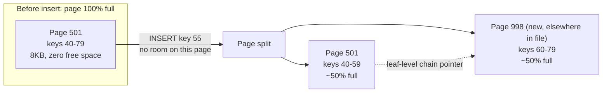
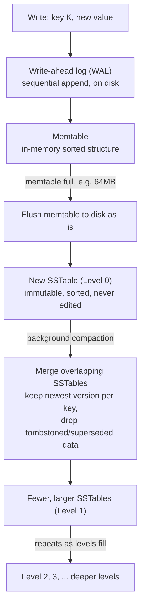

## Two tickets, same root cause

Same week, two unrelated tickets. First: a nightly batch job that inserts a few million rows into a SQL Server table keyed by `NEWID()` (a random GUID, a 16-byte globally unique identifier) has gone from an 11-minute run in January to a 54-minute run in July, no volume change, no code change. Second: a new hire on the events team asks how to fix a bad record in a Kafka-backed audit topic by "just updating it," and cannot find an `UPDATE` statement anywhere in the client library and assumes something is missing.

Both tickets have the same answer, and it is not a bug in either case - it is what each storage engine was built to do. SQL Server's clustered index is a **B-tree**: a page-organized, sorted, mutable structure where a write finds the right page and changes it in place. Kafka's log, and the storage layer under Cassandra and RocksDB, is an **LSM-tree** (log-structured merge-tree, a design where writes are only ever appended and old versions are cleaned up later in the background): a write never touches old data, it just appends a new version and lets a background process reconcile the mess afterward. The random-GUID job is drowning in page splits, the structural cost of in-place mutation. The audit topic literally cannot be updated, because "in place" is not a concept its storage engine has. Once you see both engines as answers to the same question, decisions like "should this table have a sequential key," "why does this Cassandra cluster need compaction tuning," and "why is CDC append-only under the hood" stop being separate facts you memorized and become one mental model.

## What SQL Server actually does when you write a row

A clustered index (the subject of [Clustered vs Non-Clustered Index](/posts/what-is-clustered-vs-non-clustered-index/)) stores table rows in B-tree leaf pages, sorted by the clustering key. Each page is a fixed 8 KB, holding somewhere around 8,060 usable bytes after headers. For a ~200-byte row, that is roughly 40 rows per page.

An `UPDATE` or an `INSERT` for a key that belongs in the middle of the sorted order has to land on the page that already holds its neighbors, because the whole point of a B-tree is that leaf order is physical order. Two things can happen:

- The page has free space (this is what `FILLFACTOR` reserves on purpose) - the row is written into the existing 8 KB page. Cheap: one page write, one log record.
- The page is full - SQL Server performs a **page split**: it allocates a brand-new page, moves roughly half the rows from the full page onto it, and rewires the leaf-level linked list and the parent page's pointers to keep the B-tree sorted. That is two page writes, extra transaction log records for both, and the new page usually lands somewhere else entirely in the data file - the logical order (sorted by key) and the physical order (position in the file) drift apart. That drift is **fragmentation**, and it turns what should be a sequential scan into a random-IO scan.



A monotonically increasing key (an `IDENTITY` column, or a sequence) mostly avoids this - every insert lands after the last row, on the last page, so pages fill and then a new page is simply appended at the end. No split, no rewiring, no fragmentation. A random key like `NEWID()` inserts somewhere in the middle of the keyspace on essentially every write, so once the table is large enough that every page is full, close to every insert costs a split. That is exactly the batch job in the first ticket: it started fast because early pages had room, and got progressively slower as the table filled and every insert began forcing a split.

The fix is boring and effective: build the clustered index with headroom (`CREATE INDEX ... WITH (FILLFACTOR = 80)` leaves 20% of each page empty on rebuild, so pages absorb inserts before splitting), rebuild periodically to undo drift, and prefer a sequential clustering key when insert order does not need to match business meaning.

```sql
-- Leave 20% free space per page so inserts land without splitting immediately
CREATE CLUSTERED INDEX IX_Orders_OrderId
    ON dbo.Orders (OrderId)
    WITH (FILLFACTOR = 80, ONLINE = ON);

-- Check how bad the drift actually is before you guess
SELECT
    index_type_desc,
    avg_fragmentation_in_percent,   -- logical vs physical order mismatch
    page_count
FROM sys.dm_db_index_physical_stats(DB_ID(), OBJECT_ID('dbo.Orders'), 1, NULL, 'SAMPLED')
WHERE avg_fragmentation_in_percent > 10;
```

Note what this buys you in exchange for the split tax: a read for a single key or a range is `O(log_B N)` page reads - for a B-tree with a branching factor in the hundreds, a multi-billion-row table is typically 3-4 page reads from root to leaf. Mutation is expensive; lookup is close to free. That is the B-tree's entire personality.

## What Kafka, Cassandra, and RocksDB actually do when you write a row

An LSM-tree makes the opposite bet: writes are cheap and sequential, reads pay the cost instead. There is no "find the page and mutate it," because nothing already on disk is ever mutated.

A write - `Produce()` to a Kafka partition, an `INSERT`/`UPDATE` in Cassandra (they are the same operation internally), a `Put()` in RocksDB - does two things, both appends:

1. It is appended to a **write-ahead log (WAL)**, a plain sequential file, purely for crash durability. SQL Server does this too for the same reason - both engines use write-ahead logging to guarantee durability before acknowledging a write. The difference is what happens next.
2. It is inserted into the **memtable**, an in-memory sorted structure (a skip list, typically) holding recent writes.

Nothing has touched disk-resident data yet. When the memtable fills (RocksDB's default is 64 MB), it is flushed as-is to disk as a new **SSTable** (Sorted String Table - an immutable, sorted, on-disk file). Immutable is the operative word: once written, an SSTable is never edited again, only read or eventually deleted. A newer write for the same key does not find and change the old value - it lands in a brand-new SSTable that simply shadows the old one. Over time you accumulate many SSTables, several of which may hold different versions of the same key, plus tombstones (delete markers, which are themselves just a special value, not an in-place removal). A background process called **compaction** periodically merges SSTables together, keeping only the newest version of each key and dropping tombstoned or superseded data.



This is the mechanism behind the "everything is a log" framing from [Kafka for Engineers Who Know Databases](/posts/kafka-for-engineers-who-know-databases/): a Kafka partition never runs compaction on normal topics at all (retention just deletes whole old log segments), but Kafka's own **compacted topics**, and Cassandra's and RocksDB's storage layers, all run the identical merge-and-drop-old-versions process described above. Same mechanism, same tradeoffs, whether the "row" is a Cassandra cell or a Kafka key.

## The triangle: write, read, and space amplification

Every storage engine's disk footprint can be described by three multipliers, and the honest framing (close to what the database research literature calls the RUM conjecture: read, update, memory) is that you cannot minimize all three at once - improving one costs one of the others.

- **Write amplification**: bytes actually written to disk per logical byte the application wrote. A B-tree writes a full 8 KB page to update a 200-byte row (40x at the page level alone), plus doubles that on a split. An LSM-tree looks cheap at the moment of write (append a few bytes to the WAL and memtable) but pays later: a key flushed to Level 0 gets rewritten every time compaction merges it into the next level. RocksDB with leveled compaction and a 10x level size multiplier commonly cites **10-30x write amplification** over the tree's lifetime - your key was durable after one append, but disk work for it kept happening for hours afterward.
- **Read amplification**: how many disk reads answer one logical read. A B-tree is close to its theoretical best: 3-4 page reads regardless of how many times the row has been updated, because there is only ever one current copy. An LSM-tree may have to check the memtable and multiple SSTables across multiple levels before it can be sure it found the newest (or only) version of a key - bloom filters (a per-SSTable probabilistic "definitely not here" check) cut this down a lot, but size-tiered compaction (Cassandra's older default) can still leave dozens of SSTables to check for a cold key before the next compaction cleans up.
- **Space amplification**: disk bytes used per logical byte alive. A B-tree with `FILLFACTOR = 80` is deliberately wasting 20% of every page by design, and fragmentation adds more on top. An LSM-tree can temporarily hold several versions of the same key across different SSTables, plus tombstones that occupy space until a compaction pass physically removes them - 2-10x space amplification before compaction catches up is normal under sustained write load, which is exactly why a Cassandra node can show disk usage that looks alarming until the next compaction cycle runs.

Pick two: leveled compaction (RocksDB, ScyllaDB) minimizes read and space amplification and accepts high write amplification. Size-tiered compaction (Cassandra's classic default) minimizes write amplification and accepts higher space and read amplification. A B-tree with a low fill factor minimizes write amplification for random keys and accepts permanent space amplification. There is no configuration that gets all three low at once - if a vendor's marketing implies otherwise, ask which one they quietly gave up.

## Why you never UPDATE a Kafka record

Once the append-only structure is the mental model, "Kafka has no `UPDATE`" stops being a missing feature and becomes the design working as intended. A partition is a log; a log's contract is that position N's contents never change after they are written, because every consumer's entire state is "I have read up to offset N" - if offset 500's payload could silently change after a consumer already read it, replaying from an earlier offset (the recovery mechanism the [Kafka post](/posts/kafka-for-engineers-who-know-databases/) covers in depth) would replay something different than what actually happened, which defeats the reason you wanted a log instead of a database in the first place.

To get "current value per key" semantics on top of an append-only log, Kafka gives you a **compacted topic**: you produce a new record with the same key and the new value, and a background compaction process (the same mechanism as the diagram above) eventually removes the earlier record for that key, keeping only the latest. That is the entire mechanism behind Kafka Streams' `KTable`, Debezium's changelog topics, and the pattern in [Change Data Capture in SQL Server](/posts/change-data-capture-in-sql-server/) for turning a stream of row versions into a "latest state" view - it is compaction with a friendlier name, not a hidden `UPDATE`.

```csharp
// Cassandra (CQL via the driver) - looks like an UPDATE, is actually an append
var statement = new SimpleStatement(
    "UPDATE orders SET status = ? WHERE order_id = ?",
    "Shipped", orderId);
await session.ExecuteAsync(statement);
// Under the hood: a new cell for (order_id, status) is written to the memtable/WAL.
// The old value is not touched. It becomes unreachable once this write's
// timestamp wins during a read (or gets physically dropped during compaction).
```

```csharp
// RocksDB (rocksdb-sharp) - same shape, no database "table" in sight, just a log-structured store
using var db = RocksDb.Open(new DbOptions().SetCreateIfMissing(true), "/data/mystore");
db.Put(Encoding.UTF8.GetBytes("order:42"), Encoding.UTF8.GetBytes("Shipped"));
// This call appends to the WAL and the memtable. The bytes previously stored
// for "order:42" are not located or overwritten - they will be dropped later,
// when compaction merges the SSTable holding this write with an older one.
```

## The compaction tax and the fragmentation tax

Both engines eventually pay for cheap writes; they just bill you at different times and require different maintenance.

LSM stores need **compaction tuned to the workload**, or the read and space amplification numbers above stop being theoretical. A Cassandra table with heavy overwrites and size-tiered compaction can accumulate hundreds of SSTables per key range before a major compaction runs, turning single-row reads into dozens of disk seeks - the fix is switching that table to leveled compaction (`compaction = {'class': 'LeveledCompactionStrategy'}`), trading some write throughput for bounded read cost. RocksDB exposes the same knob directly (`level_compaction_dynamic_level_bytes`, level multipliers, background compaction thread counts) because the "right" compaction strategy genuinely depends on whether the workload is write-heavy-rarely-read (favor size-tiered) or read-heavy-with-occasional-writes (favor leveled).

B-tree stores need **index maintenance tuned to the write pattern**, or fragmentation quietly turns sequential scans into random IO, exactly like the first ticket in this post. `ALTER INDEX ... REORGANIZE` defragments online with low overhead for moderate drift; `ALTER INDEX ... REBUILD` fully rebuilds the structure (offline unless you have `ONLINE = ON`, an Enterprise/Azure feature) and is worth it above roughly 30% fragmentation. Neither is optional maintenance - they are the B-tree equivalent of compaction, just against a different failure mode (physical disorder, not accumulated old versions).

## Picking the engine for the workload

None of this is an argument that one design is better - it is an argument that the choice was already made for you the moment you picked SQL Server/Postgres versus Cassandra/RocksDB/Kafka, and pretending otherwise is how you end up fighting the engine instead of the workload.

Reach for a B-tree (SQL Server, Postgres) when the workload is a genuine **OLTP mix**: point lookups and range scans interleaved with in-place updates on the same rows, where read latency needs to stay flat regardless of how many times a row has been touched, and where the table's natural key can be made mostly sequential. Reach for an LSM-tree (Cassandra, RocksDB, and Kafka's own log for the append-heavy case) when the workload is **write-dominated and append-heavy**: high-volume ingestion, time-series or event data where you rarely revisit an old key, and where you can tolerate tuning compaction rather than tuning index rebuilds. Ad-tech event pipelines, CDC change streams, and metrics ingestion are LSM-shaped almost by definition; a customer-facing order table with constant updates to the same rows by primary key is B-tree-shaped almost by definition.

The B-tree and the LSM-tree are not competing implementations of the same idea - they are the two coherent answers to "should a write touch old data or leave it alone," and every downstream property (page splits versus compaction, fragmentation versus tombstones, cheap reads versus cheap writes) falls out of that single decision. Once you know which answer your storage engine gave, its weird behaviors stop being surprising and start being predictable.
