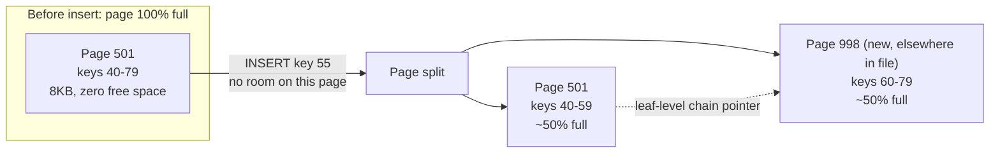
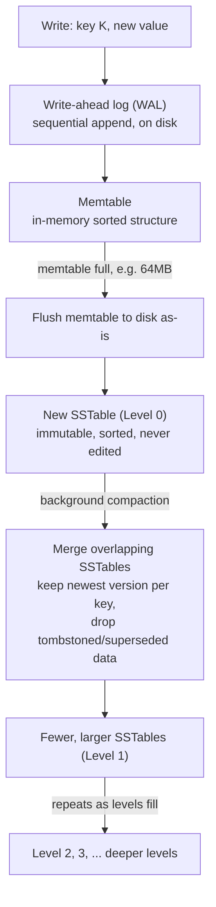

## Two tickets that turned out to be the same ticket

Two tickets landed in the same week, and it took me longer than I'd like to admit to notice they were actually one problem.

First ticket: a nightly batch job that inserts a few million rows into a SQL Server table, keyed by `NEWID()` (a random GUID, basically a random 16-byte unique ID). Back in January it finished in 11 minutes. By July, same job, same volume, same code, it was taking 54 minutes.

Second ticket: someone new on the events team wanted to fix a bad record in a Kafka-backed audit log by "just updating it." They went looking for an `UPDATE` in the client library, couldn't find one, and assumed something was broken or missing.

Neither of these is a bug. They're both just the storage engine doing exactly what it was built to do. SQL Server's clustered index is a structure called a **B-tree**: rows live on fixed-size pages, sorted, and a write finds the right page and edits it in place. Kafka's log, and the storage underneath Cassandra and RocksDB, is a different structure called an **LSM-tree** (log-structured merge-tree): a write never touches anything that's already on disk. It just appends a new version, and something else cleans up the old versions later.

The random-GUID job is drowning in a cost that's specific to B-trees, which I'll get to. The audit topic genuinely cannot be updated, because "edit in place" isn't a thing its storage engine knows how to do. Once you see both of these as two different answers to the same design question, a bunch of things that used to feel like separate trivia (why should this table have a sequential key, why does this Cassandra cluster need compaction tuning, why is CDC append-only under the hood) turn out to be the same idea wearing different clothes.

## What SQL Server actually does when you write a row

A clustered index (I wrote about the basics [here](/posts/what-is-clustered-vs-non-clustered-index/)) stores your table's rows on B-tree pages, sorted by whatever column you clustered on. Each page is a fixed 8 KB, and after SQL Server's own bookkeeping that leaves around 8,060 usable bytes. For a row that's roughly 200 bytes, that's about 40 rows per page.

Here's the part that matters: an insert or update for a key that belongs in the middle of the sorted order has to land on the same page as its neighbors, because the entire point of a B-tree is that the order on the page matches the sorted order of the keys. From there, one of two things happens.

If that page still has room, this is cheap. One page gets rewritten, one log record gets written, done. That spare room is what the `FILLFACTOR` setting is reserving on purpose.

If the page is completely full, SQL Server has to do a **page split**. It allocates a brand new page, moves roughly half the rows from the full page onto it, and updates the pointers that keep everything linked in sorted order. That's now two page writes instead of one, extra log records for both, and the new page usually ends up somewhere else entirely in the file. Over time, the order you'd read the data in (sorted by key) and the order it actually sits in on disk drift apart. That drift is called **fragmentation**, and it's what turns a scan that should be one smooth sweep across the disk into a scramble of scattered reads.


```mermaid
flowchart LR
    subgraph Before["Before insert: page 100% full"]
        P1["Page 501<br/>keys 40-79<br/>8KB, zero free space"]
    end
    P1 -->|"INSERT key 55<br/>no room on this page"| SPLIT["Page split"]
    SPLIT --> P2["Page 501<br/>keys 40-59<br/>~50% full"]
    SPLIT --> P3["Page 998 (new, elsewhere in file)<br/>keys 60-79<br/>~50% full"]
    P2 -.->|"leaf-level chain pointer"| P3
```

A key that only ever goes up, like an `IDENTITY` column, mostly dodges this problem entirely. Every insert lands after the last row, on the last page, so pages fill up and a fresh page just gets tacked on at the end. No split, no rewiring, no fragmentation. A random key like `NEWID()` inserts somewhere in the middle of the existing data on basically every write. Once the table is big enough that every page is full, nearly every insert forces a split.

That's exactly what happened in the first ticket. The job was fast in January because there was still free room on pages. As the table filled up, more and more inserts started forcing splits, and the job got slower every month without anyone touching the code.

The fix is unglamorous but it works: build the clustered index with some headroom (`FILLFACTOR = 80` leaves 20% of each page empty), rebuild the index periodically to undo the drift that's already happened, and use a sequential key for the clustering column whenever the insert order doesn't need to carry business meaning.

```sql
-- Leave 20% free space per page so inserts land without splitting immediately
CREATE CLUSTERED INDEX IX_Orders_OrderId
    ON dbo.Orders (OrderId)
    WITH (FILLFACTOR = 80, ONLINE = ON);

-- Check how bad the drift actually is before you guess
SELECT
    index_type_desc,
    avg_fragmentation_in_percent,   -- logical vs physical order mismatch
    page_count
FROM sys.dm_db_index_physical_stats(DB_ID(), OBJECT_ID('dbo.Orders'), 1, NULL, 'SAMPLED')
WHERE avg_fragmentation_in_percent > 10;
```

Here's what you get in exchange for putting up with splits: looking up a single key or a range only ever costs a handful of page reads, no matter how big the table gets. A B-tree branches so widely (hundreds of children per page) that even a table with billions of rows is typically just 3 to 4 page reads from the top to the row you want. Writes are the expensive part. Reads are nearly free. That's the whole personality of a B-tree in one sentence.

## What Kafka, Cassandra, and RocksDB actually do when you write a row

An LSM-tree makes the opposite bet. Writes should be cheap and reads can pay for it instead. There's no "find the page and change it," because nothing that's already on disk ever gets touched again.

A write, whether it's a `Produce()` call to a Kafka partition, an `INSERT` or `UPDATE` in Cassandra (which are internally the exact same operation), or a `Put()` in RocksDB, does two things, and both of them are appends rather than edits.

First, it's appended to a **write-ahead log**, a plain sequential file whose only job is making sure the write survives a crash. SQL Server does this too, for the same reason. Both kinds of engines write ahead to guarantee durability before telling the caller "saved." The difference is what happens after that.

Second, the write is inserted into the **memtable**, an in-memory sorted structure holding whatever's been written recently.

Nothing on disk has been touched yet. Once the memtable fills up (RocksDB defaults to 64 MB), it gets flushed to disk exactly as it is, becoming a new file called an **SSTable**, short for Sorted String Table. The word that matters here is immutable. Once an SSTable is written, it is never edited again. Only read, or eventually deleted.

So what happens when you write a newer value for a key that already exists? The old value doesn't get found and changed. The new write just lands in a brand new SSTable, which simply takes priority over the old one whenever anyone reads that key. Do this enough times and you end up with a pile of SSTables, some of which hold different versions of the same keys, plus tombstones (delete markers, which are themselves just another value written to disk, not an actual removal). A background process called **compaction** periodically merges these files together, keeps only the newest version of each key, and drops anything that's been deleted or superseded.


```mermaid
flowchart TD
    W["Write: key K, new value"] --> WAL["Write-ahead log (WAL)<br/>sequential append, on disk"]
    WAL --> MT["Memtable<br/>in-memory sorted structure"]
    MT -->|"memtable full, e.g. 64MB"| FL["Flush memtable to disk as-is"]
    FL --> L0["New SSTable (Level 0)<br/>immutable, sorted, never edited"]
    L0 -->|"background compaction"| MERGE["Merge overlapping SSTables<br/>keep newest version per key,<br/>drop tombstoned/superseded data"]
    MERGE --> L1["Fewer, larger SSTables (Level 1)"]
    L1 -->|"repeats as levels fill"| L2["Level 2, 3, ... deeper levels"]
```

This is the same mechanism I described as "everything is a log" in [Kafka for Engineers Who Know Databases](/posts/kafka-for-engineers-who-know-databases/). A regular Kafka topic never runs compaction at all, it just deletes whole old segments once they age out. But Kafka's own **compacted topics**, along with Cassandra's and RocksDB's entire storage layer, run exactly the merge-and-drop-old-versions process shown above. Same mechanism, same tradeoffs, whether what you're calling a "row" is a Cassandra cell or a Kafka key.

## Three costs you can't all minimize at once

Every storage engine's disk usage boils down to three numbers, and here's the honest part: you cannot make all three small at the same time. Improving one always costs you one of the other two.

**Write amplification** is how many bytes actually get written to disk for every byte your application wrote. A B-tree writes a full 8 KB page just to update a 200-byte row, so that's already 40x at the page level, and a split doubles it again. An LSM-tree looks cheap the instant you write, since it's just a small append to the log and the memtable, but it pays for that later: a key that lands in an early SSTable gets rewritten every single time compaction merges it into the next level. RocksDB with its default compaction settings commonly sees 10 to 30 times write amplification over a key's lifetime. It was durable after one append, but the disk kept doing work on it for hours afterward.

**Read amplification** is how many disk reads it takes to answer one logical read. A B-tree is close to ideal here: 3 to 4 page reads no matter how many times the row has been updated, because there's only ever one current copy sitting on disk. An LSM-tree might have to check the memtable and several SSTables across multiple levels before it's sure it's found the right version of a key. Bloom filters (a cheap per-file check that can say "definitely not in here" without a full read, which I wrote about separately) cut this down a lot, but under an older-style compaction strategy you can still end up checking dozens of files for one cold key.

**Space amplification** is how many disk bytes you're using per byte of data that's actually alive. A B-tree with `FILLFACTOR = 80` is deliberately wasting 20% of every page, on purpose, and fragmentation piles more waste on top of that. An LSM-tree can be holding several versions of the same key across different files at once, plus tombstones that stick around until compaction physically removes them. Seeing 2 to 10 times space amplification under sustained write load is completely normal, which is why a Cassandra node's disk usage can look alarming right up until the next compaction pass runs and cleans house.

You get to pick two, roughly speaking. RocksDB and ScyllaDB's leveled compaction keeps read and space costs low and accepts high write cost. Cassandra's older default, size-tiered compaction, keeps write cost low and accepts higher read and space cost. A B-tree with a low fill factor keeps write cost down for random keys and just accepts permanent wasted space. There's no setting that gets all three down simultaneously. If a vendor's marketing implies otherwise, ask which one they quietly left out.

## Why Kafka has no UPDATE statement

Once you're thinking in terms of "append-only structure," the fact that Kafka has no `UPDATE` stops looking like a missing feature and starts looking like the design doing its job.

A Kafka partition is a log, and a log's entire contract is that whatever is at position N never changes after it's written. Every consumer's state is just "I've read up to offset N." If the contents at offset 500 could silently change after someone already read it, then replaying the log from an earlier point (the recovery mechanism I cover in the Kafka post linked above) would replay something different from what actually happened. That defeats the reason you wanted a log instead of a database in the first place.

So how do you get "current value for this key" behavior out of something append-only? Kafka gives you a **compacted topic**. You produce a new record with the same key and a new value, and compaction (the exact process from the diagram above) eventually removes the earlier record for that key, leaving only the latest one. This is the entire mechanism behind Kafka Streams' `KTable`, behind Debezium's changelog topics, and behind the pattern I described in [Change Data Capture in SQL Server](/posts/change-data-capture-in-sql-server/) for turning a stream of row versions into a single current-state view. It's compaction with a friendlier name. Not a hidden `UPDATE`.

```csharp
// Cassandra (CQL via the driver) - looks like an UPDATE, is actually an append
var statement = new SimpleStatement(
    "UPDATE orders SET status = ? WHERE order_id = ?",
    "Shipped", orderId);
await session.ExecuteAsync(statement);
// Under the hood: a new cell for (order_id, status) is written to the memtable/WAL.
// The old value is not touched. It becomes unreachable once this write's
// timestamp wins during a read (or gets physically dropped during compaction).
```

```csharp
// RocksDB (rocksdb-sharp) - same shape, no database "table" in sight, just a log-structured store
using var db = RocksDb.Open(new DbOptions().SetCreateIfMissing(true), "/data/mystore");
db.Put(Encoding.UTF8.GetBytes("order:42"), Encoding.UTF8.GetBytes("Shipped"));
// This call appends to the WAL and the memtable. The bytes previously stored
// for "order:42" are not located or overwritten - they will be dropped later,
// when compaction merges the SSTable holding this write with an older one.
```

## Both engines pay eventually, just at different times

Neither design gets cheap writes for free forever. They just bill you later, and the maintenance looks completely different.

LSM stores need compaction tuned to how you're actually using them, or those read and space numbers from earlier stop being theoretical and start showing up in your latency graphs. A Cassandra table that gets hit with heavy overwrites, running the older size-tiered compaction, can pile up hundreds of small files before a big compaction finally runs, and by then a single-row read means dozens of disk seeks. The fix is usually switching that table to leveled compaction, which trades away some write throughput in exchange for keeping read cost bounded. RocksDB exposes similar knobs directly, because the right compaction strategy genuinely depends on whether your workload writes constantly and rarely reads, or reads constantly with occasional writes.

B-tree stores need index maintenance tuned to the write pattern, or fragmentation quietly turns clean sequential scans into random disk hits, exactly like the first ticket at the top of this post. `ALTER INDEX ... REORGANIZE` cleans up moderate drift online with low overhead. `ALTER INDEX ... REBUILD` fully rebuilds the structure (offline unless you have the `ONLINE` option available) and is worth doing once fragmentation gets past roughly 30%. Neither of these is optional. They're the B-tree's version of compaction, just fighting a different failure mode: physical disorder instead of piled-up old versions.

## So which one do you actually want

None of this makes one design better than the other. It's really an argument that the choice got made for you the moment you picked SQL Server or Postgres over Cassandra, RocksDB, or Kafka, and pretending otherwise is how you end up fighting your storage engine instead of just working with it.

Reach for a B-tree when your workload is a real mix of point lookups and range scans interleaved with in-place updates to the same rows, where you need read latency to stay flat no matter how many times a row has been touched, and where you can make the table's natural key mostly sequential. Reach for an LSM-tree when the workload is write-heavy and append-heavy: high-volume ingestion, time-series or event data you rarely revisit by key, and a willingness to tune compaction instead of tuning index rebuilds. Ad-tech event pipelines, CDC change streams, and metrics ingestion are LSM-shaped almost by definition. A customer-facing order table that gets updated constantly by primary key is B-tree-shaped almost by definition.

The B-tree and the LSM-tree aren't two competing ways of implementing the same idea. They're the two coherent answers to one question: should a write touch old data, or leave it alone? Everything downstream, page splits versus compaction, fragmentation versus tombstones, cheap reads versus cheap writes, falls straight out of that single choice. Once you know which answer your storage engine picked, its quirks stop being surprising and start being predictable.
