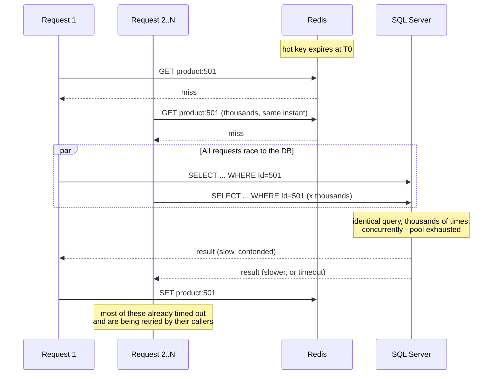

## The cache made it worse

A team I worked with added Redis in front of a "hot product" lookup that was doing 200 SQL Server round trips a second at peak. Cache hit rate settled at 97%, p99 latency dropped from 40ms to 3ms, everyone moved on. Three weeks later the key for their single best-selling product expired during a flash sale. In the ~80ms it took to recompute it, roughly 14,000 requests arrived for that same key. Every single one missed the cache, because the old value was gone and the new one wasn't written yet. Every single one went to the database, in parallel, for the same query the cache existed to avoid. SQL Server, which had never seen more than 200 qps for this key, now saw 14,000 qps for it in under a second. Connection pool exhausted, query queue backed up, and the resulting timeouts cascaded into retries (the same retry-amplification math from [the resilience post](/posts/timeouts-retries-circuit-breakers-dotnet/)), which added more load to a database that was already drowning. The outage lasted eleven minutes and the root cause line in the postmortem read: "we added a cache."

That's not irony, it's mechanism. A cache converts a steady trickle of database reads into an all-or-nothing gate: while the key is warm, the database sees near zero of that traffic; the instant it's cold, the database sees all of it, simultaneously. This post covers the three ways to keep the gate warm (cache-aside, write-through, write-behind), the concrete consistency cost of each, the stampede failure mode above and its three real fixes, and why TTL-based invalidation is the wrong tool for correctness-sensitive data.

## Three strategies, three different lies you tell the reader

All three answer the same question - "when does the cache get the right value?" - with a different tradeoff between latency, write cost, and how wrong the cache is allowed to be for how long.

**Cache-aside** (also called lazy loading): the application owns the logic. On read, check the cache; on miss, read the database, then write the result into the cache before returning it. On write, update the database and either delete the cache key or leave it to expire via TTL (time-to-live, how long a cached entry survives before it's considered stale). Nothing is ever written to the cache except as a side effect of a read. This is the default choice for most services because it only caches what's actually requested (no wasted memory on cold data) and the cache is allowed to be absent entirely - if Redis is down, cache-aside degrades to "every read hits the database," which is slow but correct.

```csharp
public async Task<Product> GetProductAsync(int productId, CancellationToken ct)
{
    var cacheKey = $"product:{productId}";
    var cached = await _cache.GetStringAsync(cacheKey, ct);
    if (cached is not null)
        return JsonSerializer.Deserialize<Product>(cached)!;

    // Miss: go to the source of truth.
    var product = await _db.Products.AsNoTracking()
        .FirstOrDefaultAsync(p => p.Id == productId, ct);
    if (product is null) return null!;

    await _cache.SetStringAsync(cacheKey, JsonSerializer.Serialize(product),
        new DistributedCacheEntryOptions { AbsoluteExpirationRelativeToNow = TimeSpan.FromMinutes(10) }, ct);
    return product;
}
```

The consistency cost: between a write to the database and the next cache miss, readers can see stale data for up to the TTL. That staleness window is the price of every cache-aside deployment - it is never zero unless you invalidate explicitly on write.

**Write-through**: the write path goes through the cache, which writes to the database itself (or the two are updated together as one operation) before the write is acknowledged. Every write keeps the cache warm, so reads almost never miss for recently-written data. The cost is write latency - every write now pays for both the cache round trip and the database round trip, synchronously - and you're caching data whether or not anyone reads it.

```csharp
public async Task UpdatePriceAsync(int productId, decimal newPrice, CancellationToken ct)
{
    await using var tx = await _db.Database.BeginTransactionAsync(ct);
    var product = await _db.Products.FirstAsync(p => p.Id == productId, ct);
    product.Price = newPrice;
    await _db.SaveChangesAsync(ct);
    await tx.CommitAsync(ct);

    // Cache updated only after the database commit succeeds - never before.
    var cacheKey = $"product:{productId}";
    await _cache.SetStringAsync(cacheKey, JsonSerializer.Serialize(product),
        new DistributedCacheEntryOptions { AbsoluteExpirationRelativeToNow = TimeSpan.FromMinutes(10) }, ct);
}
```

The consistency cost here is different from cache-aside's: if the process crashes between the database commit and the cache update, the cache holds a stale value with no TTL pressure forcing a refresh soon - so write-through still needs a TTL as a backstop, it just needs one far less often in practice.

**Write-behind** (write-back): the write lands in the cache and is acknowledged immediately; a background process asynchronously flushes it to the database on a delay or batch schedule. This is the fastest write path by far - the caller never waits on the database - and it's the right shape for high-frequency counters (view counts, rate-limit buckets, leaderboard scores) where losing the last few seconds of updates on a crash is an acceptable cost. It is close to never the right shape for anything with a "the money has to be there" requirement: if the cache node dies before the flush, those writes are gone, full stop, and there's no WAL (write-ahead log) or transaction log to replay them from, because the database - the thing with the durability guarantees - never saw them.

The one-line summary that's worth memorizing: cache-aside trades read latency for a bounded staleness window, write-through trades write latency for a nearly-always-warm cache, write-behind trades durability for the fastest possible write. None of them are "the fast one" in isolation - each is fast at a different operation and pays for it somewhere else.

## The stampede: why a cache miss under load is worse than no cache

The opening story generalizes into a named failure mode: **cache stampede** (also called dogpiling or the thundering herd problem). The mechanism is simple and that's exactly why it's easy to miss in design review: a cache absorbs N requests/second into roughly zero database load while warm, so nobody sizes the database for N. The moment the key goes cold - TTL expiry, eviction under memory pressure, or a cold deploy - every one of those N requests/second (times however many seconds it takes to recompute the value) executes the cache-miss path at once. If recompute takes 80ms and traffic is 14,000 req/s for that key, roughly 1,100 requests execute the exact same expensive query concurrently before the first one finishes and repopulates the cache. A database that was doing zero work for this query a moment ago now gets over a thousand identical, redundant executions in parallel. Without a cache at all, the database would only ever have seen the steady 14,000 req/s, spread out - which is exactly the load profile it would have been provisioned for. The cache didn't reduce peak load, it deferred it and then delivered it as a burst.



Three fixes, and they compose:

**Request coalescing / single-flight**: when a key is missing, only the first caller is allowed to go to the database; everyone else who asks for the same key while that fetch is in flight waits on the *same* result instead of starting their own query. This is the single highest-leverage fix because it caps concurrent database load per key at exactly 1, regardless of how many callers are waiting. In a single process, a keyed semaphore does this cheaply:

```csharp
public sealed class SingleFlightCache
{
    private readonly IDistributedCache _cache;
    private readonly IDatabase _db; // whatever your data access looks like
    // One semaphore per key, created on demand, so unrelated keys never block each other.
    private readonly ConcurrentDictionary<string, SemaphoreSlim> _locks = new();

    public SingleFlightCache(IDistributedCache cache, IDatabase db)
    {
        _cache = cache;
        _db = db;
    }

    public async Task<Product> GetProductAsync(int productId, CancellationToken ct)
    {
        var cacheKey = $"product:{productId}";
        var cached = await _cache.GetStringAsync(cacheKey, ct);
        if (cached is not null)
            return JsonSerializer.Deserialize<Product>(cached)!;

        var gate = _locks.GetOrAdd(cacheKey, _ => new SemaphoreSlim(1, 1));
        await gate.WaitAsync(ct);
        try
        {
            // Re-check: while we waited for the gate, the first caller
            // through may have already repopulated the cache.
            cached = await _cache.GetStringAsync(cacheKey, ct);
            if (cached is not null)
                return JsonSerializer.Deserialize<Product>(cached)!;

            var product = await _db.GetProductAsync(productId, ct);
            await _cache.SetStringAsync(cacheKey, JsonSerializer.Serialize(product),
                new DistributedCacheEntryOptions { AbsoluteExpirationRelativeToNow = TimeSpan.FromMinutes(10) }, ct);
            return product;
        }
        finally
        {
            gate.Release();
        }
    }
}
```

That double-checked-lock shape (check, acquire gate, check again) is deliberate: without the second check, every waiter would still run its own database query the instant the gate releases, one after another - correct but pointless serialized load. With it, only the first caller ever touches the database; the rest read the value it just wrote. The caveat: a `SemaphoreSlim` here only coalesces requests *within one process*. Across a fleet of 20 pods, you still get up to 20 concurrent database hits (one per pod) instead of 14,000 - a massive improvement, but if you need to cap it at exactly 1 across the whole fleet, that's a distributed lock (`SET key value NX PX 5000` in Redis is the standard pattern) instead of an in-memory semaphore.

**Jittered TTLs**: if you seed a cache by warming 500 keys in a loop with the same 10-minute expiration, all 500 expire within the same millisecond ten minutes later, and you've manufactured a synchronized stampede across 500 keys instead of one. The fix costs one line: add randomness to the expiration so keys decorrelate.

```csharp
var jitter = TimeSpan.FromSeconds(Random.Shared.Next(0, 60)); // up to 1 min of spread
await _cache.SetStringAsync(cacheKey, value,
    new DistributedCacheEntryOptions { AbsoluteExpirationRelativeToNow = TimeSpan.FromMinutes(10) + jitter }, ct);
```

This is the same decorrelation idea as jittered retry backoff from [the timeouts and retries post](/posts/timeouts-retries-circuit-breakers-dotnet/) - synchronized clients (or, here, synchronized key expirations) turn a fixed schedule into a coordinated wave; jitter smears the wave into something the database can absorb.

**Probabilistic early expiration**: instead of waiting for a key to fully expire and letting whichever request happens to arrive first pay the full recompute latency under contention, let requests *near* the expiry time probabilistically decide to refresh early, before anyone is blocked on a miss. The well-known approach (XFetch, from research at Facebook) recomputes with a probability that rises as the true expiry approaches, weighted by how long the last recompute took - so a value that's expensive to rebuild starts getting proactively refreshed further ahead of its deadline than a cheap one. A simplified version:

```csharp
// XFetch: probabilistically refresh before expiry, weighted by how long
// the last recompute took. beta is a tuning knob (1.0 is a reasonable default).
bool ShouldRefreshEarly(DateTimeOffset now, DateTimeOffset expiresAt, TimeSpan lastRecomputeCost, double beta = 1.0)
{
    var secondsRemaining = (expiresAt - now).TotalSeconds;
    if (secondsRemaining <= 0) return true; // already expired, definitely refresh

    // -ln(uniform random) grows without bound but is usually small,
    // so this fires rarely far from expiry and increasingly often close to it.
    var randomFactor = -Math.Log(Random.Shared.NextDouble()) * beta;
    return randomFactor * lastRecomputeCost.TotalSeconds >= secondsRemaining;
}
```

In practice this is easier to reason about as a rule than as that formula: store the recompute cost alongside the value, and once you're within roughly `delta` of expiry, let a small and rising fraction of requests trigger a background refresh (serving the still-valid cached value to the caller while the refresh happens) instead of all requests waiting for a hard expiry. Combined with single-flight so only one of those "early" requests actually performs the refresh, this eliminates the miss-driven stampede entirely - the cache is refreshed while it's still warm, so no request ever sees a true miss for a hot key under normal operation.

## Invalidation is the hard problem, not caching itself

There's an old line about there being exactly two hard problems in computer science: naming things and cache invalidation. It holds up because TTL-based expiry is not actually invalidation, it's a timer - the cache is guaranteed wrong for up to the TTL after every write, and you're picking that number by guessing at an acceptable staleness window rather than by any correctness argument. For a product description, a five-minute-stale read is a shrug. For an account balance, an entitlement flag, or a fraud-risk score, "wrong for up to five minutes" is a bug with a customer's name on it.

The cleaner pattern for correctness-sensitive data is to invalidate the cache from the same place that knows the data actually changed: the database's own change stream. [SQL Server's Change Data Capture](/posts/change-data-capture-in-sql-server/) (CDC) already tails the transaction log and turns row-level DML into a queryable, ordered record of what changed. Wire that into a Kafka topic and have a small consumer delete (not update - delete, so the next reader repopulates from the source of truth rather than trusting a second hand-rolled write path) the corresponding cache key the moment the change lands:

```csharp
// Kafka consumer processing CDC change events (e.g. via Debezium's SQL Server connector)
await foreach (var change in changeStream.ConsumeAsync(ct))
{
    // change.Table = "Products", change.Key = { Id = 501 }, change.Operation = "Update"
    var cacheKey = $"product:{change.Key["Id"]}";
    await _cache.RemoveAsync(cacheKey, ct);
    // Next GetProductAsync call for this key is a clean cache-aside miss,
    // reads the post-commit row, and repopulates. No polling, no TTL guess.
}
```

This turns staleness from "up to N minutes, hope N is small enough" into "up to however long the CDC pipeline takes to deliver an event," which is typically low single-digit seconds and, critically, is driven by an actual write happening rather than an arbitrary clock. It composes with everything above: the delete just makes the next read a normal cache-aside miss, so it still benefits from single-flight and jitter if that key is hot. It's more moving parts than a TTL, which is exactly why it should be reserved for data where staleness has a real cost, not applied everywhere by default.

## Choosing among the three isn't really about speed

Every one of these patterns can be made fast; that was never the hard part. Cache-aside is the right default because it's the only one of the three that degrades gracefully when the cache itself is unavailable - it just becomes slower, not wrong. Write-through earns its keep when read-after-write consistency matters more than write latency, such as a page that immediately re-reads what it just saved. Write-behind belongs in a narrow lane of high-frequency, loss-tolerant counters, and reaching for it anywhere durability matters is choosing speed you didn't need at a cost you can't take back. Layered on top of whichever strategy you pick, the stampede protections - single-flight, jittered TTLs, early refresh - aren't optional hardening for later; they're the difference between a cache that smooths load and one that, on its worst day, focuses your entire traffic spike into a single database query fired ten thousand times in parallel. And for the subset of your data where being wrong is expensive, invalidate on the write itself rather than betting on a timer - the database already knows when it changed, so let it tell the cache instead of making the cache guess.
