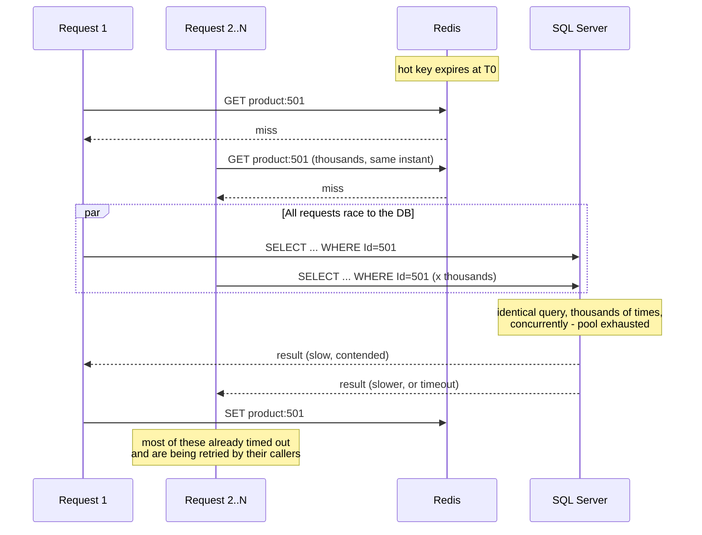

## The cache made it worse

A team I worked with put Redis in front of a "hot product" lookup. Before the cache, that lookup was doing about 200 trips to SQL Server per second at peak. After, 97% of reads never reached the database at all, and the slowest 1% of requests went from 40ms down to 3ms. Everyone moved on to the next thing.

Three weeks later, during a flash sale, the cache entry for their single best-selling product hit its expiry time and vanished.

Recomputing that value took about 80 milliseconds. In those 80 milliseconds, roughly 14,000 requests came in asking for that exact product. All of them looked in the cache. All of them found nothing, because the old copy was gone and the new one hadn't been written yet. So all of them went to the database, at the same time, running the identical query that the cache existed to prevent.

SQL Server had never seen more than 200 requests a second for this thing. It now got 14,000 in under a second. The connection pool ran dry, queries queued up behind each other, requests started timing out, and the callers responded to those timeouts by retrying - which piled even more load onto a database that was already underwater. (That retry pile-on has its own dynamics, which I wrote about in [the timeouts and retries post](/posts/timeouts-retries-circuit-breakers-dotnet/).)

Eleven minutes of downtime. The root cause line in the postmortem read: "we added a cache."

I think about that incident a lot, because the cache wasn't misconfigured and nobody did anything careless. It's just what caches do. A cache turns a steady trickle of database reads into an all-or-nothing gate. While the entry is there, the database sees almost none of that traffic. The moment it's gone, the database sees every bit of it, all at once.

## Three ways to keep a cache in sync

There are three common strategies, and they're all answering the same question: when does the cache get the right value? They just answer it differently, and each one is willing to be wrong in a different way.

**Cache-aside**, sometimes called lazy loading, puts your application in charge. On a read, you check the cache first. If it's not there (a "miss"), you read the database, stash the result in the cache, and return it. On a write, you update the database and then either delete the cache entry or let it expire on its own.

That expiry is the TTL, or time-to-live: the number of seconds a cached entry is allowed to live before the cache throws it away. You set it when you write the entry.

The thing that makes cache-aside the sensible default is that nothing ever gets written to the cache except as a side effect of somebody actually asking for it. You never waste memory on data nobody reads. And the cache is allowed to be completely missing. If Redis falls over, every read just goes to the database instead. Slower, but still correct.

```csharp
public async Task<Product> GetProductAsync(int productId, CancellationToken ct)
{
    var cacheKey = $"product:{productId}";
    var cached = await _cache.GetStringAsync(cacheKey, ct);
    if (cached is not null)
        return JsonSerializer.Deserialize<Product>(cached)!;

    // Miss: go to the source of truth.
    var product = await _db.Products.AsNoTracking()
        .FirstOrDefaultAsync(p => p.Id == productId, ct);
    if (product is null) return null!;

    await _cache.SetStringAsync(cacheKey, JsonSerializer.Serialize(product),
        new DistributedCacheEntryOptions { AbsoluteExpirationRelativeToNow = TimeSpan.FromMinutes(10) }, ct);
    return product;
}
```

What you pay for that: between the moment somebody writes to the database and the moment the cache entry expires, readers get the old value. If your TTL is ten minutes, your data can be ten minutes out of date. That gap doesn't go away on its own. The only way to close it is to explicitly delete the cache entry when you write, which I'll come back to later.

**Write-through** flips the write path around. Writes go through the cache, and the cache (or your code, wrapping both) updates the database before telling the caller "done." Because every write refreshes the cache on its way past, a read that follows a write almost never misses.

You pay for that in write speed. Every write now waits on both the cache and the database, one after the other. And you end up caching things whether or not anybody ever reads them.

```csharp
public async Task UpdatePriceAsync(int productId, decimal newPrice, CancellationToken ct)
{
    await using var tx = await _db.Database.BeginTransactionAsync(ct);
    var product = await _db.Products.FirstAsync(p => p.Id == productId, ct);
    product.Price = newPrice;
    await _db.SaveChangesAsync(ct);
    await tx.CommitAsync(ct);

    // Cache updated only after the database commit succeeds - never before.
    var cacheKey = $"product:{productId}";
    await _cache.SetStringAsync(cacheKey, JsonSerializer.Serialize(product),
        new DistributedCacheEntryOptions { AbsoluteExpirationRelativeToNow = TimeSpan.FromMinutes(10) }, ct);
}
```

Notice the order in that code. The cache only gets updated after the database commit succeeds, never before. If you write the cache first and the database write then fails, you've just published a value that doesn't exist anywhere real.

There's still a gap, though it's a smaller one than cache-aside's. If the process dies in between the database commit and the cache update, the cache is left holding an old value and nothing is pushing it to refresh. So write-through wants a TTL too, as a safety net. It just needs to lean on it far less often.

**Write-behind**, also called write-back, is the aggressive one. The write goes into the cache and you tell the caller "saved" immediately. A background job flushes it to the database later, on a timer or in batches.

This is by far the fastest write path, because the caller never waits for the database at all. It's a genuinely good fit for high-frequency counters: view counts, rate-limit buckets, leaderboard scores. Things where losing the last few seconds of updates in a crash is annoying but survivable.

It is almost never right for anything involving money or entitlements. If the cache node dies before the flush happens, those writes are simply gone. There's nothing to replay them from, because the database - the component that actually has durability guarantees - never saw them in the first place.

Here's the short version of all three. Cache-aside gives you fast reads and accepts that data can be stale for a while. Write-through gives you a cache that's almost always current and accepts slower writes. Write-behind gives you the fastest possible write and accepts that you might lose some. None of them is "the fast one" - each is fast at a different thing and pays for it somewhere else.

## The stampede: when a cache miss is worse than no cache

That opening story has a name: a **cache stampede**. You'll also see it called dogpiling, or the thundering herd.

The mechanism is simple, which is exactly why it slips past design reviews. While the cache entry is warm, it soaks up all the traffic for that key, and the database sees essentially none of it. So nobody ever sizes the database for that traffic. Why would they? It never arrives.

Then the entry goes away. Maybe the TTL expired, maybe Redis evicted it because it was running low on memory, maybe you just deployed and the cache is cold. Whatever the reason, every request that would have been absorbed now takes the miss path instead, and they all take it at the same moment.

Run the numbers from the incident. Recomputing takes 80ms, and traffic is 14,000 requests a second for that one key. That's roughly 1,100 requests all firing the same expensive query before the very first one finishes and writes the answer back. The database was doing zero work for this query a second ago. Now it's running eleven hundred identical copies of it, in parallel.

The part I find genuinely uncomfortable: without the cache, the database would have seen a steady 14,000 requests a second, spread evenly, which is the load it would have been provisioned for in the first place. The cache didn't lower the peak. It postponed it and then delivered it as a spike.


```mermaid
sequenceDiagram
    participant C1 as Request 1
    participant C2 as Request 2..N
    participant Cache as Redis
    participant DB as SQL Server

    Note over Cache: hot key expires at T0
    C1->>Cache: GET product:501
    Cache-->>C1: miss
    C2->>Cache: GET product:501 (thousands, same instant)
    Cache-->>C2: miss
    par All requests race to the DB
        C1->>DB: SELECT ... WHERE Id=501
        C2->>DB: SELECT ... WHERE Id=501 (x thousands)
    end
    Note over DB: identical query, thousands of times,<br/>concurrently - pool exhausted
    DB-->>C1: result (slow, contended)
    DB-->>C2: result (slower, or timeout)
    C1->>Cache: SET product:501
    Note over C2: most of these already timed out<br/>and are being retried by their callers
```

There are three fixes, and the nice thing is you can use all three together.

**Single-flight**, also called request coalescing, is the big one. When an entry is missing, only the first caller gets to go to the database. Everyone else who asks for that same key while the fetch is in progress just waits for that one result instead of starting their own query.

It's the highest-leverage fix because it caps the database load for a given key at exactly one query, no matter how many callers are piled up behind it. Inside a single process, a semaphore per key does the job cheaply:

```csharp
public sealed class SingleFlightCache
{
    private readonly IDistributedCache _cache;
    private readonly IDatabase _db; // whatever your data access looks like
    // One semaphore per key, created on demand, so unrelated keys never block each other.
    private readonly ConcurrentDictionary<string, SemaphoreSlim> _locks = new();

    public SingleFlightCache(IDistributedCache cache, IDatabase db)
    {
        _cache = cache;
        _db = db;
    }

    public async Task<Product> GetProductAsync(int productId, CancellationToken ct)
    {
        var cacheKey = $"product:{productId}";
        var cached = await _cache.GetStringAsync(cacheKey, ct);
        if (cached is not null)
            return JsonSerializer.Deserialize<Product>(cached)!;

        var gate = _locks.GetOrAdd(cacheKey, _ => new SemaphoreSlim(1, 1));
        await gate.WaitAsync(ct);
        try
        {
            // Re-check: while we waited for the gate, the first caller
            // through may have already repopulated the cache.
            cached = await _cache.GetStringAsync(cacheKey, ct);
            if (cached is not null)
                return JsonSerializer.Deserialize<Product>(cached)!;

            var product = await _db.GetProductAsync(productId, ct);
            await _cache.SetStringAsync(cacheKey, JsonSerializer.Serialize(product),
                new DistributedCacheEntryOptions { AbsoluteExpirationRelativeToNow = TimeSpan.FromMinutes(10) }, ct);
            return product;
        }
        finally
        {
            gate.Release();
        }
    }
}
```

That check-then-lock-then-check-again shape is the part people leave out, and it matters. Without the second check, every waiter wakes up when the gate opens and runs its own database query anyway, just one at a time instead of all at once. Still correct, still pointless. With the second check, the first caller does the work and everyone else reads what it just wrote.

One important limit: `SemaphoreSlim` lives in memory, so it only coalesces requests inside one process. If you're running 20 pods, you'll get up to 20 database hits instead of 14,000. That's still a huge win and honestly good enough most of the time. If you truly need exactly one across the whole fleet, you want a distributed lock instead, which in Redis usually means `SET key value NX PX 5000`.

**Jittered TTLs** fix a problem you create for yourself. Say you warm the cache at startup by looping over 500 keys and giving each a 10-minute expiry. Ten minutes later, all 500 expire within the same millisecond of each other. You've just built a synchronized stampede across 500 keys instead of one.

The fix is one line. Add a little randomness so the expiries drift apart:

```csharp
var jitter = TimeSpan.FromSeconds(Random.Shared.Next(0, 60)); // up to 1 min of spread
await _cache.SetStringAsync(cacheKey, value,
    new DistributedCacheEntryOptions { AbsoluteExpirationRelativeToNow = TimeSpan.FromMinutes(10) + jitter }, ct);
```

This is the same idea as adding jitter to retry delays, which comes up in [the timeouts and retries post](/posts/timeouts-retries-circuit-breakers-dotnet/). Anything on a fixed schedule eventually lines up into a wave. A bit of randomness smears the wave into something the database can actually absorb.

**Early refresh** is the third fix, and it's the one that stops misses from happening at all. Instead of waiting for an entry to fully expire and letting whoever arrives first eat the full recompute time while everyone queues behind them, you let requests that arrive *near* the expiry decide, at random, to refresh it early.

The trick is that the odds go up as the deadline gets closer, and they're weighted by how expensive the last recompute was. Something slow to rebuild starts getting refreshed further ahead of time than something cheap. The published version of this is called XFetch, out of research at Facebook. Here's a stripped-down take:

```csharp
// XFetch: probabilistically refresh before expiry, weighted by how long
// the last recompute took. beta is a tuning knob (1.0 is a reasonable default).
bool ShouldRefreshEarly(DateTimeOffset now, DateTimeOffset expiresAt, TimeSpan lastRecomputeCost, double beta = 1.0)
{
    var secondsRemaining = (expiresAt - now).TotalSeconds;
    if (secondsRemaining <= 0) return true; // already expired, definitely refresh

    // -ln(uniform random) grows without bound but is usually small,
    // so this fires rarely far from expiry and increasingly often close to it.
    var randomFactor = -Math.Log(Random.Shared.NextDouble()) * beta;
    return randomFactor * lastRecomputeCost.TotalSeconds >= secondsRemaining;
}
```

Don't get stuck on the formula. The rule behind it is easy enough: store how long the last recompute took alongside the value, and once you're getting close to expiry, let a small and growing share of requests kick off a background refresh. Those requests still get served the cached value immediately, because it hasn't actually expired yet. They just also trigger the rebuild.

Pair this with single-flight so only one of those early requests does the actual work, and the miss-driven stampede goes away completely. The entry gets refreshed while it's still warm, so under normal traffic no request ever hits a true miss on a hot key.

## Invalidation is the hard part

There's an old joke that there are only two hard problems in computer science: naming things and cache invalidation. It stays funny because a TTL isn't really invalidation. It's a timer.

Think about what a TTL actually promises. After any write, your cache is guaranteed to be wrong for up to the full TTL, and you picked that number by guessing at how stale you could stand to be. There's no correctness argument in there anywhere.

For a product description, five minutes stale is a shrug. For an account balance, a feature entitlement, or a fraud score, "wrong for up to five minutes" is a bug with a specific customer's name attached to it.

When correctness matters, the better move is to invalidate from the place that actually knows the data changed: the database's own change stream. [SQL Server's Change Data Capture](/posts/change-data-capture-in-sql-server/) reads the transaction log and turns every insert, update, and delete into an ordered record you can consume. Push that into a Kafka topic, and have a small consumer drop the matching cache entry the moment a change arrives.

Note that it deletes rather than updates. That's deliberate. Deleting means the next reader goes and fetches from the source of truth, instead of you maintaining a second hand-written path that builds the cached value and hoping it stays in agreement with the first one.

```csharp
// Kafka consumer processing CDC change events (e.g. via Debezium's SQL Server connector)
await foreach (var change in changeStream.ConsumeAsync(ct))
{
    // change.Table = "Products", change.Key = { Id = 501 }, change.Operation = "Update"
    var cacheKey = $"product:{change.Key["Id"]}";
    await _cache.RemoveAsync(cacheKey, ct);
    // Next GetProductAsync call for this key is a clean cache-aside miss,
    // reads the post-commit row, and repopulates. No polling, no TTL guess.
}
```

This changes staleness from "up to N minutes, and I hope N is small enough" into "however long it takes an event to travel the pipeline." In practice that's usually a couple of seconds, and more importantly it's driven by a real write happening rather than by an arbitrary clock.

It also plays nicely with everything above. The delete just turns the next read into an ordinary cache-aside miss, so single-flight and jitter still apply if that key is hot.

It's obviously more machinery than a TTL. That's the reason to save it for data where being stale actually costs something, rather than rolling it out everywhere by default.

## So which one should you use?

All three of these can be made fast. Speed was never the interesting part of the decision.

Cache-aside is the right default, and the reason is what happens when things break. It's the only one of the three that degrades gracefully when the cache itself is down. You get slower, not wrong.

Write-through earns its place when someone needs to read back what they just wrote and see it immediately, and you'd rather pay for that on the write side.

Write-behind lives in a narrow lane: high-volume counters where losing a few seconds is fine. Reaching for it anywhere durability matters is buying speed you didn't need at a price you can't refund.

Whichever one you pick, add the stampede protections. Single-flight, jittered TTLs, early refresh. I'd argue these aren't hardening you get to do later, because they're the difference between a cache that smooths out load and a cache that, on its worst day, concentrates your entire traffic spike into one query fired ten thousand times at once.

And for the slice of your data where being wrong is expensive, invalidate on the write instead of betting on a timer. The database already knows exactly when something changed. Let it tell the cache rather than making the cache guess.
