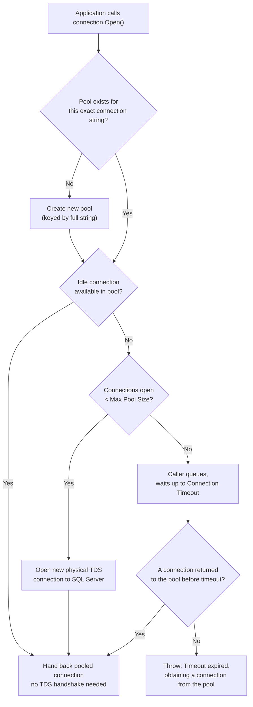

## The error that blames the wrong server

`System.InvalidOperationException: Timeout expired. The timeout period elapsed prior to obtaining a connection from the pool. This may have occurred because all pooled connections were in use and max pool size was reached.`

The instinct when this hits a dashboard is to open SQL Server and look for blocking, a runaway query, a maxed-out CPU. Most of the time that's the wrong direction to look. This error almost never means SQL Server is overloaded - it means your own process asked its ADO.NET driver for a connection object and the driver said no. The server may be sitting at 4% CPU the entire time. The bottleneck is a client-side object cache, and the postmortem below is about the four ways applications actually exhaust it, three of which have nothing to do with how many users you have.

## Where pooling actually lives: driver, not server

SQL Server has no concept of a "connection pool." From the server's point of view, a pooled connection and a one-off connection look identical: both are physical [TDS](/glossary/#tds) (Tabular Data Stream, the wire protocol SQL Server speaks) sessions, each with a `session_id` visible in `sys.dm_exec_sessions`. The server just sees N logins and N logouts. Pooling is entirely a client-side feature of the ADO.NET driver - `Microsoft.Data.SqlClient` (or the older `System.Data.SqlClient`) - implemented as an in-process cache of already-opened physical connections, keyed by connection string, that your process holds onto so the next `Open()` call doesn't have to pay for a fresh TCP handshake, TLS negotiation, and login round-trip.

That handshake is not free. A cold `Open()` against a nearby SQL Server typically costs somewhere in the 5-30ms range depending on network and auth mode; against Azure SQL with Azure AD auth it can be 50-100ms+. At 500 requests/second, paying that cost per request instead of reusing a warm connection would be the dominant latency source in the whole request. Pooling exists to amortize that cost across many logical `Open()`/`Close()` calls against one physical connection - which is exactly why `using (var conn = new SqlConnection(...))` followed by `conn.Open()` is cheap in practice: `Close()`/`Dispose()` doesn't tear down the [TDS](/glossary/#tds) session, it just returns the physical connection to the pool for the next caller.

## The pool key: same server, different pool

The pool is keyed by the **exact connection string text** (plus a few identity-related factors like Windows credentials under integrated security). Not the server name. Not a normalized/parsed version. The literal string, compared essentially character-for-character.

```csharp
// These are TWO separate pools against the SAME database.
var a = "Server=sql1;Database=Orders;User Id=svc;Password=x;Max Pool Size=100";
var b = "Server=sql1;Database=Orders;User Id=svc;Password=x;Max Pool Size=100 "; // trailing space
```

That trailing space is enough. So is appending `Application Name=Worker3` to tag connections per instance, or building the string with a different parameter order via string interpolation in two different code paths, or one team's config using `Server=` and another's using `Data Source=` for the same host. Each distinct string gets its own pool with its own `Min Pool Size`/`Max Pool Size` counters. This is the gotcha that turns "we have one 100-connection pool" into "we actually have six 100-connection pools because six slightly different connection strings exist across the codebase," each independently capable of exhausting itself while `sys.dm_exec_connections` on the server shows a number nobody can explain from the app-side metrics. If you've ever seen SQL Server report more open sessions from an app than the app's own pool-exhaustion alerts suggest should be possible, this is usually why - go count distinct connection strings before assuming the DMV is lying.

## Min/Max Pool Size, and what "exhausted" actually means

Two knobs, both connection-string parameters:

- **`Min Pool Size`** (default `0`): connections the pool keeps warm even when idle. Zero means a quiet app pays the cold-open cost again after any idle gap, which matters for bursty workloads like Azure Functions consumption-plan cold starts.
- **`Max Pool Size`** (default `100`): the hard ceiling on physical connections that pool will ever hold for that exact connection string.

When a request calls `Open()` and the pool is at `Max Pool Size` with zero idle connections available, the caller doesn't fail immediately - it queues, waiting for another caller to return a connection. It keeps waiting until `Connection Timeout` (default **15 seconds**, a separate setting from `Command Timeout`'s default 30) elapses, at which point it throws the exception at the top of this post. The mechanism, end to end:



The important thing this diagram makes obvious: exhaustion is never about how many connections SQL Server can handle. It's about how many of the 100 slots in your pool are currently checked out by your own code and not yet returned. A pool can be "exhausted" while SQL Server has thousands of session slots free. What follows are the four ways real applications get there.

## Root cause 1: the leak that doesn't look like a leak

A worked example. A checkout service handles 150 requests/second. Each legitimate request holds a pooled connection for about 8ms of actual query time - under Little's Law that's `150 × 0.008 ≈ 1.2` connections in use on average, nowhere near the default 100. Then a deploy ships a validation path that returns early on a bad request, before the `using` block's `Dispose()` runs:

```csharp
// The leak: early return skips Dispose entirely.
public Order GetOrder(int id)
{
    var conn = new SqlConnection(_connectionString);
    conn.Open();

    if (!IsAuthorized(id))
    {
        return null; // conn.Close()/Dispose() never runs - connection is never returned to the pool
    }

    using var cmd = new SqlCommand("SELECT * FROM Orders WHERE Id = @id", conn);
    cmd.Parameters.AddWithValue("@id", id);
    using var reader = cmd.ExecuteReader();
    // ... map and return
    conn.Close();
    return order;
}
```

```csharp
// The fix: the using statement guarantees Dispose runs on every exit path, including exceptions.
public Order GetOrder(int id)
{
    using var conn = new SqlConnection(_connectionString);
    conn.Open();

    if (!IsAuthorized(id))
    {
        return null; // conn is still disposed via the using block on the way out
    }

    using var cmd = new SqlCommand("SELECT * FROM Orders WHERE Id = @id", conn);
    cmd.Parameters.AddWithValue("@id", id);
    using var reader = cmd.ExecuteReader();
    return MapOrder(reader);
}
```

Without a finalizer running, an unclosed `SqlConnection` doesn't return itself to the pool - it sits there until GC collects the orphaned object and its finalizer eventually releases the underlying handle, which can take minutes under normal Gen2 GC pressure, far longer than the incident lasts. If 2% of requests hit that validation-failure branch, at 150 req/s that's 3 leaked connections per second. The pool's 100 slots are gone in `100 / 3 ≈ 33 seconds`. That number is the entire postmortem: alerts fired 41 minutes after the deploy shipped, not because the leak rate changed, but because traffic that morning was low until a marketing email went out and request volume - and therefore leak volume - tripled.

## Root cause 2: async-over-sync starves the pool the same way a leak does

This one is worth linking directly to [Async/Await Pitfalls in C#](/posts/async-await-pitfalls-in-csharp/), because the mechanism is the same deadlock described there, just observed from the connection pool's side instead of the thread pool's side.

```csharp
// Blocks the calling thread waiting on an async DB call.
public Order GetOrder(int id)
{
    using var conn = new SqlConnection(_connectionString);
    conn.OpenAsync().Wait(); // .Wait() instead of await
    // ...
}
```

`Dispose()` here does eventually run - the connection isn't leaked in the strict sense. But if this code runs under a `SynchronizationContext` that only allows one thread at a time (classic ASP.NET, WPF), `.Wait()` can deadlock the same way `.Result` does: the blocked thread is waiting for `OpenAsync()`'s continuation, and that continuation needs the very thread that's blocked. From the pool's perspective the connection is checked out and simply never comes back - indistinguishable from a leak until the request eventually times out and unwinds (if it ever does). Under load, every thread-pool thread doing this eventually gets stuck the same way, and the two failures compound: thread-pool starvation delays new work from even reaching `Open()`, while the connections already checked out by stuck threads sit unreturned. A stack of "sync-over-async" call sites and a pool exhaustion incident are, in production, often the same root cause wearing two different error messages.

## Root cause 3: DbContext lifetime mistakes

[EF Core](/glossary/#ef-core)'s `DbContext` owns a `SqlConnection` internally and follows the same pooling rules underneath. The standard registration is scoped-per-request:

```csharp
services.AddDbContext<OrdersDbContext>(options =>
    options.UseSqlServer(connectionString));
// AddDbContext defaults to ServiceLifetime.Scoped
```

The mistake that actually exhausts pools isn't usually the obvious one (registering `DbContext` as `Singleton`, which EF Core will loudly reject as not thread-safe the first time two requests hit it concurrently). It's the quieter "captive dependency" version: a background worker resolves its `DbContext` once, at startup, into a scope that lives for the process's entire run instead of per work item.

```csharp
// Wrong: one DI scope created once, DbContext (and its connection) held for the app's lifetime.
public class OrderSyncWorker : BackgroundService
{
    private readonly IServiceScope _scope;
    private readonly OrdersDbContext _db;

    public OrderSyncWorker(IServiceScopeFactory scopeFactory)
    {
        _scope = scopeFactory.CreateScope();
        _db = _scope.ServiceProvider.GetRequiredService<OrdersDbContext>();
    }

    protected override async Task ExecuteAsync(CancellationToken ct)
    {
        while (!ct.IsCancellationRequested)
        {
            await ProcessBatch(_db, ct); // same _db, same connection, forever
            await Task.Delay(TimeSpan.FromSeconds(5), ct);
        }
    }
}
```

```csharp
// Right: a fresh scope (and DbContext, and connection) per work item.
public class OrderSyncWorker : BackgroundService
{
    private readonly IServiceScopeFactory _scopeFactory;

    public OrderSyncWorker(IServiceScopeFactory scopeFactory) => _scopeFactory = scopeFactory;

    protected override async Task ExecuteAsync(CancellationToken ct)
    {
        while (!ct.IsCancellationRequested)
        {
            using var scope = _scopeFactory.CreateScope();
            var db = scope.ServiceProvider.GetRequiredService<OrdersDbContext>();
            await ProcessBatch(db, ct); // connection returns to the pool when scope disposes
            await Task.Delay(TimeSpan.FromSeconds(5), ct);
        }
    }
}
```

One captive worker only pins one connection - not enough on its own to exhaust a 100-slot pool. The version that actually pages someone is when this pattern is scaled out: a hosted service configured with a degree of parallelism of 12 (twelve concurrent worker loops, each built the same captive-scope way) pins 12 of the pool's 100 slots for the lifetime of the process, permanently, before the web app sharing that same connection string serves its first request. Combine that with a traffic spike that needs headroom the pool no longer has, and the timeout shows up on requests that have nothing to do with the worker.

## Root cause 4: MARS as a workaround instead of a fix

MARS (Multiple Active Result Sets, a connection-string option that lets one physical connection have more than one pending command or open reader at a time) exists to let you interleave operations - start reading result set A, issue a query for B without closing A's reader first - without SQL Server rejecting the second command. It's reached for reflexively whenever someone hits `InvalidOperationException: There is already an open DataReader associated with this Command which must be closed first`, by adding `MultipleActiveResultSets=True` to the connection string instead of fixing the code that opened two readers on one connection at once.

The pool-exhaustion angle is indirect but real. `MultipleActiveResultSets=True` is itself a connection-string change - per the pool-key rule above, it silently creates a second, separate pool alongside whatever non-MARS pool the rest of the app already uses against the same database, splitting your effective `Max Pool Size` across two pools instead of sharing one. And MARS doesn't give you true parallelism on the server: interleaved batches on one MARS session are serialized cooperatively by the server, not executed concurrently, so a sequence of "concurrent" operations that were sequential to begin with now sit inside one connection object for the combined duration of all of them, held checked out from the pool the whole time, instead of each borrowing and returning a connection quickly in turn. It converts a code smell (readers left open) into a resource-holding pattern that looks fine in a diagnostic session with one user and gets worse, not better, exactly when concurrency increases.

## Watching it happen: DMVs and SqlClient counters

On the server side, `sys.dm_exec_sessions` joined to `sys.dm_exec_connections` shows what's actually checked out, grouped by the client's reported `program_name` and `host_name` - the fastest way to tell "leak in service A" from "leak in the batch worker":

```sql
SELECT
    s.host_name,
    s.program_name,
    s.status,
    COUNT(*) AS connection_count
FROM sys.dm_exec_sessions s
JOIN sys.dm_exec_connections c ON s.session_id = c.session_id
WHERE s.is_user_process = 1
GROUP BY s.host_name, s.program_name, s.status
ORDER BY connection_count DESC;
```

`sp_who2` gives the same rough picture faster in [SSMS](/glossary/#ssms) for a quick look during an active incident, though the [DMV](/glossary/#dmv) query above is what you actually want for grouping by application.

On the client side, `Microsoft.Data.SqlClient` exposes its pool counters through `SqlClientEventSource`, which `dotnet-counters` can attach to live, in production, without a redeploy:

```bash
dotnet-counters monitor -p <pid> Microsoft.Data.SqlClient.EventSource
```

The counters that matter for this specific failure: `active-hard-connections` (real [TDS](/glossary/#tds) sessions currently open), `number-of-active-connections` (checked out of the pool right now), `number-of-free-connections` (idle, available), and `number-of-pooled-connections` (total pool size). If `active-connections` sits at `Max Pool Size` while `free-connections` stays at zero for minutes, that's a leak or a captive scope, not a traffic spike - a real spike shows `active` and `free` both moving as connections churn.

## Azure SQL: retries can make this worse, not better

Azure SQL adds transient faults on top of everything above - brief connection drops from load balancing, failovers, or throttling that a well-behaved client should retry. [EF Core](/glossary/#ef-core)'s `EnableRetryOnFailure()` and manual Polly retry policies both handle this by re-attempting the whole operation, which under the hood means calling `Open()` again and asking the pool for another connection.

That's fine in isolation, but it's the same amplification pattern covered in [Timeouts, Retries, and Circuit Breakers](/posts/timeouts-retries-circuit-breakers-dotnet/): if the underlying cause of the transient faults is the database itself being under load (not a blip), every retrying caller now holds its original connection attempt *and* issues a new one, and a fleet of callers doing this simultaneously multiplies pressure on the exact pool that's already struggling, right as `Connection Timeout` windows start expiring across the board. The fix is the same principle as that post: bound the retry budget, use jittered backoff so retries don't all land in the same instant, and make sure a faulted connection is actually returned or discarded (not left in limbo) before the retry attempt asks the pool for a new one. A `DbContext` misconfigured with a long-lived captive scope (root cause 3) that also has `EnableRetryOnFailure()` turned on is a particularly bad combination - retries on a connection nobody was ever going to return anyway just add more queued callers behind it.

## The mental model that holds up

Every failure mode above reduces to the same sentence: the pool only has as many connections as your code returns, and it doesn't know the difference between "still legitimately in use" and "forgotten." SQL Server's own capacity is almost never the constraint that produces this specific error - the constraint is a client-side cache with a size limit, keyed by a string most teams have never audited for consistency, drained by code paths that look correct at a glance (an early return, a `.Wait()`, a scope created once for convenience, a connection-string flag added to silence a different error). Reading the pool counters and the exact connection string in play, before touching a query plan, turns a vague "the database is slow" incident into a specific line of application code within minutes - which is usually where the fix actually belongs.
