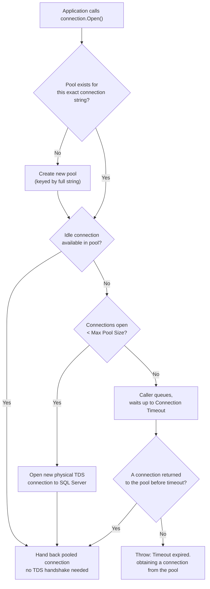

## The error that points at the wrong server

`System.InvalidOperationException: Timeout expired. The timeout period elapsed prior to obtaining a connection from the pool. This may have occurred because all pooled connections were in use and max pool size was reached.`

The first instinct when this shows up is to open SQL Server and start looking for blocking, a runaway query, a maxed-out CPU. Nine times out of ten, that's the wrong place to look. This error almost never means SQL Server itself is overloaded. It means your own process asked its .NET driver for a connection object, and the driver said no. SQL Server can be sitting at 4% CPU the whole time this is happening.

The actual bottleneck is a cache your own process is keeping, and this post is a postmortem-style walk through the four ways applications actually run that cache dry. Three of the four have nothing to do with how many users you have.

## Where pooling actually lives: the driver, not the server

SQL Server itself has no idea what a "connection pool" is. From the server's point of view, a pooled connection and a one-off connection are identical. Both are physical network sessions using a wire protocol called [TDS](/glossary/#tds) (Tabular Data Stream), each with its own `session_id` visible in `sys.dm_exec_sessions`. The server just sees logins and logouts.

Pooling is a feature of the .NET driver, `Microsoft.Data.SqlClient` (or the older `System.Data.SqlClient`), not of SQL Server. It's an in-process cache, sitting inside your own app, of physical connections that are already open. It's keyed by connection string, and it exists so your next `Open()` call doesn't have to pay for a fresh network handshake, TLS negotiation, and login round trip every single time.

That handshake genuinely isn't free. A cold `Open()` against a nearby SQL Server usually costs somewhere between 5 and 30 milliseconds depending on the network and how you're authenticating. Against Azure SQL with Azure AD auth, it can run 50 to 100 milliseconds or more. At 500 requests a second, paying that cost on every single request instead of reusing a connection you already opened would dominate your entire request latency. That's what pooling is for: it spreads that one expensive handshake across many logical `Open()`/`Close()` calls on the same physical connection. It's also why `using (var conn = new SqlConnection(...))` followed by `conn.Open()` is cheap in practice. `Close()` and `Dispose()` don't tear the connection down at all, they just hand it back to the pool for the next caller.

## The pool key: same database, different pool

Here's a detail that trips up more teams than you'd expect. The pool is keyed by the exact text of the connection string, compared essentially character for character, plus a few identity details like Windows credentials under integrated security. Not the server name. Not some normalized version of the string. The literal text.

```csharp
// These are TWO separate pools against the SAME database.
var a = "Server=sql1;Database=Orders;User Id=svc;Password=x;Max Pool Size=100";
var b = "Server=sql1;Database=Orders;User Id=svc;Password=x;Max Pool Size=100 "; // trailing space
```

That trailing space is enough on its own to split the pool in two. So is tagging connections with `Application Name=Worker3`, or building the string with parameters in a different order in two different code paths, or one team using `Server=` while another uses `Data Source=` for the exact same host. Each distinct string gets its own separate pool, with its own separate `Min Pool Size` and `Max Pool Size` counters.

This is how "we have one 100-connection pool" quietly turns into "we actually have six 100-connection pools, because six slightly different connection strings exist across the codebase" - and each one of those six can independently run dry. If SQL Server ever reports more open sessions than your app's own pool-exhaustion alerts think should be possible, this is usually why. Go count the distinct connection strings in your codebase before you assume the monitoring is lying to you.

## What "Min" and "Max" pool size actually control

There are two relevant settings, both part of the connection string.

`Min Pool Size` (default 0) is how many connections the pool keeps warm even while idle. At the default of zero, a quiet app pays the full cold-open cost again after any idle gap, which is exactly what bites bursty workloads like Azure Functions cold starts.

`Max Pool Size` (default 100) is the hard ceiling on how many physical connections that pool will ever hold for that one exact connection string.

Here's what happens when a request calls `Open()` and the pool is already sitting at `Max Pool Size` with nothing idle to hand out: the caller doesn't fail right away. It waits in line for someone else to return a connection, up to `Connection Timeout` (default 15 seconds - a different setting from `Command Timeout`'s default of 30). Once that runs out, you get the exception at the top of this post. Here's the whole path end to end:


```mermaid
flowchart TD
    A["Application calls connection.Open()"] --> B{"Pool exists for<br/>this exact connection string?"}
    B -- "No" --> C["Create new pool<br/>(keyed by full string)"]
    C --> D
    B -- "Yes" --> D{"Idle connection<br/>available in pool?"}
    D -- "Yes" --> E["Hand back pooled connection<br/>no TDS handshake needed"]
    D -- "No" --> F{"Connections open<br/>< Max Pool Size?"}
    F -- "Yes" --> G["Open new physical TDS<br/>connection to SQL Server"]
    G --> E
    F -- "No" --> H["Caller queues,<br/>waits up to Connection Timeout"]
    H --> I{"A connection returned<br/>to the pool before timeout?"}
    I -- "Yes" --> E
    I -- "No" --> J["Throw: Timeout expired.<br/>obtaining a connection from the pool"]
```

The thing worth sitting with here is that "exhausted" has nothing to do with how much SQL Server can handle. It's entirely about how many of your own 100 slots are currently checked out by your own code and just haven't been given back yet. A pool can run completely dry while SQL Server has thousands of session slots free and idle. The next four sections are the ways I've actually seen applications get there.

## Cause one: the leak that doesn't look like a leak

Let's work through a real example. A checkout service handles 150 requests a second, and each legitimate request holds a pooled connection for about 8 milliseconds of actual query time. Do the rough math and that's only about 1.2 connections in use on average, nowhere near the default cap of 100.

Then a deploy ships a validation path that returns early on a bad request, before the `using` block's cleanup ever gets a chance to run:

```csharp
// The leak: early return skips Dispose entirely.
public Order GetOrder(int id)
{
    var conn = new SqlConnection(_connectionString);
    conn.Open();

    if (!IsAuthorized(id))
    {
        return null; // conn.Close()/Dispose() never runs - connection is never returned to the pool
    }

    using var cmd = new SqlCommand("SELECT * FROM Orders WHERE Id = @id", conn);
    cmd.Parameters.AddWithValue("@id", id);
    using var reader = cmd.ExecuteReader();
    // ... map and return
    conn.Close();
    return order;
}
```

```csharp
// The fix: the using statement guarantees Dispose runs on every exit path, including exceptions.
public Order GetOrder(int id)
{
    using var conn = new SqlConnection(_connectionString);
    conn.Open();

    if (!IsAuthorized(id))
    {
        return null; // conn is still disposed via the using block on the way out
    }

    using var cmd = new SqlCommand("SELECT * FROM Orders WHERE Id = @id", conn);
    cmd.Parameters.AddWithValue("@id", id);
    using var reader = cmd.ExecuteReader();
    return MapOrder(reader);
}
```

Without that `using` block, an unclosed `SqlConnection` doesn't quietly return itself to the pool. It just sits there until the garbage collector eventually notices the orphaned object and releases the underlying handle, which can take minutes under normal conditions - far longer than most incidents last.

If just 2% of requests hit that failed-validation branch, at 150 requests a second that's 3 leaked connections every second. Do the math and the pool's 100 slots are gone in about 33 seconds. That number is basically the entire postmortem: the alert fired 41 minutes after the deploy shipped, and the leak rate hadn't changed at all in that time. Traffic was just low that morning, until a marketing email went out and request volume, and with it leak volume, tripled.

## Cause two: blocking on async code starves the pool the same way

This one connects directly to a deadlock I described in [Async/Await Pitfalls in C#](/posts/async-await-pitfalls-in-csharp/) - it's the same underlying problem, just observed from the connection pool's side instead of the thread pool's side.

```csharp
// Blocks the calling thread waiting on an async DB call.
public Order GetOrder(int id)
{
    using var conn = new SqlConnection(_connectionString);
    conn.OpenAsync().Wait(); // .Wait() instead of await
    // ...
}
```

`Dispose()` does eventually run here, so this isn't a leak in the strict sense. But if this code runs somewhere that only allows one thread to run application code at a time (classic ASP.NET, or WPF), `.Wait()` can deadlock exactly the way `.Result` famously does: the thread that's blocked is waiting on `OpenAsync()`'s continuation, and that continuation needs the very thread that's currently blocked to run.

From the pool's point of view, that connection is checked out and simply never comes back. It looks exactly like a leak, right up until the request eventually times out and unwinds, if it ever does. Under load, every thread that hits this pattern gets stuck the same way, and the two failures start compounding each other: thread-pool starvation delays new work from even reaching `Open()`, while the connections already grabbed by stuck threads just sit there unreturned. A pile of blocking-on-async call sites and a pool exhaustion incident are, in production, often the exact same root cause showing up as two different error messages.

## Cause three: a DbContext living too long

[EF Core](/glossary/#ef-core)'s `DbContext` owns a `SqlConnection` internally, and it follows the exact same pooling rules underneath. The standard setup scopes it to one request:

```csharp
services.AddDbContext<OrdersDbContext>(options =>
    options.UseSqlServer(connectionString));
// AddDbContext defaults to ServiceLifetime.Scoped
```

The mistake that actually drains pools isn't the obvious one (registering `DbContext` as a singleton, which EF Core will loudly refuse the moment two requests hit it at the same time). It's a quieter version: a background worker resolves its `DbContext` once, at startup, into a scope that lives for the entire life of the process instead of being created fresh per work item.

```csharp
// Wrong: one DI scope created once, DbContext (and its connection) held for the app's lifetime.
public class OrderSyncWorker : BackgroundService
{
    private readonly IServiceScope _scope;
    private readonly OrdersDbContext _db;

    public OrderSyncWorker(IServiceScopeFactory scopeFactory)
    {
        _scope = scopeFactory.CreateScope();
        _db = _scope.ServiceProvider.GetRequiredService<OrdersDbContext>();
    }

    protected override async Task ExecuteAsync(CancellationToken ct)
    {
        while (!ct.IsCancellationRequested)
        {
            await ProcessBatch(_db, ct); // same _db, same connection, forever
            await Task.Delay(TimeSpan.FromSeconds(5), ct);
        }
    }
}
```

```csharp
// Right: a fresh scope (and DbContext, and connection) per work item.
public class OrderSyncWorker : BackgroundService
{
    private readonly IServiceScopeFactory _scopeFactory;

    public OrderSyncWorker(IServiceScopeFactory scopeFactory) => _scopeFactory = scopeFactory;

    protected override async Task ExecuteAsync(CancellationToken ct)
    {
        while (!ct.IsCancellationRequested)
        {
            using var scope = _scopeFactory.CreateScope();
            var db = scope.ServiceProvider.GetRequiredService<OrdersDbContext>();
            await ProcessBatch(db, ct); // connection returns to the pool when scope disposes
            await Task.Delay(TimeSpan.FromSeconds(5), ct);
        }
    }
}
```

One worker doing this only pins one connection, which isn't enough on its own to drain a 100-slot pool. The version that actually pages someone is when this pattern gets scaled out: a hosted service configured to run 12 of these loops in parallel, each built the same way, permanently pins 12 of your 100 slots for the entire life of the process, before the web app sharing that same connection string has served a single request. Add a traffic spike that needed that headroom and no longer has it, and the timeout shows up on requests that had nothing to do with the worker at all.

## Cause four: MARS papering over a different bug

MARS stands for Multiple Active Result Sets, a connection-string option that lets one physical connection have more than one command or open reader in flight at a time. It's meant for genuinely interleaving operations, like starting to read result set A and then issuing a query for B without closing A's reader first.

In practice, it usually gets reached for reflexively. Someone hits `InvalidOperationException: There is already an open DataReader associated with this Command which must be closed first`, and instead of fixing the code that opened two readers on one connection at once, they add `MultipleActiveResultSets=True` to the connection string and move on.

The connection to pool exhaustion is indirect, but it's real. `MultipleActiveResultSets=True` is itself a change to the connection string, so by the pool-key rule from earlier, it silently creates a second, separate pool right alongside whatever pool the rest of the app is already using against the same database. That splits your effective `Max Pool Size` in two instead of sharing it.

And MARS doesn't actually give you parallelism on the server. Interleaved batches on one MARS session are cooperatively serialized by SQL Server, not run concurrently. So a sequence of operations that were sequential to begin with now sit inside one connection object for their combined total duration, checked out from the pool the whole time, instead of each one quickly borrowing and returning a connection in turn. It quietly turns a code smell (readers left open too long) into a resource-holding pattern that looks completely fine with one user testing it, and gets worse, not better, exactly when concurrency goes up in production.

## Watching it happen: DMVs and driver counters

On the server side, joining `sys.dm_exec_sessions` to `sys.dm_exec_connections` (a [DMV](/glossary/#dmv) pair) shows you what's actually checked out right now, grouped by the client's reported program name and host name. This is the fastest way to tell "the leak is in service A" from "the leak is in the batch worker":

```sql
SELECT
    s.host_name,
    s.program_name,
    s.status,
    COUNT(*) AS connection_count
FROM sys.dm_exec_sessions s
JOIN sys.dm_exec_connections c ON s.session_id = c.session_id
WHERE s.is_user_process = 1
GROUP BY s.host_name, s.program_name, s.status
ORDER BY connection_count DESC;
```

`sp_who2` gives you the same rough picture faster in SSMS in [SSMS](/glossary/#ssms) if you just need a quick look during an active incident, but the query above is what you actually want when you need to group by application.

On the client side, `Microsoft.Data.SqlClient` exposes its pool counters through an event source that `dotnet-counters` can attach to live, in production, with no redeploy needed:

```bash
dotnet-counters monitor -p <pid> Microsoft.Data.SqlClient.EventSource
```

The counters that matter here: `active-hard-connections` (real [TDS](/glossary/#tds) sessions currently open), `number-of-active-connections` (checked out of the pool right now), `number-of-free-connections` (idle and available), and `number-of-pooled-connections` (total pool size). If active connections sit pinned at `Max Pool Size` while free connections stay at zero for minutes at a time, that's a leak or a captive scope, not a traffic spike. A genuine traffic spike shows both numbers moving as connections come and go.

## Azure SQL: retries can make this worse, not better

Azure SQL adds a wrinkle on top of everything above: brief connection drops from load balancing, failovers, or throttling that a well-behaved client is expected to retry through. [EF Core](/glossary/#ef-core)'s `EnableRetryOnFailure()` and manual Polly retry policies both handle this by re-running the whole operation, which under the hood means calling `Open()` again and asking the pool for another connection.

That's fine on its own. But it's the same amplification pattern I described in [Timeouts, Retries, and Circuit Breakers](/posts/timeouts-retries-circuit-breakers-dotnet/): if the real cause of those transient faults is the database being under sustained load rather than a one-off blip, every retrying caller now holds its original connection attempt and makes a new one. A whole fleet of callers doing this at once multiplies the pressure on the exact pool that's already struggling, right as connection timeouts start expiring across the board.

The fix is the same idea as that post: cap how many times you'll retry, add jitter so retries don't all land in the same instant, and make sure a failed connection is actually released back to the pool (not left in limbo) before you retry and ask for a new one. A `DbContext` with a long-lived captive scope from cause three, combined with `EnableRetryOnFailure()` turned on, is a particularly bad combination - you end up retrying on a connection that was never going to be returned anyway, which just adds more callers to an already-backed-up queue.

## The pattern underneath all four

Every one of these reduces to the same sentence: the pool only ever has as many connections available as your code actually gives back, and it has no way to tell "still legitimately in use" from "forgotten." SQL Server's own capacity is almost never the actual constraint behind this error. The constraint is a client-side cache with a fixed size, keyed by a string most teams have never bothered to audit for consistency, and drained by code that looks totally fine at a glance: an early return, a `.Wait()` somewhere it shouldn't be, a scope created once out of convenience, a connection-string flag added to make a different error go away.

Checking the pool counters and the exact connection string in play, before you go anywhere near a query plan, turns a vague "the database seems slow" incident into a specific line of application code within a few minutes. Which is usually where the actual fix belongs anyway.
