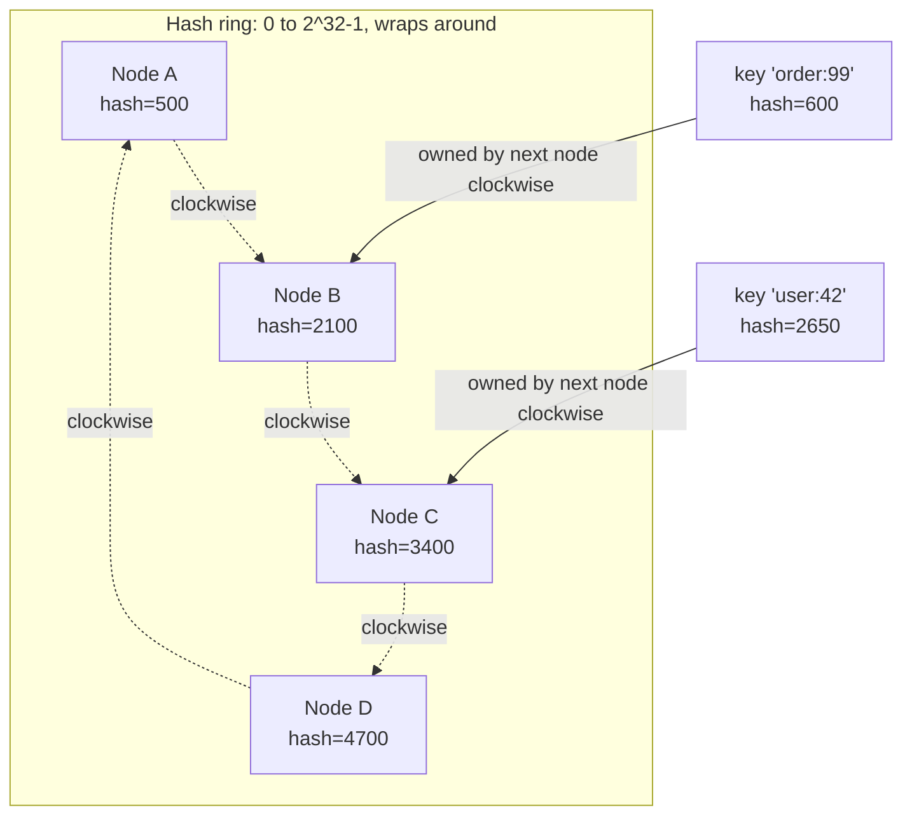
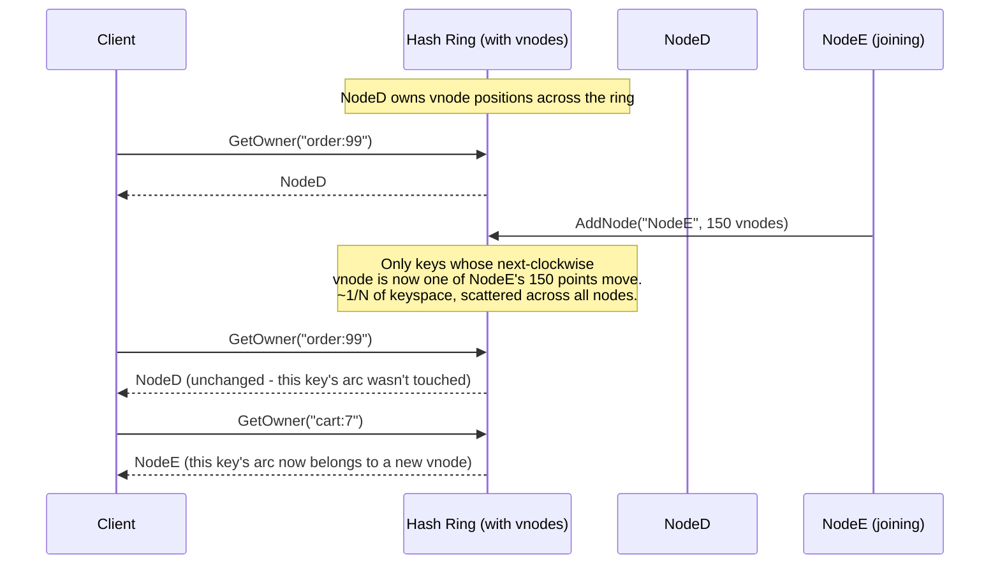

## The 3 a.m. page that a modulo caused

A Redis-backed cache cluster, 8 nodes, each holding roughly 2 million keys. Traffic is steady, hit rate is 94%, everyone's happy. Then a node dies and ops adds a replacement - now 9 nodes instead of 8. Within two minutes, database CPU goes from 30% to 100%, latency triples, and the on-call engineer is staring at a cache that should have just gotten *bigger*, not slower. What happened is that the shard-routing code used `hash(key) % N`, and changing N from 8 to 9 silently invalidated almost every key at once. The cache didn't grow. It reset.

This post derives why that happens with actual numbers, then builds the fix - consistent hashing - from first principles: a ring, a clockwise-ownership rule, and a virtual-node trick that keeps the ring balanced. It's the algorithm underneath Redis Cluster's routing tier (with an important caveat), the original DynamoDB, Cassandra, memcached client-side sharding, and most CDN request routers. If you've ever wondered how a distributed cache adds capacity without a stop-the-world rehash, this is the mechanism.

## The naive scheme: hash(key) % N

The obvious way to spread keys across N nodes is: compute a hash of the key, take it mod N, route to that node.

```csharp
// Naive modulo sharding - looks fine until N changes
static int GetShardNaive(string key, int nodeCount)
{
    // A stable hash (not string.GetHashCode - that's randomized per process)
    uint hash = Crc32.HashToUInt32(Encoding.UTF8.GetBytes(key));
    return (int)(hash % (uint)nodeCount);
}
```

This is correct and evenly distributed *as long as N never changes*. The problem is what happens the moment it does. Consider 8 nodes and a key whose CRC32 hash happens to be `1,234,567,893`:

- With N = 8: `1234567893 % 8 = 5` → node 5
- With N = 9: `1234567893 % 9 = 3` → node 3

The key moved. That's not surprising by itself - some keys have to move when capacity changes, that's the whole point of resharding. What's surprising is *how many* move. Because `% N` and `% (N+1)` are essentially unrelated functions of the same input, a key keeps its shard only when `hash % N == hash % (N+1)` happens to hold, which for random hashes is roughly a `1/(N+1)` coincidence. Everything else relocates.

I ran exactly this over 1,000,000 synthetic keys, hashed with CRC32, comparing shard assignment at N=8 against N=9:

```
Keys that stayed on the same node:     124,932   (12.5%)
Keys that moved to a different node:   875,068   (87.5%)
```

Adding **one** node out of eight - a 12.5% capacity increase - reshuffled **87.5%** of the keyspace. Every one of those "moved" keys is a cache miss on the next read: the value is sitting on some node, unreachable to a router now pointing elsewhere, effectively lost. With an 8-node, 16M-key cache and a 30ms average database round-trip per miss, that's the stampede: hundreds of thousands of requests per minute suddenly falling through to the database that the cache exists to protect. This is the same "hot partition from a bad key choice" family of pain covered at the shard-design level in [Partitioning Strategies That Follow You Everywhere](/posts/partitioning-strategies-that-follow-you-everywhere/) - what follows here is the specific algorithm that avoids it at the routing layer.

Removing a node is just as bad, for the same reason: it's not "that node's keys redistribute," it's "the modulus changed, so almost everything redistributes."

## The ring: hash keys and nodes into the same space

Consistent hashing's move is to stop making node count part of the routing function at all. Instead of `hash(key) % N`, both **keys** and **nodes** are hashed into the same fixed output space - conventionally visualized as points on a circle, 0 to 2³²-1 wrapping back to 0 - and a key is owned by whichever node's point comes next going clockwise.



Concretely: hash each node's identity (its host:port string, say) with the same hash function used for keys, and place it on the ring at that position. To find who owns a key, hash the key, walk clockwise from that point, and the first node you hit owns it. Implemented, "walk clockwise" is a binary search over a sorted array of node positions:

```csharp
public sealed class HashRing
{
    // SortedDictionary keeps ring positions ordered so we can binary-search for "next clockwise"
    private readonly SortedDictionary<uint, string> _ring = new();

    public void AddNode(string nodeId)
    {
        uint position = Crc32.HashToUInt32(Encoding.UTF8.GetBytes(nodeId));
        _ring[position] = nodeId;
    }

    public void RemoveNode(string nodeId)
    {
        uint position = Crc32.HashToUInt32(Encoding.UTF8.GetBytes(nodeId));
        _ring.Remove(position);
    }

    public string GetOwner(string key)
    {
        uint hash = Crc32.HashToUInt32(Encoding.UTF8.GetBytes(key));

        // Find the first node position >= key's hash (the next node clockwise)
        foreach (var (position, nodeId) in _ring)
        {
            if (position >= hash) return nodeId;
        }

        // Wrapped past the highest position - owner is the first node on the ring
        return _ring.Count > 0 ? _ring.First().Value
            : throw new InvalidOperationException("Ring is empty");
    }
}
```

`SortedDictionary<uint, string>.Keys` supports `GetViewBetween` in .NET for an actual O(log N) lookup instead of the linear scan above; the linear version is here for clarity. Either way, the important structural fact is what happens on `AddNode` or `RemoveNode`: **only the keys that fall between the changed node and its counterclockwise neighbor move.** Everything else's "next node clockwise" answer is unaffected, because nothing about their arc of the ring changed. Removing node C only affects the keys between B and C - they now land on D instead. Adding a new node E between C and D only affects the keys between C and E - they now land on E instead of D. No modulus, no global reshuffle.

## Worked example: a 4-node ring gains a 5th node

Take a small ring with 4 nodes at positions (out of a 0-9999 space, scaled down for readability):

| Node | Position |
|------|---------:|
| A | 1200 |
| B | 3800 |
| C | 6100 |
| D | 8900 |

And 10 keys scattered around the ring:

| Key | Hash | Owner (next clockwise) |
|-----|-----:|------|
| k1 | 200 | A (1200) |
| k2 | 1500 | B (3800) |
| k3 | 2900 | B (3800) |
| k4 | 4000 | C (6100) |
| k5 | 5200 | C (6100) |
| k6 | 6300 | D (8900) |
| k7 | 7100 | D (8900) |
| k8 | 8000 | D (8900) |
| k9 | 9200 | A (1200, wraps) |
| k10 | 9900 | A (1200, wraps) |

Now add node E at position 5000 (between C's counterclockwise neighbor B at 3800, and C at 6100):

| Key | Hash | Old owner | New owner |
|-----|-----:|-----------|-----------|
| k4 | 4000 | C | **E** |
| k5 | 5200 | C | **E** |

Every other key - k1, k2, k3, k6, k7, k8, k9, k10 - keeps the exact same owner. Two keys out of ten moved: 20%, in the same ballpark as the theoretical `1/N` (here 1/5 = 20%, an exact match because this example was constructed cleanly). Compare that to the modulo scheme's 87.5% churn from a *smaller* proportional capacity change. That gap - "only the keys adjacent to the change move" versus "almost everything moves" - is the entire value proposition of consistent hashing, and it's what makes online resharding viable: a cache can absorb a node join or leave as a small, local cache-miss blip instead of a stampede.

## The load-skew problem, and virtual nodes

There's a catch the 4-node example glossed over: node positions come from hashing arbitrary strings (`"cache-node-a.internal:6379"`), and a hash function gives you *uniformly random* positions, not *evenly spaced* ones. With only 4-8 physical nodes, random points on a circle clump. Working out the arcs each node owns in the example above - the span from the previous node's position, clockwise, to its own - gives B the arc from A to B (2600 units), C the arc from B to C (2300 units), D the arc from C to D (2800 units), and A the wraparound arc from D through 0 back to A (2300 units), against a perfectly even target of 2500 each. That's only a mild wobble with four well-spread sample points; with unluckier hash outputs, or fewer nodes, the same math produces one node owning 3-5x the arc of another, because four (or eight, or even a few dozen) random samples from a uniform distribution routinely clump rather than spread evenly - that's a property of small sample counts, not a bug in the hash function. A node that happens to land in a large gap absorbs disproportionate load; a real cluster with a handful of physical nodes can easily see one carrying 40% of traffic while another carries 8%.

The fix is **virtual nodes**: instead of hashing each physical node to one ring position, hash it to many - typically 100 to 500 - each a distinct point derived from the node's identity plus an index (`"cache-node-a#0"`, `"cache-node-a#1"`, ... `"cache-node-a#149"`). The physical node owns every arc that any of its virtual points wins.

```csharp
public void AddNode(string nodeId, int virtualNodeCount = 150)
{
    for (int i = 0; i < virtualNodeCount; i++)
    {
        uint position = Crc32.HashToUInt32(Encoding.UTF8.GetBytes($"{nodeId}#{i}"));
        _ring[position] = nodeId;   // multiple ring positions map back to the same physical node
    }
}
```

With 150 virtual points per physical node, the law of large numbers does the work: instead of 4 random samples deciding the arc split, you have 600, and the standard deviation of any node's total owned arc drops sharply - in practice, load imbalance across nodes falls from the 2-5x swings you see with raw hashing at small N to within roughly 10% of perfectly even. This is also why removing a physical node in a virtual-node ring still only moves about `1/N` of total keys, not `1/N` of one contiguous chunk: its 150 scattered points hand off to 150 different (mostly-distinct) neighbors, spreading the reload cost across the whole cluster instead of dumping it on one neighbor.



The tradeoff virtual nodes buy you costs memory and lookup size - a 10-node cluster with 150 vnodes each means 1,500 ring entries instead of 10 - which is a non-issue at the scale where this matters (microseconds and kilobytes), but it's worth knowing the number isn't free.

## Failure modes worth knowing before you rely on this

**Ring position collisions.** Two different node identities can theoretically hash to the same ring position; with a 32-bit hash space and a few thousand virtual nodes total, the birthday-paradox collision probability is low but not zero. Production implementations either use a wider hash (SHA-1's 160 bits, as in the original Amazon Dynamo paper) or simply detect and re-hash on collision.

**Correlated churn on cascading failures.** Consistent hashing bounds churn *per membership change*, but if 3 of 8 nodes die in the same incident, you still lose roughly 3/8 of the cache, and each of those keys' new owner takes a cold-cache read penalty simultaneously - that's a real, if smaller, version of the stampede the ring was built to avoid. Bulkheading database load (see the circuit-breaker and bulkhead patterns in [Timeouts, Retries, and Circuit Breakers](/posts/timeouts-retries-circuit-breakers-dotnet/)) is what keeps that from becoming a second outage.

**It's routing, not replication.** Consistent hashing tells you which node *owns* a key; it says nothing about durability. Dynamo-style systems layer replication on top by walking N *distinct physical* nodes clockwise from the key's position (skipping repeats from the same physical node's other virtual points) and writing to all of them - the ring's ordering becomes a natural, deterministic replica-placement rule for free.

## What real systems actually do

**Cassandra** and the original **Amazon DynamoDB** (per the 2007 Dynamo paper) are textbook consistent hashing with virtual nodes ("vnodes" in Cassandra's own terminology) exactly as derived above - ring position determines both primary ownership and the replica walk.

**Memcached client-side sharding** (Ketama and similar libraries) is the classic use case this post opened with: the client library keeps the ring, hashes the key, and picks the server - no coordination service needed, which is exactly why it needed to survive server list changes gracefully.

**Redis Cluster** is the case to get precise about, because it's commonly - and wrongly - described as consistent hashing. It actually uses **hash slots**: a fixed 16,384 slots, each key mapped via `CRC16(key) % 16384`, and each slot explicitly assigned to a node by the cluster config (not derived from hashing the node's identity onto a ring). Adding a node means migrating specific, explicitly-chosen slots to it - operationally similar in spirit (bounded, targeted movement instead of a global reshuffle) but mechanically different: slot-to-node assignment is an explicit table Redis maintains and gossips, not a geometric consequence of a hash ring. The similarity is the *goal* (avoid `% N` style global churn); the *mechanism* is closer to static range partitioning with a remapping table than to a ring.

**CDN request routing** (routing a cache key or user session to one of many edge/origin-shield nodes) commonly uses consistent hashing so that adding capacity in one region doesn't invalidate cached objects cluster-wide - the same cache-stampede-avoidance argument from the top of this post, at CDN scale.

**Load balancers** doing session affinity ("sticky sessions" to a specific backend without a shared session store) use the identical ring trick: hash the client identifier, walk to the next backend clockwise, and backend pool changes only reroute the fraction of clients adjacent to the change.

## Synthesis

The naive `hash(key) % N` scheme fails not because modulo is a bad hash - it's a fine one - but because the *routing function itself* depends on N, so any change to N is a global discontinuity: every key's answer to "which node?" changes simultaneously, unrelated to whether that particular key needed to move. Consistent hashing's fix is to make node count fall out of the data (how many points happen to be on the ring) rather than being an input to the formula, so a membership change perturbs only the ring's local neighborhood. Virtual nodes are the correction for the fact that "a few random points on a circle" doesn't actually give you even spacing - more samples per node smooths that out the same way any Monte Carlo estimate improves with sample count. None of this is exotic; it's the load-bearing idea under most caches and sharded stores you've already used, and worth carrying as one mental model: separate *what determines ownership* from *how many owners there are*, and capacity changes stop being global events.
