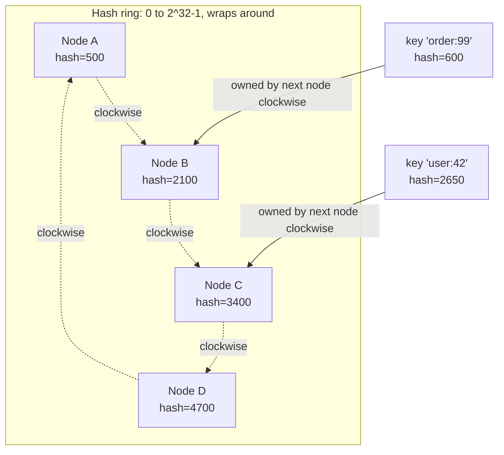
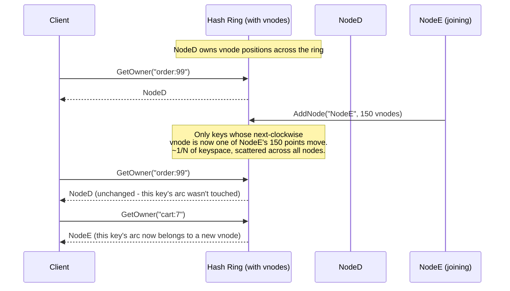

## The page that a single line of arithmetic caused

An 8-node Redis cache, roughly 2 million keys per node, humming along at a 94% hit rate. Everyone's happy. Then one node dies, ops adds a replacement, and now there are 9 nodes instead of 8.

Within two minutes, database CPU jumps from 30% to 100%, latency triples, and the on-call engineer is staring at a cache cluster that just got *bigger* and somehow got slower. What actually happened: the routing code decided which node owned a key with `hash(key) % N`, and changing N from 8 to 9 silently invalidated almost every key in the cluster at once. The cache didn't grow. It reset itself.

This post walks through why that happens, with actual numbers, and then builds the fix from scratch: a ring, a simple ownership rule, and a small trick called virtual nodes that keeps the ring balanced. This is the mechanism underneath Redis Cluster's routing (with one important caveat I'll get to), the original DynamoDB, Cassandra, memcached client-side sharding, and most CDN routers. If you've ever wondered how a distributed cache adds a machine without a stop-the-world rehash, this is how.

## The naive approach: hash(key) % N

The obvious way to spread keys across N nodes: hash the key, take the result mod N, route to that node.

```csharp
// Naive modulo sharding - looks fine until N changes
static int GetShardNaive(string key, int nodeCount)
{
    // A stable hash (not string.GetHashCode - that's randomized per process)
    uint hash = Crc32.HashToUInt32(Encoding.UTF8.GetBytes(key));
    return (int)(hash % (uint)nodeCount);
}
```

This works fine and spreads keys evenly, as long as N never changes. The problem shows up the moment it does. Take 8 nodes and a key whose hash happens to come out to 1,234,567,893.

With N = 8, that key lands on node 5 (`1234567893 % 8 = 5`). With N = 9, it lands on node 3 (`1234567893 % 9 = 3`).

The key moved. On its own, that's not surprising - some keys have to move when you add capacity, that's unavoidable. What's surprising is how many move. `% 8` and `% 9` are essentially two unrelated functions of the same input. A key only keeps its node if `hash % N` happens to equal `hash % (N+1)`, and for random hashes that's roughly a 1-in-9 coincidence. Everything else gets relocated.

I actually ran this: 1,000,000 synthetic keys, hashed with CRC32, comparing shard assignment at N=8 against N=9.

```
Keys that stayed on the same node:     124,932   (12.5%)
Keys that moved to a different node:   875,068   (87.5%)
```

Adding one node out of eight, a 12.5% capacity increase, reshuffled 87.5% of the keyspace. Every one of those moved keys is a guaranteed cache miss on the next read. The value is still sitting on some node somewhere, but the router is now pointing everyone at a different one, so it's effectively lost. On an 8-node, 16-million-key cache, with a 30ms average database round trip per miss, that's hundreds of thousands of requests a minute suddenly falling through to the database the cache was there to protect. I've written before about hot-partition pain from a bad key choice in [Partitioning Strategies That Follow You Everywhere](/posts/partitioning-strategies-that-follow-you-everywhere/) - this is the specific fix at the routing layer.

Removing a node is exactly as bad, and for the same reason. It's not "that one node's keys redistribute." It's "the modulus itself changed, so nearly everything redistributes."

## The ring: put keys and nodes in the same space

Consistent hashing's move is to take node count out of the routing function entirely. Instead of `hash(key) % N`, you hash both keys and nodes into the same fixed space, conventionally pictured as points on a circle running from 0 up to 2³²-1 and then wrapping back to 0. A key belongs to whichever node's point comes next, going clockwise.


```mermaid
flowchart TD
    subgraph Ring["Hash ring: 0 to 2^32-1, wraps around"]
        direction LR
        A["Node A<br/>hash=500"] -.clockwise.-> B["Node B<br/>hash=2100"]
        B -.clockwise.-> C["Node C<br/>hash=3400"]
        C -.clockwise.-> D["Node D<br/>hash=4700"]
        D -.clockwise.-> A
    end
    K1["key 'user:42'<br/>hash=2650"] -->|owned by next node clockwise| C
    K2["key 'order:99'<br/>hash=600"] -->|owned by next node clockwise| B
```

In practice: hash each node's identity, its `host:port` string, say, with the same hash function you use for keys, and drop it on the ring at that position. To find who owns a key, hash the key and walk clockwise until you hit a node. In code, "walk clockwise" is just a search over a sorted list of node positions.

```csharp
public sealed class HashRing
{
    // SortedDictionary keeps ring positions ordered so we can binary-search for "next clockwise"
    private readonly SortedDictionary<uint, string> _ring = new();

    public void AddNode(string nodeId)
    {
        uint position = Crc32.HashToUInt32(Encoding.UTF8.GetBytes(nodeId));
        _ring[position] = nodeId;
    }

    public void RemoveNode(string nodeId)
    {
        uint position = Crc32.HashToUInt32(Encoding.UTF8.GetBytes(nodeId));
        _ring.Remove(position);
    }

    public string GetOwner(string key)
    {
        uint hash = Crc32.HashToUInt32(Encoding.UTF8.GetBytes(key));

        // Find the first node position >= key's hash (the next node clockwise)
        foreach (var (position, nodeId) in _ring)
        {
            if (position >= hash) return nodeId;
        }

        // Wrapped past the highest position - owner is the first node on the ring
        return _ring.Count > 0 ? _ring.First().Value
            : throw new InvalidOperationException("Ring is empty");
    }
}
```

(For a real implementation you'd want `GetViewBetween` on the sorted keys for an actual fast lookup instead of the linear scan above - I kept it simple here so the logic reads clearly.)

Here's the structural fact that makes the whole thing work: when you add or remove a node, only the keys sitting between that node and its counterclockwise neighbor move. Every other key's "next node clockwise" answer doesn't change, because nothing about their stretch of the ring changed. Remove node C, and only the keys between B and C are affected - they land on D now instead. Add a new node E between C and D, and only the keys between C and E move to E. No modulus, no global reshuffle.

## A worked example: a 4-node ring gains a 5th node

Take a small ring, four nodes, positions scaled down to a 0-9999 space for readability:

| Node | Position |
|------|---------:|
| A | 1200 |
| B | 3800 |
| C | 6100 |
| D | 8900 |

And 10 keys scattered around it:

| Key | Hash | Owner (next clockwise) |
|-----|-----:|------|
| k1 | 200 | A (1200) |
| k2 | 1500 | B (3800) |
| k3 | 2900 | B (3800) |
| k4 | 4000 | C (6100) |
| k5 | 5200 | C (6100) |
| k6 | 6300 | D (8900) |
| k7 | 7100 | D (8900) |
| k8 | 8000 | D (8900) |
| k9 | 9200 | A (1200, wraps) |
| k10 | 9900 | A (1200, wraps) |

Now add node E at position 5000, which lands between B (3800) and C (6100):

| Key | Hash | Old owner | New owner |
|-----|-----:|-----------|-----------|
| k4 | 4000 | C | **E** |
| k5 | 5200 | C | **E** |

Every other key, all eight of them, keeps the exact same owner. Two out of ten moved: 20%, which happens to match the theoretical 1-in-5 you'd expect from adding a 5th node to 4 (this example was built cleanly enough that the numbers line up exactly). Compare that to the 87.5% churn the modulo scheme produced from a smaller proportional change. That gap, only the neighboring keys move versus almost everything moves, is the entire value of consistent hashing. It's what makes adding or removing capacity survivable: a node joining or leaving becomes a small, local blip of cache misses instead of a full stampede.

## The catch: uneven load, and the fix

There's something the 4-node example glossed over. Node positions come from hashing arbitrary strings like `"cache-node-a.internal:6379"`, and a hash function gives you uniformly random positions, not evenly spaced ones. With only 4 to 8 physical nodes, random points on a circle tend to clump.

Work out the arcs each node actually owns in the earlier example, and you get B owning 2600 units, C owning 2300, D owning 2800, and A owning 2300 through the wraparound, against a perfectly even target of 2500 each. That's only a mild wobble with four well-placed sample points. With less lucky hash outputs, or fewer nodes, that same math can leave one node owning 3 to 5 times the arc of another. Random samples clumping like this isn't a bug in the hash function, it's just what small sample counts do. In a real cluster with only a handful of physical nodes, you can easily see one node carrying 40% of traffic while another carries 8%.

The fix is called virtual nodes. Instead of hashing each physical node to one position on the ring, you hash it to many, typically 100 to 500, each one a distinct point derived from the node's identity plus an index (`"cache-node-a#0"`, `"cache-node-a#1"`, and so on). The physical node then owns every arc that any one of its virtual points wins.

```csharp
public void AddNode(string nodeId, int virtualNodeCount = 150)
{
    for (int i = 0; i < virtualNodeCount; i++)
    {
        uint position = Crc32.HashToUInt32(Encoding.UTF8.GetBytes($"{nodeId}#{i}"));
        _ring[position] = nodeId;   // multiple ring positions map back to the same physical node
    }
}
```

With 150 virtual points per node, averaging just does its job. Instead of 4 random samples deciding how the ring splits, you now have 600, and the spread in how much arc each node ends up owning shrinks dramatically. In practice, the 2 to 5x imbalance you'd see with raw hashing at small node counts drops to within roughly 10% of perfectly even. It also fixes something else: removing a physical node in a virtual-node ring still only moves about 1/N of total keys, but instead of dumping that reload cost onto one unlucky neighbor, its 150 scattered points hand off to 150 different, mostly distinct neighbors, so the cost spreads across the whole cluster.


```mermaid
sequenceDiagram
    participant Client
    participant Ring as Hash Ring (with vnodes)
    participant NodeD
    participant NodeE as NodeE (joining)

    Note over Ring: NodeD owns vnode positions across the ring
    Client->>Ring: GetOwner("order:99")
    Ring-->>Client: NodeD

    NodeE->>Ring: AddNode("NodeE", 150 vnodes)
    Note over Ring: Only keys whose next-clockwise<br/>vnode is now one of NodeE's 150 points move.<br/>~1/N of keyspace, scattered across all nodes.

    Client->>Ring: GetOwner("order:99")
    Ring-->>Client: NodeD (unchanged - this key's arc wasn't touched)
    Client->>Ring: GetOwner("cart:7")
    Ring-->>Client: NodeE (this key's arc now belongs to a new vnode)
```

None of this comes for free. Virtual nodes cost you memory and a bigger ring to search through. A 10-node cluster with 150 vnodes each means 1,500 ring entries instead of 10. At the scale where any of this matters, we're talking microseconds and kilobytes, so it's a non-issue in practice, but it's worth knowing the number isn't zero.

## Things worth knowing before you rely on this

**Two node identities can collide on the ring.** It's rare with a 32-bit hash space and a few thousand virtual nodes total, but not impossible. Real implementations either use a wider hash (SHA-1's 160 bits, as in the original Amazon Dynamo paper) or just detect a collision and re-hash.

**Losing several nodes at once still hurts.** Consistent hashing bounds how much churns per membership change, but if 3 of your 8 nodes die in the same incident, you still lose roughly 3/8 of the cache, and every one of those keys' new owners takes a cold-cache read penalty at the same time. That's a real, if smaller, version of the exact stampede the ring exists to avoid. Keeping the database from falling over when that happens is a job for bulkheading and circuit breakers, which I covered in [Timeouts, Retries, and Circuit Breakers](/posts/timeouts-retries-circuit-breakers-dotnet/).

**This is routing, not replication.** Consistent hashing tells you which node owns a key. It says nothing on its own about durability. Dynamo-style systems build replication on top of it by walking clockwise from the key's position and picking N distinct physical nodes (skipping repeats from the same node's other virtual points), then writing to all of them. The ring's own ordering becomes a natural, deterministic way to decide where replicas live, essentially for free.

## What real systems actually do with this

**Cassandra** and the original **Amazon DynamoDB** (from the 2007 Dynamo paper) are textbook consistent hashing with virtual nodes, exactly as built above. Ring position decides both who owns a key and who the replicas are.

**Memcached client-side sharding**, via libraries like Ketama, is the classic use case this post opened with. The client library keeps the ring, hashes the key, and picks a server directly, with no coordination service needed - which is exactly why it needed to handle server list changes gracefully in the first place.

**Redis Cluster** is worth being precise about, because it's often described as consistent hashing and that's not quite right. It actually uses hash slots: a fixed 16,384 of them, each key mapped by `CRC16(key) % 16384`, and each slot explicitly assigned to a node through cluster configuration rather than derived from hashing a node's identity onto a ring. Adding a node means migrating specific, chosen slots to it. Operationally that's similar in spirit (bounded, targeted movement instead of a global reshuffle), but mechanically it's closer to static range partitioning with an explicit remapping table than to an actual hash ring.

**CDN routing**, sending a cache key or user session to one of many edge or origin-shield nodes, commonly uses real consistent hashing so that adding capacity in one region doesn't invalidate cached content across the whole network. Same stampede-avoidance argument as the top of this post, just at CDN scale.

**Load balancers doing sticky sessions**, keeping a client pinned to the same backend without a shared session store, use the identical ring trick: hash the client, walk to the next backend clockwise, and only the clients adjacent to a pool change get rerouted.

## Where this leaves you

`hash(key) % N` doesn't fail because modulo is a bad hash function. It's a perfectly good one. It fails because the routing function itself depends on N, so any change to N is a global event: every key's answer to "which node?" changes at once, whether or not that particular key actually needed to move.

Consistent hashing's fix is to make the node count fall out of the data (however many points happen to be sitting on the ring) instead of being an input to the formula, so a membership change only disturbs the ring's local neighborhood. Virtual nodes are just the correction for the fact that a handful of random points on a circle doesn't actually give you even spacing - more samples per node smooths that out, the same way any estimate gets more stable with more samples.

None of this is exotic once you've seen it laid out. It's the idea underneath most caches and sharded stores you've probably already used, and it's worth keeping as a general habit: separate what determines ownership from how many owners there are, and capacity changes stop being global events.
