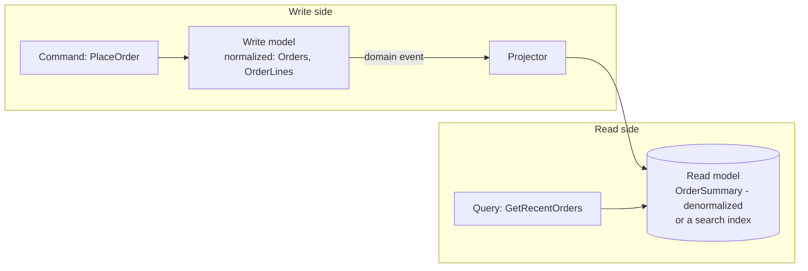
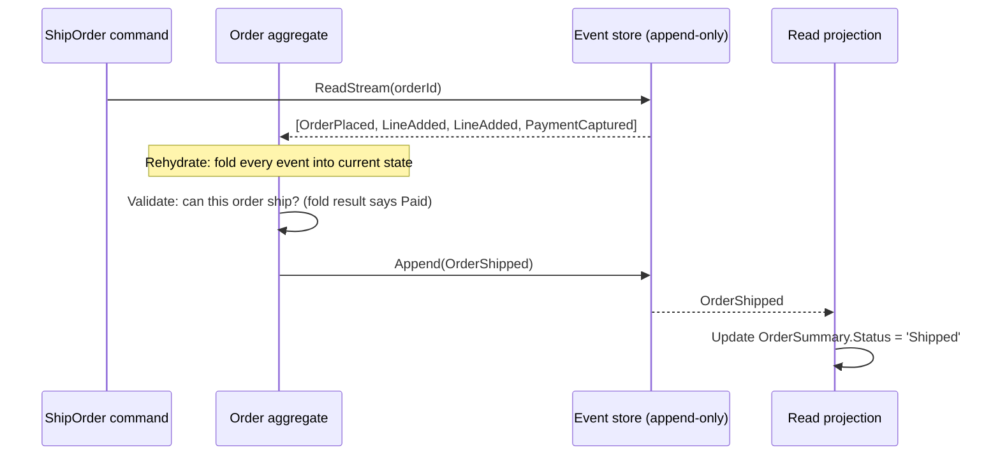

## The order summary page that took 40 seconds

A team I worked adjacent to had an `Orders` table, an `OrderLines` table, a `Shipments` table, and a `Payments` table - textbook third normal form, no duplicated data, every write trivially consistent. Then the "recent orders" dashboard shipped: one row per order, customer name, item count, total, current status, last shipment event. Rendering it meant joining all four tables, aggregating line items, and picking the latest shipment row per order. At 200 orders it was instant. At 4 million orders with a product manager filtering by date range, it was a 40-second query that locked pages other transactions needed.

The instinct at that point is usually "add more indexes" or "throw more compute at SQL Server." Sometimes that works. But the actual mismatch is structural: the shape that makes writes safe (normalized, one fact in one place, foreign keys enforcing referential integrity) is rarely the shape that makes a specific read fast. That gap - and what to do about it once it's real, not hypothetical - is what CQRS is for. It's a different problem from the one event sourcing solves, and the two get bundled together so often that people assume you need both or neither. You don't. This post takes them apart.

## CQRS, precisely: one write model, one or more read models

**CQRS** (Command Query Responsibility Segregation, the pattern name traces back to Bertrand Meyer's Command-Query Separation principle applied at the architecture level) means: the model that handles writes and the model that serves reads are allowed to be different things, updated through different code paths, and even stored differently.

- The **write model** (command side) is optimized for correctness: enforce invariants, validate business rules, protect consistency. It's usually normalized, usually transactional, usually the thing you'd draw as a textbook relational schema.
- The **read model** (query side) is optimized for the query the UI actually issues: pre-joined, pre-aggregated, denormalized, sometimes in a different datastore entirely (a search index, a key-value cache, a reporting warehouse).

Here is the part that gets lost in every conference talk on the subject: **most applications should not do this.** A single EF Core `DbContext` with a normalized schema, read and written through the same entities, is the correct architecture for the overwhelming majority of CRUD apps. If your reads are "get this order by ID" or "list a customer's orders," a normalized write model already answers those queries fine with an index or two. CQRS earns its keep specifically when the *read shape* and the *write shape* diverge sharply, and usually when the *read scale* dwarfs the *write scale* too (the order summary dashboard is read constantly by ops, sales, and support, but each order is written once and updated a handful of times).



Two models, two paths. The write path never serves a dashboard query; the read path never validates a business rule. They meet only through the event that flows from write to projector.

## When the split actually pays off

Concretely: the write model stays exactly what it already is - `Orders` and `OrderLines`, normalized, transactional.

```csharp
public sealed class Order
{
    public Guid Id { get; private set; }
    public Guid CustomerId { get; private set; }
    public OrderStatus Status { get; private set; }
    private readonly List<OrderLine> _lines = new();
    public IReadOnlyList<OrderLine> Lines => _lines;

    public static Order Place(Guid customerId, IEnumerable<(Guid ProductId, int Qty, decimal UnitPrice)> lines)
    {
        var order = new Order { Id = Guid.NewGuid(), CustomerId = customerId, Status = OrderStatus.Placed };
        foreach (var l in lines)
            order._lines.Add(new OrderLine(l.ProductId, l.Qty, l.UnitPrice));
        if (order._lines.Count == 0)
            throw new InvalidOperationException("An order needs at least one line."); // invariant lives here
        return order;
    }
}
```

The read model is a separate, deliberately denormalized table, kept up to date by a projector that reacts to the same `OrderPlaced` event the [outbox pattern](/posts/outbox-pattern-end-to-end/) already gets out of your write transaction reliably:

```csharp
// Runs off the outbox dispatcher's consumer side - one handler per event type.
public class OrderSummaryProjector
{
    private readonly SqlConnection _db;

    public async Task OnOrderPlaced(OrderPlacedV1 evt, CancellationToken ct)
    {
        // Denormalized write: customer name and item count baked in, no joins at read time.
        const string sql = @"
            INSERT INTO dbo.OrderSummary (OrderId, CustomerName, ItemCount, Total, Status, LastUpdatedUtc)
            SELECT @OrderId, c.Name, @ItemCount, @Total, 'Placed', SYSUTCDATETIME()
            FROM dbo.Customer c WHERE c.Id = @CustomerId;";
        await _db.ExecuteAsync(sql, new
        {
            evt.OrderId, evt.CustomerId, ItemCount = evt.Lines.Count, Total = evt.Lines.Sum(l => l.Qty * l.UnitPrice)
        });
    }
}

// The dashboard query now hits one table, no joins, no aggregation at read time:
// SELECT * FROM dbo.OrderSummary WHERE LastUpdatedUtc >= @from ORDER BY LastUpdatedUtc DESC;
```

Notice what this costs you, because CQRS is not a free lunch either: `OrderSummary` is now **eventually consistent** with `Orders` - there's a window, usually milliseconds to low seconds if you're consuming off the outbox promptly, where a just-placed order hasn't hit the read table yet. If the dashboard needs to be read-your-own-writes consistent (the customer who just placed the order immediately views it), that's a real design constraint, not a rounding error. And you now have two schemas to keep synchronized instead of one, plus a projector that can lag, crash, or need replaying. This is exactly the same reliability shape as any consumer described in [Kafka Delivery Semantics in .NET](/posts/kafka-delivery-semantics-dotnet/) - idempotent handlers, at-least-once delivery, the works. CQRS is a scaling decision with an operational bill attached; write it down before you reach for it.

## Event sourcing is a different question entirely

This is where the two patterns get conflated, so the distinction earns its own section, in contrast to a pattern this blog already covers in depth: the [outbox pattern](/posts/outbox-pattern-end-to-end/).

The outbox pattern starts from a conventional CRUD write model - `Orders`, current state, updated in place - and adds a reliability mechanism: when state changes, also write a row describing that change, atomically, so the event reliably makes it out to the world. The `Orders` table is still the source of truth. The outbox is a delivery guarantee bolted onto it.

**Event sourcing inverts that.** Instead of storing current state and emitting events as a side effect, you store *only* the sequence of events, and current state is *derived* - a fold (a running reduction: `state = events.Aggregate(initialState, Apply)`) over that log, computed by replaying it. If there's a current-state table at all, it's not the source of truth; it's a cache. Delete it, replay the events, and it comes back byte-for-byte identical. That's the test for whether something is actually event-sourced: can you throw away the "table" and rebuild it purely from history? With a conventional write model plus an outbox, the answer is no - the outbox rows are transient delivery artifacts, not a complete, replayable history of every state transition.



The event stream in that diagram - `Store` - is the one and only source of truth. `Proj`, the read table, is disposable. That's the whole idea, and it maps directly onto the log-as-source-of-truth model Kafka embodies at the infrastructure level, covered in [Kafka for Engineers Who Know Databases](/posts/kafka-for-engineers-who-know-databases/): a Kafka topic is a durable, replayable, append-only log, and the table is just a materialized view over it. Event sourcing applies that exact idea one layer up, inside a single aggregate's persistence model, whether or not Kafka is anywhere in the picture.

## Code: an event-sourced order aggregate

Events are the schema now, not tables. Each is an immutable fact about something that already happened, named in the past tense:

```csharp
public interface IOrderEvent { Guid OrderId { get; } }
public record OrderPlaced(Guid OrderId, Guid CustomerId, DateTime OccurredUtc) : IOrderEvent;
public record LineAdded(Guid OrderId, Guid ProductId, int Qty, decimal UnitPrice) : IOrderEvent;
public record PaymentCaptured(Guid OrderId, decimal Amount) : IOrderEvent;
public record OrderShipped(Guid OrderId, string Carrier, DateTime OccurredUtc) : IOrderEvent;

public sealed class Order
{
    public Guid Id { get; private set; }
    public OrderStatus Status { get; private set; }
    private readonly List<(Guid ProductId, int Qty, decimal UnitPrice)> _lines = new();
    private decimal _amountCaptured;
    private readonly List<IOrderEvent> _pending = new(); // uncommitted events from this session

    // Current state is a fold - never assigned directly, only derived from events.
    public static Order Rehydrate(IEnumerable<IOrderEvent> history)
    {
        var order = new Order();
        foreach (var e in history) order.Apply(e);
        return order;
    }

    private void Apply(IOrderEvent e)
    {
        switch (e)
        {
            case OrderPlaced p: Id = p.OrderId; Status = OrderStatus.Placed; break;
            case LineAdded l: _lines.Add((l.ProductId, l.Qty, l.UnitPrice)); break;
            case PaymentCaptured pc: _amountCaptured += pc.Amount; Status = OrderStatus.Paid; break;
            case OrderShipped: Status = OrderStatus.Shipped; break;
        }
    }

    public void Ship(string carrier)
    {
        // Business rule, checked against folded state, not a column read from a row.
        if (Status != OrderStatus.Paid)
            throw new InvalidOperationException($"Cannot ship order {Id} in status {Status}.");
        Raise(new OrderShipped(Id, carrier, DateTime.UtcNow));
    }

    private void Raise(IOrderEvent e) { Apply(e); _pending.Add(e); }
    public IReadOnlyList<IOrderEvent> DequeuePending() { var p = _pending.ToList(); _pending.Clear(); return p; }
}
```

Loading an order for a command means `Rehydrate(await store.ReadStreamAsync(orderId))`, calling a method, then `store.AppendAsync(orderId, order.DequeuePending(), expectedVersion)` - that `expectedVersion` is optimistic concurrency: if another process appended events to the same stream since you read it, the append fails and you retry, the same conflict-detection idea as a rowversion column, just applied to a stream instead of a row.

## Snapshotting: the escape hatch from replaying everything

Fold-from-the-start is fine for an order with 12 events. It is not fine for a customer account with 400,000 events accumulated over six years, replayed on every single command. The fix is a **snapshot**: periodically (every N events, or on a schedule) serialize the folded state and store it alongside the stream, tagged with the stream version it represents.

```csharp
public class SnapshotStore
{
    public async Task<Order> LoadAsync(Guid orderId, IEventStore events)
    {
        var snapshot = await GetLatestSnapshotAsync(orderId); // (state, asOfVersion) or null
        var fromVersion = snapshot?.AsOfVersion ?? 0;
        var remaining = await events.ReadStreamAsync(orderId, fromVersion); // only events since the snapshot

        var order = snapshot is null ? Order.Rehydrate(Enumerable.Empty<IOrderEvent>())
                                      : Order.FromSnapshot(snapshot.State);
        order.ApplyAll(remaining); // fold just the tail, not the whole history
        return order;
    }
}
```

Rehydration becomes "load the snapshot, replay the handful of events since." Snapshots are pure optimization - they're derivable from the events, so losing them is a performance regression, never a data-loss event. That asymmetry (events are truth, everything else is cache) is what you're actually buying with event sourcing, and it's also most of its cost.

## The real cost nobody puts in the pitch deck

The pitch is "perfect audit trail, free time travel, rebuild any read model from history." All true. The bill:

- **Schema evolution is not "add a column."** In a normal table, adding a nullable column is a metadata-only operation. In an event store, `LineAdded` events from three years ago are already serialized in whatever shape they had then. If you change the `LineAdded` record - add a `DiscountCode` field, say - old events don't magically gain it. You need **upcasters**: versioned event types (`LineAddedV1`, `LineAddedV2`) and explicit translation code that runs old events through a converter on the way into `Apply`. This is a permanent tax, not a one-time migration script.
- **Replay performance is a standing concern, not a one-off.** Snapshotting helps, but every new read model you add still has to be built by replaying the *entire* history at least once, and every bug in a projector means replaying however much history is needed to fix it. At meaningful event volumes, that's a real batch job, not a quick backfill.
- **The learning curve is not just for developers.** Debugging "what is this order's status right now" now means reading a fold, not a row. Support engineers, other teams' services, and ad-hoc SQL queries all lose the ability to just `SELECT * FROM Orders WHERE Id = @id` and trust it - unless you maintain a projection for exactly that, which you now must, forever, in sync.
- **Eventual consistency is structural, not incidental.** Any projection is at least one hop behind the event stream, same as any [CDC](/glossary/#cdc)-fed read model - see [Change Data Capture in SQL Server](/posts/change-data-capture-in-sql-server/) for the mechanics of a comparable lag on the infrastructure side.

## When it's actually worth it

Reach for event sourcing when "what happened, in what order, and why" is itself a business requirement, not just a debugging nicety:

- **Financial ledgers.** A bank account balance is not "current state you update" - it's the sum of every debit and credit that ever happened, and regulators want that history, not just the total. Double-entry bookkeeping *is* event sourcing; accountants invented the pattern first.
- **Order lifecycle in e-commerce, when disputes and chargebacks are common.** "The customer says they never got a refund confirmation - what did our system actually record, and when?" is a query against the event log, not a guess from a `Status` column that's been overwritten five times.
- **Anything with regulatory audit requirements** - who approved what, when, under what prior state - where reconstructing history after the fact has real cost if you get it wrong.

Do not reach for it for a user's profile settings, a product catalog, or most internal admin tools. If nobody will ever ask "what was this record's value last Tuesday and why did it change," you're paying the upcaster tax and the replay tax for a feature nobody needs. And note the two patterns are genuinely orthogonal: you can do CQRS without event sourcing (the order summary example above - completely conventional write model, denormalized read model), and it's the overwhelmingly common combination. You can, in principle, do event sourcing without CQRS - but in practice almost nobody does, because replaying an entire event stream to answer "list orders over $500 from Texas customers" is unworkable, so an event-sourced write model almost always needs a projected read side to be queryable at all. That's the real reason the two names travel together: event sourcing usually *requires* CQRS downstream of it, even though CQRS never requires event sourcing.

## Where they actually meet

CQRS is a scaling answer to a read/write shape mismatch, and most systems never develop a mismatch sharp enough to justify it - a single EF Core model reading and writing the same normalized tables is the right default, and staying there is a legitimate architectural decision, not a failure to modernize. Event sourcing is a different, stricter commitment: current state stops being a fact you store and becomes a fact you compute, which buys a complete audit trail at the cost of a permanent schema-evolution and replay-performance tax. They compose well because event sourcing's write side naturally produces the event stream that a CQRS projector needs, but they solve unrelated problems and either can exist without the other. The question worth asking before adopting either is not "is this pattern good" - it's "does my domain actually need a rebuildable history of every state transition, or do I just need one query to be fast," because those two answers point at completely different amounts of complexity, and only one domain in most companies' portfolio - the ledger, the order lifecycle, the thing compliance cares about - usually answers the first question yes.
