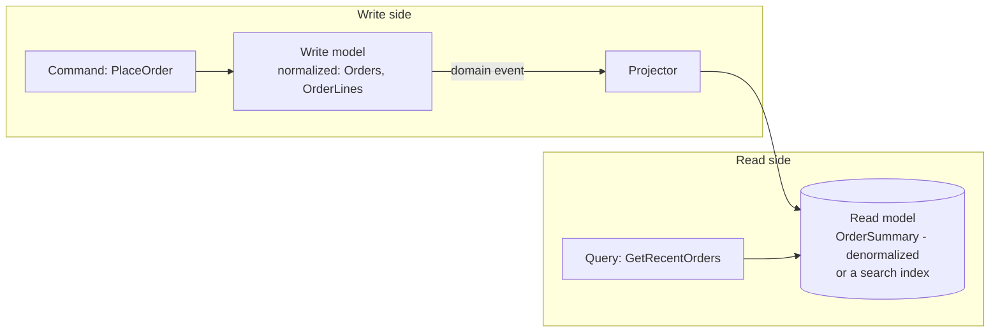
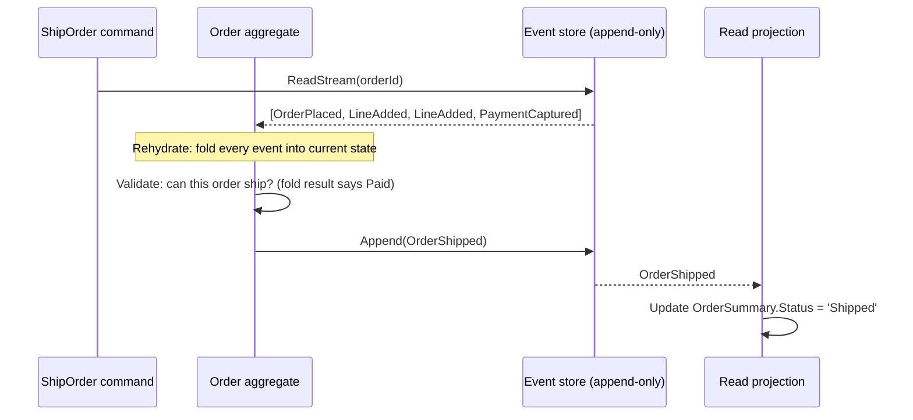

## The order summary page that took 40 seconds

A team I worked adjacent to had an `Orders` table, an `OrderLines` table, a `Shipments` table, and a `Payments` table. Textbook normalized design, no duplicated data, every write trivially consistent. Then the "recent orders" dashboard shipped: one row per order, customer name, item count, total, current status, latest shipment event. Rendering it meant joining all four tables, summing up line items, and picking the latest shipment row per order. At 200 orders it was instant. At 4 million orders, with a product manager filtering by date range, it turned into a 40-second query that locked pages other transactions needed.

The first instinct is usually "add more indexes" or "throw more compute at SQL Server." Sometimes that helps. But the real mismatch here is structural: the shape that makes writes safe (normalized, one fact stored in one place, foreign keys enforcing integrity) is rarely the shape that makes a specific read fast. That gap, and what you actually do about it once it's real rather than hypothetical, is what CQRS exists for. It's a genuinely separate problem from what event sourcing solves, even though the two get bundled together so often that people assume you need both or neither. You don't. Let's take them apart.

## CQRS, in plain terms: one write model, one or more read models

CQRS stands for Command Query Responsibility Segregation. The idea traces back to a much older principle from Bertrand Meyer, applied here at the architecture level: the model that handles writes and the model that serves reads are allowed to be genuinely different things, updated through different code paths, and even stored in different places.

The write model, or command side, is optimized for correctness. It enforces invariants, validates business rules, protects consistency. Usually normalized, usually transactional, usually the thing you'd draw as a textbook relational schema. The read model, or query side, is optimized for whatever the UI actually asks for: pre-joined, pre-aggregated, denormalized, sometimes living in a completely different kind of store, a search index or a key-value cache or a reporting warehouse.

Here's the part that gets lost in every conference talk on this topic: most applications should not do this. A single EF Core `DbContext` with a normalized schema, read and written through the same entities, is the right architecture for the overwhelming majority of ordinary CRUD apps. If your reads are "get this order by ID" or "list a customer's orders," a normalized write model already answers those queries fine with an index or two. CQRS earns its keep specifically when the read shape and the write shape pull sharply apart, and usually when read volume dwarfs write volume too. The order summary dashboard gets hammered constantly by ops, sales, and support, but any individual order is written once and updated a handful of times at most.


```mermaid
flowchart LR
    subgraph Write side
        C[Command: PlaceOrder] --> WM[Write model\nnormalized: Orders, OrderLines]
        WM -->|domain event| P[Projector]
    end
    subgraph Read side
        P --> RM[(Read model\nOrderSummary - denormalized\nor a search index)]
        Q[Query: GetRecentOrders] --> RM
    end
```

Two models, two separate paths. The write path never serves a dashboard query, and the read path never validates a business rule. They only ever meet through the event that flows from the write side over to the projector.

## When splitting them actually pays off

Concretely: the write model stays exactly what it already is. `Orders` and `OrderLines`, normalized, transactional.

```csharp
public sealed class Order
{
    public Guid Id { get; private set; }
    public Guid CustomerId { get; private set; }
    public OrderStatus Status { get; private set; }
    private readonly List<OrderLine> _lines = new();
    public IReadOnlyList<OrderLine> Lines => _lines;

    public static Order Place(Guid customerId, IEnumerable<(Guid ProductId, int Qty, decimal UnitPrice)> lines)
    {
        var order = new Order { Id = Guid.NewGuid(), CustomerId = customerId, Status = OrderStatus.Placed };
        foreach (var l in lines)
            order._lines.Add(new OrderLine(l.ProductId, l.Qty, l.UnitPrice));
        if (order._lines.Count == 0)
            throw new InvalidOperationException("An order needs at least one line."); // invariant lives here
        return order;
    }
}
```

The read model is a separate, deliberately denormalized table, kept up to date by a projector reacting to the same `OrderPlaced` event that [the outbox pattern](/posts/outbox-pattern-end-to-end/) already gets out of your write transaction reliably:

```csharp
// Runs off the outbox dispatcher's consumer side - one handler per event type.
public class OrderSummaryProjector
{
    private readonly SqlConnection _db;

    public async Task OnOrderPlaced(OrderPlacedV1 evt, CancellationToken ct)
    {
        // Denormalized write: customer name and item count baked in, no joins at read time.
        const string sql = @"
            INSERT INTO dbo.OrderSummary (OrderId, CustomerName, ItemCount, Total, Status, LastUpdatedUtc)
            SELECT @OrderId, c.Name, @ItemCount, @Total, 'Placed', SYSUTCDATETIME()
            FROM dbo.Customer c WHERE c.Id = @CustomerId;";
        await _db.ExecuteAsync(sql, new
        {
            evt.OrderId, evt.CustomerId, ItemCount = evt.Lines.Count, Total = evt.Lines.Sum(l => l.Qty * l.UnitPrice)
        });
    }
}

// The dashboard query now hits one table, no joins, no aggregation at read time:
// SELECT * FROM dbo.OrderSummary WHERE LastUpdatedUtc >= @from ORDER BY LastUpdatedUtc DESC;
```

Here's what this actually costs you, because CQRS isn't a free lunch either. `OrderSummary` is now eventually consistent with `Orders`. There's a window, usually milliseconds to a few seconds if you're consuming off the outbox promptly, where a just-placed order hasn't reached the read table yet. If the dashboard needs to show a customer their own order the instant they place it, that's a real design constraint you have to solve for, not a rounding error to wave away. And you now have two schemas to keep in sync instead of one, plus a projector that can lag, crash, or need replaying from scratch. This is the same reliability shape as any consumer I described in [Kafka Delivery Semantics in .NET](/posts/kafka-delivery-semantics-dotnet/): idempotent handlers, at-least-once delivery, all of it. CQRS is a scaling decision with an operational bill attached. Write that bill down before you reach for it.

## Event sourcing is answering a completely different question

This is exactly where the two patterns get conflated, so it's worth drawing the line clearly, against a pattern this blog already covers: [the outbox pattern](/posts/outbox-pattern-end-to-end/).

The outbox pattern starts from an ordinary write model, an `Orders` table holding current state, updated in place, and adds a reliability mechanism on top: when state changes, also write a row describing that change, in the same transaction, so the event is guaranteed to make it out into the world eventually. The `Orders` table is still the actual source of truth. The outbox is just a delivery guarantee bolted onto it.

Event sourcing flips that entirely. Instead of storing current state and emitting events as a side effect of that, you store only the sequence of events, and current state gets derived by folding over that log, replaying it from the start. If there's a current-state table at all, it isn't the source of truth. It's just a cache. Delete it, replay the events, and it comes back byte-for-byte identical. That's actually the test for whether something is truly event-sourced: can you throw away the table and rebuild it purely from history? With a conventional write model plus an outbox, the answer is no. The outbox rows are transient delivery artifacts, not a complete, replayable record of every state change that ever happened.


```mermaid
sequenceDiagram
    participant Cmd as ShipOrder command
    participant Agg as Order aggregate
    participant Store as Event store (append-only)
    participant Proj as Read projection

    Cmd->>Store: ReadStream(orderId)
    Store-->>Agg: [OrderPlaced, LineAdded, LineAdded, PaymentCaptured]
    Note over Agg: Rehydrate: fold every event into current state
    Agg->>Agg: Validate: can this order ship? (fold result says Paid)
    Agg->>Store: Append(OrderShipped)
    Store-->>Proj: OrderShipped
    Proj->>Proj: Update OrderSummary.Status = 'Shipped'
```

The event stream in that diagram, labeled `Store`, is the one and only source of truth. `Proj`, the read table, is entirely disposable. That's the whole idea, and it maps directly onto the log-as-source-of-truth model that Kafka embodies at the infrastructure level, which I covered in [Kafka for Engineers Who Know Databases](/posts/kafka-for-engineers-who-know-databases/): a Kafka topic is a durable, replayable, append-only log, and any table built from it is just a view materialized over that log. Event sourcing applies the exact same idea one layer up, inside a single aggregate's own persistence model, whether or not Kafka is anywhere in the picture.

## What an event-sourced order aggregate looks like

Events are the schema now, not tables. Each one is an immutable fact about something that already happened, named in the past tense:

```csharp
public interface IOrderEvent { Guid OrderId { get; } }
public record OrderPlaced(Guid OrderId, Guid CustomerId, DateTime OccurredUtc) : IOrderEvent;
public record LineAdded(Guid OrderId, Guid ProductId, int Qty, decimal UnitPrice) : IOrderEvent;
public record PaymentCaptured(Guid OrderId, decimal Amount) : IOrderEvent;
public record OrderShipped(Guid OrderId, string Carrier, DateTime OccurredUtc) : IOrderEvent;

public sealed class Order
{
    public Guid Id { get; private set; }
    public OrderStatus Status { get; private set; }
    private readonly List<(Guid ProductId, int Qty, decimal UnitPrice)> _lines = new();
    private decimal _amountCaptured;
    private readonly List<IOrderEvent> _pending = new(); // uncommitted events from this session

    // Current state is a fold - never assigned directly, only derived from events.
    public static Order Rehydrate(IEnumerable<IOrderEvent> history)
    {
        var order = new Order();
        foreach (var e in history) order.Apply(e);
        return order;
    }

    private void Apply(IOrderEvent e)
    {
        switch (e)
        {
            case OrderPlaced p: Id = p.OrderId; Status = OrderStatus.Placed; break;
            case LineAdded l: _lines.Add((l.ProductId, l.Qty, l.UnitPrice)); break;
            case PaymentCaptured pc: _amountCaptured += pc.Amount; Status = OrderStatus.Paid; break;
            case OrderShipped: Status = OrderStatus.Shipped; break;
        }
    }

    public void Ship(string carrier)
    {
        // Business rule, checked against folded state, not a column read from a row.
        if (Status != OrderStatus.Paid)
            throw new InvalidOperationException($"Cannot ship order {Id} in status {Status}.");
        Raise(new OrderShipped(Id, carrier, DateTime.UtcNow));
    }

    private void Raise(IOrderEvent e) { Apply(e); _pending.Add(e); }
    public IReadOnlyList<IOrderEvent> DequeuePending() { var p = _pending.ToList(); _pending.Clear(); return p; }
}
```

Loading an order to run a command against it means calling `Rehydrate` on whatever the store gives back, calling a method on the result, and then appending whatever's pending back to the store along with the version you expected it to be at. That expected-version check is optimistic concurrency: if another process appended events to the same stream since you read it, the append fails and you retry. Same conflict-detection idea as a rowversion column on a regular table, just applied to a stream instead of a row.

## Snapshotting: the escape hatch from replaying everything

Folding from the very start is fine for an order with 12 events. It's not fine for a customer account that's accumulated 400,000 events over six years, replayed in full on every single command. The fix is a snapshot: periodically, every N events or on some schedule, serialize the folded state and store it alongside the stream, tagged with the exact stream version it represents.

```csharp
public class SnapshotStore
{
    public async Task<Order> LoadAsync(Guid orderId, IEventStore events)
    {
        var snapshot = await GetLatestSnapshotAsync(orderId); // (state, asOfVersion) or null
        var fromVersion = snapshot?.AsOfVersion ?? 0;
        var remaining = await events.ReadStreamAsync(orderId, fromVersion); // only events since the snapshot

        var order = snapshot is null ? Order.Rehydrate(Enumerable.Empty<IOrderEvent>())
                                      : Order.FromSnapshot(snapshot.State);
        order.ApplyAll(remaining); // fold just the tail, not the whole history
        return order;
    }
}
```

Rehydration becomes "load the snapshot, then replay just the handful of events since." Snapshots are pure optimization, nothing more. They're fully derivable from the events, so losing one is a performance hit, never a data-loss incident. That asymmetry, where events are the truth and everything else is just a cache, is what you're really buying with event sourcing. It's also most of what it costs you.

## The real cost that doesn't make it into the pitch deck

The pitch is a perfect audit trail, free time travel, the ability to rebuild any read model from history. All of that's true. Here's the actual bill.

Schema evolution stops being "just add a column." In a normal table, adding a nullable column is basically free. In an event store, `LineAdded` events from three years ago are already serialized in whatever shape they had back then. Change the `LineAdded` type today, say by adding a `DiscountCode` field, and old events don't magically gain it. You need upcasters: versioned event types and explicit translation code that runs old events through a converter on their way into your fold logic. This is a permanent tax you keep paying, not a one-time migration script you run once and forget.

Replay performance is a standing concern, not a one-off cost you pay once. Snapshotting helps, but every new read model you add still has to be built by replaying the entire history at least once, and every bug found in a projector means replaying however much history is needed to fix it. At real event volumes, that's a genuine batch job, not a quick backfill you run over lunch.

The learning curve isn't just for developers either. Debugging "what is this order's status right now" now means reading a fold instead of a row. Support engineers, other teams' services, and anyone who used to run an ad-hoc SQL query lose the ability to just look up a row directly and trust it, unless you maintain a projection for exactly that purpose, which you now have to do, forever, kept in sync.

And eventual consistency here is structural, not incidental. Any projection sits at least one hop behind the event stream, the same lag you'd see in any CDC-fed read model - see [Change Data Capture in SQL Server](/posts/change-data-capture-in-sql-server/) for the mechanics of a comparable delay on the infrastructure side.

## When it's actually worth paying that bill

Reach for event sourcing when "what happened, in what order, and why" is itself a business requirement, not just something nice to have for debugging.

Financial ledgers are the classic case. A bank account balance isn't current state you update, it's the sum of every debit and credit that ever happened, and regulators want that full history, not just the running total. Double-entry bookkeeping is event sourcing. Accountants invented the pattern first, long before we did.

Order lifecycles in e-commerce are another good fit, especially anywhere disputes and chargebacks are common. "The customer says they never got a refund confirmation, what did our system actually record, and when?" is a query against the event log, not a guess based on a status column that's already been overwritten five times.

Anything with real regulatory audit requirements belongs here too: who approved what, when, under what prior state, where getting the reconstruction wrong after the fact has real consequences.

Don't reach for it for a user's profile settings, a product catalog, or most internal admin tools. If nobody will ever ask "what was this record's value last Tuesday and why did it change," you're paying the upcaster tax and the replay tax for a feature nobody actually needs.

And the two patterns really are separate decisions. You can absolutely do CQRS without event sourcing, which is exactly what the order summary example above does: a completely conventional write model with a denormalized read model on top, and it's by far the more common combination. You can, in principle, do event sourcing without CQRS, but in practice almost nobody does, because replaying an entire event stream just to answer "list orders over $500 from Texas customers" is completely unworkable. An event-sourced write model almost always needs a projected read side just to be queryable at all. That's the real reason these two names travel together so often: event sourcing usually requires CQRS downstream of it, even though CQRS never requires event sourcing.

## Where they actually meet

CQRS is a scaling answer to a mismatch between how you read and how you write, and most systems never develop a mismatch sharp enough to justify it. A single EF Core model reading and writing the same normalized tables is the right default for most teams, and staying there is a legitimate architectural decision, not a failure to keep up. Event sourcing is a different, stricter commitment: current state stops being a fact you store and becomes a fact you compute, which buys you a complete audit trail at the cost of a permanent tax on schema evolution and replay performance. They compose well together because event sourcing's write side naturally produces the event stream a CQRS projector needs anyway, but they're solving unrelated problems, and either one can exist perfectly well without the other.

The question worth asking before you adopt either one isn't "is this pattern good." It's "does my domain actually need a rebuildable history of every state transition, or do I just need one particular query to run fast," because those two questions point at wildly different amounts of complexity. In most companies' portfolios, only one part of the business (the ledger, the order lifecycle, whatever compliance actually cares about) usually answers the first question with a real yes.
