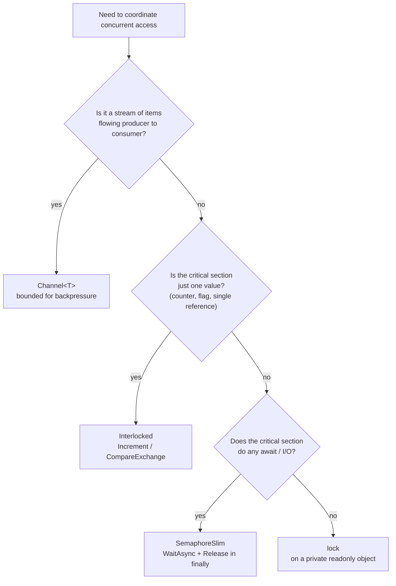

## The line that doesn't compile, and the one that's worse

Someone on the team is capping concurrent calls to a rate-limited downstream API. Their first instinct is the tool they already know:

```csharp
private readonly object _gate = new();

public async Task<Response> CallDownstreamAsync(Request req)
{
    lock (_gate)
    {
        return await _httpClient.SendAsync(req); // CS1996: cannot await in lock body
    }
}
```

This doesn't compile. `lock` lowers to a `Monitor.Enter`/`Monitor.Exit` pair wrapped in `try`/`finally`, and the compiler refuses to let an `await` sit inside that block, because `await` can suspend the method and resume on a *different thread* - and `Monitor.Exit` must be called by the same thread that called `Monitor.Enter`, or it throws `SynchronizationLockException`. The compiler is saving you from a bug you'd otherwise ship.

So the next instinct is to "fix" it by moving the lock to wrap only the synchronous parts, or worse, by blocking instead of awaiting:

```csharp
private readonly object _gate = new();

public Response CallDownstreamAsync(Request req)
{
    lock (_gate)
    {
        return _httpClient.SendAsync(req).Result; // compiles. now it's worse.
    }
}
```

This compiles, and it's the actual production bug, not the one the compiler caught. `.Result` blocks the calling thread until the HTTP call finishes - exactly the sync-over-async trap covered in [async/await pitfalls in C#](/posts/async-await-pitfalls-in-csharp/) - and it does so *while holding an exclusive lock*. Every other caller now queues up behind one thread that's sitting idle, waiting on network I/O it isn't even doing any work during. Ten callers that should have ten HTTP requests in flight concurrently end up with one request at a time, each blocking a whole thread pool thread for the round trip. You've paid for concurrency and gotten serial execution, and the throughput graph in production will look like someone dropped a governor on it right after the change that was supposed to add rate limiting.

The underlying mistake is using a primitive built for guarding in-memory state to guard I/O instead. `lock` was never the wrong idea here - it's the wrong *tool*. C# gives you four primitives that solve four genuinely different problems, and most concurrency bugs in application code come from picking the familiar one instead of the matching one.

## Primitive 1: `lock` - mutual exclusion, no async, ever

`lock (obj) { ... }` guarantees only one thread executes the block at a time, by acquiring a `Monitor` on `obj` for the duration. It's cheap (no kernel transition on the uncontended path), it's exception-safe (the compiler-generated `finally` always releases), and it is a purely synchronous, in-memory construct. Use it when you're protecting shared mutable state - a dictionary, a running total, a cache - and the critical section is CPU-only:

```csharp
public sealed class RequestCounter
{
    private readonly object _gate = new();
    private readonly Dictionary<string, int> _countsByRoute = new();

    public void RecordHit(string route)
    {
        lock (_gate)
        {
            _countsByRoute.TryGetValue(route, out var count);
            _countsByRoute[route] = count + 1;
        }
    }

    public IReadOnlyDictionary<string, int> Snapshot()
    {
        lock (_gate)
        {
            return new Dictionary<string, int>(_countsByRoute);
        }
    }
}
```

No I/O, no `await`, in and out fast. This is the textbook case, and it's genuinely the right call - the trap isn't `lock` itself, it's reaching for it when the body isn't purely synchronous.

The other classic `lock` bug has nothing to do with async: locking on the wrong object.

```csharp
public class BadCounter
{
    public int Count; // not private, not readonly
    private readonly object _lockObj = new object();

    public void Increment()
    {
        lock (this) // locking on a publicly-visible reference
        {
            Count++;
        }
    }
}
```

`lock (this)` locks on an object any external caller can also lock on - `lock (myBadCounter) { ... }` from unrelated code now contends for the same monitor, and a caller could hold it indefinitely and stall you. Same problem with locking on a `string`: string interning means two unrelated pieces of code holding the "same" literal string can accidentally share a lock. And locking on a boxed value type is worse - `lock (someInt)` boxes a fresh object on every call, so each thread locks on a *different* object and gets no mutual exclusion at all, silently. The fix is always the same: a `private readonly object _gate = new();` field, dedicated to nothing but being a lock target, never exposed outside the class.

## Primitive 2: `SemaphoreSlim` - limiting concurrent *async* work

The downstream-throttling problem from the opening needs a primitive that can be awaited without blocking a thread. `SemaphoreSlim` is a counting gate: it holds a count of available "slots," `WaitAsync()` asynchronously waits for a slot and decrements the count, and `Release()` gives a slot back. Unlike `lock`, it has no thread affinity - the thread that calls `Release()` doesn't have to be the one that called `WaitAsync()` - which is exactly what makes it safe across `await` boundaries.

```csharp
public sealed class ThrottledDownstreamClient
{
    private readonly HttpClient _httpClient;
    private readonly SemaphoreSlim _throttle = new(initialCount: 10, maxCount: 10);

    public ThrottledDownstreamClient(HttpClient httpClient) => _httpClient = httpClient;

    public async Task<HttpResponseMessage> CallAsync(HttpRequestMessage req)
    {
        await _throttle.WaitAsync(); // asynchronously waits for one of 10 slots
        try
        {
            return await _httpClient.SendAsync(req); // real concurrent I/O, up to 10 at once
        }
        finally
        {
            _throttle.Release(); // MUST run even on exception, or the slot is gone forever
        }
    }
}
```

With 10 slots, up to 10 calls run genuinely concurrently - 10 real outbound sockets in flight, not 10 threads blocked - and the 11th caller's `await _throttle.WaitAsync()` suspends without occupying a thread at all while it waits. This is the actual fix for the opening scenario: replace the `lock` with a `SemaphoreSlim(10, 10)`, and throughput matches the downstream's real capacity instead of collapsing to one request at a time.

The `finally` around `Release()` is not optional decoration. If an exception escapes `SendAsync` and `Release()` is outside the `try`, that slot is gone permanently - the semaphore's effective capacity shrinks by one, silently, forever, or until the process restarts. Do this to two or three slots over a bad afternoon and your "10 concurrent calls" limiter is quietly running at 7, then 5, with no exception or log line pointing at the cause - just a slow, unexplained throughput decline that looks like a downstream problem until someone thinks to check whether the semaphore's `CurrentCount` still adds up.

## Primitive 3: `Channel<T>` - a pipeline, not a single gate

`lock` and `SemaphoreSlim` both protect access to *shared state or a shared resource*. `Channel<T>` (from `System.Threading.Channels`) solves a different shape of problem: moving a stream of items from one or more producers to one or more consumers, safely, without either side taking out an explicit lock. Under the hood it's a lock-free (or lightly-locked, implementation-dependent) queue with `async` reader and writer APIs built in from the start.

```csharp
var channel = Channel.CreateBounded<OrderEvent>(new BoundedChannelOptions(capacity: 500)
{
    FullMode = BoundedChannelFullMode.Wait,   // writer awaits instead of dropping when full
    SingleReader = true,
    SingleWriter = false
});

// Producers: many callers can write concurrently (SingleWriter: false)
async Task ProduceAsync(ChannelWriter<OrderEvent> writer, IEnumerable<OrderEvent> events)
{
    foreach (var e in events)
    {
        await writer.WriteAsync(e); // suspends here if the channel is full
    }
}

// Single consumer draining the channel
async Task ConsumeAsync(ChannelReader<OrderEvent> reader)
{
    await foreach (var e in reader.ReadAllAsync())
    {
        await ProcessOrderEventAsync(e);
    }
}
```

Two design decisions matter more than the API surface itself:

**Bounded vs. unbounded.** `Channel.CreateUnbounded<T>()` never makes a writer wait - it just keeps growing. That's fine for short-lived, low-volume signaling, but for anything sustained it's a memory leak with extra steps: if the consumer falls behind, the channel absorbs every item the producer hands it until the process runs out of heap. `Channel.CreateBounded<T>(capacity)` with `FullMode.Wait` gives you backpressure for free - once the channel is full, `WriteAsync` suspends the producer until the consumer catches up, which couples producer speed to consumer speed instead of decoupling them into a runaway queue. [Processing 100 million rows a night](/posts/processing-100-million-rows-a-night/) covers this exact mechanism applied to a real bulk-load pipeline, where an 8-item bounded channel between chunking and writing keeps memory flat regardless of how far ahead the fast stage tries to run; this post is about the primitive underneath that, not the pipeline built on top of it.

**Single vs. multiple reader/writer.** `SingleReader`/`SingleWriter` are hints, not enforced contracts, but the runtime uses them to pick a faster internal implementation when only one side ever touches the channel - a single-reader channel can skip synchronization that a multi-reader one needs. Set them accurately: `SingleWriter = false` above because multiple producer tasks call `WriteAsync` concurrently, `SingleReader = true` because only one loop drains it. Get this wrong (claim `SingleReader = true` while actually running two consumer loops against the same channel) and you get corrupted internal state or missed items, not a clean exception - it's an unchecked promise, not a validated one.

`FullMode` has other values worth knowing: `DropOldest` and `DropNewest` discard instead of blocking, useful for a "latest status wins" channel where losing an old update is fine; `Wait` is the right default anywhere data loss isn't acceptable, which is most pipelines moving orders, events, or rows.

## Primitive 4: `Interlocked` - atomic ops on one value, no lock at all

Sometimes the entire critical section is "increment this number" or "swap this reference if it hasn't changed." Wrapping that in `lock` works but costs a `Monitor` acquisition for something the CPU can do in a single atomic instruction. `Interlocked` exposes those instructions directly:

```csharp
public sealed class RequestMetrics
{
    private long _totalRequests;
    private long _activeRequests;

    public void RequestStarted()
    {
        Interlocked.Increment(ref _totalRequests);
        Interlocked.Increment(ref _activeRequests);
    }

    public void RequestFinished() => Interlocked.Decrement(ref _activeRequests);

    public long TotalRequests => Interlocked.Read(ref _totalRequests);
}
```

No `lock`, no `Monitor`, no thread ever blocks - each call compiles to a single interlocked CPU instruction (`lock xadd` on x86/x64), and it's faster than the equivalent `lock` block under contention because there's no possibility of a thread being descheduled while holding anything. This is the right and only reasonable choice for counters, flags, and single-reference swaps, and the wrong choice the moment you need to update *more than one value consistently* - `Interlocked` gives you atomicity per field, not a transaction across fields. Two `Interlocked.Increment` calls on two different counters can interleave with a reader in between, seeing one updated and one not; if that matters, you're back to `lock`.

`CompareExchange` is the general-purpose building block underneath most lock-free code: "set the value to X, but only if it's currently Y, and tell me what it actually was."

```csharp
private int _state; // 0 = idle, 1 = running

public bool TryStart()
{
    // Only transition 0 -> 1. Returns the value BEFORE the attempted swap.
    var previous = Interlocked.CompareExchange(ref _state, 1, 0);
    return previous == 0; // true means we won the race and are now the one running
}
```

This is the pattern for "exactly one thread should do X" without a lock: every thread calls `TryStart()`, exactly one gets `previous == 0` and proceeds, the rest see `previous == 1` and back off. It's also where the classic **ABA problem** shows up if you're not careful: `CompareExchange` only checks that the value is *currently* equal to what you expect, not that it hasn't changed and changed back in between. If thread A reads `_state == 0`, gets suspended, and while it's suspended some other code flips it `0 -> 1 -> 0` and back to a state that looks identical, A's `CompareExchange(ref _state, 1, 0)` still succeeds - because as far as the instruction can tell, the value never moved. For a simple idle/running flag that's harmless (0 really does mean idle again), but for lock-free structures built on `CompareExchange` over object references - a hand-rolled lock-free stack node, for example - "the pointer is back to the same address" can mean "the object was freed and a new one happens to sit at the same address," which is a real, well-documented class of lock-free bugs. The practical takeaway: `Interlocked` is safe and simple for counters and single flags; the moment you're building a lock-free structure around `CompareExchange` on references, you're doing research-grade concurrency, and reaching for a tested library type (`ConcurrentQueue<T>`, `ConcurrentDictionary<TKey,TValue>`, `Channel<T>`) instead of hand-rolling it is usually the correct engineering call.

## The decision tree



Read it as a sequence of questions in priority order, because each one rules out an entire category of bug. First: is this actually a pipeline - items produced somewhere, consumed somewhere else, possibly at different rates? If so, stop thinking about locks entirely and reach for `Channel<T>`, bounded unless you have a specific reason not to. Second, if it's not a pipeline: is the whole critical section reducible to one value - a count, a flag, a single reference you're swapping? If yes, `Interlocked` beats a lock on every axis that matters (no blocking, no context switch, less code) and there's rarely a reason not to use it. Third, for anything left - a multi-field critical section or an operation that isn't just "update one thing" - the question that decides between the last two primitives is whether the body needs to `await`. If it does, `SemaphoreSlim` is the only one of the four that composes with async correctly; a `WaitAsync()`/`Release()` pair costs a little more than `lock` on the uncontended path but never blocks a thread while it's held. If the body is synchronous, in-memory, and fast, `lock` is still the right, boring, well-understood answer - just on a dedicated private object, never on `this`, a type, or anything boxed.

None of these four primitives is more "modern" or more "correct" than the others - they're not a ranked list, they're a matched set, each built for a shape of problem the others handle badly. The bug in the opening example wasn't that `lock` is bad; it's that a mutual-exclusion primitive with thread affinity was asked to guard a network call, and the compiler's refusal to compile the naive version was the one honest signal in the whole episode. Once concurrent I/O, single-value atomics, and producer/consumer pipelines each have their own primitive instead of all being forced through `lock`, most of the throughput cliffs and silently-shrinking semaphores in production code stop happening, because the type system and the API shape start ruling out the mistake before it ships.
