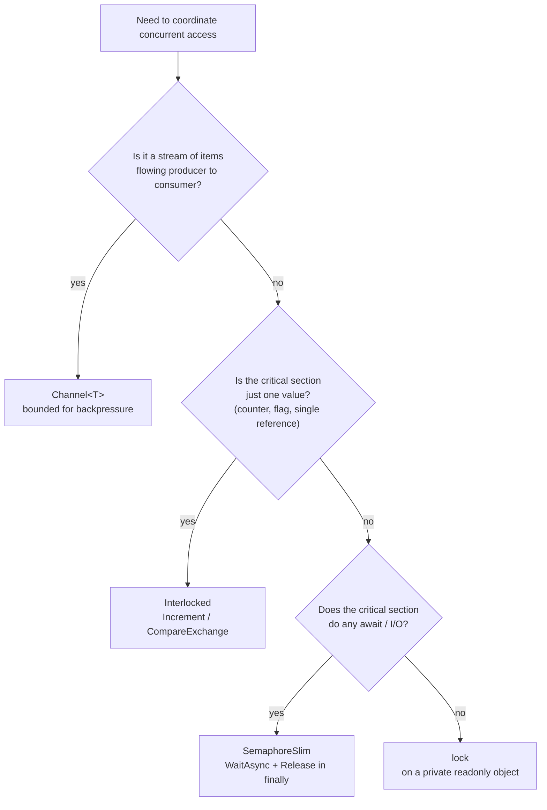

## The line that won't compile, and the one that's worse

Someone on the team needs to cap how many concurrent calls hit a rate-limited downstream API. Their first instinct is to reach for the tool they already know:

```csharp
private readonly object _gate = new();

public async Task<Response> CallDownstreamAsync(Request req)
{
    lock (_gate)
    {
        return await _httpClient.SendAsync(req); // CS1996: cannot await in lock body
    }
}
```

This won't even compile. `lock` compiles down to entering and exiting a `Monitor`, wrapped in a `try`/`finally`, and the compiler refuses to let an `await` live inside that block. The reason is that `await` can suspend the method and resume it on a completely different thread, but exiting a `Monitor` has to happen on the exact same thread that entered it. The compiler is catching a real bug here before you ever get the chance to ship it.

So the next move is usually to "fix" the compile error by moving the lock around, or worse, by blocking instead of awaiting:

```csharp
private readonly object _gate = new();

public Response CallDownstreamAsync(Request req)
{
    lock (_gate)
    {
        return _httpClient.SendAsync(req).Result; // compiles. now it's worse.
    }
}
```

This compiles, and it's the actual bug that ships to production, not the one the compiler stopped. `.Result` blocks the calling thread until the HTTP call finishes (the exact sync-over-async trap I wrote about in [async/await pitfalls in C#](/posts/async-await-pitfalls-in-csharp/)), and it does that while holding an exclusive lock. Every other caller now queues up behind one thread that's sitting there doing nothing, just waiting on a network response. Ten callers that should have ten HTTP requests running at once end up with exactly one in flight at a time, each one tying up a whole thread pool thread for the duration. You added rate limiting and got a throughput cliff instead.

The actual mistake is using a tool built for guarding in-memory state to guard a network call instead. `lock` isn't a bad idea here, it's just the wrong primitive for this particular job. C# gives you four of them, and each one solves a genuinely different shape of problem. Most concurrency bugs in application code come down to reaching for the familiar one instead of the matching one.

## Primitive one: lock, for guarding memory, never I/O

`lock (obj) { ... }` guarantees that only one thread runs the block at a time. It's cheap when nobody's contending for it, it cleans up after itself even if an exception is thrown, and it's a purely synchronous, in-memory tool. Reach for it when you're protecting shared mutable state, a dictionary, a running total, a small cache, and the work inside is CPU-only with nothing waiting on I/O:

```csharp
public sealed class RequestCounter
{
    private readonly object _gate = new();
    private readonly Dictionary<string, int> _countsByRoute = new();

    public void RecordHit(string route)
    {
        lock (_gate)
        {
            _countsByRoute.TryGetValue(route, out var count);
            _countsByRoute[route] = count + 1;
        }
    }

    public IReadOnlyDictionary<string, int> Snapshot()
    {
        lock (_gate)
        {
            return new Dictionary<string, int>(_countsByRoute);
        }
    }
}
```

No I/O, no `await`, in and out fast. This is the textbook case and genuinely the right call. The trap isn't `lock` itself, it's reaching for it when the body inside isn't purely synchronous.

There's a second, unrelated `lock` bug worth knowing: locking on the wrong object.

```csharp
public class BadCounter
{
    public int Count; // not private, not readonly
    private readonly object _lockObj = new object();

    public void Increment()
    {
        lock (this) // locking on a publicly-visible reference
        {
            Count++;
        }
    }
}
```

`lock (this)` locks on an object anyone outside the class can also lock on. Some unrelated piece of code doing `lock (myBadCounter) { ... }` now contends for the exact same monitor, and if it holds that lock for a while, it stalls you too. Locking on a string has the same problem in disguise, because of string interning: two unrelated pieces of code holding what looks like "the same" literal string can accidentally share a lock without meaning to. Locking on a boxed value type is worse still: `lock (someInt)` boxes a brand new object every time it runs, so every thread ends up locking on a different object and gets no mutual exclusion at all, silently, with no error to tell you. The fix is always the same one: a dedicated `private readonly object _gate = new();` field that exists purely to be a lock target and is never exposed outside the class.

## Primitive two: SemaphoreSlim, for limiting concurrent async work

The throttling problem from the opening needs something you can await without blocking a thread. `SemaphoreSlim` is a counting gate: it holds a number of available slots, `WaitAsync()` waits for a slot to open up and takes it, and `Release()` gives it back. Unlike `lock`, it has no notion of "which thread." The thread that calls `Release()` doesn't need to be the same one that called `WaitAsync()`, which is exactly what makes it safe to use across an `await`.

```csharp
public sealed class ThrottledDownstreamClient
{
    private readonly HttpClient _httpClient;
    private readonly SemaphoreSlim _throttle = new(initialCount: 10, maxCount: 10);

    public ThrottledDownstreamClient(HttpClient httpClient) => _httpClient = httpClient;

    public async Task<HttpResponseMessage> CallAsync(HttpRequestMessage req)
    {
        await _throttle.WaitAsync(); // asynchronously waits for one of 10 slots
        try
        {
            return await _httpClient.SendAsync(req); // real concurrent I/O, up to 10 at once
        }
        finally
        {
            _throttle.Release(); // MUST run even on exception, or the slot is gone forever
        }
    }
}
```

With 10 slots, up to 10 calls actually run at the same time, ten real sockets in flight, not ten threads sitting blocked. The 11th caller's `await _throttle.WaitAsync()` just suspends without tying up a thread while it waits its turn. This is the real fix for the opening problem: swap the `lock` for a `SemaphoreSlim(10, 10)`, and throughput ends up matching what the downstream can actually handle instead of collapsing to one request at a time.

That `finally` around `Release()` isn't optional. If an exception escapes `SendAsync` and `Release()` sits outside the `try`, that slot is gone for good. The semaphore's effective capacity quietly shrinks by one, forever, or until the process restarts. Lose two or three slots like that over a bad afternoon and your "10 concurrent calls" limiter is running at 7, then 5, with no exception and no log line pointing at why. Just a slow, unexplained decline in throughput that looks like a downstream problem until someone thinks to check whether the semaphore's count still adds up.

## Primitive three: Channel, for a pipeline instead of a gate

`lock` and `SemaphoreSlim` both protect access to some shared state or resource. `Channel<T>` solves a different problem entirely: moving a stream of items from one or more producers to one or more consumers, safely, without either side taking out an explicit lock. Underneath, it's a queue built specifically with `async` reading and writing in mind from the start.

```csharp
var channel = Channel.CreateBounded<OrderEvent>(new BoundedChannelOptions(capacity: 500)
{
    FullMode = BoundedChannelFullMode.Wait,   // writer awaits instead of dropping when full
    SingleReader = true,
    SingleWriter = false
});

// Producers: many callers can write concurrently (SingleWriter: false)
async Task ProduceAsync(ChannelWriter<OrderEvent> writer, IEnumerable<OrderEvent> events)
{
    foreach (var e in events)
    {
        await writer.WriteAsync(e); // suspends here if the channel is full
    }
}

// Single consumer draining the channel
async Task ConsumeAsync(ChannelReader<OrderEvent> reader)
{
    await foreach (var e in reader.ReadAllAsync())
    {
        await ProcessOrderEventAsync(e);
    }
}
```

Two choices here matter more than the rest of the API surface.

First, bounded versus unbounded. `Channel.CreateUnbounded<T>()` never makes a writer wait, it just keeps growing. That's fine for something short-lived and low-volume, but for anything sustained it's a memory leak wearing a different hat: if the consumer ever falls behind, the channel just keeps absorbing everything the producer hands it until the process runs out of memory. `Channel.CreateBounded<T>(capacity)` with `FullMode.Wait` gives you backpressure automatically, because once it's full, `WriteAsync` suspends the producer until the consumer catches up. That ties producer speed to consumer speed instead of letting the gap between them turn into a runaway queue. I used exactly this pattern in [Processing 100 million rows a night](/posts/processing-100-million-rows-a-night/), where a small bounded channel between chunking and writing keeps memory flat no matter how far ahead the fast stage tries to get.

Second, single versus multiple reader and writer. `SingleReader` and `SingleWriter` are hints, not enforced rules, but the runtime uses them to pick a faster internal path when only one side ever touches the channel. Set them honestly: `SingleWriter = false` above because several producer tasks call `WriteAsync` at once, `SingleReader = true` because only one loop drains it. Get this wrong, say you claim `SingleReader = true` but actually run two consumer loops against the same channel, and you don't get a clean exception. You get corrupted internal state or missed items, because it's an unchecked promise, not something the runtime verifies for you.

`FullMode` has other options worth knowing about too. `DropOldest` and `DropNewest` discard items instead of blocking, which is useful for something like a "latest status wins" channel where losing an old update doesn't matter. `Wait` is the right default anywhere losing data isn't acceptable, which is most pipelines moving orders, events, or rows.

## Primitive four: Interlocked, for one value with no lock at all

Sometimes the whole critical section is "increment this number" or "swap this reference if it hasn't changed." Wrapping that in a `lock` works, but it costs a full monitor acquisition for something the CPU can already do as a single atomic instruction. `Interlocked` gives you those instructions directly:

```csharp
public sealed class RequestMetrics
{
    private long _totalRequests;
    private long _activeRequests;

    public void RequestStarted()
    {
        Interlocked.Increment(ref _totalRequests);
        Interlocked.Increment(ref _activeRequests);
    }

    public void RequestFinished() => Interlocked.Decrement(ref _activeRequests);

    public long TotalRequests => Interlocked.Read(ref _totalRequests);
}
```

No lock, no monitor, no thread ever blocks. Each call compiles down to a single atomic CPU instruction, and it's faster than the equivalent `lock` under contention, because there's no chance of a thread getting swapped out mid-operation while holding something. This is the right choice, really the only reasonable choice, for counters, flags, and swapping a single reference. It stops being the right choice the moment you need more than one value to update together consistently. `Interlocked` gives you atomicity per field, not a transaction across several fields. Two separate `Interlocked.Increment` calls on two different counters can still be seen by a reader with one updated and the other not yet caught up. If that matters, you're back to `lock`.

`CompareExchange` is the general building block underneath most lock-free code: set this value to X, but only if it's currently Y, and tell me what it actually was.

```csharp
private int _state; // 0 = idle, 1 = running

public bool TryStart()
{
    // Only transition 0 -> 1. Returns the value BEFORE the attempted swap.
    var previous = Interlocked.CompareExchange(ref _state, 1, 0);
    return previous == 0; // true means we won the race and are now the one running
}
```

This is the standard pattern for "exactly one thread should do this" without a lock. Every thread calls `TryStart()`, exactly one of them sees `previous == 0` and gets to proceed, and the rest see `previous == 1` and back off.

It's also where a subtle bug called the ABA problem can show up. `CompareExchange` only checks that the value is *currently* what you expect, it has no way of knowing whether the value changed and then changed back to look the same in between. Say thread A reads `_state == 0`, then gets suspended right there. While it's suspended, something else flips the value from 0 to 1 and back to 0. When A resumes, its `CompareExchange` still succeeds, because as far as the instruction can tell, nothing ever moved. For a simple idle/running flag that's harmless, since 0 really does mean idle either way. But for lock-free structures built around swapping object references, like a hand-rolled lock-free stack, "the pointer is back to the same address" can actually mean "the old object was freed and a completely different one happens to sit at that same address now," which is a real and well-documented class of bug.

The practical takeaway: `Interlocked` is simple and safe for counters and single flags. The moment you're building an actual lock-free structure around `CompareExchange` on references, you're doing genuinely hard concurrency work, and reaching for a tested type like `ConcurrentQueue<T>`, `ConcurrentDictionary<TKey,TValue>`, or `Channel<T>` instead of hand-rolling it is almost always the right engineering call.

## How I actually decide


```mermaid
flowchart TD
    A["Need to coordinate concurrent access"] --> B{"Is it a stream of items\nflowing producer to consumer?"}
    B -- yes --> C["Channel&lt;T&gt;\nbounded for backpressure"]
    B -- no --> D{"Is the critical section\njust one value?\n(counter, flag, single reference)"}
    D -- yes --> E["Interlocked\nIncrement / CompareExchange"]
    D -- no --> F{"Does the critical section\ndo any await / I/O?"}
    F -- yes --> G["SemaphoreSlim\nWaitAsync + Release in finally"]
    F -- no --> H["lock\non a private readonly object"]
```

I run through these questions roughly in this order, because each one rules out a whole category of bug before I even think about the next.

First: is this actually a pipeline, items produced somewhere and consumed somewhere else, possibly at different speeds? If so, stop thinking about locks entirely and reach for `Channel<T>`, bounded unless you have a specific reason not to.

If it's not a pipeline, next question: does the whole critical section reduce to one value, a count, a flag, a single reference being swapped? If yes, `Interlocked` wins on every axis that matters here: no blocking, no context switch, less code to get wrong.

For everything left over, a critical section touching more than one value, or doing something more than "update one thing", the deciding question is whether the body needs to `await`. If it does, `SemaphoreSlim` is the only one of the four that plays correctly with async. It costs a bit more than `lock` when there's no contention, but it never blocks a thread while it's held. If the body is synchronous, in-memory, and quick, `lock` is still the right, boring, well-understood answer, as long as it's on a dedicated private object and never on `this`, a type, or anything boxed.

None of these four is more modern or more correct than the others. They're not a ranked list, they're four tools built for four different shapes of problem. The bug in the opening example wasn't that `lock` is bad. It was that a tool with a notion of "which thread" got asked to guard a network call, and the compiler refusing to build it was the one honest warning in the whole story. Give concurrent I/O, single-value atomics, and producer-consumer pipelines their own dedicated primitives instead of forcing everything through `lock`, and most of the throughput cliffs and silently-shrinking semaphores I've seen in production code simply stop happening, because the API shape rules out the mistake before it ever ships.
