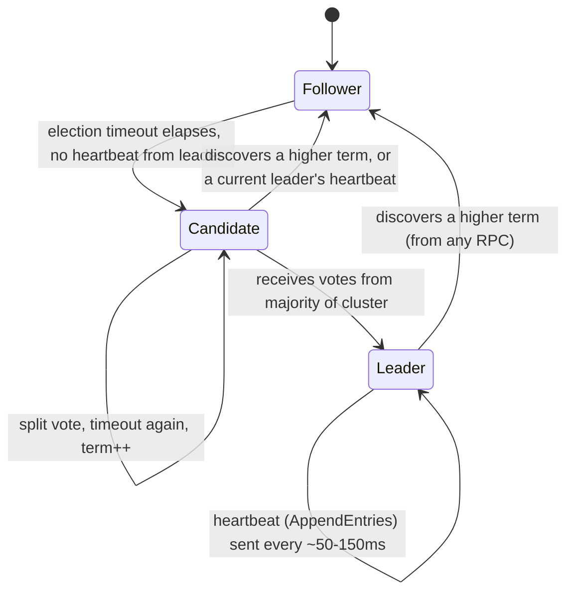
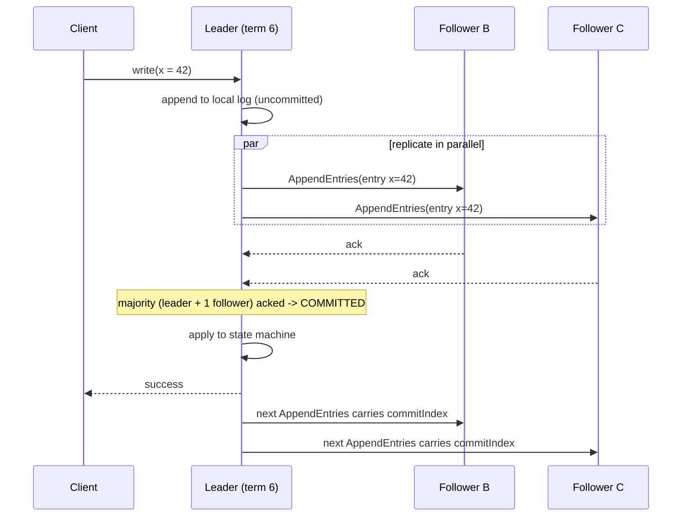

## The outage that two leaders cause

Picture a 3-node service that replicates a config store: one node is "primary," the other two are "replicas," and a client always writes to whoever currently answers to `/is-leader = true`. A network partition splits the cluster - node A is cut off from B and C, but A can still see clients on its side of the split. A was the primary before the partition. It has no idea it is now cut off; its heartbeat to itself never fails. So A keeps accepting writes.

Meanwhile B and C, no longer hearing from A, do the sensible-looking thing: they elect a new primary among themselves, say B. B also starts accepting writes.

Now you have two nodes, each fully convinced it is the one true primary, each accepting writes from clients that can still reach them. This is **split-brain**, and it is not a rare edge case - it is the default outcome of "pick a leader and have it coordinate" the instant you add a network that can partition, which is every network. Both A's and B's write histories look locally consistent. Neither node can tell, from its own log, that the other exists and has diverged. When the partition heals, you have two histories that disagree about what happened, and no principled way to merge them - you pick one and silently discard the other, or you page someone at 3 a.m. to reconcile transactions by hand.

The fix is not "detect two leaders and shut one down" - by the time you can detect it, damage is already committed. The fix has to make it *structurally impossible* for two nodes to both believe they can accept writes at the same time, even though nodes can't directly observe each other's state and messages can be arbitrarily delayed or lost. That is what **consensus algorithms** solve, and Raft is the one most engineers now meet without realizing it: it is the algorithm inside etcd (which is what Kubernetes leader election and its entire cluster state actually run on), inside Kafka's KRaft mode, inside CockroachDB and Cosmos DB's underlying replication, and inside HashiCorp Consul.

## What consensus actually promises

A consensus protocol lets a cluster of nodes agree on a single, ordered sequence of values (think: an append-only log) even when some nodes crash or the network drops and delays messages, as long as a **majority** of nodes are up and can talk to each other. The promise is narrow and easy to state, and that narrowness is the whole point:

- At most one leader can be recognized by a majority at any given time.
- Once a majority of nodes have durably stored a log entry, that entry is permanent - it will never be silently overwritten or lost, even if the leader that wrote it crashes one millisecond later.
- A minority partition can keep running, but it can never commit anything new. It is deliberately unavailable rather than risk disagreeing with the majority.

That last bullet is the part people find counterintuitive on first read. A protocol that makes part of the cluster refuse to do its job sounds like a bug. It is the entire mechanism. Availability is being traded, on purpose, for the guarantee that "committed" means committed - the same trade-off you already accept every time you set `min.insync.replicas=2` in Kafka and let the broker reject writes rather than accept them into a single fragile copy, a pattern covered in [Kafka for Engineers Who Know Databases](/posts/kafka-for-engineers-who-know-databases/). Raft just applies that idea to leader election itself, not only to data replication.

## Terms: a logical clock for "which election are we talking about"

Raft divides time into **terms** - monotonically increasing integers, starting at 0. Each term has at most one leader. A node keeps a `currentTerm` field and attaches it to every message it sends. The rule that makes terms useful: **whenever a node sees a term number higher than its own, it immediately updates its own term and steps down to follower**, no matter what it currently believes about itself.

This single rule is what kills split-brain. Suppose node A is leader in term 5. A partition isolates it. B and C time out waiting for A's heartbeat, and C starts an election for term 6, wins a majority (B and C, which is 2 of 3 - a majority), and becomes leader of term 6. When the partition heals and A finally reconnects and sends a heartbeat claiming to be leader of term 5, B and C reject it - term 5 is stale. Worse for A: the moment A receives *any* message tagged with term 6, A sees a higher term than its own `currentTerm = 5`, and steps down to follower immediately. A cannot resume being leader; it does not get a vote on whether it should. The term number alone settles it.

This is why a term functions as a logical clock rather than a wall-clock timestamp: nodes never need synchronized clocks (a notoriously hard distributed-systems problem) to agree on ordering - they only need to compare two integers.



Every node is always in exactly one of these three states. Followers are passive - they only respond to RPCs (remote procedure calls, the request/response messages nodes send each other over the network) from leaders and candidates. The moment a follower stops hearing from a leader, it assumes something is wrong and promotes itself.

## Randomized timeouts: why elections don't deadlock

When a follower's election timeout elapses, it becomes a **candidate**: it increments its own term, votes for itself, and sends `RequestVote` RPCs to every other node in parallel. If it gets votes from a majority (including itself), it becomes leader for that term and starts sending heartbeats before anyone else's timeout fires.

The obvious failure mode: if every follower uses the *same* timeout, then when a leader dies, all the followers time out at the same instant, all become candidates for the same new term simultaneously, and each votes for itself. Nobody gets a majority - a **split vote**. Now everyone's election timer restarts... with the same fixed duration, so they all time out again at the same instant and split the vote again. Forever.

Raft's fix is almost embarrassingly simple: each node picks its election timeout **randomly** from a range, typically 150-300ms, re-rolled every time the timer resets. With randomized timeouts, one follower's timer almost always fires meaningfully before the others'. That node becomes a candidate first, sends `RequestVote` before anyone else even considers it, and usually collects a majority before a second candidate emerges. Split votes still happen occasionally (two nodes roll timeouts within a few milliseconds of each other), but the retry - with a fresh random timeout each time - converges quickly. This is the same tool as jittered retry backoff, which shows up again in [Timeouts, Retries, and Circuit Breakers in .NET](/posts/timeouts-retries-circuit-breakers-dotnet/): uncoordinated actors avoiding synchronized collisions by adding randomness.

Here is the vote-granting logic each node runs on receiving a `RequestVote` RPC - the safety check that keeps a lagging node from winning an election and then losing data:

```csharp
// Simplified RequestVote handler, run by every follower/candidate on receipt.
VoteResponse HandleRequestVote(RequestVoteArgs args)
{
    if (args.Term < currentTerm)
        return new VoteResponse(currentTerm, voteGranted: false); // stale candidate, ignore

    if (args.Term > currentTerm)
    {
        currentTerm = args.Term;
        state = NodeState.Follower; // newer term always wins, step down unconditionally
        votedFor = null;
    }

    bool logIsUpToDate =
        args.LastLogTerm > lastLogTerm ||
        (args.LastLogTerm == lastLogTerm && args.LastLogIndex >= lastLogIndex);

    // Grant at most one vote per term, and only to a candidate whose log
    // is at least as complete as ours - this is what stops a node that
    // missed recent writes from becoming leader and truncating them.
    if ((votedFor == null || votedFor == args.CandidateId) && logIsUpToDate)
    {
        votedFor = args.CandidateId;
        ResetElectionTimer();
        return new VoteResponse(currentTerm, voteGranted: true);
    }

    return new VoteResponse(currentTerm, voteGranted: false);
}
```

That `logIsUpToDate` check is easy to skim past and is actually load-bearing: a node can only win an election if a majority of the cluster agrees its log is at least as current as their own. A node that was partitioned away for an hour and missed a hundred commits cannot become leader and steamroll them - it will lose every vote until it catches up.

## Log replication: commit means a majority wrote it down

Leader election answers "who is in charge." Log replication is where the actual work happens. Once elected, a leader is the only node that accepts client writes. For each write:

1. The leader appends the entry to its own log (tagged with the current term and the index it lands at) but does **not** apply it yet.
2. The leader sends `AppendEntries` RPCs to every follower, carrying the new entry.
3. Each follower appends the entry to its own log and acknowledges.
4. Once the leader has heard acknowledgement from a **majority** of the cluster (itself plus enough followers), the entry is **committed**. Only now does the leader apply it to its state machine and respond success to the client.
5. Subsequent `AppendEntries` (or heartbeats) tell followers the latest committed index, so they apply it too.



The majority rule is the load-bearing beam of the whole algorithm. It guarantees that any two majorities overlap by at least one node - in a 5-node cluster, any two sets of 3 share at least one member. That shared node is what makes it impossible for a future leader election to "forget" a committed entry: whoever wins the next election needed votes from a majority, and that majority necessarily includes at least one node that has the committed entry in its log, and the `logIsUpToDate` check from the vote handler above means the new leader cannot have a log that is missing it.

## Worked example: a 5-node cluster loses its leader mid-write

Take a 5-node cluster - N1 through N5 - currently in term 4, with N1 as leader. State:

| Node | Role | Term | Last log index |
|------|------|------|-----------------|
| N1 | Leader | 4 | 100 |
| N2 | Follower | 4 | 100 |
| N3 | Follower | 4 | 100 |
| N4 | Follower | 4 | 99 (slightly behind) |
| N5 | Follower | 4 | 99 |

A client sends write #101. N1 appends it locally (log index 101, term 4) and fires `AppendEntries` to N2-N5. N1 crashes - hardware fault, OOM kill, doesn't matter - after the RPC reaches N2 and N2 acks, but before N3, N4, or N5 receive it.

At this instant: N1 has entry 101 (crashed, irrelevant now), N2 has entry 101, and N3/N4/N5 do not. That entry was acknowledged by only 2 of 5 nodes (N1 and N2) - not a majority of 5 (which needs 3). **It was never committed.** The client is still waiting; it never got a success response.

N3, N4, and N5 each independently notice no heartbeat is arriving and start their randomized election timers. Say N4's timer fires first (it happened to roll the shortest random timeout). N4 increments to term 5, votes for itself, and sends `RequestVote` to N1 (unreachable), N2, N3, N5. N2's log has entry 101 at index 101; N4's log stops at index 99. Under the `logIsUpToDate` rule, N2 must reject N4's vote request - N4's log is less complete. N4 fails to get a majority and its election times out.

Eventually N3 (log index 100, matching N2) times out, becomes a candidate for term 5, and requests votes. N2 and N5 grant it (N3's log is at least as up to date as theirs), giving N3 a majority (N2, N3, N5 = 3 of 5). N3 becomes leader of term 5. Entry 101 - the one only N1 and N2 ever saw - is simply gone. It never makes it into the new leader's log, and once N3 starts sending `AppendEntries`, N2 will find its own index-101 entry conflicts with what the new leader dictates and overwrite it to match N3's log.

This is the correct outcome, not data loss in the "we have a bug" sense. The write was never acknowledged to the client as durable, so nothing that was promised was broken. If N1 recovers later and rejoins as a follower, it will discover N3's term (5) is higher than its own (4), step down, and its log gets truncated back to index 100 to match the new leader - its lone copy of entry 101 is discarded because it never reached a majority.

## Kafka's ISR is Raft's cousin, and KRaft is the real thing

If this majority-commit shape feels familiar, it should: it's the same idea behind Kafka's `acks=all` combined with `min.insync.replicas`, covered in depth in [Kafka for Engineers Who Know Databases](/posts/kafka-for-engineers-who-know-databases/) and from the producer's side in [Kafka Delivery Semantics in .NET](/posts/kafka-delivery-semantics-dotnet/). A Kafka partition's leader only tells the producer a write is durable once every replica in the [In-Sync Replica set (ISR)](/glossary/#isr) has it - conceptually a majority-style acknowledgement, though Kafka's ISR is a broker-managed, dynamically shrinking membership rather than Raft's fixed-majority-of-all-voters rule, which is why Kafka needs the extra `min.insync.replicas` guard rail to stop the ISR from degenerating to a single node. It is a purpose-built, weaker cousin of full consensus: good enough for "don't lose data," not designed to solve leader election among brokers.

Leader election among *brokers themselves* - which broker is the controller, who owns which partition's leadership - used to be Kafka's actual gap: it delegated that job entirely to Apache ZooKeeper, a separate consensus service (running the Zab protocol, a close relative of Raft) that Kafka clusters had to deploy, operate, and scale independently. **KRaft** (Kafka Raft) is Kafka's replacement for that: as of Kafka 3.x/4.0, the brokers themselves run a real Raft implementation to elect a controller and agree on cluster metadata (topic configs, partition assignments, ACLs), with no external ZooKeeper ensemble at all. It's the same terms-plus-majority-log mechanism from this post, just replicating "the cluster's metadata" instead of "one partition's messages." Everything above - randomized election timeouts, `AppendEntries`-equivalent replication, majority commit - runs, with Kafka-specific naming, inside every modern Kafka cluster's controller quorum.

The pattern repeats everywhere you look once you know the shape: etcd (a key-value store built directly on a Raft library) is what Kubernetes uses for all cluster state and leader election - every `kubectl get pods` is ultimately a read against a Raft-replicated log, and every "which controller-manager instance is active" decision is a Raft leader election. Cosmos DB's underlying replication protocol and CockroachDB's range replicas use Raft or Paxos-family algorithms for the identical reason: multiple copies of data across machines that can fail or partition, needing one agreed-upon order of writes.

## Honest tradeoffs

Consensus is not free, and pretending otherwise is how people get surprised in production:

- **A minority partition is unavailable by design, not by accident.** In the 5-node example, if a partition splits the cluster 2-3, the 2-node side can never elect a leader (it can't reach a majority) and can never commit a write, even though both of its nodes are perfectly healthy and reachable by some clients. That is Raft protecting correctness at the cost of availability - the CAP theorem trade-off made concrete, not a defect to patch around.
- **Every write pays a network round trip to a majority**, not just to the leader. Cross-region Raft clusters (say, nodes in three different Azure regions for disaster tolerance) pay real cross-region latency on every commit - tens of milliseconds, not microseconds. This is why etcd and similar systems are usually deployed within a single region or a small number of nearby ones, not spread globally for every write.
- **Cluster size matters more than intuition suggests.** A 3-node cluster tolerates 1 failure (needs 2 of 3). A 5-node cluster tolerates 2 failures (needs 3 of 5) but pays for two more round trips per write and two more disks. Going from 3 to 5 nodes doesn't double your fault tolerance for double the cost - it adds exactly one more failure of headroom. Most production Raft-based systems (etcd, Kafka's KRaft controllers) default to 3 or 5 for exactly this reason; even numbers are actively worse, since a 4-node cluster still only tolerates 1 failure (needs 3 of 4) while paying for a fourth node.
- **Leader changes cause a real, if brief, availability blip.** Between a leader failing and a new one being elected, the cluster cannot commit writes - bounded by the election timeout (hundreds of milliseconds, typically), but not zero. Systems layered on Raft (Kafka's producers, etcd clients) need retry logic that tolerates this window rather than treating it as a hard failure.
- **This is a leader-based protocol, not a leaderless one.** Every write still funnels through one node. Raft solves *safe* leadership, not the throughput ceiling of having a single write path - that ceiling is why Kafka partitions the log at all, spreading leadership across many independent partitions instead of running one giant Raft group for an entire topic.

## Putting it together

The naive "pick a leader, trust the leader" scheme fails not because leaders are a bad idea, but because it has no mechanism for a leader to notice it has stopped being the leader - it can only be told by a message that a partition might delay indefinitely. Raft closes that hole with two cheap primitives: a term number that makes "who is more recent" a simple integer comparison instead of a clock-synchronization problem, and a majority-commit rule that makes "is this durable" require overlap with any future majority, so nothing committed can ever be un-committed by a later election. Randomized timeouts are the unglamorous detail that makes elections actually terminate instead of livelocking forever. None of this is exotic anymore - it is running quietly inside etcd every time Kubernetes schedules a pod, inside Kafka's controller quorum since KRaft replaced ZooKeeper, and inside every managed database that advertises "automatic failover with no data loss." The mental model is worth keeping permanently: a distributed system doesn't get correctness by avoiding failure, it gets correctness by defining precisely what a majority must agree to before anything is allowed to count as true.
