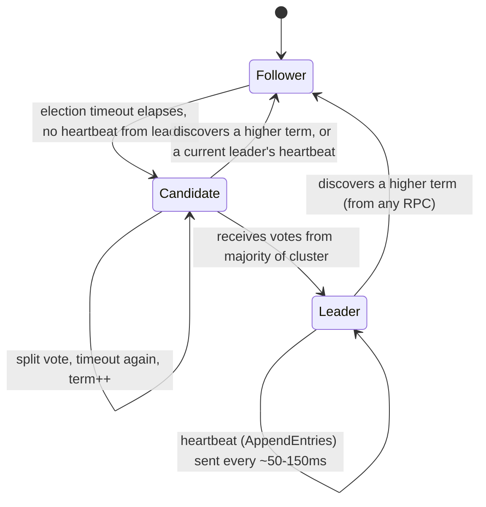
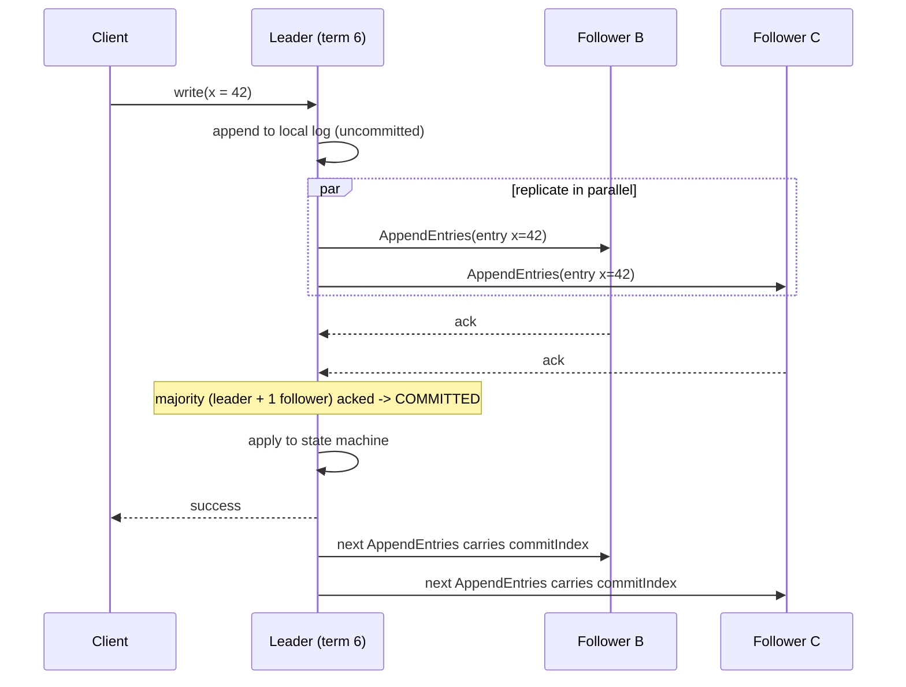

## Two servers, both certain they're in charge

The worst version of this bug is the one where nothing looks broken.

You've got three servers holding a config store. One is the primary, the other two are replicas, and clients write to whichever one currently reports `/is-leader = true`. Simple, and it works fine for months.

Then the network hiccups. Server A gets cut off from B and C, but clients on A's side of the split can still reach it. A was the primary before the split, and here's the problem: A has no way to know anything changed. Its own health check still passes. So it keeps taking writes.

Meanwhile B and C stop hearing from A and do the reasonable thing - they pick a new primary between themselves, say B. B starts taking writes too.

Now two servers are each completely convinced they're the one in charge, and each is accepting real customer writes. This is called **split-brain**.

The thing that makes it nasty is that from the inside, both look healthy. A's history is perfectly consistent with itself. So is B's. Neither one can look at its own data and tell that another server exists and has drifted away from it.

When the network heals, you've got two versions of what happened and no principled way to combine them. You either pick one and quietly throw away the other, or you wake somebody up at 3 a.m. to reconcile transactions by hand.

You can't fix this by detecting two leaders and shutting one down, because by the time you can detect it, the bad writes have already happened. The fix has to make it structurally impossible for two servers to believe they can accept writes at the same time - and it has to work even though servers can't see inside each other and messages can be delayed or dropped for arbitrarily long.

That's what **consensus algorithms** are for. Raft is the one most of us are already running without thinking about it: it's inside etcd (which is where all of Kubernetes' cluster state lives), inside Kafka's KRaft mode, inside CockroachDB and Cosmos DB's replication, and inside HashiCorp Consul.

Fair warning before we go further: this post assumes you're comfortable with the idea of servers replicating data to each other over a network that can fail. You don't need any prior distributed systems theory. I'll define the jargon as it comes up.

## What consensus actually promises

A consensus protocol lets a group of servers agree on one ordered list of values - think of an append-only log - even when some of them crash and the network drops or delays messages. The catch is that it only works as long as a **majority** of the servers are up and able to talk to each other.

Majority just means more than half. Two out of three. Three out of five. That's it, no deeper meaning.

The promise itself is short:

- At most one leader can be recognized by a majority at any moment.
- Once a majority of servers have written an entry to disk, it's permanent. It won't be silently overwritten or lost, even if the leader that wrote it dies a millisecond later.
- A group that finds itself in the minority side of a split keeps running, but it can't commit anything new. It goes unavailable on purpose rather than risk disagreeing with the majority.

That last one trips people up. A protocol that makes part of your cluster deliberately refuse to work sounds like a defect.

It's the actual mechanism, though. You're trading availability, knowingly, for the guarantee that "committed" means committed. If you've ever set `min.insync.replicas=2` in Kafka and let the broker reject writes rather than accept them into one fragile copy, you've already made this exact trade. (More on that in [Kafka for Engineers Who Know Databases](/posts/kafka-for-engineers-who-know-databases/).) Raft applies the same idea to choosing a leader, not just to copying data.

## Terms: a counter that settles every argument

Raft chops time into **terms**. A term is just a number that only ever goes up, starting at 0. Each term gets at most one leader.

Every server keeps its own `currentTerm` and stamps it on every message it sends. And there's one rule that does an enormous amount of work:

**When a server sees a term number higher than its own, it immediately adopts that term and demotes itself to follower.** No exceptions, no matter what it thought it was a moment ago.

That single rule is what kills split-brain. Walk through it.

Server A is leader in term 5, and a network split isolates it. B and C stop hearing from A, so C starts an election for term 6. It wins votes from B and itself - two out of three, a majority - and becomes leader of term 6.

The split heals. A reconnects and confidently sends a heartbeat saying it's the leader of term 5. B and C reject it outright, because term 5 is old news.

Worse for A: the instant it receives *any* message stamped term 6, it sees a number bigger than its own 5 and steps down on the spot. A doesn't get a say in the matter. Comparing two integers settles it.

This is why the term acts like a clock without actually being one. Servers never need their wall clocks synchronized, which is famously hard to pull off, because ordering is decided by comparing integers instead.


```mermaid
stateDiagram-v2
    [*] --> Follower
    Follower --> Candidate: election timeout elapses, no heartbeat from leader
    Candidate --> Candidate: split vote, timeout again, term++
    Candidate --> Leader: receives votes from majority of cluster
    Candidate --> Follower: discovers a higher term, or a current leader's heartbeat
    Leader --> Follower: discovers a higher term (from any RPC)
    Leader --> Leader: heartbeat (AppendEntries) sent every ~50-150ms
```

Every node is always in exactly one of these three states. Followers are passive - they only respond to RPCs (remote procedure calls, the request/response messages nodes send each other over the network) from leaders and candidates. The moment a follower stops hearing from a leader, it assumes something is wrong and promotes itself.

## Randomized timeouts: how elections avoid deadlocking forever

When a follower's timer runs out with no heartbeat from a leader, it turns into a **candidate**. It bumps its own term, votes for itself, and fires off `RequestVote` messages to everyone else at once. Get a majority of votes and it becomes leader, then starts sending heartbeats before anyone else's timer even expires.

Here's the obvious way that breaks: if every follower uses the exact same timeout length, then when a leader dies, all of them time out at the same instant, all become candidates for the same term at the same instant, and all vote for themselves. Nobody gets a majority. That's called a **split vote**. Everyone's timer resets, and since it's the same fixed length again, they all time out together a second time and split the vote again. This can, in principle, go on forever.

Raft's answer is almost too simple: each server picks its timeout at random from a range, usually somewhere around 150 to 300 milliseconds, and re-rolls it every time the timer resets. With that in place, one follower's timer will almost always go off meaningfully earlier than everyone else's. It becomes a candidate first, sends out its vote requests before any other server has even considered running, and usually locks up a majority before a second candidate has a chance to start. Split votes still happen sometimes, when two servers happen to roll timeouts within a few milliseconds of each other, but the retry (with a fresh random number each time) sorts itself out fast.

If this sounds familiar, it's the exact same idea as jittered retry delays, which I wrote about in [Timeouts, Retries, and Circuit Breakers in .NET](/posts/timeouts-retries-circuit-breakers-dotnet/): give uncoordinated actors some randomness and they stop colliding with each other.

Here's the logic each server runs when it receives a `RequestVote` message - this is the safety check that stops a server that's behind on data from winning an election and then losing everyone's writes:

```csharp
// Simplified RequestVote handler, run by every follower/candidate on receipt.
VoteResponse HandleRequestVote(RequestVoteArgs args)
{
    if (args.Term < currentTerm)
        return new VoteResponse(currentTerm, voteGranted: false); // stale candidate, ignore

    if (args.Term > currentTerm)
    {
        currentTerm = args.Term;
        state = NodeState.Follower; // newer term always wins, step down unconditionally
        votedFor = null;
    }

    bool logIsUpToDate =
        args.LastLogTerm > lastLogTerm ||
        (args.LastLogTerm == lastLogTerm && args.LastLogIndex >= lastLogIndex);

    // Grant at most one vote per term, and only to a candidate whose log
    // is at least as complete as ours - this is what stops a node that
    // missed recent writes from becoming leader and truncating them.
    if ((votedFor == null || votedFor == args.CandidateId) && logIsUpToDate)
    {
        votedFor = args.CandidateId;
        ResetElectionTimer();
        return new VoteResponse(currentTerm, voteGranted: true);
    }

    return new VoteResponse(currentTerm, voteGranted: false);
}
```

That `logIsUpToDate` check is easy to skim past, but it's doing real work. A server can only win an election if a majority of the cluster agrees its log is at least as current as its own. So a server that got cut off for an hour and missed a hundred commits can't come back and steamroll everyone by winning an election - it will lose every vote until it catches up on its own.

## Replicating the log: a write only counts once most nodes have it

Leader election settles who's in charge. Replication is where the actual work happens - it's how one write on the leader ends up safely copied onto the rest of the cluster. Once a server is elected, it's the only one that accepts writes from clients. Here's what happens to one write, step by step:

1. The leader appends the entry to its own log (tagged with the current term and the index it lands at) but does **not** apply it yet.
2. The leader sends `AppendEntries` RPCs to every follower, carrying the new entry.
3. Each follower appends the entry to its own log and acknowledges.
4. Once the leader has heard acknowledgement from a **majority** of the cluster (itself plus enough followers), the entry is **committed**. Only now does the leader apply it to its state machine and respond success to the client.
5. Subsequent `AppendEntries` (or heartbeats) tell followers the latest committed index, so they apply it too.


```mermaid
sequenceDiagram
    participant C as Client
    participant L as Leader (term 6)
    participant F1 as Follower B
    participant F2 as Follower C
    C->>L: write(x = 42)
    L->>L: append to local log (uncommitted)
    par replicate in parallel
        L->>F1: AppendEntries(entry x=42)
        L->>F2: AppendEntries(entry x=42)
    end
    F1-->>L: ack
    F2-->>L: ack
    Note over L: majority (leader + 1 follower) acked -> COMMITTED
    L->>L: apply to state machine
    L-->>C: success
    L->>F1: next AppendEntries carries commitIndex
    L->>F2: next AppendEntries carries commitIndex
```

The majority rule is really the whole algorithm. Any two majorities out of the same group have to overlap by at least one member - in a 5-node cluster, pick any two groups of 3 and they'll always share at least one node. That shared node is exactly why a later election can never "forget" something that was already committed. Whoever wins the next election needed votes from a majority, that majority necessarily includes someone who has the committed entry, and the `logIsUpToDate` rule from earlier means the new leader's log can't be missing it either.

## Watching a leader die mid-write

Let's trace through an actual failure so this stops being abstract. Take a 5-node cluster, N1 through N5, currently in term 4, with N1 as leader. Here's where everyone stands:

| Node | Role | Term | Last log index |
|------|------|------|-----------------|
| N1 | Leader | 4 | 100 |
| N2 | Follower | 4 | 100 |
| N3 | Follower | 4 | 100 |
| N4 | Follower | 4 | 99 (slightly behind) |
| N5 | Follower | 4 | 99 |

A client sends write #101. N1 appends it to its own log at index 101, term 4, and fires off `AppendEntries` to N2 through N5. Then N1 crashes - doesn't matter why, hardware fault or an out-of-memory kill - right after the message reaches N2 and N2 acknowledges it, but before N3, N4, or N5 ever see it.

Freeze the clock right there. N1 has entry 101, but N1 is dead, so that copy doesn't matter anymore. N2 has entry 101. N3, N4, and N5 don't. Only 2 out of 5 nodes ever acknowledged it, and a majority of 5 needs 3. So this entry was never committed. The client is still sitting there waiting - it never got a success response, and it never will for this attempt.

N3, N4, and N5 each notice the heartbeats have stopped and start their randomized timers. Say N4 happens to roll the shortest one and fires first. It bumps itself to term 5, votes for itself, and sends `RequestVote` to everyone else. But N4's log only goes up to index 99, and N2's log already has entry 101. Under the `logIsUpToDate` rule, N2 has to reject N4 - its log is less complete. N4 can't get a majority, and its election times out.

Eventually N3 times out too. Its log is at index 100, matching N2's before the crash, so N2 and N5 both grant it their vote. That's N2, N3, and N5 - three out of five, a majority. N3 becomes leader of term 5.

And entry 101, the one only N1 and N2 ever saw, is just gone. It never makes it into N3's log. Once N3 starts sending `AppendEntries`, N2 finds its own copy of entry 101 conflicts with what the new leader says should be there, and overwrites it to match.

I want to be clear that this isn't data loss in the "something went wrong" sense. The write was never told it succeeded, so nothing that was promised to anyone got broken. If N1 comes back later and rejoins as a follower, it'll see N3's term 5 is higher than its own term 4, step down immediately, and get its log trimmed back to index 100 to match everyone else. Its lone copy of entry 101 gets thrown away, because it never reached enough nodes to count.

## Kafka already does something like this

If the majority-commit idea sounds familiar, that's because it is. Kafka's `acks=all` combined with `min.insync.replicas` is doing the same thing in spirit - covered in more depth in [Kafka for Engineers Who Know Databases](/posts/kafka-for-engineers-who-know-databases/) and from the producer's side in [Kafka Delivery Semantics in .NET](/posts/kafka-delivery-semantics-dotnet/). A Kafka partition's leader only tells the producer a write is durable once every replica in the ISR (the [In-Sync Replica set](/glossary/#isr), the group of replicas currently caught up enough to be trusted) has it too.

It's a looser cousin of Raft's rule, not the same thing. Kafka's ISR is managed by the broker and can shrink dynamically, unlike Raft's fixed rule of "a majority of all voters." That's exactly why Kafka needs the extra `min.insync.replicas` setting as a guard rail, so the ISR can't shrink all the way down to a single, fragile copy. It's purpose-built to answer "don't lose data," not to solve leader election among brokers.

Leader election among the brokers themselves - who's the controller, who owns which partition - used to be a gap Kafka didn't solve on its own. It just handed that job to Apache ZooKeeper, a separate consensus service (running a Raft relative called Zab) that you had to deploy and operate as its own thing. **KRaft** is Kafka's fix for that. As of Kafka 3.x and 4.0, the brokers run an actual Raft implementation themselves to elect a controller and agree on metadata like topic configs and partition assignments, with no external ZooKeeper cluster at all. Same terms-plus-majority mechanism from this whole post, just applied to cluster metadata instead of one partition's messages.

Once you know the shape, you see it everywhere. etcd, a key-value store built directly on a Raft library, is what Kubernetes uses for all of its cluster state - every `kubectl get pods` is a read against a Raft-replicated log under the hood. Cosmos DB and CockroachDB use Raft or a close relative for the same underlying reason: multiple copies of data on machines that can fail or get cut off from each other, needing one agreed order of writes.

## What this actually costs you

Consensus isn't free, and it helps to know exactly where the cost shows up before it surprises you in production.

A minority partition goes unavailable on purpose. In the 5-node example, if a split leaves 2 nodes on one side and 3 on the other, the 2-node side can never elect a leader and can never commit a write, even though both of its nodes are perfectly healthy and clients can reach them. That's Raft choosing correctness over availability, deliberately.

Every write pays a round trip to a majority, not just to the leader. If your cluster spans three Azure regions for disaster tolerance, every commit pays real cross-region latency - tens of milliseconds, not microseconds. That's why etcd and similar systems usually stay within one region or a few nearby ones rather than spreading globally.

Cluster size matters in a way that isn't obvious at first. A 3-node cluster survives 1 failure (it needs 2 of 3 to keep going). A 5-node cluster survives 2 failures, but costs two more round trips per write and two more disks to do it. Going from 3 to 5 doesn't double your fault tolerance for double the cost - it buys you exactly one more failure of headroom. This is also why you almost never see an even-numbered cluster: a 4-node cluster still only survives 1 failure (it needs 3 of 4), so you're paying for a fourth node and getting nothing extra for it.

A leader change causes a real, if short, gap in availability. Between the old leader dying and a new one getting elected, the cluster can't commit anything - bounded by the election timeout, so hundreds of milliseconds typically, but not zero. Anything built on top of Raft needs retry logic that can ride out that gap instead of treating it as a hard failure.

And it's worth saying plainly: this is a leader-based protocol, not a leaderless one. Every write still funnels through one node. Raft makes leadership safe, but it doesn't remove the throughput ceiling of having a single write path - which is exactly why Kafka partitions a topic in the first place, spreading leadership across many independent partitions instead of running one giant Raft group for the whole thing.

## Where that leaves us

The naive "pick a leader and trust it" approach doesn't fail because leaders are a bad idea. It fails because there's no way for a leader to find out it's stopped being the leader - it can only learn that from a message, and a network partition can delay that message indefinitely.

Raft closes the gap with two cheap tools. A term number turns "who's more current" into comparing two integers instead of synchronizing clocks across machines. A majority-commit rule makes "is this durable" mean "does it overlap with every possible future majority," which is exactly what guarantees nothing committed can ever be un-committed later. Randomized timeouts are the unglamorous detail that keeps elections from stalling out forever.

None of this is exotic anymore, even if it sounds like it. It's quietly running inside etcd every time Kubernetes schedules a pod, inside Kafka's controller quorum since KRaft replaced ZooKeeper, and inside every managed database that advertises automatic failover with no data loss. The mental model worth keeping is this: a distributed system doesn't get correctness by avoiding failure. It gets correctness by being precise about what a majority has to agree to before anything is allowed to count as true.
