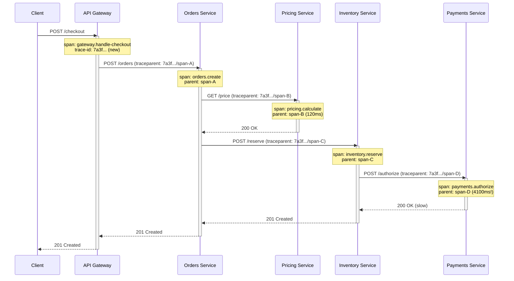

## A support ticket with no seams

"Checkout is slow" comes in as a support ticket, with a timestamp and a user id, nothing else. You open the logs. The request went through an API gateway, an orders service, a pricing service, an inventory service, and a payments service - five processes, five log streams, five Kibana or Log Analytics tabs. Each service logs its own start and end times for its own work, with no shared identifier tying any of it together. You start guessing: the gateway logged the request at 14:02:03.100, orders logged something around 14:02:03.150, pricing logged two entries in that window because it also served an unrelated request from a different user at nearly the same millisecond. You are pattern-matching timestamps by eye, hoping the request you are chasing is the one you think it is, across services owned by three different teams, none of whom logged a correlation id because nobody agreed on one.

Eventually you find it: inventory called payments, payments took 4.1 seconds to respond, and the whole checkout took 4.6 seconds instead of the usual 500ms. It took you forty minutes to learn that one fact, and you got there by squinting at timestamps, not by querying anything. That forty minutes is the actual cost of not having distributed tracing, and it recurs every single time someone asks "why was this one request slow," because "slow" is never the aggregate - it is always one request, one trace, one specific path through the call graph.

This post is about the mechanism that replaces the guessing: OpenTelemetry (a vendor-neutral standard for emitting traces, metrics, and logs, abbreviated **OTel**), wired into ASP.NET Core so the correlation happens automatically, plus the honest tradeoffs - sampling in particular - that show up the moment you run this at production volume instead of on your laptop.

## The model: one trace, many spans, a tree

A **trace** represents one end-to-end request - in this case, one checkout. It is identified by a single trace id, generated once, at the very first hop.

A **span** represents one unit of work within that trace - one HTTP call, one SQL query, one Kafka produce, one in-process function you deemed worth measuring. Every span records a start time, a duration, a set of key-value attributes (`http.status_code`, `db.statement`, `customer.tier`, whatever you attach), and a reference to its parent span. A trace with no internal calls is one span. A trace that fans out across five services with each service doing its own DB call is a dozen or more spans, all sharing the same trace id, related to each other as a **tree** that mirrors the actual call graph - not a flat list, a tree, because "orders called pricing and inventory concurrently, then inventory called payments" is a shape, and the shape is exactly what tells you where the time went.



Every arrow in that diagram carries the same trace id forward, and each hop creates a new child span whose parent is the span that made the call. Query the trace by id afterward and you get exactly this tree back, with real durations attached - `payments.authorize` at 4.1 seconds jumps out immediately, because it is visibly the one span that is 30x longer than everything around it. No timestamp-squinting, no cross-tab guessing. This is the retry-storm failure mode from [the timeouts and retries post](/posts/timeouts-retries-circuit-breakers-dotnet/) made visible: if payments were actually down and inventory were retrying it 3 times with backoff, you would see three consecutive `payments.authorize` child spans under the same `inventory.reserve` parent, each one failing, and the trace duration would make the amplification obvious in a way no aggregate latency graph would - you'd see the shape of the retry, not just a number that went up.

## Propagation: how the trace id crosses a process boundary

The mechanism that makes this work is deliberately unglamorous: a trace id and the calling span's id get serialized into an HTTP header on every outbound call, and the receiving service reads that header before starting its own span. The standard header is `traceparent`, defined by the W3C Trace Context specification, and it looks like this:

```
traceparent: 00-7a3f8e2c1b4d4f6a9e0d5c3b2a1f0e9d-00f067aa0ba902b7-01
```

Four fields, dash-separated: a version (`00`), the 32-character trace id (`7a3f8e2c...`, shared by every span in the entire request), the 16-character id of the span that is making this call (`00f067aa...`), and trace flags (`01` meaning "sampled" - more on that shortly). When orders calls pricing, orders' outgoing HTTP client writes a `traceparent` header whose span id is orders' own span. Pricing's inbound middleware reads that header, learns "I am a child of this span, within this trace," and creates its own child span accordingly. Repeat at every hop and the tree in the diagram above is exactly what falls out - not because anyone hand-wired a correlation id through five codebases, but because one HTTP header format is honored by every service's HTTP client and every service's HTTP server middleware.

This is also why it matters that the propagation is a *standard*, not a homegrown header. `traceparent` is recognized by every OpenTelemetry SDK regardless of language, so a .NET gateway calling a Go pricing service calling a Java payments service still produces one connected trace, because all three SDKs speak the same header format. Roll your own `X-Correlation-Id` and it works fine until someone's client drops it, someone else's forgets to forward it, and you are back to guessing - which is precisely the state most systems are in before adopting this.

## Auto-instrumentation: most of this you do not write by hand

The reason distributed tracing is practical to adopt (rather than a project of manually wrapping every function in a span) is that OpenTelemetry's .NET SDK hooks into ASP.NET Core's request pipeline and `HttpClient`'s message handler pipeline automatically. Register the instrumentation packages, and every inbound request becomes a span, every outbound `HttpClient` call becomes a child span with the `traceparent` header attached for you, and the parent/child relationship is inferred from `Activity` - the .NET runtime's own primitive for exactly this ("a span" and "an `Activity`" are the same concept; OpenTelemetry adopted .NET's pre-existing `System.Diagnostics.Activity` type rather than inventing a new one). Community packages extend the same auto-instrumentation to EF Core and `SqlClient`, so a slow query shows up as a child span with the SQL text attached, without a single line of manual instrumentation in the repository layer.

```csharp
// Program.cs
var builder = WebApplication.CreateBuilder(args);

builder.Services.AddOpenTelemetry()
    .ConfigureResource(resource => resource
        .AddService(serviceName: "inventory-service", serviceVersion: "1.4.2"))
    .WithTracing(tracing => tracing
        .AddAspNetCoreInstrumentation(options =>
        {
            // Skip noisy health-check spans - they add volume with zero signal.
            options.Filter = httpContext =>
                !httpContext.Request.Path.StartsWithSegments("/healthz");
        })
        .AddHttpClientInstrumentation()   // outbound calls: writes traceparent, creates child spans
        .AddSqlClientInstrumentation(options =>
        {
            options.SetDbStatementForText = true; // capture the SQL text as a span attribute
        })
        .AddSource("Inventory.BusinessLogic")     // custom ActivitySource, registered below
        .AddOtlpExporter(otlp =>
        {
            // OTLP: the standard wire protocol OpenTelemetry SDKs use to ship data to a
            // collector - here, an OpenTelemetry Collector sidecar that forwards to your
            // backend (Jaeger, Tempo, Honeycomp, Azure Monitor, whatever you point it at).
            otlp.Endpoint = new Uri(builder.Configuration["Otel:CollectorUrl"]!);
        }));

var app = builder.Build();
```

That block is nearly all the tracing setup most services need. `AddAspNetCoreInstrumentation` turns every inbound request into the root or child span for that hop. `AddHttpClientInstrumentation` makes every outbound call propagate `traceparent` and record its own child span with method, URL, and status code as attributes. `AddSqlClientInstrumentation` (a community package, `OpenTelemetry.Instrumentation.SqlClient`) does the same for ADO.NET and EF Core underneath it, which is how a slow query surfaces as a named, timed span sitting exactly where it happened in the tree - not as a mystery gap.

## Manual spans: the one thing auto-instrumentation cannot know

Auto-instrumentation covers "an HTTP call happened" and "a SQL query ran." It cannot cover "we spent 800ms validating a 40-item cart against three business rules" if that validation is pure in-process C# with no HTTP or DB call inside it - to the auto-instrumented spans, that's invisible time sitting inside a parent span with no explanation. For business-meaningful steps like that, you create a span by hand using `ActivitySource`, .NET's factory type for `Activity` instances:

```csharp
// Defined once, near the top of the class or as a static field - this is the "tracer"
// for this component. The name ("Inventory.BusinessLogic") must match the AddSource(...)
// call in Program.cs, or the SDK will not pick these spans up.
private static readonly ActivitySource ActivitySource = new("Inventory.BusinessLogic");

public async Task<ReservationResult> ReserveStockAsync(CartDto cart, CancellationToken ct)
{
    // StartActivity returns null if nothing is listening (e.g. sampled out), so every
    // call below is null-safe by design - you do not need an "is tracing enabled" check.
    using var activity = ActivitySource.StartActivity("inventory.validate-cart");
    activity?.SetTag("cart.item_count", cart.Items.Count);
    activity?.SetTag("cart.total_value", cart.TotalValue);

    foreach (var rule in _businessRules)
    {
        if (!rule.IsSatisfiedBy(cart))
        {
            // Errors get flagged explicitly - this is what tail-based sampling later
            // keys on to decide "keep this trace no matter what the sample rate says."
            activity?.SetStatus(ActivityStatusCode.Error, rule.FailureReason);
            return ReservationResult.Rejected(rule.FailureReason);
        }
    }

    activity?.SetStatus(ActivityStatusCode.Ok);
    return await ReserveInternalAsync(cart, ct);
}
```

Because this `Activity` is started while an ASP.NET Core-instrumented request is already in flight, it is automatically picked up as a child of the current inbound-request span - no manual trace id plumbing required, `Activity.Current` handles it. The `using` block ends the span (records its duration) when validation finishes, success or failure. This is the pattern to reach for anywhere the interesting cost is CPU-bound business logic rather than an I/O call the SDK already sees.

## Sampling: tracing everything is correct until it is expensive

Trace every request and store every span, and in dev or staging this is exactly right - low volume, and you want full visibility while you are building the thing. At real production volume it usually is not, for a boring but decisive reason: cost. A service doing 5,000 requests/second, each producing say 8 spans across the call graph, is 40,000 spans/second, all needing ingestion, storage, and indexing at the tracing backend. Most of those traces are unremarkable - the checkout that took 480ms instead of 500ms tells you nothing new. Storing all of them anyway is real infrastructure spend for close to zero marginal signal, and it is the reason "just trace 100%" quietly turns into a five-figure monthly bill the first time someone actually tries it at scale.

Two different strategies trade off differently, and conflating them is a common mistake:

**Head-based sampling** decides at the very start of the trace - literally at the first span, before anything downstream has happened - whether this trace will be recorded at all, typically via a probability (1 in 100, expressed as `TraceIdRatioBasedSampler(0.01)`). It is cheap: no service needs to buffer anything, the decision is a coin flip made once and honored by every downstream service via the sampled flag in `traceparent` (that trailing `01` from the header example earlier). The cost is exactly what you'd expect from deciding blind: you might sample out the one request that was going to be the 4-second outlier, because at decision time nobody knew yet that this particular checkout would hit the slow path. You get a representative sample of *typical* traffic, which is good for latency percentiles, and is not guaranteed to contain your worst incidents.

**Tail-based sampling** decides after the full trace is assembled - keep it if it errored, keep it if total duration exceeded some threshold (say 2 seconds), otherwise keep a small random fraction for baseline visibility. This gets you the traces you actually want to look at: the errors, the outliers, the ones that would have taught you something. The cost is architectural, not just financial: every span from every service has to be buffered somewhere until the trace is complete and a decision can be made, which means an OpenTelemetry Collector deployed as a dedicated tier (not just a sidecar) doing that buffering and decision-making, adding its own memory footprint and a delay between "request happened" and "trace decision made." You are trading infrastructure complexity for signal quality, which is a legitimate trade only once you have enough volume that head-based sampling's blind spots are actually costing you incidents you cannot diagnose.

The practical default most teams land on: head-based sampling at a modest rate (1-10%) for baseline traffic, combined with force-keeping any trace that already looks interesting before sampling would even apply - always trace requests carrying an explicit debug flag, always trace anything that trips a circuit breaker per [the resilience patterns post](/posts/timeouts-retries-circuit-breakers-dotnet/), and treat tail-based sampling as the upgrade you reach for once head-based sampling's blind spots start costing you real incident time.

## Closing the loop: traces, logs, and metrics are one picture

Tracing does not replace logs and metrics - the three are usually called the "pillars of observability," and they answer different questions. Metrics tell you *something* is wrong (p99 latency on checkout just doubled). Traces tell you *where*, span by span (payments.authorize, specifically, in the requests that pass through inventory's retry path). Logs tell you *why*, in arbitrary detail a span's fixed attribute set cannot hold (the exact exception, the request body, the validation message). The connective tissue is simple and often skipped: inject the current trace id into your structured log entries (`Activity.Current?.TraceId`, added as a scope or a property on every log line your service emits), so that once a trace surfaces a slow or failed span, you can pivot directly to that service's logs filtered by that exact trace id - no more timestamp-squinting, now for logs instead of spans. This is the same correlation-id instinct that motivates the outbox pattern's processed-message tracking or CDC's LSN-ordered change stream: attach a stable identifier once, and every downstream system that respects it becomes queryable by it later, instead of requiring painful post-hoc reconstruction.

It is also worth being honest about where tracing does not help: it tells you what happened to *one request's* path through your services, which is exactly the wrong tool for "why did throughput drop 20% overall" (a metrics question) or "did we lose any orders during the deploy" (a question about [service boundaries and who owns which data](/posts/microservice-boundaries-data-ownership/), not about individual request latency). Tracing earns its keep specifically on the class of problem this post opened with: one request, several services, an unexplained gap, and no shared identifier to chase it with. Once every hop propagates `traceparent` and every process ships its spans to the same backend, that forty-minute manual correlation exercise becomes a five-second query for a trace id - and the four seconds that used to be invisible becomes the one span that was always the actual answer.
