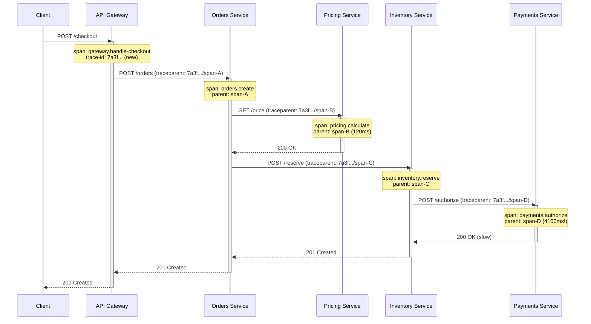

## A support ticket with no seams to hold onto

"Checkout is slow" lands as a support ticket, with nothing but a timestamp and a user ID attached. You open the logs. The request passed through an API gateway, an orders service, a pricing service, an inventory service, and a payments service - five processes, five separate log streams, five browser tabs open at once. Each service logs its own start and end times for its own little piece of the work, and none of them share an identifier that ties any of it together.

So you start guessing. The gateway logged the request at 14:02:03.100. Orders logged something around 14:02:03.150. Pricing logged two entries in that same window, because it happened to be serving an unrelated request from a different user at nearly the same millisecond. You're pattern-matching timestamps by eye, hoping the entry you're looking at really is the request you're chasing, across services owned by three different teams, none of whom agreed on a correlation ID because nobody ever sat down and decided on one.

Eventually you find it. Inventory called payments, payments took 4.1 seconds to respond, and the whole checkout took 4.6 seconds instead of the usual half second. It took forty minutes to learn that one fact, and you got there by squinting at timestamps, not by running a query. That forty minutes is the real cost of not having distributed tracing, and it comes back every single time someone asks why one particular request was slow, because "slow" is never about the aggregate. It's always one request, taking one specific path through the system.

This post is about the mechanism that replaces the guesswork: OpenTelemetry, a vendor-neutral standard for emitting traces, metrics, and logs (usually shortened to OTel), wired into ASP.NET Core so the correlation happens automatically. And the honest tradeoffs, sampling especially, that only show up once you're running this at real production volume instead of on your laptop.

## The model: one trace, many spans, arranged as a tree

A **trace** represents one request from start to finish, in this case one checkout. It's identified by a single trace ID, generated once, at the very first hop.

A **span** represents one unit of work inside that trace: one HTTP call, one SQL query, one message published to Kafka, one in-process function you decided was worth measuring. Every span records a start time, a duration, a set of attributes you attach (an HTTP status code, the SQL text, a customer's account tier, whatever's useful), and a reference to its parent span. A trace with no calls to anything else is just one span. A trace that fans out across five services, each doing its own database call, is a dozen or more spans, all sharing the same trace ID, arranged as a tree that mirrors the actual call graph. Not a flat list, a tree, because "orders called pricing and inventory at the same time, and then inventory called payments" is a shape, and that shape is exactly what tells you where the time actually went.


```mermaid
sequenceDiagram
    participant Client
    participant Gateway as API Gateway
    participant Orders as Orders Service
    participant Pricing as Pricing Service
    participant Inventory as Inventory Service
    participant Payments as Payments Service

    Client->>Gateway: POST /checkout
    activate Gateway
    Note over Gateway: span: gateway.handle-checkout<br/>trace-id: 7a3f... (new)

    Gateway->>Orders: POST /orders (traceparent: 7a3f.../span-A)
    activate Orders
    Note over Orders: span: orders.create<br/>parent: span-A

    Orders->>Pricing: GET /price (traceparent: 7a3f.../span-B)
    activate Pricing
    Note over Pricing: span: pricing.calculate<br/>parent: span-B (120ms)
    Pricing-->>Orders: 200 OK
    deactivate Pricing

    Orders->>Inventory: POST /reserve (traceparent: 7a3f.../span-C)
    activate Inventory
    Note over Inventory: span: inventory.reserve<br/>parent: span-C

    Inventory->>Payments: POST /authorize (traceparent: 7a3f.../span-D)
    activate Payments
    Note over Payments: span: payments.authorize<br/>parent: span-D (4100ms!)
    Payments-->>Inventory: 200 OK (slow)
    deactivate Payments

    Inventory-->>Orders: 201 Created
    deactivate Inventory
    Orders-->>Gateway: 201 Created
    deactivate Orders
    Gateway-->>Client: 201 Created
    deactivate Gateway
```

Every arrow in that diagram carries the same trace ID forward, and each hop creates a new child span whose parent is whichever span made the call. Query for that trace ID afterward and you get exactly this tree back, with real durations attached. `payments.authorize` at 4.1 seconds jumps out immediately, because it's visibly 30 times longer than everything around it. No squinting at timestamps, no guessing across browser tabs. This also makes retry storms visible in a way a dashboard number never quite does: I described the failure mode in [the timeouts and retries post](/posts/timeouts-retries-circuit-breakers-dotnet/), and if payments had actually been down and inventory were retrying it three times with backoff, you'd see three consecutive `payments.authorize` child spans under the same parent, each one failing. The trace shows you the shape of the retry storm, not just a number that went up somewhere.

## How the trace ID actually crosses a process boundary

The mechanism behind all of this is deliberately unglamorous. A trace ID and the calling span's ID get written into an HTTP header on every outbound call, and whoever receives the call reads that header before starting its own span. The standard header, defined by the W3C's own Trace Context specification, is called `traceparent`, and it looks like this:

```
traceparent: 00-7a3f8e2c1b4d4f6a9e0d5c3b2a1f0e9d-00f067aa0ba902b7-01
```

Four dash-separated fields: a version number, a 32-character trace ID shared by every span in the whole request, a 16-character ID for the span that's making this particular call, and a flags field (that trailing `01` means "sampled," which I'll get to shortly). When orders calls pricing, orders' outgoing HTTP client writes a `traceparent` header carrying orders' own span ID. Pricing's inbound middleware reads that header, learns "I'm a child of this span, inside this trace," and creates its own child span to match. Do that at every hop and the tree in the diagram above just falls out on its own, not because anyone hand-wired a correlation ID through five different codebases, but because one HTTP header format gets honored by every service's client and every service's server.

It matters here that this is a real standard and not a homegrown header. `traceparent` is understood by every OpenTelemetry SDK regardless of language, so a .NET gateway calling a Go pricing service calling a Java payments service still produces one connected trace, because all three SDKs speak the exact same header format. Roll your own `X-Correlation-Id` instead, and it works fine right up until one client drops it or someone forgets to forward it, and you're right back to guessing, which is exactly the state most systems are in before they adopt something like this.

## Most of this you never write by hand

The reason distributed tracing is practical to adopt, rather than a slog of manually wrapping every function in a span, is that OpenTelemetry's .NET SDK hooks directly into ASP.NET Core's request pipeline and into `HttpClient`, automatically. Register the instrumentation packages and every inbound request becomes a span on its own, every outbound `HttpClient` call becomes a child span with the `traceparent` header already attached, and the parent-child relationship is inferred for you from `Activity`, which is .NET's own built-in primitive for exactly this concept. ("A span" and "an `Activity`" are the same thing - OpenTelemetry adopted .NET's existing type rather than inventing a new one.) Community packages extend the same automatic instrumentation to EF Core and `SqlClient`, so a slow query shows up as a child span with the actual SQL text attached, with zero manual instrumentation anywhere in your repository layer.

```csharp
// Program.cs
var builder = WebApplication.CreateBuilder(args);

builder.Services.AddOpenTelemetry()
    .ConfigureResource(resource => resource
        .AddService(serviceName: "inventory-service", serviceVersion: "1.4.2"))
    .WithTracing(tracing => tracing
        .AddAspNetCoreInstrumentation(options =>
        {
            // Skip noisy health-check spans - they add volume with zero signal.
            options.Filter = httpContext =>
                !httpContext.Request.Path.StartsWithSegments("/healthz");
        })
        .AddHttpClientInstrumentation()   // outbound calls: writes traceparent, creates child spans
        .AddSqlClientInstrumentation(options =>
        {
            options.SetDbStatementForText = true; // capture the SQL text as a span attribute
        })
        .AddSource("Inventory.BusinessLogic")     // custom ActivitySource, registered below
        .AddOtlpExporter(otlp =>
        {
            // OTLP: the standard wire protocol OpenTelemetry SDKs use to ship data to a
            // collector - here, an OpenTelemetry Collector sidecar that forwards to your
            // backend (Jaeger, Tempo, Honeycomp, Azure Monitor, whatever you point it at).
            otlp.Endpoint = new Uri(builder.Configuration["Otel:CollectorUrl"]!);
        }));

var app = builder.Build();
```

That block is nearly the entire tracing setup most services need. `AddAspNetCoreInstrumentation` turns every inbound request into a span. `AddHttpClientInstrumentation` makes every outbound call propagate `traceparent` and records its own child span with the method, URL, and status code attached. `AddSqlClientInstrumentation`, a community package, does the same underneath ADO.NET and EF Core, which is exactly how a slow query ends up as a named, timed span sitting right where it happened in the tree, instead of a mystery gap you have to guess at.

## The one thing auto-instrumentation can't see for you

Automatic instrumentation covers "an HTTP call happened" and "a SQL query ran." What it can't cover is "we spent 800ms validating a 40-item cart against three business rules," if that validation is pure in-process C# with no HTTP or database call inside it. To the auto-instrumented spans around it, that's just invisible time sitting inside a parent span with no explanation attached. For business-meaningful steps like that, you create a span yourself, using `ActivitySource`, .NET's own factory for `Activity` instances:

```csharp
// Defined once, near the top of the class or as a static field - this is the "tracer"
// for this component. The name ("Inventory.BusinessLogic") must match the AddSource(...)
// call in Program.cs, or the SDK will not pick these spans up.
private static readonly ActivitySource ActivitySource = new("Inventory.BusinessLogic");

public async Task<ReservationResult> ReserveStockAsync(CartDto cart, CancellationToken ct)
{
    // StartActivity returns null if nothing is listening (e.g. sampled out), so every
    // call below is null-safe by design - you do not need an "is tracing enabled" check.
    using var activity = ActivitySource.StartActivity("inventory.validate-cart");
    activity?.SetTag("cart.item_count", cart.Items.Count);
    activity?.SetTag("cart.total_value", cart.TotalValue);

    foreach (var rule in _businessRules)
    {
        if (!rule.IsSatisfiedBy(cart))
        {
            // Errors get flagged explicitly - this is what tail-based sampling later
            // keys on to decide "keep this trace no matter what the sample rate says."
            activity?.SetStatus(ActivityStatusCode.Error, rule.FailureReason);
            return ReservationResult.Rejected(rule.FailureReason);
        }
    }

    activity?.SetStatus(ActivityStatusCode.Ok);
    return await ReserveInternalAsync(cart, ct);
}
```

Because this `Activity` gets started while an ASP.NET Core-instrumented request is already in flight, it's automatically picked up as a child of that request's own span. No manual trace ID plumbing required, `.NET`'s own `Activity.Current` handles it for you. The `using` block ends the span, recording its duration, the moment validation finishes, whether it succeeded or not. This is the pattern to reach for anywhere the interesting cost is CPU-bound business logic rather than an I/O call the SDK can already see on its own.

## Sampling: tracing everything is right up until it isn't

Trace every single request and store every single span, and in dev or staging that's exactly the right call. Volume is low and you want full visibility while you're building the thing. At real production volume, it usually stops being right, for a boring but decisive reason: cost. A service handling 5,000 requests a second, each producing say 8 spans across the call graph, is 40,000 spans a second, all needing to be ingested, stored, and indexed somewhere. Most of those traces are completely unremarkable, and the checkout that took 480ms instead of 500ms tells you nothing new. Storing all of them anyway is real infrastructure spend for close to zero marginal signal, which is exactly how "just trace 100%" quietly turns into a five-figure monthly bill the first time someone tries it at scale.

There are two different strategies here, and it's easy to conflate them.

**Head-based sampling** decides right at the very start of the trace, at the very first span, before anything downstream has even happened, whether this trace gets recorded at all. Usually that's a flat probability, say 1 in 100. It's cheap: no service needs to buffer anything, the decision is one coin flip made once and then honored by every downstream service through that sampled flag in `traceparent`. The cost is exactly what you'd expect from deciding blind: you might sample out the one request that was about to become the 4-second outlier, because at decision time nobody knew yet that this particular checkout would hit the slow path. You get a representative sample of typical traffic, which is genuinely useful for latency percentiles, but it's not guaranteed to contain your worst incidents.

**Tail-based sampling** waits until after the whole trace is assembled to decide. Keep it if it errored, keep it if the total duration crossed some threshold, say 2 seconds, otherwise keep a small random slice for baseline visibility. This gets you the traces you actually want to look at: the errors, the outliers, the ones that would have taught you something. The cost here is architectural, not just financial. Every span from every service has to be buffered somewhere until the whole trace is complete and a decision can be made, which means running an OpenTelemetry Collector as its own dedicated tier rather than a lightweight sidecar, adding its own memory footprint and a delay between "the request happened" and "the trace decision got made." You're trading infrastructure complexity for signal quality, and that's only a good trade once you have enough volume that head-based sampling's blind spots are actually costing you incidents you can't diagnose.

The practical default most teams land on: head-based sampling at a modest rate, somewhere around 1 to 10%, for baseline traffic, combined with force-keeping anything that already looks interesting before sampling even gets a say - always trace requests carrying an explicit debug flag, always trace anything that trips a circuit breaker (see [the resilience patterns post](/posts/timeouts-retries-circuit-breakers-dotnet/)) - and treat tail-based sampling as the upgrade you reach for once head-based sampling's blind spots start costing you real incident time.

## Traces, logs, and metrics are one picture, not three

Tracing doesn't replace logs and metrics. The three are usually called the pillars of observability, and each one answers a different question. Metrics tell you something is wrong, like checkout's p99 latency just doubled. Traces tell you where, span by span, like `payments.authorize` specifically, in the requests that pass through inventory's retry path. Logs tell you why, in whatever level of detail a span's fixed set of attributes can't hold, like the exact exception or the request body or a validation message.

The connective tissue is simple, and it's often skipped: inject the current trace ID into your structured log entries, so once a trace shows you a slow or failed span, you can pivot straight to that service's logs filtered by that exact trace ID. No more timestamp-squinting, now for logs instead of spans. It's the same instinct behind the outbox pattern's processed-message tracking or CDC's ordered change stream: attach one stable identifier early, and every downstream system that respects it becomes queryable by it later, instead of forcing a painful reconstruction after the fact.

It's also worth being honest about where tracing doesn't help. It shows you what happened to one request's path through your services, which makes it exactly the wrong tool for "why did overall throughput drop 20%" (that's a metrics question) or "did we lose any orders during the deploy" (that's a question about [service boundaries and who owns which data](/posts/microservice-boundaries-data-ownership/), not about individual request latency). Tracing earns its keep specifically on the problem this post opened with: one request, several services, an unexplained gap, and nothing to chase it with. Once every hop propagates `traceparent` and every process ships its spans to the same backend, that forty-minute manual correlation exercise turns into a five-second query for a trace ID, and the four seconds that used to be invisible becomes the one span that was the answer all along.
