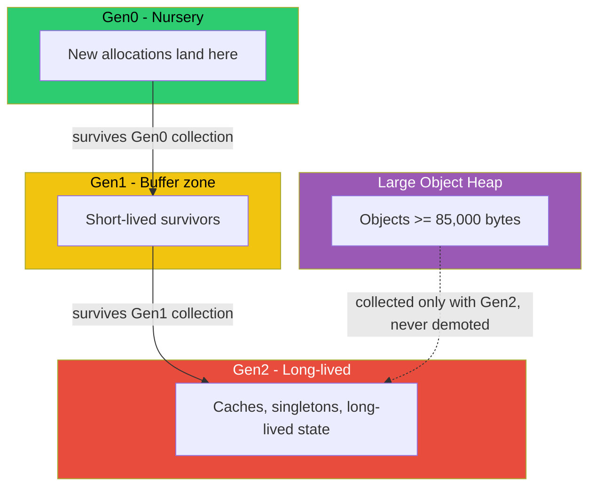

## The symptom: flat memory, spiky p99

A team I worked with had an ASP.NET Core API that looked completely healthy by every dashboard that mattered. Working set memory sat flat around 1.2 GB for hours - no leak, no sawtooth climbing to an OOM kill. CPU averaged 30%. And yet p99 latency had a clean, repeating pattern: quiet for 3-4 seconds, then a spike to 300-400ms on requests that normally finished in 8ms. Not correlated with traffic bursts, not correlated with a specific endpoint. Just periodic, like a heartbeat.

The instinct is to go looking for a lock, a slow downstream call, a connection pool exhaustion. All reasonable guesses, all wrong here. The actual cause was garbage collection - specifically, Gen2 collections triggered by allocation rate, not by any bug. The memory graph was flat precisely *because* the collector was doing its job every few seconds. A flat memory graph doesn't mean the GC is idle; it means the GC is working hard enough to keep the graph flat, and that work isn't free.

This post builds the mental model you need to recognize that pattern on sight, and the concrete code patterns that cause it.

## The generational hypothesis

The .NET GC (part of the CLR - Common Language Runtime, the execution engine that runs .NET bytecode and owns memory management) is generational, built on an empirically-observed pattern: **most objects die young**. A `Deserialize` result, a LINQ intermediate list, a string built for one log line - these are allocated, used for microseconds, and discarded. Long-lived objects (a cache, a singleton service, a connection pool) are comparatively rare.

If that's true, it's wasteful to scan your *entire* heap every time you need to reclaim memory. Instead, the GC segregates objects by age into generations, and collects the young generation far more often than the old one, because that's where the garbage actually accumulates.



New objects (below the LOH threshold) always start in **Gen0**. When Gen0 fills up - it's small, typically a few hundred KB to a few MB depending on cache size and workload - the GC runs a Gen0 collection: it walks the *roots* (static fields, thread stacks, CPU registers - anything currently referencing an object) and traces which Gen0 objects are still reachable. Everything unreachable is garbage; its memory is reclaimed instantly because Gen0 objects are never finalized in place, just walked away from. Everything reachable is **promoted** to Gen1.

This is the key performance property: a Gen0 collection only touches Gen0 objects plus the roots pointing into it. It does not walk Gen1, Gen2, or the LOH. Because most objects die in Gen0 (the generational hypothesis holds), a Gen0 collection usually finds almost nothing to promote and finishes in well under a millisecond. That's why Gen0 collections are cheap enough to happen dozens of times per second under load without anyone noticing.

Gen1 acts as a buffer between short-lived and truly long-lived data. Objects that survive a Gen1 collection get promoted to **Gen2**. Gen2 is the "everything else" generation - caches, DI singletons, static collections, anything referenced for the app's lifetime. A Gen2 collection is a **full** collection: it walks Gen0, Gen1, *and* Gen2 together (younger generations are always included when an older one collects). That's the expensive one, and it's the one that produces the pause your p99 graph is complaining about.

## The Large Object Heap and Pinned Object Heap

Objects at least 85,000 bytes go straight to the **Large Object Heap (LOH)** instead of Gen0 - a large `byte[]` buffer, a big `List<T>` after enough growth, a sizeable string. This threshold exists because copying a 10 MB object every time it survives a generation would be absurdly expensive; the LOH sidesteps that by never doing the young-generation copy dance in the first place.

Two consequences that matter in practice:

1. **LOH objects are only collected during a Gen2 collection.** There's no separate "LOH generation" collection - a big buffer you allocate and drop stays alive, unreclaimed, until the next full GC happens for some other reason. Allocate large buffers frequently and you're indirectly forcing more Gen2 activity.
2. **The LOH is not compacted by default.** Gen0/1/2 collections compact survivors together to keep the heap contiguous and allocation cheap (bump a pointer). The LOH instead uses a free-list allocator, like a regular heap allocator, because moving multi-megabyte objects is expensive. That means the LOH can fragment: free 80,000-byte and 200,000-byte holes scattered between live objects, none big enough for your next 500,000-byte buffer request, so the process pages in more memory even though "enough" free space technically exists. `GCSettings.LargeObjectHeapCompactionMode` can force compaction on the next Gen2 collection, but that's a targeted fix for known fragmentation, not something to set blindly.

The **Pinned Object Heap (POH)**, added in .NET 5, exists for a narrower reason: code that pins memory (e.g., for interop with native code, or `fixed` buffers) used to pin objects wherever they happened to live in Gen0/1/2, which blocked compaction around them and fragmented the *normal* heap. The POH gives pinned objects their own segment so the rest of the heap can compact freely. If you're not doing native interop, you can mostly ignore it - but it's worth recognizing in a memory dump instead of assuming it's a leak.

## Workstation vs Server GC, and background collection

.NET ships two GC flavors, and picking the wrong one for the workload shows up exactly as unexplained pauses:

- **Workstation GC**: one heap, collections can run on the thread that triggered them. Tuned for low resource usage on client apps where you have one primary thread of execution (a desktop app, a CLI tool).
- **Server GC**: one heap *and one dedicated GC thread per logical core*, collections run in parallel across all of them. Tuned for throughput on multi-core server workloads. This is the default for ASP.NET Core (`ServerGarbageCollection` in the `.csproj`, or `runtimeconfig.json`).

Server GC is right for the vast majority of API workloads - more cores collecting in parallel means each Gen2 pause is shorter for a given heap size. But it also means each GC thread reserves its own heap segment, so a Server GC process legitimately holds more memory per core at rest than Workstation GC. If you're running many small containers with tight memory limits and one core each, Server GC's per-core heap allocation can actually work against you; that's a case for evaluating Workstation GC or setting `GCHeapCount` explicitly.

Both modes support **background (concurrent) GC**, on by default. It lets most of a Gen2 collection's marking work happen on a background thread while the application keeps running and even keeps allocating into a small reserve, instead of stopping everything. It doesn't eliminate the pause - the final sweep/compact phase still needs a short stop-the-world window - but it shrinks it substantially. Background GC is why modern Gen2 pauses are usually tens of milliseconds rather than the multi-second full stops from a decade ago. It's also why the pause in the opening example was 300-400ms and not 3-4 seconds: without background GC, it would likely have been worse.

## The code patterns that cause this

Gen0 collections are cheap individually, but their *frequency* is a direct function of allocation rate. Push enough bytes/sec through Gen0 and you promote more survivors into Gen1, which raises the rate Gen1 fills and promotes into Gen2, which raises the rate of full collections. None of these patterns leak - the objects are all correctly collected - but each one manufactures allocation pressure that shows up as exactly the periodic pause pattern from the opening example.

**String concatenation in a loop.** Each `+=` allocates a brand-new string, because `string` is immutable in .NET - the old buffer becomes garbage immediately.

```csharp
// allocates a new string object on every iteration - N allocations for N rows
string report = "";
foreach (var row in rows)
{
    report += $"{row.Id},{row.Name}\n";
}

// one growable buffer, amortized allocation
var sb = new StringBuilder();
foreach (var row in rows)
{
    sb.Append(row.Id).Append(',').Append(row.Name).Append('\n');
}
string report = sb.ToString();
```

**Boxing value types.** Passing an `int` (or any struct) where `object` is expected copies it onto the heap - a small, easy-to-miss allocation that's brutal at scale because it happens silently.

```csharp
// non-generic ArrayList boxes every int as it's stored
ArrayList ids = new ArrayList();
foreach (var row in rows)
{
    ids.Add(row.Id); // int -> object, heap allocation per element
}

// List<int> stores the int inline, no boxing
var ids = new List<int>();
foreach (var row in rows)
{
    ids.Add(row.Id);
}
```

`string.Format`/interpolation with struct arguments has the same trap if you're not on a version that optimizes it - passing a `DateTime` or an `int` into a method expecting `object[]` boxes each one.

**Closures and LINQ in hot paths.** A lambda that captures a local variable forces the compiler to allocate a closure object to hold that variable, and most LINQ operators (`Where`, `Select`) allocate an enumerator plus, for anything that isn't lazily consumed immediately, an intermediate list.

```csharp
// closure allocation for `threshold`, plus a Where iterator, on every call
public List<Order> GetLargeOrders(List<Order> orders, decimal threshold)
{
    return orders.Where(o => o.Total > threshold).ToList();
}

// manual loop, no closure, no iterator allocation
public List<Order> GetLargeOrders(List<Order> orders, decimal threshold)
{
    var result = new List<Order>(orders.Count / 4); // rough capacity guess
    foreach (var o in orders)
    {
        if (o.Total > threshold) result.Add(o);
    }
    return result;
}
```

This isn't "never use LINQ" - for most code, LINQ's readability wins and the allocations are noise. It matters specifically in hot paths: something called per-request or per-row in a loop processing millions of rows, where [processing 100 million rows a night](/posts/processing-100-million-rows-a-night/) compounds a few extra bytes per row into gigabytes of Gen0 churn over the run.

**A new `HttpClient` per request.** This one is notorious enough to deserve its own line: `HttpClient` holds onto underlying socket handler state, and constructing one per request both allocates a nontrivial object graph *and* risks socket exhaustion under load, independent of the GC angle. Always inject a shared instance (`IHttpClientFactory` in ASP.NET Core) instead of `new HttpClient()` inside a handler.

## Diagnosing it

Don't guess - measure. `dotnet-counters` (a .NET global tool) attaches to a running process and streams live GC stats without a redeploy:

```bash
dotnet-counters monitor -p <pid> --counters System.Runtime
```

Watch `gen-0-gc-count`, `gen-1-gc-count`, `gen-2-gc-count`, and `gc-heap-size`. If Gen0 count is climbing several times a second and Gen2 count ticks up every few seconds under moderate load, that's your allocation-pressure signature - not a leak, not a downstream dependency. `alloc-rate` (bytes/sec) is the single most useful number here: correlate its spikes against your p99 spikes and you'll usually find they line up almost exactly.

For a deeper look at *what* is allocating, `dotnet-trace` captures a timed profiling session you can open in PerfView or Visual Studio's profiler to see allocation call stacks by type and size. For a point-in-time snapshot of what's actually sitting on the heap (and by what generation), `dotnet-gcdump collect -p <pid>` produces a `.gcdump` you can inspect for the "top types by retained size" - useful for confirming a suspected `List<T>` or boxed-value hotspot rather than assuming it.

## Fixes that actually target the right thing

Once you've confirmed it's Gen0/Gen2 frequency, not a leak, the fixes are about reducing allocation rate, not reducing steady-state memory:

- **Pool and reuse buffers** with `ArrayPool<T>` instead of allocating fresh arrays per request:

```csharp
var buffer = ArrayPool<byte>.Shared.Rent(4096);
try
{
    // use buffer
}
finally
{
    ArrayPool<byte>.Shared.Return(buffer);
}
```

For general object pooling beyond raw arrays (e.g., reusable `StringBuilder`s or parser instances), `Microsoft.Extensions.ObjectPool`'s `ObjectPool<T>` gives you the same rent/return pattern.

- **`Span<T>`/`Memory<T>` to slice without allocating.** `someString.Substring(0, 10)` allocates a new string; `someString.AsSpan(0, 10)` is a view over the existing memory with zero allocation. This matters most in parsing code that used to slice strings repeatedly.
- **Avoid unnecessary boxing** by preferring generic collections (`List<T>`, `Dictionary<TKey,TValue>`) over their non-generic ancestors, and being deliberate about anywhere a value type crosses an `object`-typed boundary.
- **Reuse the closure-heavy LINQ pattern only outside hot paths**, and hand-roll loops where profiling actually shows it matters - don't pre-optimize code that runs once per request against a 3-row list.

"Just add more RAM" is the fix people reach for because it's a config change, not a code change - and it's the wrong tool here. More RAM lets Gen0/Gen1/Gen2 grow larger before they trigger, which can *reduce collection frequency*, but it doesn't reduce the amount of garbage your code produces per request, and a larger Gen2 heap makes each full collection's mark-and-sweep pass scan more objects, potentially making individual Gen2 pauses *longer* even as they become rarer. If your allocation rate is the problem, you're trading pause frequency for pause size - not eliminating the pause. The only real fix is allocating less.

## Where this leaves you

A GC-caused latency spike is one of the few production symptoms that looks like a mystery until you know to look for it, and looks completely obvious once you do: flat memory, periodic pauses, no correlation with any single slow dependency. The mental model that gets you there is simple - Gen0 is a cheap nursery scanned constantly, Gen2 is an expensive full sweep triggered by promotion pressure, and the LOH silently taxes anything over 85,000 bytes with no compaction by default. Every allocation-heavy pattern in this post (string concatenation, boxing, closures, per-request `HttpClient`s) is a way of feeding that pipeline faster than necessary, and every fix is the same idea from a different angle: give the collector less work per request, rather than trying to outrun it with more memory. The same discipline that keeps [async code from deadlocking under load](/posts/async-await-pitfalls-in-csharp/) applies here too - it's not about writing exotic code, it's about recognizing the handful of ordinary-looking patterns that quietly compound.
