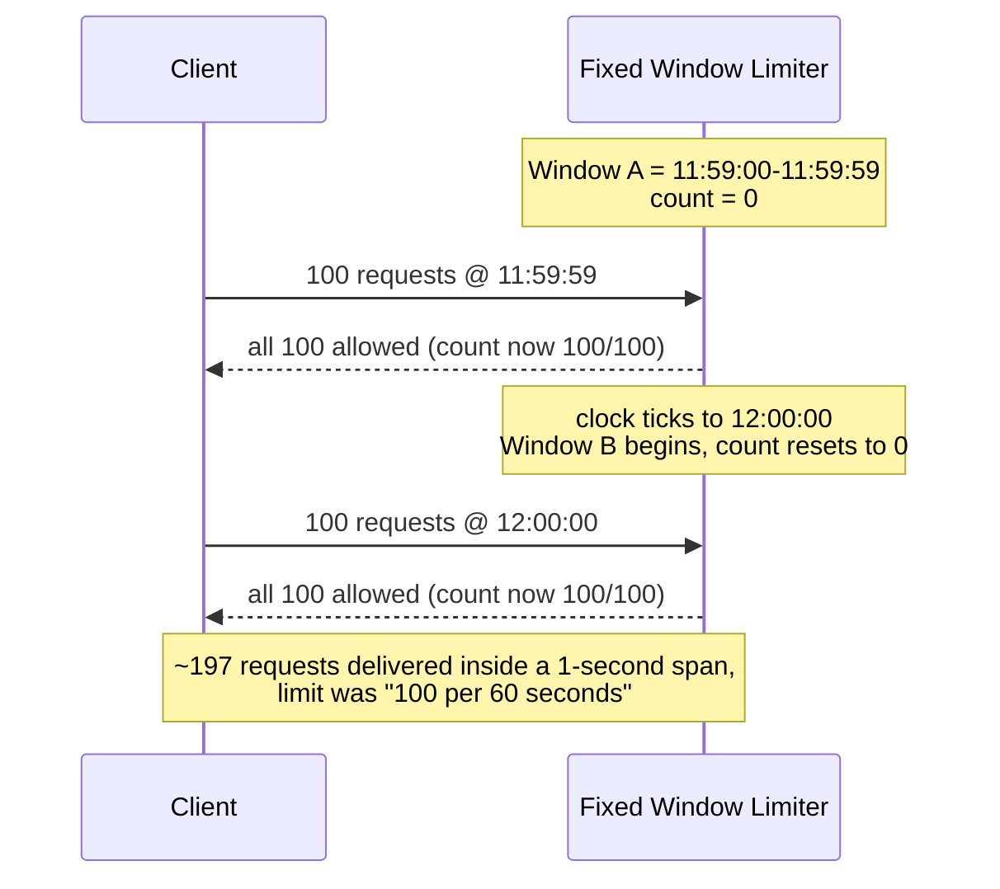
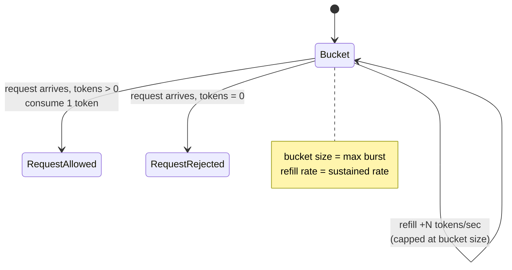

## The limiter that passed every load test and still let the burst through

A service sets a limit of 100 requests/minute per API key, tests it with a script that fires 100 requests and confirms the 101st gets a 429, ships it, and moves on. Weeks later a client's retry loop manages to push 197 requests through in under a second, against a limit that is supposed to cap them at 100 *per minute*. Nothing in the code is broken. The counter incremented correctly, the reset happened on schedule, every individual decision was right. The algorithm itself has a hole, and it is shaped exactly like a clock.

This is the **fixed window counter**, and it is where almost every rate limiter starts because it is trivial to reason about: pick a window size (say 60 seconds), keep a count, reset the count when the window rolls over.

```csharp
// Naive fixed window: one counter per key, reset when the window changes.
public class FixedWindowLimiter
{
    private readonly ConcurrentDictionary<string, (int Count, long WindowStart)> _windows = new();
    private const int Limit = 100;
    private const long WindowSeconds = 60;

    public bool TryAcquire(string key)
    {
        var now = DateTimeOffset.UtcNow.ToUnixTimeSeconds();
        var currentWindow = now - (now % WindowSeconds); // e.g. 12:00:00, 12:01:00, ...

        var entry = _windows.AddOrUpdate(key,
            _ => (1, currentWindow),
            (_, existing) => existing.WindowStart == currentWindow
                ? (existing.Count + 1, existing.WindowStart)
                : (1, currentWindow)); // new window, count resets to 1

        return entry.Count <= Limit;
    }
}
```

Walk the clock past a window boundary and the flaw is obvious. A client sends 100 requests at 11:59:59 - all land in the `11:59:00-11:59:59` window, all allowed, counter hits exactly 100. One second later, at 12:00:00, the window rolls over to `12:00:00-12:00:59` and the counter resets to zero. The same client sends 100 more requests at 12:00:00 - also allowed, because as far as this counter is concerned it is a brand new minute with a clean slate. The result: **197-ish requests in roughly a one-second span**, against a limit whose entire point was "no more than 100 requests in any 60-second span." The counter never lied about anything it measured. It measured the wrong thing - calendar-aligned buckets instead of a rolling window relative to *now*.



That is not a rare edge case a fuzzer found. It is the *default behavior* every time traffic happens to bunch up near a minute boundary, which for anything bursty (retry storms, cron-triggered clients, a mobile app waking up on a timer) is often. The fix space is three algorithms, each trading off memory, precision, and how bursty they let you be, plus a fourth problem - making any of them correct once you have more than one app instance - that catches people who solved the algorithm and forgot the infrastructure.

## Sliding window log: exact, and it remembers everything

The precise fix is to stop aligning windows to the clock at all. A **sliding window log** stores the timestamp of every request and, on each new request, counts how many stored timestamps fall within the last 60 seconds of *now* - not the last 60 seconds of some fixed minute boundary. Slide the window back one second and the boundary artifact disappears, because there is no boundary; every point in time has its own trailing window.

Redis gives you this natively with a sorted set: score each entry by its timestamp, trim anything older than the window on every call, and the set's cardinality *is* the count.

```lua
-- KEYS[1] = rate limit key, ARGV[1] = now (ms), ARGV[2] = window (ms), ARGV[3] = limit
redis.call("ZREMRANGEBYSCORE", KEYS[1], 0, ARGV[1] - ARGV[2])
local count = redis.call("ZCARD", KEYS[1])
if count < tonumber(ARGV[3]) then
    redis.call("ZADD", KEYS[1], ARGV[1], ARGV[1])
    redis.call("PEXPIRE", KEYS[1], ARGV[2])
    return 1 -- allowed
else
    return 0 -- rejected, do not record it
end
```

This is exactly correct - no boundary case, no approximation. The cost is that "store every timestamp" is a literal instruction, not a figure of speech. Rate-limit 500,000 active users at 100 requests/minute each, and in the worst case (everyone at their limit simultaneously) you are holding 50 million sorted-set entries. A Redis sorted set entry runs somewhere around 80-100 bytes once you account for the skip-list pointers and the member string itself - conservatively that is **4-5 GB of memory spent purely on rate-limit bookkeeping**, for state that exists only to answer "how many, recently." That is a real operational cost, not a rounding error, and it is why the sliding window log is the algorithm you reach for when correctness at the boundary genuinely matters (billing-adjacent limits, abuse detection) and reach past otherwise.

## Sliding window counter: the practical compromise

Most APIs do not need exact-to-the-millisecond accuracy; they need the boundary bug gone without the memory bill. The **sliding window counter** gets there by keeping the fixed window's two cheap integers (current count, previous count) and blending them with a weight based on how far into the current window you are:

```
weighted_count = current_window_count + previous_window_count * (1 - elapsed_fraction_of_current_window)
```

Worked example: limit is 100/minute. The previous window (11:59:00-11:59:59) ended with 90 requests. It is now 12:00:15 - fifteen seconds, or 25%, into the current window - so 75% of the previous window's weight still counts against you. Current window so far has 20 requests.

```
weighted_count = 20 + 90 * (1 - 0.25) = 20 + 67.5 = 87.5
```

87.5 is under 100, so the request is allowed - and correctly so, because a client that front-loaded 90 requests in the last quarter-second of the previous window and 20 more just after the boundary really did send something close to 110 requests in a 15-second span, and the weighting reflects that instead of pretending the previous window never happened. It is an approximation (it assumes requests were spread evenly through the previous window, which is not always true), but the error is bounded and small in practice, and the state per key is two integers plus a timestamp instead of a growing list. This is the compromise most production rate limiters (including the sliding-window mode in Cloudflare's and Amazon API Gateway's limiters) actually ship, because "close enough, cheap, no boundary cliff" beats "exact, expensive" for the overwhelming majority of endpoints.

## Token bucket: bursts are allowed, on purpose

Everything so far assumes bursts are the enemy. Sometimes they are not - a client that behaves for 55 seconds and sends 10 requests in the 56th should not be penalized the same as one that hammers continuously, and plenty of legitimate traffic (a user opening a dashboard that fires eight parallel widget calls) is burst-shaped by nature. The **token bucket** algorithm is built for that: a bucket holds up to `N` tokens, one token is consumed per request, and tokens refill continuously at a fixed rate up to the bucket's capacity. If the bucket is empty, the request is rejected (or queued). Because the bucket can hold up to `N` tokens, a client that has been idle can spend all of them at once - a controlled, bounded burst - and then is throttled back to the steady refill rate.



This is the algorithm behind most cloud API limits (AWS, Stripe, GitHub) precisely because "sustained rate with an allowance for bursts" matches how real clients behave. .NET 8 ships it as a first-class primitive in `System.Threading.RateLimiting`, and ASP.NET Core wires it straight into the middleware pipeline:

```csharp
builder.Services.AddRateLimiter(options =>
{
    options.RejectionStatusCode = StatusCodes.Status429TooManyRequests;

    options.OnRejected = async (context, token) =>
    {
        // The client-side mirror of this is honoring Retry-After - see
        // /posts/timeouts-retries-circuit-breakers-dotnet/
        context.HttpContext.Response.Headers.RetryAfter = "1";
        await context.HttpContext.Response.WriteAsync(
            "Rate limit exceeded. Retry after 1 second.", token);
    };

    options.AddPolicy("per-api-key", httpContext =>
    {
        var apiKey = httpContext.Request.Headers["X-Api-Key"].ToString();

        return RateLimitPartition.GetTokenBucketLimiter(apiKey, _ => new TokenBucketRateLimiterOptions
        {
            TokenLimit = 100,                                // bucket size: max burst
            TokensPerPeriod = 50,                            // refill amount
            ReplenishmentPeriod = TimeSpan.FromSeconds(1),   // ...every second: 50/sec sustained
            QueueLimit = 0,                                  // reject immediately, do not queue
            QueueProcessingOrder = QueueProcessingOrder.OldestFirst,
            AutoReplenishment = true
        });
    });
});

var app = builder.Build();

app.UseAuthentication();
app.UseAuthorization();
app.UseRateLimiter(); // after auth, so the partition key can be the caller's identity, not raw IP

app.MapGet("/api/prices", GetPrices).RequireRateLimiting("per-api-key");
```

The ordering matters the same way it did for [timeout, retry, and circuit breaker layering](/posts/timeouts-retries-circuit-breakers-dotnet/): put `UseRateLimiter()` after `UseAuthentication()` (see [authentication in ASP.NET Core](/posts/authentication-aspnet-core/) for how that pipeline is built) so the partition key is the authenticated caller, not their IP - otherwise everyone behind the same corporate NAT or mobile carrier shares one bucket, and one noisy client throttles the rest.

## Leaky bucket: when the downstream cannot take a burst at all

Token bucket answers "how much can I let through, on average, while tolerating spikes." Sometimes that is the wrong question, because the thing behind the limiter cannot tolerate spikes at all - a legacy system with a fixed connection pool, a third-party API with its own strict per-second cap, a write path into a database that starts blocking on lock contention past a certain concurrent-write threshold. For that, you want the **leaky bucket**: requests arrive into a queue (the bucket) at whatever rate they want, but they *leave* the queue - get forwarded to the downstream - at a constant, fixed rate, no matter how bursty the arrivals were. If the queue fills up faster than it drains, new arrivals are rejected (the bucket overflows).

The mental model that keeps these two straight: token bucket controls how much you *let in*, and lets it in as a burst if capacity allows. Leaky bucket controls how fast you *let out*, and flattens every burst into a constant trickle regardless of how it arrived. Token bucket is the shape of most public APIs, because the caller mostly just wants throughput and occasional bursts are fine for the server to absorb. Leaky bucket is the shape you want in front of something that will fall over if it receives 50 requests in the same millisecond, even if the sustained average is well within its capacity - a real example is queuing writes into a downstream that batches at a fixed cadence, where the useful property is not "average rate is fine" but "instantaneous rate is *always* fine."

```csharp
// Leaky bucket via a bounded channel drained at a fixed cadence.
var queue = Channel.CreateBounded<Func<Task>>(new BoundedChannelOptions(capacity: 500)
{
    FullMode = BoundedChannelFullMode.DropWrite // bucket overflow: reject, do not queue further
});

// Drain at a constant rate - this is the "leak."
_ = Task.Run(async () =>
{
    var interval = TimeSpan.FromMilliseconds(20); // 50 operations/sec, constant, regardless of arrivals
    await foreach (var work in queue.Reader.ReadAllAsync())
    {
        await work();
        await Task.Delay(interval);
    }
});
```

## The race condition hiding in "check then increment"

Every algorithm above assumes the read-count-then-write-count sequence is atomic. It usually is not, because production rate limiters run behind a load balancer across several app instances, all sharing one Redis instance for state. The obvious-looking implementation is a race:

```csharp
// BROKEN under concurrency: two instances can both read count=99 and both allow request 100 and 101.
var count = (int)await db.StringGetAsync(key);
if (count >= limit) return RateLimitResult.Rejected;
await db.StringIncrementAsync(key); // separate round-trip, separate opportunity to interleave
return RateLimitResult.Allowed;
```

Two instances handling concurrent requests both read `count = 99` before either has written back. Both conclude "99 < 100, allow it," both increment, and the limit of 100 just let through 101 - and under real load, with tens of instances and thousands of requests per second, the overshoot is not one request, it is however many concurrent readers land in the same gap. The fix is the same one that shows up anywhere shared mutable state meets concurrent writers: collapse read-check-write into a single atomic operation. Redis's `EVAL` runs a Lua script atomically relative to every other command the server processes, which makes it the natural place to put "increment, and tell me if the pre-increment value already reset the TTL":

```lua
-- KEYS[1] = rate limit key, ARGV[1] = limit, ARGV[2] = window (seconds)
-- INCR + conditional EXPIRE run as one atomic unit - no other client's
-- commands can interleave between them.
local current = redis.call("INCR", KEYS[1])
if current == 1 then
    redis.call("EXPIRE", KEYS[1], ARGV[2])
end
if current > tonumber(ARGV[1]) then
    return 0
end
return 1
```

```csharp
private static readonly LuaScript RateLimitScript = LuaScript.Prepare(
    """
    local current = redis.call('INCR', @key)
    if current == 1 then
        redis.call('EXPIRE', @key, @window)
    end
    if current > tonumber(@limit) then
        return 0
    end
    return 1
    """);

public async Task<bool> TryAcquireAsync(string apiKey, int limit = 100, int windowSeconds = 60)
{
    var db = _redis.GetDatabase();
    var result = await db.ScriptEvaluateAsync(RateLimitScript, new
    {
        key = (RedisKey)$"ratelimit:{apiKey}",
        limit,
        window = windowSeconds
    });
    return (int)result == 1;
}
```

The same reasoning applies to the sliding window log's `ZREMRANGEBYSCORE` + `ZCARD` + `ZADD` sequence shown earlier - wrapped in one Lua script, Redis executes it as a single indivisible step, which is why that snippet did not need a separate locking mechanism. This is also the general lesson underneath [distributed CDC and outbox patterns](/posts/microservice-boundaries-data-ownership/): once state is shared across independent processes, "correct when run alone" and "correct under concurrency" are different claims, and only one of them matters in production.

## Choosing one, honestly

Fixed window is fine only where the boundary overshoot is genuinely tolerable - internal tooling, generous limits with a lot of headroom - because it is the simplest thing to build and reason about. Sliding window log is for when the limit is load-bearing enough that a 2x overshoot is a real problem (billing, abuse, security-relevant throttles) and you can afford the memory. Sliding window counter is the default for everything in between: public APIs, per-user throttles, anything where "correct to within a few percent" is correct enough and O(1) state per key matters at scale. Token bucket is what you want when bursts are a feature, not a bug, and it is why it dominates public API design. Leaky bucket is narrower and more specific: reach for it when the thing on the other side of the limiter has a hard ceiling on instantaneous load, not just average load.

None of that matters if the counter itself is racy. A perfectly chosen algorithm with a check-then-increment implementation still lets bursts through - just a different, less predictable burst than the one the algorithm was designed to prevent. Get the atomicity right first; it is the foundation every algorithm above is quietly assuming.
