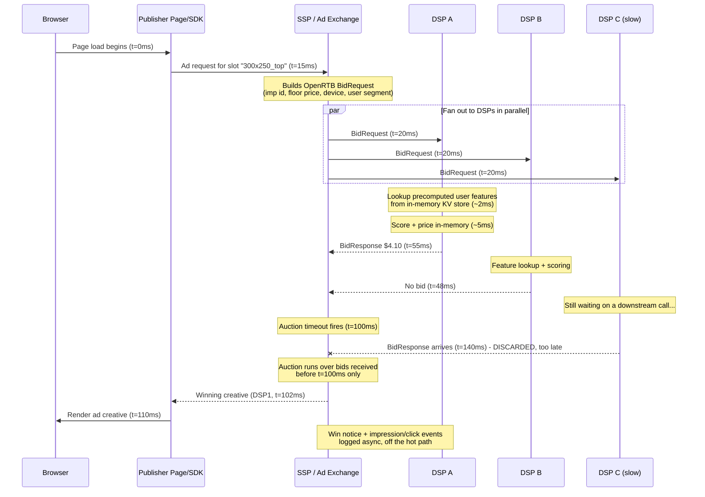

## The budget is 80 milliseconds and nobody gets a retry

Open a news article. Before the hero image finishes decoding, somewhere between two and a dozen companies have been asked "do you want to show this specific person an ad, and if so, how much will you pay," each has done a full round trip of network plus a pricing decision, someone has run an auction among the answers, and a winning creative (the actual ad image/video/HTML asset that renders) has started downloading into the page. All of it happens in the gap between your click and the page feeling "loaded" - typically under 100 milliseconds for the bidding leg alone, nested inside a page load you already perceive as instant or sluggish.

This is real-time bidding (RTB), and it is one of the more extreme distributed-systems problems most engineers never encounter, because it lives in an industry (ad-tech) that gets dismissed as "just tracking pixels." It isn't. It's a fan-out to N unreliable services, a synchronous auction with a hard deadline, and a firehose of billing-grade logging - all under a latency budget tighter than most people's database query timeout. The [timeouts and circuit breakers post](/posts/timeouts-retries-circuit-breakers-dotnet/) argued that every remote call needs a budget and that retries must live inside it. RTB is what happens when you take that argument to its logical extreme: the budget is so tight that retries are not a tuning knob, they are not available at all. A late answer isn't a slow answer. It's not an answer.

## The cast of characters

Programmatic advertising has a supply side and a demand side, and RTB is the auction connecting them:

- **Publisher**: the website or app showing the ad (the news site, the game, the weather app).
- **SSP (Supply-Side Platform)**: represents publishers. It takes the publisher's available ad slot ("impression opportunity") and finds the highest-paying buyer for it, usually by running an auction.
- **DSP (Demand-Side Platform)**: represents advertisers. It receives impression opportunities from many SSPs, decides per-opportunity whether this specific ad slot, in front of this specific user, is worth bidding on, and if so, at what price.
- **Ad exchange**: sometimes a distinct entity, sometimes folded into the SSP - the marketplace that actually clears the auction among competing bids.

The protocol that lets an SSP ask a DSP "do you want this impression" without both companies hand-building an integration is **OpenRTB (Open Real-Time Bidding)**: a JSON schema for bid requests and bid responses, sent over HTTP(S), standardized by the IAB (Interactive Advertising Bureau) Tech Lab. Every DSP implements the same request/response shape, which is the only reason an SSP can fan a single impression out to fifty different companies and get back comparable answers.

## The sequence, with real numbers

Here is the flow for one ad slot on one page load, with timings representative of a mobile web display auction. The exact numbers vary by vendor and region, but the shape and the order of magnitude do not.



The part worth staring at: **DSP C's bid was not wrong, it was just late**, and late is indistinguishable from absent. There is no retry lane in an auction. If DSP C's bid had come back at t=99ms it would have competed; at t=140ms the auction has already closed, the creative is already rendering, and the bid is simply thrown away. This is the one place in distributed systems where "retry" isn't even a wrong answer, it's a category error, because the caller (the SSP) has already moved on to a decision that cannot be unmade for that impression. The [resilience post's](/posts/timeouts-retries-circuit-breakers-dotnet/) whole argument - "timeouts bound the damage, retries live inside the budget" - simplifies here to just the first half. There is no second half.

## The OpenRTB wire format, trimmed but real-shaped

A bid request from the SSP to a DSP looks roughly like this (fields trimmed for space; real requests carry more, especially around brand-safety and consent signals):

```json
{
  "id": "8f3e2b9c-req",
  "imp": [
    {
      "id": "1",
      "banner": { "w": 300, "h": 250 },
      "bidfloor": 1.50,
      "bidfloorcur": "USD"
    }
  ],
  "site": {
    "domain": "example-news.com",
    "cat": ["IAB12"]
  },
  "device": {
    "ua": "Mozilla/5.0 (iPhone...)",
    "ip": "203.0.113.0",
    "geo": { "country": "USA", "region": "NY" },
    "devicetype": 4
  },
  "user": {
    "id": "seg-a1b2c3",
    "buyeruid": "dsp-cookie-xyz"
  },
  "at": 1,
  "tmax": 100
}
```

A few fields carry real design weight:

- **`bidfloor`**: the minimum price the publisher will accept. Bid below it and you don't compete, full stop.
- **`tmax`**: the SSP telling every DSP, in the request itself, exactly how many milliseconds they have. This is the deadline propagation the resilience post argues for, made explicit and mandatory at the protocol level rather than left to convention.
- **`user.id` / `device.ip`**: notice this is *not* "here is everything we know about this person." Post-GDPR/CCPA-era RTB carries pseudonymous identifiers and coarse geo, not raw PII, and increasingly less identifying data by the year as third-party cookies erode. The DSP has to do useful targeting with less signal per request every year, which is part of why precomputation (below) matters more, not less.
- **`at`**: auction type. `1` means first-price, `2` means second-price - explained next.

A bid response back from the DSP:

```json
{
  "id": "8f3e2b9c-req",
  "seatbid": [
    {
      "bid": [
        {
          "id": "bid-001",
          "impid": "1",
          "price": 4.10,
          "crid": "creative-9981",
          "adm": "<VAST or HTML snippet or creative URL>"
        }
      ]
    }
  ]
}
```

`price` and `crid` (creative id, referencing an asset already served to the SSP's CDN ahead of time so it doesn't need to travel in this response) are the two fields the auction actually cares about. Everything upstream of generating this JSON - deciding whether to bid, and at what price - has to happen inside `tmax` milliseconds, minus the network time already spent getting the request there and the response back.

## Why 100ms rules out almost everything you'd normally reach for

Split a 100ms `tmax` realistically: 15-25ms is gone to network round trip before the DSP's code even runs (more on cellular, less on wired). That leaves the DSP something like 50-80ms of actual compute, and typically the DSP sets its *own* internal deadline tighter still - say 60ms - to leave slack for its own response to travel back and for the SSP's auction-clearing logic to run before the exchange's outer deadline fires. Inside that 60ms, a DSP has to:

1. Parse the bid request.
2. Decide whether this impression matches any active campaign (targeting: geography, device, site category, frequency caps).
3. Score the user against every eligible campaign (how likely is this person to click, convert, or otherwise be worth money to this specific advertiser).
4. Turn that score into a price.
5. Serialize and return a bid response.

Step 3 is the one that breaks naive designs. Scoring "how valuable is this user" sounds like it wants a database lookup - pull the user's recent browsing history, purchase signals, whatever the audience model needs. **A synchronous call to any database at bid time is a design that will lose the auction on its own latency**, not to competitors' better prices. A single SQL round trip inside a shared connection pool can easily cost 5-15ms on a good day and blow past the entire remaining budget on a bad one (lock contention, a GC pause, a noisy neighbor). At RTB volumes - tens of thousands of requests per second per DSP is unremarkable - "occasionally slow" isn't a tail latency footnote, it's a guaranteed and constant stream of forfeited auctions.

The fix is the same move distributed systems make everywhere the timeout is nonnegotiable: **move the expensive work off the hot path, entirely, ahead of time.** DSPs run offline pipelines (batch or streaming, often reading the same [Kafka topics](/posts/kafka-for-engineers-who-know-databases/) that later carry billing events) that continuously recompute user/audience features - propensity scores, segment membership, frequency-cap counters - and write them into a low-latency key-value store: Redis, Aerospike, or an equivalent in-memory/SSD-backed store built specifically for single-digit-millisecond point lookups. At bid time, step 3 becomes one keyed GET against that store, not a query against a system of record. That lookup is sharded the same way [partitioning strategies](/posts/partitioning-strategies-that-follow-you-everywhere/) describes for any high-QPS keyed store - hash on user id, keep hot keys (heavily-retargeted users, viral content) from concentrating on one shard, and treat resharding as the expensive, planned event it always is.

Scoring itself (step 3's "how likely is this person to convert") is a model inference call, and it has to run **in-memory, in-process**, not as a call to a separate model-serving endpoint - a network hop for inference is the same mistake as a network hop for a database read, just wearing a different hat. Models get trained offline (often on exactly the outcome data the async logging pipeline below produces) and pushed to bidder hosts as compact serialized artifacts - a scored gradient-boosted tree ensemble or a small embedding lookup, not something that needs a GPU cluster - reloaded periodically without a deploy.

## A DSP bid handler, budgeted like it means it

This is the shape of a real bid handler: a hard deadline enforced with a `CancellationToken`, a synchronous in-memory lookup instead of any I/O that could stall, and an explicit "no bid" path that is not an error, just an outcome.

```csharp
public sealed class BidHandler
{
    // Tight budget: SSP gave us tmax=100ms, we reserve slack for
    // response serialization and the return trip.
    private static readonly TimeSpan BidBudget = TimeSpan.FromMilliseconds(60);

    private readonly IFeatureStore _featureStore; // in-memory / low-latency KV, no network round trip to a DB
    private readonly IPricingModel _pricingModel; // loaded in-process, no RPC

    public BidHandler(IFeatureStore featureStore, IPricingModel pricingModel)
    {
        _featureStore = featureStore;
        _pricingModel = pricingModel;
    }

    public BidResponse? TryBid(BidRequest request)
    {
        using var cts = new CancellationTokenSource(BidBudget);

        try
        {
            return Bid(request, cts.Token);
        }
        catch (OperationCanceledException)
        {
            // We ran out of our own internal budget. Do not bid late -
            // a bid that misses the window is worse than no bid, it just
            // wastes the exchange's time parsing a response nobody scores.
            return null;
        }
    }

    private BidResponse? Bid(BidRequest request, CancellationToken ct)
    {
        var imp = request.Imp.FirstOrDefault();
        if (imp is null) return null;

        // Synchronous, precomputed - no query, no RPC. This is a keyed
        // lookup against data written by an offline pipeline minutes
        // or hours earlier, not computed now.
        ct.ThrowIfCancellationRequested();
        var features = _featureStore.GetUserFeatures(request.User.Id);
        if (features is null) return null; // unknown user - typically the "no bid" default

        var campaign = SelectEligibleCampaign(imp, request.Site, features);
        if (campaign is null) return null; // nothing worth bidding on

        ct.ThrowIfCancellationRequested();
        var score = _pricingModel.Score(campaign, imp, features); // in-memory inference, no I/O

        var price = PriceFromScore(score, imp.BidFloor, request.AuctionType);
        if (price < imp.BidFloor) return null; // would lose or violate the floor, don't bother

        return new BidResponse
        {
            Id = request.Id,
            Bid = new[]
            {
                new Bid { ImpId = imp.Id, Price = price, CreativeId = campaign.CreativeId }
            }
        };
    }

    private static decimal PriceFromScore(double score, decimal floor, AuctionType auctionType)
    {
        var rawValue = (decimal)score * 10.0m; // model output scaled to a $ value estimate

        // First-price auctions charge exactly what you bid, so bidding your
        // full valuation overpays whenever the next-highest bid was lower.
        // Shade the bid down from the estimated value; second-price auctions
        // don't need this because the winner pays the second-highest bid,
        // not their own, so bidding true value is already optimal there.
        var shaded = auctionType == AuctionType.FirstPrice
            ? rawValue * 0.85m
            : rawValue;

        return Math.Max(shaded, floor);
    }
}
```

Two things about this code are the whole point, not incidental style choices. First, `TryBid` catching `OperationCanceledException` and returning `null` is not error handling bolted on afterward, it's the primary success path for "we ran out of time" - failing to bid is a completely ordinary outcome, not an exception to log and alert on. Second, there is no retry anywhere in this method, and there structurally cannot be one: retrying the feature lookup or the scoring call would just spend budget the auction has already decided isn't coming back.

## First-price vs second-price, and why bid shading exists

For most of RTB's history, the dominant model was the **second-price auction**: the highest bidder wins, but pays only the *second*-highest bid price (plus a cent). That has a clean game-theoretic property - your optimal strategy is to bid your true valuation, because bidding higher only risks overpaying and bidding lower only risks losing a profitable win, so there's no incentive to shade your bid down. Vickrey auctions (the general theory this is built on) are specifically designed to make honest bidding the dominant strategy.

Around 2019, the industry broadly shifted to **first-price auctions**: the winner pays exactly what they bid. This happened largely because header bidding (publishers running simultaneous auctions across multiple exchanges before the page even finishes assembling, a mechanic outside this post's scope) made second-price mechanics hard to guarantee honestly across exchanges, and first-price is simpler to reason about and audit. But it breaks the "just bid true value" strategy: in a first-price auction, bidding your full valuation means you pay full valuation every time you win, even on the impressions where the next-highest bidder was $2 behind you. Every DSP that kept bidding true value after the shift started systematically overpaying.

The response was **bid shading**: pricing models that estimate not just "what is this impression worth to us" but "what is the *minimum* price likely to still win it," using historical auction outcomes (won/lost bids and clearing prices, which is exactly the kind of data the async logging pipeline below exists to capture) to calibrate how far below true value a bid can go while still clearing. The `* 0.85m` in the code above is a placeholder for what is, in a real DSP, its own trained model - shading isn't a flat discount, it varies by publisher, by competition density, by time of day. Get shading too aggressive and you lose auctions you'd have profitably won; too conservative and first-price auctions cost you exactly what second-price used to protect you from.

## The winner, and everything that happens after, asynchronously

Once the SSP picks a winner, the publisher's page renders that creative - and only *then* does the expensive bookkeeping happen: a win notice back to the winning DSP, impression-fired and (later) click events, and everything the finance and machine-learning teams need for billing and model training. None of that can be allowed anywhere near the 100ms hot path; it would reintroduce exactly the synchronous-dependency risk the whole architecture exists to avoid.

Instead, every event - bid, win, impression, click, and eventually conversion - gets fired as a message onto an event-streaming backbone, [Kafka or a managed equivalent like Event Hubs](/posts/choosing-a-cloud-messaging-backbone/), completely decoupled from the request/response cycle that generated it. This is a genuinely enormous stream: every auction that happens, won or lost, is a candidate event, so a mid-size DSP can be producing hundreds of thousands of events per second at peak. It's also a stream where the consumers care about very different things at very different speeds - real-time budget-pacing services need impression counts within seconds so they can throttle spend before a campaign overshoots, while billing reconciliation and model-training pipelines can tolerate minutes to hours of lag reading the same topic. That's precisely the fan-out-to-independent-consumers shape a log-based backbone is built for, as opposed to a queue where one consumer's work removes the message for everyone else.

Billing in particular has to be exact - advertisers are charged real money based on these logs - so the events that matter for billing get treated with the same at-least-once-plus-idempotency discipline as any other financial event stream (the same shape as the [outbox pattern](/posts/outbox-pattern-end-to-end/) or the processed-event ledger from the [Kafka delivery-semantics post](/posts/kafka-delivery-semantics-dotnet/): a duplicate win notice must not double-charge an advertiser). The synchronous side of RTB gets to be cavalier about dropping a late bid; the asynchronous side cannot afford to be cavalier about a single dollar.

## What this buys you, and what it costs

The honest tradeoffs, stated plainly rather than hidden in a features list: precomputing features means every DSP is bidding on data that is, at best, minutes old - a user who just added something to a cart three seconds ago won't reflect that signal until the next feature-store write cycle catches up, which is a real, accepted loss of freshness traded for latency. In-memory scoring means model complexity is capped by what fits in a bid handler's time budget, which is part of why ad-tech pricing models tend to be smaller and faster (gradient-boosted trees, compact embeddings) rather than the largest models available - correctness on time beats brilliance late, always, in this domain. And "no retry" as a design principle only works because the cost of a missed auction is well understood and bounded (one lost impression, not a lost transaction or a corrupted stream) - it's a property of the domain, not a general license to skip resilience thinking elsewhere.

What it buys is a genuinely remarkable thing to have running quietly under nearly every ad-supported page on the internet: a synchronous, multi-party, deadline-bound auction across companies that don't share infrastructure, clearing in less time than it takes most people to notice a page has finished loading, backed by an asynchronous logging layer that reconciles real money against it without ever touching the hot path. It is the timeout-budget argument taken as far as it goes - down to the one case where the right answer to "what if this call is slow" isn't a smarter retry policy, it's accepting that some auctions are simply lost, and building everything else so that losing one costs nothing.
