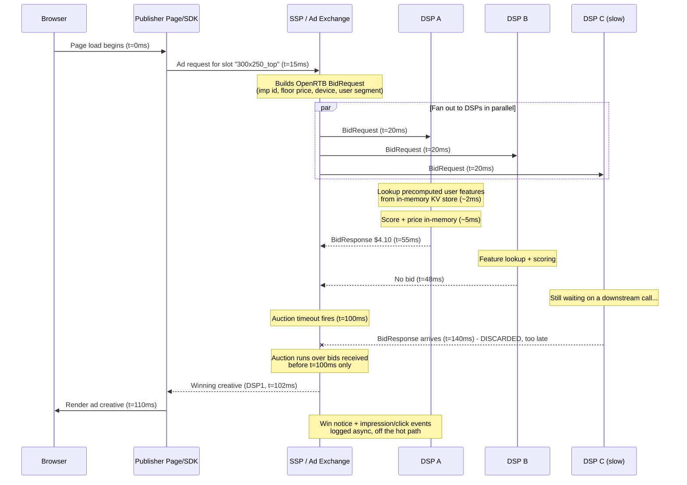

## An 80-millisecond budget with no retries allowed

Open a news article on your phone. Before the hero image even finishes decoding, somewhere between two and a dozen companies have already been asked, in effect, "do you want to show this specific person an ad, and if so, how much will you pay?" Each one has made a full network round trip, run a pricing decision, and sent back an answer. Someone has run an auction over all those answers, and the winning ad has already started downloading into the page.

All of that happens in the tiny gap between your tap and the page feeling loaded. Typically under 100 milliseconds for the bidding part alone, nested inside a page load you probably perceive as either instant or annoyingly slow.

This is called real-time bidding, or RTB, and it's one of the more extreme distributed-systems problems most engineers never run into, mostly because it lives in an industry that gets waved off as "just tracking pixels." It really isn't. It's a fan-out to a dozen unreliable outside services, a synchronous auction with a hard deadline, and a firehose of billing-grade logging, all inside a latency budget tighter than most people's database query timeout. I wrote in [the timeouts and circuit breakers post](/posts/timeouts-retries-circuit-breakers-dotnet/) that every remote call needs a time budget and that retries have to live inside that budget. RTB is what happens when you push that idea all the way to its limit: the budget is so tight that retries aren't a tuning knob you can adjust, they're simply not available. A late answer isn't a slow answer here. It's not an answer at all.

## The players involved

Programmatic advertising has a supply side and a demand side, and RTB is the auction that connects them.

The **publisher** is the website or app actually showing the ad, the news site or the game or the weather app. The **SSP**, or Supply-Side Platform, represents publishers: it takes an available ad slot and finds the highest-paying buyer for it, usually by running an auction. The **DSP**, or Demand-Side Platform, represents advertisers: it receives opportunities from many SSPs and decides, per opportunity, whether this specific ad slot in front of this specific person is worth bidding on, and at what price. Sometimes there's also a distinct **ad exchange**, the actual marketplace that clears the auction among competing bids, though it's often folded into the SSP.

The thing that lets an SSP ask a DSP "do you want this impression" without every pair of companies hand-building their own integration is a shared protocol called **OpenRTB**. It's a JSON format for bid requests and responses, sent over plain HTTPS, standardized by the industry's own trade body. Every DSP implements the same shape, which is the only reason an SSP can fan a single ad slot out to fifty different companies and get back answers it can actually compare.

## Walking through one auction, with real numbers

Here's the flow for one ad slot on one page load, with timings representative of a mobile web display auction. The exact numbers vary by vendor and region, but the shape doesn't.


```mermaid
sequenceDiagram
    participant Browser
    participant Publisher as Publisher Page/SDK
    participant SSP as SSP / Ad Exchange
    participant DSP1 as DSP A
    participant DSP2 as DSP B
    participant DSP3 as DSP C (slow)

    Browser->>Publisher: Page load begins (t=0ms)
    Publisher->>SSP: Ad request for slot "300x250_top" (t=15ms)
    Note over SSP: Builds OpenRTB BidRequest<br/>(imp id, floor price, device, user segment)
    par Fan out to DSPs in parallel
        SSP->>DSP1: BidRequest (t=20ms)
        SSP->>DSP2: BidRequest (t=20ms)
        SSP->>DSP3: BidRequest (t=20ms)
    end
    Note over DSP1: Lookup precomputed user features<br/>from in-memory KV store (~2ms)
    Note over DSP1: Score + price in-memory (~5ms)
    DSP1-->>SSP: BidResponse $4.10 (t=55ms)
    Note over DSP2: Feature lookup + scoring
    DSP2-->>SSP: No bid (t=48ms)
    Note over DSP3: Still waiting on a downstream call...
    Note over SSP: Auction timeout fires (t=100ms)
    DSP3--xSSP: BidResponse arrives (t=140ms) - DISCARDED, too late
    Note over SSP: Auction runs over bids received<br/>before t=100ms only
    SSP-->>Publisher: Winning creative (DSP1, t=102ms)
    Publisher->>Browser: Render ad creative (t=110ms)
    Note over SSP,DSP1: Win notice + impression/click events<br/>logged async, off the hot path
```

The part worth sitting with: DSP C's bid wasn't wrong, it was just late, and in this world late is completely indistinguishable from absent. There's no retry lane in an auction. If DSP C had answered at t=99ms it would have been in the running. At t=140ms, the auction is already closed and the ad creative is already rendering, so the bid just gets thrown away. This is one of the only places in distributed systems where "retry" isn't even the wrong answer, it's simply not on offer, because the caller has already moved on to a decision it can't undo for this particular impression. The argument I made in the resilience post, that timeouts bound the damage while retries live inside the budget, simplifies here to just the first half. There is no second half.

## What's actually inside the bid request

A bid request from the SSP to a DSP looks roughly like this, trimmed down for space (real ones carry more, especially around privacy consent):

```json
{
  "id": "8f3e2b9c-req",
  "imp": [
    {
      "id": "1",
      "banner": { "w": 300, "h": 250 },
      "bidfloor": 1.50,
      "bidfloorcur": "USD"
    }
  ],
  "site": {
    "domain": "example-news.com",
    "cat": ["IAB12"]
  },
  "device": {
    "ua": "Mozilla/5.0 (iPhone...)",
    "ip": "203.0.113.0",
    "geo": { "country": "USA", "region": "NY" },
    "devicetype": 4
  },
  "user": {
    "id": "seg-a1b2c3",
    "buyeruid": "dsp-cookie-xyz"
  },
  "at": 1,
  "tmax": 100
}
```

A handful of fields do real work here. `bidfloor` is the minimum price the publisher will accept - bid under it and you're simply not in the running. `tmax` is the SSP telling every single DSP, right inside the request, exactly how many milliseconds they have to answer. It's the deadline-propagation idea from the resilience post, except here it's baked into the protocol itself rather than left to convention. `user.id` and `device.ip` are worth a second look too: notice this isn't "here's everything we know about this person." Modern RTB carries pseudonymous identifiers and coarse location, not raw personal data, and that signal keeps getting thinner every year as third-party cookies fade out, which is part of why precomputing everything ahead of time (more on that below) matters more each year, not less. And `at` is the auction type: 1 means first-price, 2 means second-price, which I'll get into shortly.

A bid response coming back from the DSP looks like this:

```json
{
  "id": "8f3e2b9c-req",
  "seatbid": [
    {
      "bid": [
        {
          "id": "bid-001",
          "impid": "1",
          "price": 4.10,
          "crid": "creative-9981",
          "adm": "<VAST or HTML snippet or creative URL>"
        }
      ]
    }
  ]
}
```

`price` and `crid` (the creative ID, pointing at an ad asset that's already sitting on the SSP's CDN so it doesn't need to travel inside this response) are really the two fields the auction cares about. Everything upstream of producing this JSON, deciding whether to bid and at what price, has to happen inside `tmax` milliseconds, minus however much network time the round trip already ate.

## Why 100 milliseconds rules out almost everything you'd normally reach for

Split a 100ms budget up realistically and 15 to 25ms of it is already gone to the network round trip before the DSP's own code even starts running (more on cellular connections, less on wired ones). That leaves something like 50 to 80ms of actual compute, and most DSPs shave their own internal deadline tighter still, say 60ms, to leave room for the response to travel back and for the exchange's own auction logic to finish before its outer deadline fires.

Inside that 60ms window, a DSP has to parse the request, decide whether this impression matches any active campaign at all, score how likely this particular user is to be worth money to that campaign, turn that score into an actual price, and serialize a response.

The scoring step is the one that breaks naive designs. "How valuable is this user" sounds like it wants a database lookup: pull recent browsing history, purchase signals, whatever the model needs. But a synchronous call to any database at bid time is a design that loses the auction purely on its own latency, not because a competitor bid a better price. A single database round trip inside a shared connection pool can easily cost 5 to 15ms on a good day, and blow straight through what's left of the budget on a bad one, whether that's lock contention, a garbage collection pause, or just a busy neighbor on the same box. At the volumes involved, tens of thousands of requests a second per DSP is unremarkable, "occasionally slow" isn't a footnote in a latency chart. It's a constant, guaranteed stream of auctions you simply forfeit.

The fix is the same move distributed systems reach for anywhere a deadline truly can't move: shift the expensive work off the hot path entirely, ahead of time. DSPs run separate offline pipelines, batch or streaming, often reading the exact same [Kafka topics](/posts/kafka-for-engineers-who-know-databases/) that later carry the billing events, to continuously recompute user features: propensity scores, segment membership, frequency-cap counters. Those get written into a low-latency key-value store, something like Redis or Aerospike, purpose-built for lookups measured in single-digit milliseconds. At bid time, scoring the user becomes one keyed lookup against that store, not a query against the actual system of record. That store gets sharded the same way I described in [partitioning strategies](/posts/partitioning-strategies-that-follow-you-everywhere/): hash on user ID, watch out for hot keys like heavily retargeted users concentrating on one shard, and treat resharding as the deliberate, planned event it always is.

Scoring itself, predicting how likely someone is to convert, is a model inference call, and it has to run in memory, inside the same process, not as a call out to some separate model-serving endpoint. A network hop for inference is the exact same mistake as a network hop for a database read, just wearing a different outfit. Models get trained offline (often on the very outcome data the async logging pipeline below produces) and pushed out to the bidding hosts as small, compact serialized files, something like a scored tree ensemble, not something that needs a GPU to run, reloaded periodically with no deploy required.

## What a real bid handler looks like

Here's the shape of an actual bid handler: a hard deadline enforced with a cancellation token, a purely in-memory lookup with nothing that can stall on I/O, and an explicit "no bid" path that's a normal outcome, not an error.

```csharp
public sealed class BidHandler
{
    // Tight budget: SSP gave us tmax=100ms, we reserve slack for
    // response serialization and the return trip.
    private static readonly TimeSpan BidBudget = TimeSpan.FromMilliseconds(60);

    private readonly IFeatureStore _featureStore; // in-memory / low-latency KV, no network round trip to a DB
    private readonly IPricingModel _pricingModel; // loaded in-process, no RPC

    public BidHandler(IFeatureStore featureStore, IPricingModel pricingModel)
    {
        _featureStore = featureStore;
        _pricingModel = pricingModel;
    }

    public BidResponse? TryBid(BidRequest request)
    {
        using var cts = new CancellationTokenSource(BidBudget);

        try
        {
            return Bid(request, cts.Token);
        }
        catch (OperationCanceledException)
        {
            // We ran out of our own internal budget. Do not bid late -
            // a bid that misses the window is worse than no bid, it just
            // wastes the exchange's time parsing a response nobody scores.
            return null;
        }
    }

    private BidResponse? Bid(BidRequest request, CancellationToken ct)
    {
        var imp = request.Imp.FirstOrDefault();
        if (imp is null) return null;

        // Synchronous, precomputed - no query, no RPC. This is a keyed
        // lookup against data written by an offline pipeline minutes
        // or hours earlier, not computed now.
        ct.ThrowIfCancellationRequested();
        var features = _featureStore.GetUserFeatures(request.User.Id);
        if (features is null) return null; // unknown user - typically the "no bid" default

        var campaign = SelectEligibleCampaign(imp, request.Site, features);
        if (campaign is null) return null; // nothing worth bidding on

        ct.ThrowIfCancellationRequested();
        var score = _pricingModel.Score(campaign, imp, features); // in-memory inference, no I/O

        var price = PriceFromScore(score, imp.BidFloor, request.AuctionType);
        if (price < imp.BidFloor) return null; // would lose or violate the floor, don't bother

        return new BidResponse
        {
            Id = request.Id,
            Bid = new[]
            {
                new Bid { ImpId = imp.Id, Price = price, CreativeId = campaign.CreativeId }
            }
        };
    }

    private static decimal PriceFromScore(double score, decimal floor, AuctionType auctionType)
    {
        var rawValue = (decimal)score * 10.0m; // model output scaled to a $ value estimate

        // First-price auctions charge exactly what you bid, so bidding your
        // full valuation overpays whenever the next-highest bid was lower.
        // Shade the bid down from the estimated value; second-price auctions
        // don't need this because the winner pays the second-highest bid,
        // not their own, so bidding true value is already optimal there.
        var shaded = auctionType == AuctionType.FirstPrice
            ? rawValue * 0.85m
            : rawValue;

        return Math.Max(shaded, floor);
    }
}
```

Two things about this code matter more than the rest. First, `TryBid` catching `OperationCanceledException` and returning null isn't error handling tacked on as an afterthought, it's the actual primary path for "we ran out of time." Failing to bid is a completely ordinary outcome here, not something to log and page someone about. Second, there's no retry anywhere in this method, and structurally there can't be one. Retrying the feature lookup or the scoring call would just spend budget the auction has already decided isn't coming back.

## First-price versus second-price, and why bid shading exists

For most of RTB's history, the standard was the second-price auction: the highest bidder wins, but only pays the second-highest bid (plus a cent). This has a genuinely elegant property. Your best strategy is to just bid your true valuation, because bidding higher only risks overpaying and bidding lower only risks losing a win you'd have profited from. There's no reason to shade your number down at all.

Around 2019, the industry mostly shifted to first-price auctions, where the winner pays exactly what they bid. This happened largely because publishers running simultaneous auctions across multiple exchanges at once (a mechanic called header bidding, outside the scope of this post) made second-price mechanics hard to guarantee honestly across all of them, and first-price is simpler to reason about and audit. But it breaks the "just bid true value" strategy completely. In a first-price auction, bidding your full valuation means paying your full valuation every single time you win, even on impressions where the next-highest bidder was two dollars behind you. Every DSP that kept bidding true value right after the shift started systematically overpaying.

The response to that was bid shading: pricing models that estimate not just "what's this impression worth to us" but "what's the minimum price likely to still win it," trained on historical auction outcomes (won and lost bids and clearing prices, which is exactly the kind of data the async logging pipeline below exists to capture). The flat `* 0.85m` in the code above stands in for what's really its own trained model in a production DSP, since shading isn't a flat discount, it varies by publisher, by how much competition there is, and by time of day. Shade too aggressively and you lose auctions you'd have profitably won. Shade too conservatively and first-price auctions cost you exactly what second-price used to protect you from.

## Everything that happens after the winner is picked

Once the SSP picks a winner, the publisher's page renders that creative, and only then does the expensive bookkeeping start: a win notice back to the winning DSP, impression and eventually click events, and everything finance and the machine-learning teams need for billing and model training. None of that gets anywhere near the 100ms hot path, because that would reintroduce exactly the kind of synchronous dependency this whole design exists to avoid.

Instead, every event, bid, win, impression, click, and eventually conversion, gets published as a message onto an event-streaming backbone, [Kafka or a managed equivalent](/posts/choosing-a-cloud-messaging-backbone/), completely decoupled from the request that generated it. This is a genuinely enormous stream. Every auction that happens, won or lost, is a candidate event, so a mid-size DSP can be producing hundreds of thousands of events a second at peak. It's also a stream where different consumers care about very different things at very different speeds. Real-time budget-pacing services need impression counts within seconds so they can throttle spend before a campaign overshoots, while billing reconciliation and model training can tolerate lag measured in minutes or hours off the exact same topic. That's precisely the shape a log-based backbone is built for, as opposed to a queue where one consumer reading a message removes it for everyone else.

Billing especially has to be exact, since advertisers are charged real money based on these logs. So the events that matter for billing get the same at-least-once-plus-idempotency treatment as any other financial event stream, the same pattern behind the [outbox pattern](/posts/outbox-pattern-end-to-end/) or the processed-event ledger I described in the [Kafka delivery-semantics post](/posts/kafka-delivery-semantics-dotnet/): a duplicate win notice must never double-charge an advertiser. The synchronous side of RTB gets to be casual about dropping a late bid. The asynchronous side can't afford to be casual about a single dollar.

## What this buys you, and what it costs

Let me be honest about the tradeoffs instead of hiding them behind a feature list. Precomputing features means every DSP is bidding on data that's at best a few minutes old - someone who added an item to their cart three seconds ago won't show up in the feature store until the next write cycle catches up. That's a real, accepted loss of freshness traded for speed. In-memory scoring caps how complex a model can be by what fits inside a bid handler's time budget, which is part of why ad-tech pricing models tend to stay small and fast rather than reaching for the biggest model available. Being correct on time beats being brilliant late, always, in this domain. And "no retry" as a design principle only works here because the cost of a missed auction is well understood and bounded: one lost impression, not a lost transaction or a corrupted data stream. That's a property of this specific domain, not a general license to skip resilience thinking everywhere else.

What it buys is a genuinely remarkable thing running quietly under nearly every ad-supported page on the internet: a synchronous, multi-party auction with a hard deadline, running across companies that share no infrastructure at all, clearing in less time than most people take to notice a page has finished loading, backed by an asynchronous logging layer that reconciles real money against it without ever touching the hot path. It's the timeout-budget idea taken as far as it can go, down to the one case where the right answer to "what if this call is slow" isn't a smarter retry policy. It's accepting that some auctions are simply lost, and building everything else so that losing one costs nothing.
