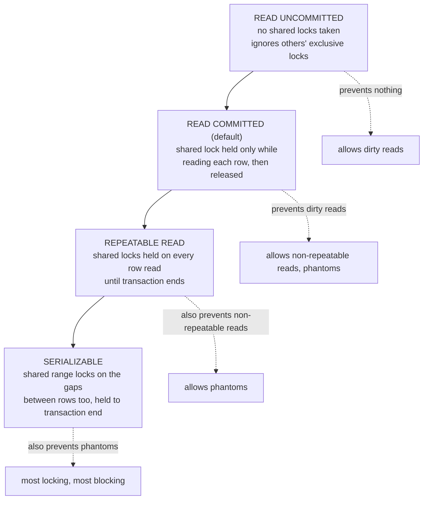
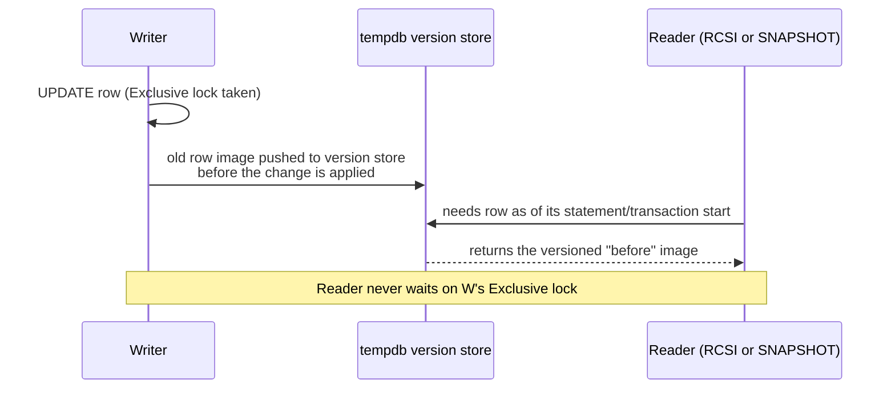

## The bug that only happens under load

A balance transfer service passed every test. Then, in production, two concurrent transfers against the same account occasionally made money disappear. Session A read a balance of 1000, added 200, wrote 1200. Session B, running at almost the same instant, also read 1000, subtracted 100, wrote 900. The 200 credit vanished - the final balance should have been 1100, and it was 900. No error was thrown. No exception, no deadlock, no constraint violation. Just a quietly wrong number.

This is a **lost update**, one of four classic concurrency anomalies that SQL Server's isolation levels exist to manage. The reason it is worth learning these anomalies by name, with real repro scripts, is that "isolation level" is not a knob you turn once and forget - it is a direct trade between correctness guarantees and how many locks your transaction holds. And [lock footprint is the raw material of deadlocks](/posts/sql-server-deadlocks-deep-dive/): the isolation level you choose determines how many locks each transaction takes, for how long, which is exactly what determines how often those locks collide into a circle.

This post builds the ladder from the loosest isolation level to the strictest, shows each anomaly with a two-session repro you can run in two SSMS (SQL Server Management Studio) tabs, and then covers the alternative SQL Server offers to locking entirely: row versioning.

## Setup: one table, two sessions

Every repro below uses the same table:

```sql
CREATE TABLE dbo.Accounts (
    AccountId INT PRIMARY KEY,
    Balance   DECIMAL(10,2) NOT NULL
);
INSERT INTO dbo.Accounts VALUES (1, 1000.00);
```

Open two SSMS query tabs against the same database - call them Session A and Session B. Run the numbered steps in the order given, alternating between tabs. That interleaving is the entire point: single-session testing never reproduces any of these anomalies, because they are races between two transactions that are running at the same time.

## Anomaly 1: the dirty read

A dirty read means Session B sees data Session A wrote but has not yet committed - and might never commit. If A rolls back, B has just acted on a value that never officially existed.

```sql
-- Session A
BEGIN TRAN;
UPDATE dbo.Accounts SET Balance = 5000 WHERE AccountId = 1;
-- do not commit yet

-- Session B (READ UNCOMMITTED lets it read A's uncommitted write)
SET TRANSACTION ISOLATION LEVEL READ UNCOMMITTED;
SELECT Balance FROM dbo.Accounts WHERE AccountId = 1;  -- returns 5000

-- Session A
ROLLBACK;  -- the 5000 never existed

-- Session B, if it re-reads
SELECT Balance FROM dbo.Accounts WHERE AccountId = 1;  -- back to 1000
```

READ UNCOMMITTED (the same effect as the `NOLOCK` hint on individual tables) tells SQL Server not to take shared locks when reading, and not to honor other sessions' exclusive locks either. That is the entire mechanism: it just reads whatever bytes are currently in the page, committed or not. It is fast and it is the only isolation level in this post that can return data that is provably wrong, not just stale. Reach for it only on dashboards where an occasional wrong number for a few milliseconds is genuinely fine - never for anything that touches money, inventory, or a decision.

## The isolation level ladder: what you buy going up

Every level above READ UNCOMMITTED uses locking by default (row versioning is a separate axis, covered later). Here is what each buys you and what it costs:



Each rung fixes exactly one anomaly by holding locks longer or wider than the rung below it. READ COMMITTED (the SQL Server default) takes a shared lock to read a row, but releases it the instant the read is done - it does not hold it for the rest of the transaction. That is cheap, but it means the same row can look different if you read it twice in one transaction, because nothing stopped another session from changing it in between.

## Anomaly 2: the non-repeatable read

Session A reads a row twice inside one transaction, and gets two different answers, because Session B updated and committed a change to that row in between A's two reads.

```sql
-- Session A
BEGIN TRAN;
SELECT Balance FROM dbo.Accounts WHERE AccountId = 1;  -- returns 1000, lock released immediately

-- Session B, runs to completion while A's transaction is still open
UPDATE dbo.Accounts SET Balance = 800 WHERE AccountId = 1;

-- Session A, same transaction, reads again
SELECT Balance FROM dbo.Accounts WHERE AccountId = 1;  -- now returns 800
COMMIT;
```

Under READ COMMITTED this is legal and silent - each individual read is correct at the instant it ran, but the two reads inside one transaction disagree, which breaks any logic that assumes a value it read earlier is still true. Switch Session A to REPEATABLE READ and rerun:

```sql
-- Session A
SET TRANSACTION ISOLATION LEVEL REPEATABLE READ;
BEGIN TRAN;
SELECT Balance FROM dbo.Accounts WHERE AccountId = 1;  -- returns 1000, lock HELD this time

-- Session B tries the same UPDATE
UPDATE dbo.Accounts SET Balance = 800 WHERE AccountId = 1;  -- blocks, waiting on A's shared lock

-- Session A
SELECT Balance FROM dbo.Accounts WHERE AccountId = 1;  -- still 1000, guaranteed
COMMIT;  -- only now does Session B's UPDATE unblock and proceed
```

REPEATABLE READ fixes it by holding every shared lock it takes until the transaction ends, instead of releasing each one right after its read. Session B is not rejected - it is made to wait. That waiting is the cost: a REPEATABLE READ transaction that reads a wide range of rows and then does application work before committing turns every one of those rows into a blocking point for the duration.

## Anomaly 3: the phantom read

A phantom is a step up from a non-repeatable read: instead of an existing row changing value, a *new* row appears (or an existing one disappears) between two reads of the same query.

```sql
-- Session A
SET TRANSACTION ISOLATION LEVEL REPEATABLE READ;
BEGIN TRAN;
SELECT COUNT(*) FROM dbo.Accounts WHERE Balance > 500;  -- returns 1

-- Session B, a brand new row, not one A has locked
INSERT INTO dbo.Accounts VALUES (2, 900.00);

-- Session A, same query again
SELECT COUNT(*) FROM dbo.Accounts WHERE Balance > 500;  -- returns 2 - a phantom
COMMIT;
```

REPEATABLE READ does not stop this, because it only locks rows it has actually read - there was no row 2 to lock the first time, so nothing blocked Session B's INSERT. To close that gap, SQL Server needs to lock the *space where a row could go*, not just rows that already exist. That is what SERIALIZABLE adds: range locks.

```sql
-- Session A
SET TRANSACTION ISOLATION LEVEL SERIALIZABLE;
BEGIN TRAN;
SELECT COUNT(*) FROM dbo.Accounts WHERE Balance > 500;  -- returns 1, range locked

-- Session B tries the same INSERT
INSERT INTO dbo.Accounts VALUES (2, 900.00);  -- blocks - it would fall inside A's locked range
```

SERIALIZABLE is the strictest locking level and the most expensive: it locks not just what a query touched, but the gaps around it, so nothing can be inserted, updated, or deleted anywhere within the query's predicate until the transaction ends. On a range predicate over a busy table, that is a wide, long-held lock footprint - exactly the shape of lock that produces the [upsert-collision deadlock pattern](/posts/sql-server-deadlocks-deep-dive/#pattern-4-the-upsert-collision), where two SERIALIZABLE existence checks each take a shared range lock and then both block trying to insert into it.

## Anomaly 4: the lost update (the one that isn't fixed by going up the ladder alone)

This is the transfer bug from the opening. It happens because "read a value, then write a new value based on it" is two separate statements, and READ COMMITTED's shared locks do not survive between them:

```sql
-- Session A: application logic does SELECT, computes in app code, then UPDATE
BEGIN TRAN;
SELECT Balance FROM dbo.Accounts WHERE AccountId = 1;  -- reads 1000, lock released
-- ... app code computes 1000 + 200 = 1200 ...

-- Session B interleaves here, same pattern
BEGIN TRAN;
SELECT Balance FROM dbo.Accounts WHERE AccountId = 1;  -- also reads 1000
UPDATE dbo.Accounts SET Balance = 900 WHERE AccountId = 1;  -- 1000 - 100
COMMIT;

-- Session A finishes with the value it computed from a now-stale read
UPDATE dbo.Accounts SET Balance = 1200 WHERE AccountId = 1;  -- overwrites B's 900
COMMIT;
-- Final balance: 1200. Should be 1100. B's -100 is gone.
```

Note this happens under plain READ COMMITTED, the default - no exotic isolation level required, because a plain SELECT followed later by an UPDATE is not atomic. Neither REPEATABLE READ nor SERIALIZABLE fixes this automatically either, unless the *read* itself takes a lock strong enough to block the other session's write, not just its own read.

The fix is to make the read take an update lock (U), the same "I intend to write this" lock from the deadlocks post's [lock-compatibility table](/posts/sql-server-deadlocks-deep-dive/#first-meet-the-locks) - update locks are incompatible with each other, so the second session's read-then-write has to wait for the first to fully finish:

```sql
-- Session A, fixed
BEGIN TRAN;
SELECT Balance FROM dbo.Accounts WITH (UPDLOCK) WHERE AccountId = 1;  -- U lock, held to commit
UPDATE dbo.Accounts SET Balance = Balance + 200 WHERE AccountId = 1;
COMMIT;
```

Or, better where the shape fits, skip the read-modify-write round trip entirely and let the engine do the arithmetic atomically:

```sql
UPDATE dbo.Accounts SET Balance = Balance + 200 WHERE AccountId = 1;
```

A single `UPDATE ... SET Balance = Balance + @amt` cannot lose an update - there is no separate read for another session to interleave with. The lost-update repro above is really a reminder that isolation level is not a substitute for writing the statement that makes the race impossible in the first place.

## The pivot: versioning instead of blocking

Everything so far bought correctness by making sessions wait for each other. SQL Server has a second, structurally different tool: **row versioning**. Instead of a reader taking a shared lock and blocking a writer (or a writer blocking a reader), the reader gets handed a consistent snapshot of the row as it looked at a point in time, built from before-images kept elsewhere. Nobody blocks anybody just to read.



There are two flavors, and mixing them up is the single most common mistake:

**RCSI (Read Committed Snapshot Isolation)** is a database-level setting that changes what the *default* READ COMMITTED level means: readers stop taking shared locks and instead see the last-committed version of each row, per statement. It only changes reader behavior - writers still take ordinary exclusive locks and still block other writers exactly as before. This is the fix already named in the deadlocks post for [pattern 2, reader meets writer](/posts/sql-server-deadlocks-deep-dive/#pattern-2-reader-meets-writer-on-the-same-rows): turn it on and readers simply stop appearing in deadlock circles, because they no longer hold any lock a writer could be waiting on.

```sql
ALTER DATABASE MyDb SET READ_COMMITTED_SNAPSHOT ON;
```

**SNAPSHOT isolation** is a separate, stricter level a transaction opts into explicitly. It gives the *whole transaction* one consistent snapshot as of the moment it started, not just one statement - and crucially, it also changes writer behavior. Two SNAPSHOT transactions that both try to update the same row will not silently produce a lost update the way READ COMMITTED did earlier; the second one to commit gets error 3960, "Snapshot isolation transaction aborted due to update conflict":

```sql
ALTER DATABASE MyDb SET ALLOW_SNAPSHOT_ISOLATION ON;

-- Session A
SET TRANSACTION ISOLATION LEVEL SNAPSHOT;
BEGIN TRAN;
SELECT Balance FROM dbo.Accounts WHERE AccountId = 1;  -- 1000, snapshot pinned

-- Session B, also SNAPSHOT, commits a change first
SET TRANSACTION ISOLATION LEVEL SNAPSHOT;
BEGIN TRAN;
UPDATE dbo.Accounts SET Balance = 900 WHERE AccountId = 1;
COMMIT;

-- Session A tries to write based on its now-stale snapshot
UPDATE dbo.Accounts SET Balance = 1200 WHERE AccountId = 1;
-- Msg 3960: Snapshot isolation transaction aborted due to update conflict.
COMMIT;
```

That error is not a bug to suppress - it is SNAPSHOT isolation refusing to silently lose the update the READ COMMITTED repro lost earlier. The correct handling is to catch it and retry the transaction from its start (re-reading fresh data), the same way you would wire up retry for the deadlock victim's error 1205. Skipping the retry logic and just swallowing 3960 reintroduces the exact bug SNAPSHOT was turned on to prevent.

Both flavors get their before-images from the same place: **tempdb**, in a structure called the version store. Every row modified while RCSI or SNAPSHOT is active gets its old version pushed into tempdb, tagged and kept around for as long as any open transaction might still need to read it. Two costs follow directly from that:

- **tempdb grows**, sometimes sharply, under write-heavy workloads with long-running readers - a report that takes ten minutes to run under SNAPSHOT keeps every row it might touch versioned in tempdb for that entire ten minutes.
- **Every write pays a small overhead** to push its old image into the version store, even when nothing is currently reading it - versioning is always on for the database once RCSI or SNAPSHOT is enabled, not only when a snapshot reader happens to be active.

Both are usually a good trade against blocking, but they are not free, and "just turn on RCSI" without watching `tempdb` free space on a system with existing tempdb pressure is how a locking problem quietly becomes a tempdb problem instead.

## Choosing a level by its lock footprint, not its name

The names suggest a checklist - pick the one that sounds strict enough for your correctness needs. The more useful question is the one the deadlocks post keeps coming back to: how many locks does this transaction hold, on how many rows or ranges, for how long? READ COMMITTED with RCSI holds essentially nothing on the read side. REPEATABLE READ holds a shared lock per row read, for the whole transaction. SERIALIZABLE holds locks on the gaps between rows too. Every step up that ladder is a step toward more sessions being made to wait behind each other - and a waiting session is a session that can end up in a deadlock's circle. If you are chasing 1205 errors, [check what isolation level the participants were running](/posts/sql-server-deadlocks-deep-dive/#step-2-read-the-graph-like-a-story) before you touch indexes or access order; sometimes the honest fix is that a report query was accidentally running under REPEATABLE READ and holding shared locks across a table scan it never needed to.

Read the execution plan alongside the isolation level when a query is slower than expected under REPEATABLE READ or SERIALIZABLE - [a scan instead of a seek](/posts/reading-sql-execution-plans/) turns a narrow lock footprint into a wide one regardless of which level you picked, because the level locks whatever the plan actually touches, not what the WHERE clause implies. And if you land on RCSI or SNAPSHOT, [Query Store](/posts/query-store-flight-recorder/) is the easiest way to confirm tempdb-driven regressions didn't creep in afterward, since it keeps historical plan and wait statistics you can compare against the day you flipped the switch.

None of these four levels, or the two versioning modes, is a universal right answer. READ UNCOMMITTED is correct exactly when wrong data is an acceptable cost for speed. READ COMMITTED with RCSI is correct for the overwhelming majority of OLTP (Online Transaction Processing) workloads, because it eliminates reader-writer blocking without asking every write to change. REPEATABLE READ and SERIALIZABLE are correct for the narrow set of transactions that genuinely cannot tolerate a value changing underneath them mid-transaction, and they should be scoped as tightly as possible because their cost is measured in every other session's wait time. SNAPSHOT is correct when a transaction needs both a consistent view and the confidence that a silent lost update is structurally impossible, paid for in tempdb and in retry logic for error 3960. Knowing which anomaly each level closes, and being able to reproduce it in two query tabs, is what turns isolation level from a setting you copy from a coworker into a decision you can actually defend.
