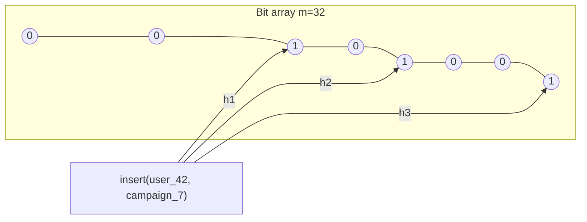

## The set that doesn't fit

Picture a frequency-capping service sitting behind the [real-time bidding](/posts/real-time-bidding-programmatic-ad-auctions/) auction I wrote about a few days ago. Its job is small on paper: for a given user and a given campaign, has this user already seen 3 impressions today? If yes, don't bid. That single check runs on the hot path of every auction, inside the same sub-100ms budget as everything else.

The naive implementation is a set: `HashSet<(userId, campaignId)>` per day, insert on every impression, check membership before every bid. At even a modest scale, say 200 million unique (user, campaign) pairs seeing activity in a day, that set alone costs real money. A `HashSet<Guid>` in .NET isn't 16 bytes per entry, it's closer to 50-60 bytes once you count the bucket array, the entry struct (hash code, next pointer, key, and for a set-only usage a dummy value), and .NET's default load factor headroom. At 200 million entries that's 10-12 GB, in memory, per day, before you've added a second campaign dimension or replicated it for availability. Multiply by however many days you need for a rolling cap window and this stops being a data structure problem and becomes a "we need a bigger and more expensive fleet" problem.

The actual requirement is weaker than "give me the exact set." It's "tell me, cheaply, whether I've probably seen this before" - and it's fine to occasionally get a false positive (wrongly saying "seen it" when you haven't, which means under-serving one impression to one user) in exchange for never getting a false negative (wrongly saying "not seen" when you have, which would break the frequency cap's guarantee). That asymmetry - one-directional error is tolerable, the other direction is not - is exactly what a Bloom filter gives you, and it's why it shows up constantly in this kind of infrastructure: LSM-tree storage engines use one per SSTable to skip disk reads for keys that definitely aren't there (I touched on this in the [B-trees vs LSM-trees post](/posts/btrees-vs-lsm-trees/)), CDNs use one to avoid caching one-hit-wonders, and ad-tech dedup pipelines use one to avoid carrying a full identity set in memory.

## The mechanism: a bit array and k independent opinions

A Bloom filter is a bit array of size `m`, all zeros to start, plus `k` independent hash functions that each map an element to one position in that array.

**Insert(x):** compute `h1(x), h2(x), ..., hk(x)`, set all `k` bits to 1.

**MightContain(x):** compute the same `k` positions. If any of them is 0, `x` was definitely never inserted - a hard, zero-error guarantee. If all `k` are 1, `x` was probably inserted - possibly a false positive, because those bits could have all been set to 1 by *other* elements' insertions colliding on the same positions.



Notice what's *not* in the structure: the element itself. You cannot get the original keys back out, and you cannot (in the vanilla version) delete an element, because clearing its bits might also clear a bit that some other element still depends on. Both of these are the price for the memory win, and both matter for how you deploy it in production - more on the deletion problem below.

## The false-positive math, worked with real numbers

The false-positive probability, after inserting `n` elements into an `m`-bit array with `k` hash functions, is well approximated by:

$$p \approx \left(1 - e^{-kn/m}\right)^k$$

Two derived, more useful forms. Given a target false-positive rate `p` and expected element count `n`, the optimal bit-array size is:

$$m = -\frac{n \ln p}{(\ln 2)^2}$$

and the optimal number of hash functions for that `m` and `n` is:

$$k = \frac{m}{n}\ln 2 \approx 0.693 \frac{m}{n}$$

Plugging in the frequency-capping scenario: `n = 200,000,000` unique (user, campaign) pairs per day, target `p = 0.1%` (a false positive rate ad ops signed off on - one in a thousand impressions gets suppressed one impression early, which is invisible in aggregate delivery numbers):

- `m = -200,000,000 * ln(0.001) / (ln 2)^2 ≈ 2.876 billion bits ≈ 359 MB`
- `k = (m/n) * ln 2 ≈ 14.375 * 0.693 ≈ 10` hash functions

359 MB for 200 million entries versus 10-12 GB for the `HashSet<Guid>` version - roughly a 30x reduction, and that ratio holds regardless of `n` because both numbers scale linearly with element count. The formulas above are the actual sizing exercise you'd run before provisioning this in production: pick `p` based on what error rate the business tolerates, get `m` and `k` out, and that's your memory budget, full stop, no capacity planning surprises later since it doesn't grow with actual key content, only with the `n` you sized for.

## Implementation: double hashing instead of ten real hash functions

Computing 10 genuinely independent hash functions per operation is wasteful. The standard trick (Kirsch-Mitzenmacher) is to compute two independent hashes and derive the rest as a linear combination:

$$h_i(x) = h_1(x) + i \cdot h_2(x) \pmod m, \quad i = 0, 1, \dots, k-1$$

This is provably good enough in practice - the derived hash functions behave as if independent for the purposes of the false-positive bound. Here's a production-shaped C# implementation using two 64-bit hashes from `System.IO.Hashing` (XxHash64 and XxHash3, both fast and already in the BCL as of .NET 6+, no third-party dependency needed):

```csharp
using System.IO.Hashing;
using System.Runtime.CompilerServices;

public sealed class BloomFilter
{
    private readonly byte[] _bits;
    private readonly int _bitCount;
    private readonly int _hashCount;

    public BloomFilter(long expectedElements, double falsePositiveRate)
    {
        _bitCount = OptimalBitCount(expectedElements, falsePositiveRate);
        _hashCount = OptimalHashCount(_bitCount, expectedElements);
        _bits = new byte[(_bitCount + 7) / 8];
    }

    public static int OptimalBitCount(long n, double p) =>
        (int)Math.Ceiling(-n * Math.Log(p) / (Math.Log(2) * Math.Log(2)));

    public static int OptimalHashCount(int m, long n) =>
        Math.Max(1, (int)Math.Round((double)m / n * Math.Log(2)));

    public void Add(ReadOnlySpan<byte> key)
    {
        var (h1, h2) = ComputeHashPair(key);
        for (int i = 0; i < _hashCount; i++)
            SetBit(CombinedHash(h1, h2, i));
    }

    public bool MightContain(ReadOnlySpan<byte> key)
    {
        var (h1, h2) = ComputeHashPair(key);
        for (int i = 0; i < _hashCount; i++)
            if (!GetBit(CombinedHash(h1, h2, i)))
                return false; // definitely absent - stop early
        return true; // probably present
    }

    private long CombinedHash(long h1, long h2, int i) =>
        (long)((ulong)(h1 + i * h2) % (ulong)_bitCount);

    private static (long h1, long h2) ComputeHashPair(ReadOnlySpan<byte> key)
    {
        long h1 = BitConverter.ToInt64(XxHash64.Hash(key));
        long h2 = BitConverter.ToInt64(XxHash3.Hash(key));
        return (h1, h2);
    }

    [MethodImpl(MethodImplOptions.AggressiveInlining)]
    private void SetBit(long position)
    {
        int byteIndex = (int)(position / 8);
        int bitIndex = (int)(position % 8);
        // Interlocked.Or is available on byte-sized ops via int-cast tricks in .NET 9;
        // for wide production use, stripe the array across N lock objects instead -
        // see the concurrency note below.
        lock (_bits)
        {
            _bits[byteIndex] |= (byte)(1 << bitIndex);
        }
    }

    [MethodImpl(MethodImplOptions.AggressiveInlining)]
    private bool GetBit(long position)
    {
        int byteIndex = (int)(position / 8);
        int bitIndex = (int)(position % 8);
        return (_bits[byteIndex] & (1 << bitIndex)) != 0;
    }
}
```

Usage for the frequency-capping check:

```csharp
var filter = new BloomFilter(expectedElements: 200_000_000, falsePositiveRate: 0.001);

byte[] key = Encoding.UTF8.GetBytes($"{userId}:{campaignId}:{DateOnly.FromDateTime(DateTime.UtcNow)}");

if (filter.MightContain(key))
{
    // probably already served today - skip the bid, or fall through to an
    // authoritative check if this bid is high-value enough to justify it
    return BidDecision.Skip;
}

filter.Add(key);
// proceed with the auction
```

That fallback comment matters in real systems: because a Bloom filter can false-positive, high-stakes decisions layer it as a fast pre-filter in front of an authoritative source (Redis, a database, an in-memory LRU of recent exact keys), not as the sole source of truth. The filter's job is to let the 99.9%+ of clearly-novel traffic skip the expensive check entirely; only the ambiguous cases fall through.

## The concurrency problem the code comment glosses over

That single `lock (_bits)` around every bit-set is a real bottleneck under the throughput this needs to handle - millions of inserts per second across many threads all serialize on one lock. Two production-grade options:

1. **Lock striping**: split `_bits` into N segments (say, 256), each guarded by its own lock, and route each `SetBit` call to `segment = position % 256`. Contention drops by roughly a factor of N because unrelated bits no longer wait on each other.
2. **True lock-free updates** using `Interlocked.Or` on `int` (not `byte`) backing storage - store the filter as an `int[]` instead of `byte[]`, and `SetBit` becomes `Interlocked.Or(ref _bits[wordIndex], 1 << bitIndex)`. This is the approach worth taking for anything genuinely hot, since it needs no locks at all and the CAS retry loop that `Interlocked.Or` compiles to is far cheaper than lock acquisition under contention.

`MightContain` needs no synchronization either way - reading a possibly-stale bit only makes the filter's false-positive rate marginally worse for a few nanoseconds around a concurrent write, and the mathematical guarantee (no false negatives) is unaffected because bits only ever transition 0 to 1, never back.

## Why you can't delete, and what to do instead

Clearing bit positions for a deleted element risks clearing bits that other, still-present elements rely on, silently turning them into false negatives - which breaks the one guarantee the whole structure exists to provide. Three real answers to "but I need expiry":

- **Time-boxed filters**: this is what the frequency-cap example above already does implicitly by keying on the date - build a fresh filter per rolling window (per day, or per hour for tighter windows) and let old filters simply get garbage collected or evicted once their window closes. No delete operation is ever needed because nothing is ever deleted, the whole filter just stops being consulted.
- **Counting Bloom filters**: replace each bit with a small counter (typically 4 bits), increment on insert, decrement on delete, and treat "counter > 0" as the membership bit. This reintroduces deletion at the cost of 4x the memory (4 bits per slot instead of 1), and it still isn't exact - counters can saturate and wrap, though a 4-bit counter overflowing requires 16 colliding elements on one slot, which is rare enough at reasonable load factors to accept.
- **RedisBloom** (the `BF.*` command family in Redis Stack) implements a scalable Bloom filter with `BF.RESERVE`, `BF.ADD`, and `BF.EXISTS`, and additionally offers a Cuckoo filter (`CF.*`) as a built-in when deletion actually matters - a Cuckoo filter supports true removal by construction, at a modest constant-factor memory cost over a Bloom filter, and is the better default if you know upfront that deletion is a hard requirement rather than something the windowing trick can route around.

## Where this trade-off actually bites

The honest failure mode worth stating plainly: a Bloom filter sized for `n = 200,000,000` at `p = 0.1%` gets *worse*, not just proportionally but the formula's `e^{-kn/m}` term shows it degrades as an accelerating curve, if the actual element count exceeds what you sized for. Campaign traffic is not flat - a launch day or a programmatic budget reallocation can spike a single campaign's unique-user count well past its provisioned `n`, and unlike a `HashSet` (which just gets slower and uses more memory but stays correct), an under-sized Bloom filter gets *actively wrong* in the direction that erodes the frequency cap's guarantee, showing more false "probably seen" hits and suppressing legitimate impressions. The mitigation is either generous headroom in `n` (oversizing the filter for the 95th-percentile traffic day, not the median one) or a scalable-filter design that adds fresh sub-filters once a fill-ratio threshold is crossed, which is exactly what RedisBloom's `BF.RESERVE ... EXPANSION` option automates rather than something worth hand-rolling.
