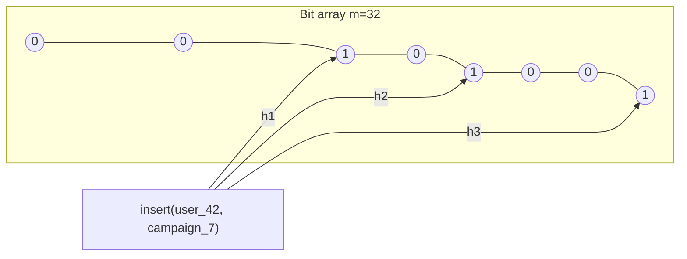

## The set that doesn't fit

There's a frequency-capping service sitting behind the [real-time bidding](/posts/real-time-bidding-programmatic-ad-auctions/) auction I wrote about a few days ago. Its job sounds tiny: for a given user and a given campaign, has this person already seen 3 impressions today? If yes, don't bid. That one check runs on the hot path of every single auction, inside the same tight latency budget as everything else.

The obvious way to build this is a set: `HashSet<(userId, campaignId)>` per day, insert on every impression, check membership before every bid. That works fine until you hit real scale. Say 200 million unique user-campaign pairs see activity in a day. A `HashSet<Guid>` in .NET isn't 16 bytes per entry like you'd hope, it's closer to 50-60 bytes once you count the internal bucket array and per-entry overhead. At 200 million entries that's 10 to 12 GB of memory, per day, before you've added a second dimension or replicated it for availability. Multiply that by however many days your rolling cap window needs, and this stops being a data structure question and turns into "we need a much bigger, much more expensive fleet."

Here's the thing though: the actual requirement is weaker than "give me the exact set." All you really need is "tell me, cheaply, whether I've probably seen this before." And it's fine to occasionally get a false positive, wrongly saying "seen it" when you actually haven't, because the worst case there is under-serving one impression to one user. What you can never afford is a false negative: wrongly saying "not seen" when you have, which would let the frequency cap fail outright. One direction of error is tolerable, the other isn't, and that lopsided tolerance is exactly what a Bloom filter is built to exploit. It's why this structure shows up constantly in infrastructure you've probably already used: storage engines that use B-trees and LSM-trees keep one per file to skip disk reads for keys that definitely aren't there (I touched on this in the [B-trees vs LSM-trees post](/posts/btrees-vs-lsm-trees/)), CDNs use one to avoid caching things nobody asks for twice, and ad-tech dedup pipelines use one instead of carrying a full identity set in memory.

## The mechanism: a bit array and k independent opinions

A Bloom filter is a bit array of size `m`, all zeros to start, plus `k` independent hash functions that each map an element to one position in that array.

**Insert(x):** compute `h1(x), h2(x), ..., hk(x)`, set all `k` bits to 1.

**MightContain(x):** compute the same `k` positions. If any of them is 0, `x` was definitely never inserted - a hard, zero-error guarantee. If all `k` are 1, `x` was probably inserted - possibly a false positive, because those bits could have all been set to 1 by *other* elements' insertions colliding on the same positions.


```mermaid
graph LR
    subgraph "Bit array m=32"
    B0((0)) --- B1((0)) --- B2((1)) --- B3((0)) --- B4((1)) --- B5((0)) --- B6((0)) --- B7((1))
    end
    X["insert(user_42, campaign_7)"] -->|h1| B2
    X -->|h2| B4
    X -->|h3| B7
```

Notice what's *not* in the structure: the element itself. You cannot get the original keys back out, and you cannot (in the vanilla version) delete an element, because clearing its bits might also clear a bit that some other element still depends on. Both of these are the price for the memory win, and both matter for how you deploy it in production - more on the deletion problem below.

## Why it can lie, and how much that costs you

Here's where the false positives actually come from. Every insert flips `k` bits from 0 to 1. As more elements go in, more of the array fills up with 1s, and eventually a brand-new element you never actually inserted can, by pure chance, land on `k` positions that were all already set to 1 by other elements. That's the false positive. It's a coincidence of overlapping bits, not a defect in the structure.

Two things control how often that coincidence happens. One is how big the bit array is relative to how many elements you're cramming into it - a bigger array means more room before it fills up with 1s. The other is how many hash functions you use per element - more hash functions means more chances to land on a bit that's still 0 and bail out early, but push that number too high and you're setting more bits per insert, which fills the array faster and makes things worse again. There's a sweet spot between the two, and it has an exact formula behind it, but you don't need to work it out by hand. Any Bloom filter calculator, or the short function in the code below, will spit out the right array size and hash count once you tell it your target error rate and how many elements you expect.

Here's what that trade-off looks like in practice for the frequency-capping scenario: 200 million unique (user, campaign) pairs a day.

| Target false-positive rate | Hash functions (`k`) | Memory needed |
|---|---|---|
| 1% | 7 | ~240 MB |
| 0.1% | 10 | ~360 MB |
| 0.01% | 13 | ~480 MB |

Compare any of those rows to the 10-12 GB a `HashSet<Guid>` would cost for the same 200 million entries, and you're looking at a 20-40x memory win depending on how tight you need the error bar. For frequency-capping, ad ops usually signs off on the 0.1% row: one impression in a thousand gets suppressed slightly early, which is invisible in aggregate delivery numbers, and 360 MB comfortably fits on a single instance.

That's the actual sizing exercise you run before putting this into production. Pick an error rate the business can live with, look up what memory and hash count that implies, and that's your budget, fixed in advance. It doesn't grow with what's actually sitting inside the filter, only with how many elements you told it to expect.

## Implementation: double hashing instead of ten real hash functions

Computing 10 genuinely independent hash functions on every operation would be wasteful. There's a well-known trick, called Kirsch-Mitzenmacher after the paper that proved it works, that computes just two independent hashes, `h1` and `h2`, and cheaply derives the rest from those: the i-th hash is just `h1 + i * h2`, wrapped into the array's range with a modulo. It sounds like it shouldn't work as well as truly independent hash functions, but it's been shown to behave close enough in practice that nobody bothers computing real ones anymore.

Here's a realistic C# implementation using two fast 64-bit hashes already built into .NET, so there's no third-party dependency needed:

```csharp
using System.IO.Hashing;
using System.Runtime.CompilerServices;

public sealed class BloomFilter
{
    private readonly byte[] _bits;
    private readonly int _bitCount;
    private readonly int _hashCount;

    public BloomFilter(long expectedElements, double falsePositiveRate)
    {
        _bitCount = OptimalBitCount(expectedElements, falsePositiveRate);
        _hashCount = OptimalHashCount(_bitCount, expectedElements);
        _bits = new byte[(_bitCount + 7) / 8];
    }

    public static int OptimalBitCount(long n, double p) =>
        (int)Math.Ceiling(-n * Math.Log(p) / (Math.Log(2) * Math.Log(2)));

    public static int OptimalHashCount(int m, long n) =>
        Math.Max(1, (int)Math.Round((double)m / n * Math.Log(2)));

    public void Add(ReadOnlySpan<byte> key)
    {
        var (h1, h2) = ComputeHashPair(key);
        for (int i = 0; i < _hashCount; i++)
            SetBit(CombinedHash(h1, h2, i));
    }

    public bool MightContain(ReadOnlySpan<byte> key)
    {
        var (h1, h2) = ComputeHashPair(key);
        for (int i = 0; i < _hashCount; i++)
            if (!GetBit(CombinedHash(h1, h2, i)))
                return false; // definitely absent - stop early
        return true; // probably present
    }

    private long CombinedHash(long h1, long h2, int i) =>
        (long)((ulong)(h1 + i * h2) % (ulong)_bitCount);

    private static (long h1, long h2) ComputeHashPair(ReadOnlySpan<byte> key)
    {
        long h1 = BitConverter.ToInt64(XxHash64.Hash(key));
        long h2 = BitConverter.ToInt64(XxHash3.Hash(key));
        return (h1, h2);
    }

    [MethodImpl(MethodImplOptions.AggressiveInlining)]
    private void SetBit(long position)
    {
        int byteIndex = (int)(position / 8);
        int bitIndex = (int)(position % 8);
        // Interlocked.Or is available on byte-sized ops via int-cast tricks in .NET 9;
        // for wide production use, stripe the array across N lock objects instead -
        // see the concurrency note below.
        lock (_bits)
        {
            _bits[byteIndex] |= (byte)(1 << bitIndex);
        }
    }

    [MethodImpl(MethodImplOptions.AggressiveInlining)]
    private bool GetBit(long position)
    {
        int byteIndex = (int)(position / 8);
        int bitIndex = (int)(position % 8);
        return (_bits[byteIndex] & (1 << bitIndex)) != 0;
    }
}
```

Usage for the frequency-capping check:

```csharp
var filter = new BloomFilter(expectedElements: 200_000_000, falsePositiveRate: 0.001);

byte[] key = Encoding.UTF8.GetBytes($"{userId}:{campaignId}:{DateOnly.FromDateTime(DateTime.UtcNow)}");

if (filter.MightContain(key))
{
    // probably already served today - skip the bid, or fall through to an
    // authoritative check if this bid is high-value enough to justify it
    return BidDecision.Skip;
}

filter.Add(key);
// proceed with the auction
```

That fallback comment in the code matters more than it looks. Because a Bloom filter can false-positive, any high-stakes decision should treat it as a fast pre-filter sitting in front of an authoritative source, like Redis or a database, rather than as the sole source of truth. The filter's job is just to let the overwhelming majority of clearly-novel traffic skip the expensive check entirely. Only the rare ambiguous case needs to fall through to something exact.

## The concurrency problem the code comment glosses over

That single `lock (_bits)` around every bit-set is a real bottleneck once you're handling the kind of throughput this needs. Millions of inserts a second, across many threads, all fighting over one lock. There are two solid ways to fix it:

1. **Lock striping**: split `_bits` into N segments (say, 256), each guarded by its own lock, and route each `SetBit` call to `segment = position % 256`. Contention drops by roughly a factor of N because unrelated bits no longer wait on each other.
2. **True lock-free updates** using `Interlocked.Or` on `int` (not `byte`) backing storage - store the filter as an `int[]` instead of `byte[]`, and `SetBit` becomes `Interlocked.Or(ref _bits[wordIndex], 1 << bitIndex)`. This is the approach worth taking for anything genuinely hot, since it needs no locks at all and the CAS retry loop that `Interlocked.Or` compiles to is far cheaper than lock acquisition under contention.

`MightContain` needs no synchronization at all, either way. Reading a bit that's a few nanoseconds stale, right in the middle of a concurrent write, only makes the false-positive rate marginally worse for that instant. The one guarantee that actually matters, no false negatives, is unaffected, because bits only ever flip from 0 to 1 and never flip back.

## Why you can't delete, and what to do instead

Clearing bits for a deleted element risks clearing bits that some other, still-present element depends on, which would silently turn it into a false negative. That breaks the one guarantee this whole structure exists to provide, so a plain Bloom filter simply doesn't support delete. Here are three real answers to "but I need expiry":

- **Time-boxed filters.** This is what the frequency-cap example above is already doing implicitly, by keying on the date. Build a fresh filter for each rolling window, per day or per hour for tighter windows, and let old filters just get garbage collected once their window closes. No delete operation is ever needed, because nothing gets deleted. The whole filter just stops being consulted.
- **Counting Bloom filters.** Replace each single bit with a small counter, typically 4 bits, increment it on insert, decrement it on delete, and treat "counter greater than zero" as the membership signal. This brings deletion back, at the cost of 4 times the memory, and it's still not perfectly exact since counters can overflow. That said, a 4-bit counter overflowing needs 16 different elements colliding on the exact same slot, which is rare enough at reasonable load to just accept.
- **RedisBloom.** The `BF.*` command family in Redis Stack gives you a scalable Bloom filter out of the box, and it also offers a Cuckoo filter (`CF.*`) for when deletion is a genuine requirement. A Cuckoo filter supports true removal by design, at a modest extra memory cost over a Bloom filter, and it's the better default if you know upfront that you'll need to delete rather than relying on the windowing trick above.

## Where this trade-off actually bites

Here's the failure mode worth being honest about. A Bloom filter sized for 200 million entries at a 0.1% error rate doesn't just get a little worse if the real element count runs over what you sized it for. It degrades on an accelerating curve, because every insertion past the number you planned for flips more bits to 1, and every already-flipped bit makes the next collision more likely too.

Campaign traffic isn't flat. A launch day or a sudden budget reallocation can push a single campaign's unique-user count well past whatever you provisioned. And unlike a `HashSet`, which just gets slower and uses more memory but stays correct, an undersized Bloom filter gets actively wrong in exactly the direction that hurts: more false "probably seen" hits, which means suppressing impressions that should have gone out.

The fix is either generous headroom (size for your busiest realistic day, not the average one) or a design that adds fresh sub-filters automatically once it starts filling up, which is exactly what RedisBloom's `BF.RESERVE ... EXPANSION` option does for you rather than something worth building by hand.
